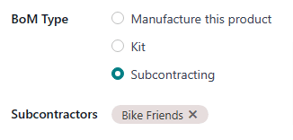

# Asosiy subpudrat

Ishlab chiqarishda subpudrat - bu kompaniyaning uchinchi tomon ishlab chiqaruvchi yoki subpudratchi bilan hamkorlik qilish jarayoni bo'lib, keyinchalik pudratchi kompaniya tomonidan sotiladigan mahsulotlarni ishlab chiqarish uchun amalga oshiriladi.

Asosiy subpudratda subpudratchi zarur komponentlarni olish uchun javobgardir. Bu pudratchi kompaniya faqat subpudrat mahsulotlari ishlab chiqarilgandan keyin ularga nima sodir bo'lishi haqida qayg'urishi kerakligini anglatadi.

Asosiy subpudrat yordamida ishlab chiqarilgan mahsulotni sotib olish ish jarayoni sotuvchidan subpudrat qilinmagan mahsulotni sotib olishda qo'llaniladigan jarayonga o'xshaydi. Asosiy farqlar subpudrat mahsulotlarining sozlanish usuli va subpudrat mahsulotlarining sotuvchidan jo'natilishi ko'proq vaqt olishi, chunki ular avval ular tomonidan ishlab chiqarilishi kerak.

## Sozlash

Odoo da subpudratdan foydalanish uchun `Manufacturing app ‣ Configuration ‣
Settings` ga o'ting va `Operations` sarlavhasi ostida `Subcontracting` sozlamasi yonidagi katakchani belgilang. Keyin `Save` tugmasini bosing.

`Subcontracting` sozlamasi yoqilgandan so'ng, subpudrat mahsuloti va mahsulotning `BoM (Bill of Materials)` ni to'g'ri sozlash ham zarur.

### Mahsulotni sozlash

Asosiy subpudrat uchun mahsulotni sozlash uchun `Inventory app ‣
Products ‣ Products` ga o'ting va mahsulotni tanlang yoki `New` tugmasini bosish orqali yangisini yarating.

Mahsulot formasida `Purchase` yorlig'ini tanlang va `Add a line` tugmasini bosish, `Vendor` ochiladigan menyuda subpudratchi tanlash va `Price` maydoniga narxni kiritish orqali mahsulot subpudratchi sotuvchi sifatida qo'shing.

Keyin `Inventory` yorlig'ini bosing va subpudratchi tomonidan ishlab chiqarilgandan keyin tayyor mahsulotga nima sodir bo'lishini belgilaydigan marshrutni sozlash uchun `Routes` maydonidan foydalaning.

Agar tayyor mahsulot pudratchi kompaniyaga qaytarib jo'natilsa, `Buy` marshrutining tanlanganligiga ishonch hosil qiling. Bundan tashqari, `SO (Sales Order)` ni bajarish uchun yetarli zaxira mavjud bo'lmasa, sotuv buyurtmasi (SO) tasdiqlangandan so'ng mahsulot uchun avtomatik ravishda `PO (Purchase Order)` yaratish uchun `Replenish on Order (MTO)` marshrutini tanlang.

Agar tayyor mahsulot subpudratchi tomonidan to'g'ridan-to'g'ri mijozga jo'natilsa, **faqat** `Dropship` marshrutining tanlanganligiga ishonch hosil qiling.

### BoM ni sozlash

Asosiy subpudrat uchun `BoM (Bill of Materials)` ni sozlash uchun mahsulot formasidagi `Bill of Materials` smart tugmasini bosing va kerakli `BoM (Bill of Materials)` ni tanlang.

Yoki `Manufacturing app ‣ Products ‣ Bills of Materials` ga o'ting va subpudrat mahsuloti uchun `BoM (Bill of Materials)` ni tanlang.

`BoM Type` maydonida `Subcontracting` variantini tanlang. Keyin pastda paydo bo'ladigan `Subcontractors` maydoniga bir yoki bir nechta subpudratchi qo'shing.

Nihoyat, `Miscellaneous` yorlig'ini bosing. `Manuf. Lead Time` maydoniga subpudratchi mahsulotni ishlab chiqarish uchun kerak bo'lgan kunlar sonini kiriting. Bu raqam mahsulotning kutilayotgan kelish sanasini hisoblashda hisobga olinadi.

::: tip

Asosiy subpudratdan foydalanganda, `BoM (Bill of Materials)` ning `Components` yorlig'ida komponentlarni ro'yxatlash shart emas, chunki ishlab chiqarish uchun zarur komponentlar va ularni olish usullari subpudratchi tomonidan hal qilinadi.
::::

## Asosiy subpudrat ish jarayoni

Asosiy subpudrat ish jarayoni to'rttagacha qadamdan iborat:

1.  Subpudrat mahsuloti uchun sotuv buyurtmasi (SO) yarating; buni amalga oshirish subpudratchi dan mahsulotni sotib olish uchun `PO (Purchase Order)` yaratadi.
2.  Oldingi qadamda yaratilgan `PO (Purchase Order)` ni tasdiqlang yoki yangi `PO (Purchase Order)` yarating; buni amalga oshirish qabul qilish buyurtmasi yoki dropship buyurtmasini yaratadi.
3.  Subpudratchi subpudrat mahsulotini ishlab chiqarishni tugatib, uni pudratchi kompaniyaga qaytarib jo'natgandan so'ng qabul qilishni qayta ishlang, **YOKI** mahsulotni to'g'ridan-to'g'ri mijozga jo'natish uchun dropship buyurtmasini qayta ishlang.
4.  Agar ish jarayoni `SO (Sales Order)` yaratish bilan boshlangan bo'lsa va tayyor mahsulot oxirgi mijozga dropship qilinmagan bo'lsa, mahsulot mijozga jo'natilgandan so'ng yetkazish buyurtmasini qayta ishlang.

Aniq qadamlar soni subpudratchi dan subpudrat mahsuloti nima uchun sotib olinayotganiga bog'liq.

Agar sabab ma'lum bir mijoz buyurtmasini bajarish bo'lsa, jarayon `SO (Sales Order)` yaratish bilan boshlanadi va mahsulotni mijozga yetkazish yoki subpudratchi uni ularga dropship qilishi bilan tugaydi.

Agar sabab qo'ldagi zaxira miqdorini oshirish bo'lsa, jarayon `PO (Purchase Order)` yaratish bilan boshlanadi va mahsulotni inventarga qabul qilish bilan tugaydi.

### SO yaratish

Bu qadamni faqat mahsulot mijoz ehtiyojini qondirish uchun subpudratchi dan sotib olinayotgan bo'lsa bajarish kerak. Agar mahsulot qo'ldagi zaxira miqdorini oshirish uchun sotib olinayotgan bo'lsa, keyingi qadamga o'ting.

Yangi `SO (Sales Order)` yaratish uchun `Sales app ‣ Orders ‣ Orders` ga o'ting va `New` tugmasini bosing.

`Customer` ochiladigan menyuda mijozni tanlang. Keyin `Order Lines` yorlig'ida `Add a
product` tugmasini bosing, `Product` ochiladigan menyuda subpudrat mahsulotini tanlang va `Quantity` maydoniga miqdorni kiriting.

`SO (Sales Order)` ni tasdiqlash uchun `Confirm` tugmasini bosing, bu vaqtda sahifaning yuqori qismida `Purchase` smart tugmasi paydo bo'ladi. Bu subpudratchi dan subpudrat mahsulotini sotib olish uchun yaratilgan `PO (Purchase Order)` ni ochadi.

::: tip

Mahsulot uchun `SO (Sales Order)` faqat mahsulot formasida *Replenish on Order (MTO)* marshruti yoqilgan bo'lsa **va** `SO (Sales Order)` ni bajarish uchun mahsulotning qo'ldagi zaxirasi yetarli bo'lmasa `PO (Purchase Order)` yaratadi.

Agar qo'ldagi zaxira yetarli bo'lsa, mahsulot uchun `SO (Sales Order)` ni tasdiqlash o'rniga yetkazish buyurtmasini yaratadi, chunki Odoo `SO (Sales Order)` ombordagi zaxira yordamida bajariladi deb hisoblaydi.

Bu oxirgi mijozga dropship qilinadigan subpudrat mahsulotlar uchun bunday emas. Bunday holda, qo'ldagi zaxira yetarli bo'lsa ham, `PO (Purchase Order)` **doimo** yaratiladi.
::::

### PO ni qayta ishlash

Agar oldingi qadamda `PO (Purchase Order)` yaratilgan bo'lsa, `SO (Sales Order)` yuqori qismidagi `Purchase` smart tugmasini bosish orqali unga o'ting yoki `Purchase app ‣ Orders ‣ Purchase
Orders` ga borib `PO (Purchase Order)` ni tanlang. Keyin uni tasdiqlash uchun `Confirm Order` tugmasini bosing va keyingi qadamga o'ting.

Agar oldingi qadamda `PO (Purchase Order)` yaratilmagan bo'lsa, `Purchase
app ‣ Orders ‣ Purchase Orders` ga o'tib `New` tugmasini bosish orqali buni hozir amalga oshiring.

`Vendor` ochiladigan menyudan subpudratchi tanlash orqali `PO (Purchase Order)` to'ldirishni boshlang. `Products` yorlig'ida yangi mahsulot qatori yaratish uchun `Add a product` tugmasini bosing. `Product` maydonida subpudrat mahsulotini tanlang va `Quantity` maydoniga miqdorni kiriting. Nihoyat, `PO (Purchase Order)` ni tasdiqlash uchun `Confirm Order` tugmasini bosing.

Asosiy subpudrat yordamida ishlab chiqarilgan mahsulot uchun `PO (Purchase Order)` tasdiqlanganida, qabul qilish yoki dropship buyurtmasi avtomatik ravishda yaratiladi va `PO (Purchase Order)` yuqori qismida paydo bo'ladigan tegishli `Receipt` yoki `Dropship` smart tugmasidan foydalanish mumkin.

Asosiy subpudrat mahsuloti uchun PO, sahifaning yuqori qismida Receipt smart tugmasi bilan.

### Qabul qilish yoki dropship buyurtmasini qayta ishlash

Subpudratchi mahsulotni ishlab chiqarishni tugatgandan so'ng, ular mahsulotning `configured` qilinish usuliga qarab, uni pudratchi kompaniyaga jo'natadilar yoki oxirgi mijozga dropship qiladilar.

#### Qabul qilishni qayta ishlash

Agar subpudratchi tayyor mahsulotni pudratchi kompaniyaga jo'natsa, u qabul qilinganidan so'ng, `Purchase app ‣ Orders ‣ Purchase Orders` ga o'ting va `PO (Purchase Order)` ni tanlang.

Qabul qilishni ochish uchun `PO (Purchase Order)` yuqori qismidagi `Receive Products` tugmasini yoki sahifaning yuqori qismidagi `Receipt` smart tugmasini bosing. Keyin mahsulotni inventarga kiritish uchun qabul qilish yuqori qismidagi `Validate` tugmasini bosing.

#### Dropship buyurtmasini qayta ishlash

Agar subpudratchi mahsulotni dropship qilsa, ular uni jo'natganlaridan so'ng, `Purchase app ‣ Orders ‣ Purchase Orders` ga o'ting va `PO (Purchase Order)` ni tanlang.

Dropship buyurtmasini ochish uchun sahifaning yuqori qismidagi `Dropship` smart tugmasini tanlang va mahsulot mijozga jo'natilganligini tasdiqlash uchun buyurtma yuqori qismidagi `Validate` tugmasini bosing.

### Yetkazish buyurtmasini qayta ishlash

Agar subpudrat ish jarayoni mijoz `SO (Sales Order)` bilan boshlangan bo'lsa va tayyor mahsulot mijozga dropship qilinmagan, balki pudratchi kompaniyaga yetkazilgan bo'lsa, mahsulotni mijozga jo'natish va yetkazish buyurtmasini qayta ishlash kerak.

Mahsulot mijozga jo'natilgandan so'ng, `Sales` ilovasiga o'ting va `SO (Sales Order)` ni tanlang. Yetkazish buyurtmasini ochish uchun sahifaning yuqori qismidagi `Delivery` smart tugmasini tanlang va mahsulot jo'natilganligini tasdiqlash uchun buyurtmada `Validate` tugmasini bosing.