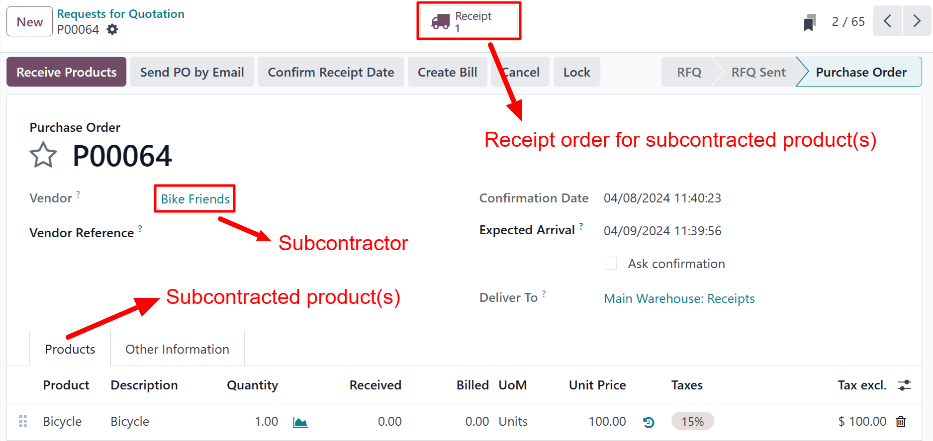
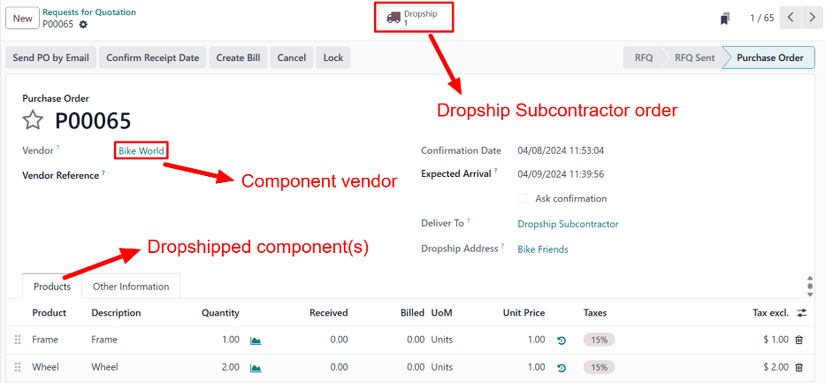

# Subpudratchi tomon Dropship

Ishlab chiqarishda subpudratchilik - bu kompaniyaning uchinchi tomon ishlab chiqaruvchi yoki subpudratchi bilan shartnoma tuzib, mahsulotlarni ishlab chiqarishga topshirish jarayoni bo'lib, keyinchalik bu mahsulotlar shartnoma tuzuvchi kompaniya tomonidan sotiladi.

Odoo dasturida `Dropship Subcontractor on Order` yo'nalishi subpudratchilik mahsuloti uchun zarur komponentlarni sotuvchidan sotib olish va har safar o'sha mahsulot uchun xarid buyurtmasi (PO) tasdiqlanganda ularni to'g'ridan-to'g'ri subpudratchi tomon yetkazib berish uchun ishlatiladi.

Subpudratchi keyin komponentlarni ishlatib kerakli mahsulotni ishlab chiqaradi va uni shartnoma tuzuvchi kompaniyaga qaytarib yuboradi.

::: warning

`Dropship` va `Dropship Subcontractor on Order` yo'nalishlari o'rtasidagi farqlarni tushunish zarur. Ikkala yo'nalish ham dropshipping bilan bog'liq bo'lsa-da, ular turli maqsadlar uchun ishlatiladi.

`Dropship` yo'nalishi mahsulotlarni sotuvchidan sotib olish va ularni to'g'ridan-to'g'ri yakuniy mijozga yetkazib berish uchun ishlatiladi.

`Dropship Subcontractor on Order` yo'nalishi komponentlarni sotuvchidan sotib olish va ularni to'g'ridan-to'g'ri subpudratchi tomon yetkazib berish uchun ishlatiladi. Odatiy holda, tayyor mahsulotlar keyin subpudratchi tomonidan shartnoma tuzuvchi kompaniyaga qaytarib yuboriladi.

Biroq, bir xil mahsulot uchun `Dropship` va `Dropship Subcontractor on Order` yo'nalishlarini birlashtirib ishlatish mumkin. Bu ish jarayonida komponentlar subpudratchi tomon dropship qilinadi, keyin u tayyor mahsulotni to'g'ridan-to'g'ri yakuniy mijozga yuboradi.

Bunga ushbu hujjatning `workflow section` qismidagi birinchi beshta qadamni bajarish orqali erishish mumkin.
::::

## Sozlash

`Dropship Subcontractor on Order` yo'nalishini ishlatish uchun `Manufacturing app ‣ Configuration ‣ Settings` ga o'ting va `Operations` sarlavhasi ostidagi `Subcontracting` yonidagi katakchani belgilang.

`Subcontracting` sozlamasi yoqilgandan so'ng, subpudratchilik mahsuloti, mahsulotning `BoM (Bill of Materials)` va `BoM (Bill of Materials)` da ko'rsatilgan komponentlarni to'g'ri sozlash zarur.

### Mahsulotni sozlash

Mahsulotni `Dropship Subcontractor on Order` yo'nalishi uchun sozlash uchun `Inventory app ‣ Products ‣ Products` ga o'ting va mahsulotni tanlang yoki `New` tugmasini bosib yangisini yarating.

`Purchase` yorlig'ini tanlang va mahsulotning subpudratchiini sotuvchi sifatida qo'shish uchun `Add a line` tugmasini bosing, `Vendor` ochiladigan menyusidan subpudratchini tanlang va `Price` maydoniga narxni kiriting.

Keyin `Inventory` yorlig'ini bosing va subpudratchi tomonidan ishlab chiqarilgandan so'ng tayyor mahsulot bilan nima qilishni belgilaydigan yo'nalishni sozlang.

Agar tayyor mahsulot shartnoma tuzuvchi kompaniyaga qaytarib yuborilsa, `Buy` yo'nalishi tanlanganligiga ishonch hosil qiling. Bundan tashqari, qo'lda etarli zaxira bo'lmagan taqdirda `SO (Sales Order)` tasdiqlanishi bilan mahsulot uchun avtomatik ravishda `PO (Purchase Order)` yaratish uchun `Replenish on Order (MTO)` yo'nalishini tanlang.

Agar tayyor mahsulot subpudratchi tomonidan to'g'ridan-to'g'ri mijozga yetkazib berilsa, faqat `Dropship` yo'nalishi tanlanganligiga ishonch hosil qiling.

### Materiallar ro'yxatini sozlash

`Dropship Subcontractor on Order` yo'nalishi uchun `BoM (Bill of Materials)` ni sozlash uchun mahsulot sahifasidagi `Bill of Materials` aqlli tugmasini bosing va `BoM (Bill of Materials)` ni tanlang.

Yoki `Manufacturing app ‣ Products ‣ Bills of Materials` ga o'ting va subpudratchilik mahsuloti uchun `BoM (Bill of Materials)` ni tanlang.

`BoM Type` maydonida `Subcontracting` variantini tanlang. Keyin pastda paydo bo'ladigan `Subcontractors` maydoniga bir yoki bir nechta subpudratchilarni qo'shing.

Nihoyat, `Components` yorlig'ida barcha zarur komponentlar ko'rsatilganligiga ishonch hosil qiling. Yangi komponent qo'shish uchun `Add a line` tugmasini bosing, `Component` ochiladigan menyusidan komponentni tanlang va `Quantity` maydonida kerakli miqdorni belgilang.

### Komponentlarni sozlash

Komponentlarni `Dropship Subcontractor on Order` yo'nalishi uchun sozlash uchun `BoM (Bill of Materials)` dan har bir komponentga o'ting, buning uchun `Components` yorlig'ida komponent nomini tanlab, nom o'ng tomonidagi `➡️ (o'ng ko'rsatkich)` tugmasini bosing.

Yoki har bir komponentga `Inventory app ‣ Products ‣ Products` ga o'tib, komponentni tanlab kiring.

Komponent mahsulot formasida `Purchase` yorlig'ini tanlang va sotuvchi qo'shish uchun `Add a line` tugmasini bosing, `Vendor` maydonidan sotuvchini tanlang va `Price` maydoniga u mahsulotni sotadigan narxni qo'shing. Bu komponentlar sotib olingandan so'ng ularni subpudratchi tomon yuboradigan sotuvchi.

Keyin `Inventory` yorlig'ini bosing va `Routes` bo'limida `Dropship Subcontractor on Order` yo'nalishini tanlang.

Subpudratchi tomon dropship qilinishi kerak bo'lgan har bir komponent uchun jarayonni takrorlang.

## Buyurtma bo'yicha subpudratchi tomon dropship ish jarayoni

Buyurtma bo'yicha subpudratchi tomon dropship ish jarayoni oltita qadamdan iborat:

1. Subpudratchilik mahsuloti uchun sotuv buyurtmasi (SO) yaratish; bu subpudratchi tomon mahsulotni sotib olish uchun *subpudratchi* `PO (Purchase Order)` yaratadi.
2. Oldingi qadamda yaratilgan `PO (Purchase Order)` ni tasdiqlash yoki yangi `PO (Purchase Order)` yaratish; bu sotuvchi tomon komponentlarni sotib olish uchun kotirovka so'rovi (RfQ) hamda qabul qilish buyurtmasi yoki dropship buyurtmasini yaratadi.
3. Uni ikkinchi `PO (Purchase Order)` (*sotuvchi* `PO (Purchase Order)`) ga aylantirish uchun `RfQ (Request for Quotation)` ni tasdiqlash; bu *Dropship Subcontractor* buyurtmasini yaratadi.
4. Sotuvchi komponentlarni subpudratchi tomon yuborgandan so'ng *Dropship Subcontractor* buyurtmasini qayta ishlash.
5. Subpudratchi subpudratchilik mahsulotini ishlab chiqarib, uni shartnoma tuzuvchi kompaniyaga qaytarib yuborgandan so'ng qabul qilishni qayta ishlash **YOKI** mahsulotni to'g'ridan-to'g'ri yakuniy mijozga yetkazib berish uchun dropship buyurtmasini qayta ishlash.
6. Agar ish jarayoni `SO (Sales Order)` yaratish bilan boshlangan bo'lsa va tayyor mahsulot yakuniy mijozga dropship qilinmagan bo'lsa, mahsulot mijozga yetkazib berilgandan so'ng yetkazib berish buyurtmasini qayta ishlash.

Qadamlarning aniq soni subpudratchilik mahsuloti subpudratchi tomon nima uchun sotib olinayotganiga bog'liq.

Agar sabab ma'lum bir mijoz buyurtmasini bajarish bo'lsa, jarayon SO yaratish bilan boshlanadi va mahsulotni mijozga yetkazib berish yoki subpudratchi tomonidan ularga dropship qilish bilan tugaydi.

Agar sabab qo'ldagi zaxira miqdorini oshirish bo'lsa, jarayon PO yaratish bilan boshlanadi va mahsulotni ombor ga qabul qilish bilan tugaydi.

### SO yaratish

Bu qadamni faqat mahsulot mijoz ehtiyojini qondirish uchun subpudratchi tomon sotib olinayotgan bo'lsa bajarish zarur. Agar mahsulot qo'ldagi zaxira miqdorini oshirish uchun sotib olinayotgan bo'lsa, keyingi qadamga o'ting.

Yangi `SO (Sales Order)` yaratish uchun `Sales app ‣ Orders ‣ Orders` ga o'ting va `New` tugmasini bosing.

`Customer` ochiladigan menyusidan mijozni tanlang. Keyin `Order Lines` yorlig'ida `Add a product` tugmasini bosing, `Product` ochiladigan menyusidan mahsulotni tanlang va `Quantity` maydoniga miqdorni kiriting.

`SO (Sales Order)` ni tasdiqlash uchun `Confirm` tugmasini bosing, shundan so'ng sahifa tepasida `Purchase` aqlli tugmasi paydo bo'ladi. Bu *subpudratchi* `PO (Purchase Order)` yoki subpudratchi tomon subpudratchilik mahsulotini sotib olish uchun yaratilgan `PO (Purchase Order)`.

::: tip

Mahsulot uchun `SO (Sales Order)` faqat mahsulot sahifasida *Replenish on Order (MTO)* yo'nalishi yoqilgan bo'lsa **VA** mahsulotdan qo'lda zaxira yo'q bo'lsagina *subpudratchi* `PO (Purchase Order)` yaratadi.

Agar qo'lda zaxira mavjud bo'lsa, mahsulot uchun `SO (Sales Order)` ni tasdiqlash o'rniga yetkazib berish buyurtmasini yaratadi, chunki Odoo `SO (Sales Order)` ni ombordagi zaxira yordamida bajariladi deb taxmin qiladi.

Bu yakuniy mijozga dropship qilinadigan subpudratchilik mahsulotlari uchun bunday emas. Bunday holda, qo'lda zaxira mavjud bo'lsa ham, *subpudratchi* `PO (Purchase Order)` **har doim** yaratiladi.
::::

### Subpudratchi PO sini qayta ishlash

Agar oldingi qadamda *subpudratchi* `PO (Purchase Order)` yaratilmagan bo'lsa, `Purchase app ‣ Orders ‣ Purchase Orders` ga o'tib, `New` tugmasini bosib hozir yarating.

`PO (Purchase Order)` ni to'ldirishni `Vendor` ochiladigan menyusidan subpudratchini tanlash bilan boshlang.

`Products` yorlig'ida yangi mahsulot qatori yaratish uchun `Add a product` tugmasini bosing. `Product` maydonida subpudratchi tomonidan ishlab chiqariladigan mahsulotni tanlang va `Quantity` maydoniga miqdorni kiriting.

Nihoyat, *subpudratchi* `PO (Purchase Order)` ni tasdiqlash uchun `Confirm Order` tugmasini bosing.

Komponentlarni subpudratchi tomon dropship qilishni talab qiladigan mahsulot uchun `PO (Purchase Order)` tasdiqlanganda, qabul qilish yoki dropship buyurtmasi avtomatik ravishda yaratiladi va `PO (Purchase Order)` tepasida paydo bo'ladigan tegishli `Receipt` yoki `Dropship` aqlli tugmasi orqali kirish mumkin.

Bundan tashqari, sotuvchi tomon sotib olinib subpudratchi tomon yuboriladigan komponentlar uchun `RfQ (Request for Quotation)` yaratiladi. Biroq, `RfQ (Request for Quotation)` *subpudratchi* `PO (Purchase Order)` ga avtomatik ravishda **bog'lanmaydi**.

`RfQ (Request for Quotation)` tasdiqlangandan so'ng *sotuvchi* `PO (Purchase Order)` ga aylanganda, *Dropship Subcontractor* buyurtmasi yaratiladi. Bu buyurtma *sotuvchi* `PO (Purchase Order)` ham, *subpudratchi* `PO (Purchase Order)` ham bilan bog'langan.

### Sotuvchi RfQ sini tasdiqlash

*Subpudratchi* `PO (Purchase Order)` ni tasdiqlash orqali yaratilgan `RfQ (Request for Quotation)` ga kirish uchun `Purchase app ‣ Orders ‣ Requests for Quotation` ga o'ting. `Vendor` maydonida to'g'ri sotuvchi va `Source Document` maydonida *subpudratchi* `PO (Purchase Order)` tasdiqlanganidan keyin yaratilgan qabul qilishning mos yozuv raqami ko'rsatilgan `RfQ (Request for Quotation)` ni tanlang.

`RfQ (Request for Quotation)` da `Deliver To` maydoni `Dropship Subcontractor` deb o'qiladi va `Dropship Address` maydonida komponentlar dropship qilinayotgan subpudratchi nomi ko'rsatiladi.

`RfQ (Request for Quotation)` ni *sotuvchi* `PO (Purchase Order)` ga aylantirish va sotuvchi tomon komponentlar xaridini tasdiqlash uchun `Confirm Order` tugmasini bosing. Shundan so'ng *sotuvchi* `PO (Purchase Order)` tepasida `Dropship` aqlli tugmasi va *subpudratchi* `PO (Purchase Order)` tepasida `Resupply` aqlli tugmasi paydo bo'ladi.

### Dropship Subcontractor buyurtmasini qayta ishlash

Komponentlar subpudratchi tomon yetkazib berilgandan so'ng, `Purchase app ‣ Orders ‣ Purchase Orders` ga o'ting va *sotuvchi* `PO (Purchase Order)` yoki *subpudratchi* `PO (Purchase Order)` ni tanlang. Keyin mos ravishda `Dropship` aqlli tugmasini yoki `Resupply` aqlli tugmasini bosing.

Ikki tugmadan birini bosish *Dropship Subcontractor* buyurtmasini ochadi. Subpudratchi komponentlarni qabul qilganini tasdiqlash uchun buyurtma tepasidagi `Validate` tugmasini bosing.

### Qabul qilish yoki dropship buyurtmasini qayta ishlash

Subpudratchi tayyor mahsulotni ishlab chiqargandan so'ng, `Purchase app ‣ Orders ‣ Purchase Orders` ga o'ting va *subpudratchi* `PO (Purchase Order)` ni tanlang.

Agar subpudratchilik mahsuloti ombor ga qabul qilinishi kerak bo'lsa, mahsulot kelgandan so'ng qabul qilishni ochish uchun *subpudratchi* `PO (Purchase Order)` tepasidagi `Receive Products` tugmasini bosing. Keyin mahsulotni ombor ga ro'yxatga olish uchun qabul qilish tepasidagi `Validate` tugmasini bosing.

Yoki *subpudratchi* `PO (Purchase Order)` tepasidagi `Receipt` aqlli tugmasini tanlab, qabul qilish tepasidagi `Validate` tugmasini bosing.

Agar subpudratchilik mahsuloti dropship qilinishi kerak bo'lsa, dropship buyurtmasini ochish uchun sahifa tepasidagi `Dropship` tugmasini tanlang va subpudratchi mahsulotni mijozga yuborgandan so'ng `Validate` tugmasini bosing.

### Yetkazib berish buyurtmasini qayta ishlash

Agar subpudratchilik ish jarayoni mijoz `SO (Sales Order)` bilan boshlangan bo'lsa va tayyor mahsulot mijozga dropship qilinmagan, balki shartnoma tuzuvchi kompaniyaga yetkazib berilgan bo'lsa, mahsulotni mijozga yetkazib berish va yetkazib berish buyurtmasini qayta ishlash zarur.

Mahsulot mijozga yetkazib berilgandan so'ng, `Sales` ilovasiga o'ting va `SO (Sales Order)` ni tanlang. Yetkazib berish buyurtmasini ochish uchun sahifa tepasidagi `Delivery` aqlli tugmasini tanlang va mahsulot mijozga yetkazib berilganini tasdiqlash uchun `Validate` tugmasini bosing.