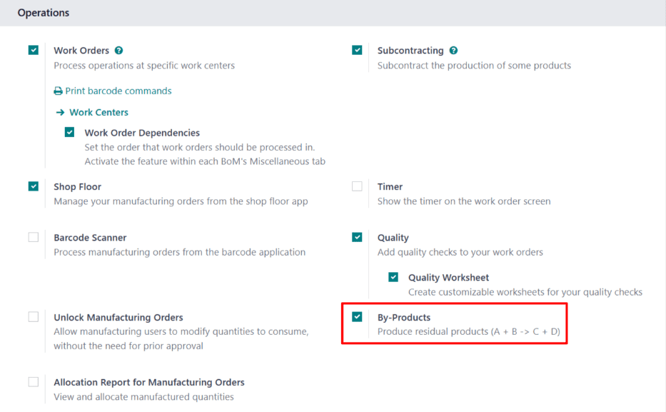
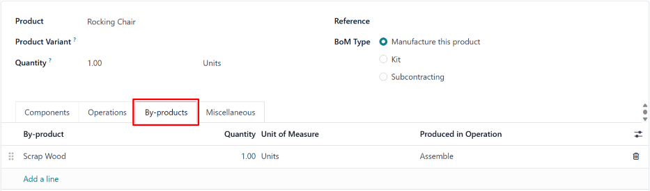
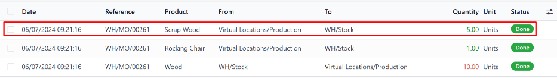

# Qo'shimcha mahsulotlar

Muayyan mahsulotlarni ishlab chiqarishda, tayyor mahsulotdan tashqari, 
qoldiq materiallar bilan qolish odatiy holdir. Bu materiallar 
*qo'shimcha mahsulotlar* deb nomlanadi. Mahsulotning `BoM (bill of materials)`ida 
ishlab chiqarish jarayonida yaratilgan qo'shimcha mahsulotlarni belgilash orqali, 
Odoo qo'shimcha mahsulotlarning mavjud miqdorini kuzatib boradi.

::: misol
*Tebranuvchi kreslo* ishlab chiqarish uchun o'nta yog'och bo'lagi kerak. 
Ishlab chiqarish jarayonida, tebranuvchi kresl bilan birga, beshta *qoldiq yog'och* 
bo'lagi yaratiladi. Qoldiq yog'ochni tebranuvchi kresloning `BoM (bill of materials)`ida 
qo'shimcha mahsulot sifatida belgilash orqali, Odoo ishlab chiqarilgan tebranuvchi 
kresl miqdorini ham, qoldiq yog'ochning mavjud miqdorini ham kuzatib boradi.
:::

## Sozlash

Mahsulotning `BoM (bill of materials)`ida qo'shimcha mahsulotlarni belgilash uchun, 
*Qo'shimcha mahsulotlar* sozlamasi **albatta** yoqilgan bo'lishi kerak. Buning uchun, 
`Manufacturing app ‣ Configuration ‣ Settings` bo'limiga o'ting va `Operations` 
sarlavhasi ostida joylashgan `By-Products` katakchani belgilang. Keyin o'zgarishni 
qo'llash uchun `Save` tugmasini bosing.

`By-Products` sozlamasi yoqilgan holda, mahsulot `BoMs (bills of materials)`ida 
`By-products` yorlig'i paydo bo'ladi.

## BoM ga qo'shimcha mahsulot qo'shish

`BoM (bill of materials)`ga qo'shimcha mahsulotlar qo'shish uchun, 
`Manufacturing app ‣ Products ‣ Bills of Materials` bo'limiga o'ting va 
`BoM (bill of materials)`ni tanlang.

`BoM (bill of materials)`da `By-products` yorlig'ini tanlang. `Add a line` tugmasini 
bosing va `By-product` pasayuvchi ro'yxat maydonida qo'shimcha mahsulotni tanlang. 
`Quantity` maydoniga ishlab chiqarish jarayonida ishlab chiqariladigan qo'shimcha 
mahsulot miqdorini kiriting.

Agar qo'shimcha mahsulot `MO (manufacturing order)`ning muayyan operatsiyasi 
davomida ishlab chiqarilsa, `Produced in Operation` maydonida operatsiyani tanlang. 
Masalan, agar qoldiq yog'och qo'shimcha mahsuloti *Yig'ish* operatsiyasi davomida 
ishlab chiqarilsa, `Produced in Operation` maydonida shu operatsiyani tanlang.

## Qo'shimcha mahsulot ishlab chiqarish

`MO (manufacturing order)` tugallanganda va *Bajarildi* deb belgilanganda, Odoo 
ishlab chiqarish jarayonida yaratilgan qo'shimcha mahsulotlar miqdorini ro'yxatga 
oladi. Yangi `MO (manufacturing order)` yaratish uchun, 
`Manufacturing app ‣ Operations ‣ Manufacturing Orders` bo'limiga o'ting va 
`New` tugmasini bosing.

`Bill of Material` maydonida qo'shimcha mahsulotlar belgilangan 
`BoM (bill of materials)`ni tanlang. Shundan so'ng, `Product` maydoni mos keladigan 
mahsulot bilan avtomatik to'ldiriladi. `MO (manufacturing order)`ni tasdiqlash uchun 
`Confirm` tugmasini bosing.

Ishlab chiqarish tugallanganda, `MO (manufacturing order)` yuqori qismidagi 
`Produce All` tugmasini bosing. Shundan so'ng, inventar hisobi ishlab chiqarilgan 
qo'shimcha mahsulot(lar) miqdorini ham, mahsulot miqdorini ham aks ettirish uchun 
yangilanadi.

Komponentlar va mahsulotlarning harakatlarini ko'rish uchun 
`MO (manufacturing order)` sahifasining yuqori qismidagi `Product Moves` aqlli 
tugmasini bosing. Har bir qo'shimcha mahsulot natijada paydo bo'ladigan 
`Inventory Moves` sahifasida ro'yxatga olinadi, `From` ustuni virtual ishlab 
chiqarish joyini, `To` ustuni esa qo'shimcha mahsulot saqlanadigan joyni ko'rsatadi.

