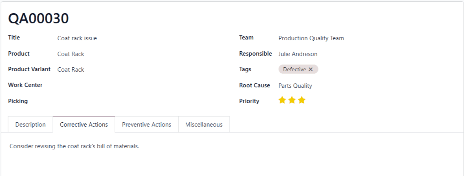
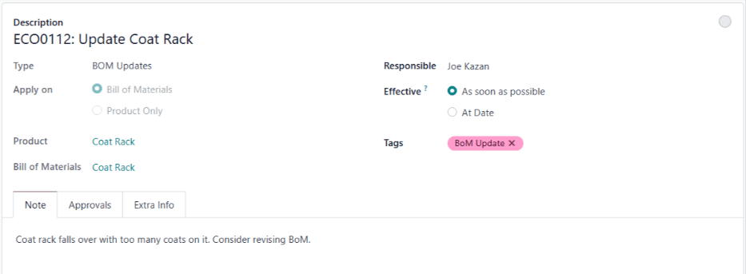
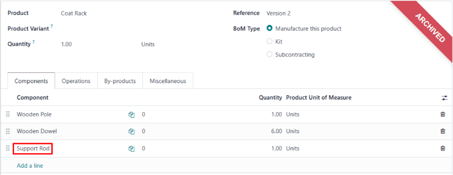

# Uzluksiz mahsulot takomillashtirish

*Uzluksiz takomillashtirish* - bu shaxslar va tashkilotlarga o'zlarini va 
ular ishlab chiqaradigan ishlarni doimiy ravishda yaxshilashga yordam berish 
maqsadida yaratilgan umumiy falsafa.

Uzluksiz takomillashtirish soyabonida joylashgan turli xil metodologiyalar 
mavjud. Bularga kaizen, olti sigma va lean kabi metodlar kiradi. Har bir 
metodning aniq qadamlari farq qilsa-da, ularning maqsadi bir xil qoladi: 
takomillashtirishni bir martalik yutuq emas, balki doimiy maqsad qilib 
qo'yadigan jarayonni amalga oshirish.

Quyidagi bo'limlar Odoo platformasini eng mashhur uzluksiz takomillashtirish 
strategiyalarida keng tarqalgan to'rtta umumiy qadamni amalga oshirish uchun 
qanday ishlatish mumkinligi haqida batafsil ma'lumot, shuningdek kerakli 
funksiyalarni sozlash bo'yicha hujjatlarga havolalar beradi. Yakuniy bo'lim 
ma'lum bir kompaniya o'z tashkilotida ushbu Odoo dasturlarini qanday sozlashi 
mumkinligi haqida batafsil ma'lumot beradi.

1.  `manufacturing/workflows/ci-identify`
2.  `manufacturing/workflows/ci-suggest`
3.  `manufacturing/workflows/ci-implement`
4.  `manufacturing/workflows/ci-review`

::: ogohlantirish

Uzluksiz takomillashtirish hammaga mos keladigan metodologiya emas. Ko'pchilik 
strategiyalar to'rt-olti qadam o'rtasida bo'lsa-da, to'g'ri amalga oshirish 
har bir kompaniyaning o'ziga xos ehtiyojlariga moslashtirilgan tizimni 
ishlab chiqishni talab qiladi.

Bu cheklov emas, balki foyda, chunki u metodologiyani deyarli har qanday 
foydalanish holatiga moslashish uchun yetarli darajada moslashuvchan qiladi. 
Xususan, Odoo bu moslashuvchanlikka yaxshi moslashadi, chunki u deyarli har 
qanday ish oqimining ehtiyojlarini qondirish uchun sozlanishi mumkin.

Shuning uchun, quyidagi kontent faqat Odoo qanday ishlatilishi mumkinligining 
*misollarini* berganini eslab qolish muhim. Ularni har bir tashkilot amal 
qilishi kerak bo'lgan aniq rejadan ko'ra, boshlanish nuqtasi sifatida 
ko'rish kerak.
:::

## Muammolarni aniqlash

Takomillashtirish boshlanishidan oldin, takomillashtirish qayerda zarur 
ekanligini aniqlash kerak. Muammolarni aniqlash aynan shu yerda rol o'ynaydi. 
Mahsulotlar yoki jarayonlardagi muammolarni aniqlash uchun eng yaxshi Odoo 
ilovalaridan ikkitasi *Helpdesk* va *Quality* hisoblanadi.

### Helpdesk

*Helpdesk* ilovasi tashkilotdan tashqaridan, masalan, mijozlar yoki 
xaridorlardan fikr-mulohaza olish uchun foydali. Bu email manzillari, jonli 
chat suhbatlari va veb-sayt formalari kabi `receiving tickets ` 
metodlaridan birini (yoki bir nechtasini) amalga oshirish orqali amalga oshiriladi.

Ushbu metodlardan foydalanib, mijozlar muammolar haqida fikr-mulohaza 
yuborishlari mumkin, keyin esa bu `helpdesk team ` a'zosi tomonidan 
ko'rib chiqiladi. Ko'rib chiqish natijasiga qarab, jamoa a'zosi masalani 
hal qilish uchun qo'shimcha choralar ko'rishga qaror qilishi mumkin. 
Bu `quality alert ` yaratishni o'z ichiga olishi mumkin.

### Quality

*Quality* ilovasi tashkilot *ichidagi*, masalan, xodimlardan fikr-mulohaza 
olish uchun foydali.

Buni amalga oshirishning bir usuli `quality control point ` (QCP) o'rnatishdir. 
`QCP (Quality Control Point)` muntazam ravishda sifat tekshiruvlarini avtomatik 
ravishda yaratish, xodimlarni mahsulot sifatini tekshirish va tasdiqlashga 
undash uchun ishlatiladi.

Agar muammo topilsa, xodim sifat jamoasini xabardor qilish uchun 
`quality alert ` yaratishi mumkin. Sifat ogohlantirishlari 
`QCP (Quality Control Point)`dan mustaqil ravishda ham yaratilishi mumkin, 
agar xodim tekshirishga undalmagan holda muammoni topsa. Bu mijoz chiptasi 
orqali e'tiborlariga etkazilgan muammo haqida sifat jamoasini xabardor 
qilish uchun mijozlarni qo'llab-quvvatlash xodimlari uchun ajoyib usul.

## Takomillashtirishlarni taklif qilish

Muammo aniqlangandan so'ng, keyingi qadam muammoni qanday hal qilish 
bo'yicha g'oyalar ilgari surishdir. Muammolarni aniqlash kabi, *Quality 
ilovasi* takomillashtirishlarni taklif qilish uchun ham foydali. Bundan 
tashqari, *PLM* (*Product Lifecycle Management*) ilovasi ham shu maqsad 
uchun ishlatilishi mumkin.

### Quality

Sifat jamoasining e'tiborini jalb qilish uchun `quality alert ` yaratishda, 
`Corrective Actions` va `Preventive Actions` yorliqlari muammo qanday 
hal qilinishi haqida fikr-mulohaza berish uchun ishlatilishi mumkin.

`Corrective Actions` yorlig'i muammoga ta'sir qilgan narsalarni tuzatish 
usulini taklif qilish uchun ishlatiladi. Masalan, [Boltlarni qattiqroq 
burab qo'ying, shunda o'rindiq o'z joyida qoladi].

`Preventive Actions` yorlig'i muammoning kelajakda takrorlanishining 
oldini olish usulini taklif qilish uchun ishlatiladi. Masalan, 
[Vintlarni juda qattiq torting, aks holda ular buziladi].

Ogohlantirishni ko'rib chiqadigan sifat jamoasi ushbu taklif qilingan 
harakatlarni ko'radi va muammoni qanday hal qilish haqida qaror 
qabul qilishda ularni hisobga olishi mumkin.

### PLM

`PLM (Product Lifecycle Management)` ilovasi mahsulotning joriy qilinishidan 
har bir keyingi versiyasigacha bo'lgan hayot aylanishini boshqarish uchun 
ishlatiladi. Shuning uchun, u mahsulot takomillashtirishlari g'oyalarini 
sinash uchun foydali.

`engineering change orders ` yordamida mahsulot boshqaruv jamoalari 
mahsulot `BoMs (Bills of Materials)`ning yangi takrorlanishlarini yaratishi, 
zarurat bo'yicha muayyan komponentlar yoki operatsiyalarni qo'shishi yoki 
olib tashlashi mumkin. Ushbu `BoMs (Bills of Materials)` yordamida yaratilgan 
mahsulotlar o'zgarishlarning samaradorligini tasdiqlash uchun ko'rib chiqish 
jarayonidan o'tkaziladi.

## Strategiyalarni amalga oshirish

Strategiyalarni amalga oshirish takomillashtirishlarni taklif qilish bosqichidan 
taklif qilingan echimlarni amalga tatbiq etishni o'z ichiga oladi. 
`PLM (Product Lifecycle Management)` ilovasi bu bosqichda ham foydali bo'lib 
qoladi, chunki u `BoM (Bill of Materials)` yangilanishlarini amalga oshirish 
uchun sozlanishi mumkin. *Field Service* ilovasi ham ma'lum kompaniyalar 
tomonidan mijozlarga allaqachon sotilgan mahsulotlarga yaxshilanishlar 
kiritish uchun ishlatilishi mumkin.

### PLM

`BoM (Bill of Materials)` o'zgarishlari tegishli ko'rib chiqish jarayonidan 
o'tgandan so'ng, ular tasdiqlanishi va yangilangan `BoM (Bill of Materials)` 
foydalanishga qo'yilishi mumkin. Bu `ECO (Engineering Change Order)` ko'rib 
chiqish bosqichlaridan birini `BoM (Bill of Materials)`ga kiritilgan 
`apply the changes ` uchun sozlash orqali amalga oshiriladi, shundan so'ng 
yangilangan `BoM (Bill of Materials)` yangi `MOs (Manufacturing Orders)` 
uchun mavjud bo'ladi.

Mahsulot `BoMs (Bills of Materials)` zarurat bo'yicha yangilanishda davom 
etishi mumkin. `PLM (Product Lifecycle Management)` ilovasining `version control ` 
funksiyalari berilgan `BoM (Bill of Materials)`ning barcha versiyalarini 
oson boshqarish imkonini beradi.

### Field Service

`PLM (Product Lifecycle Management)` ilovasi mahsulot `BoMs (Bills of Materials)`ga 
o'zgarishlar kiritishning ajoyib usuli. Biroq, bu o'zgarishlar faqat yangi 
`BoM (Bill of Materials)` yordamida ishlab chiqarilgan mahsulotlarga ta'sir qiladi. 
Agar nuqsonli mahsulot allaqachon mijozga sotilgan bo'lsa, o'sha mahsulotni 
ta'mirlash (yoki yangilash) zarur bo'lishi mumkin.

Bunday holatda, *Field Service* ilovasi `onsite interventions ` rejalashtirish 
uchun ishlatilishi mumkin. Bu aralashuvlar xizmat texniklari (yoki boshqa 
xodimlar)ni mijoz joylashuviga mahsulot bilan bog'liq muammoni hal qilish 
uchun yuborish imkonini beradi.

## Harakatlarni ko'rib chiqish

Harakatlarni ko'rib chiqish uzluksiz takomillashtirishning "uzluksiz" qismi 
paydo bo'ladigan joy, chunki u tashkilotga oldingi bosqichlarda qabul qilingan 
qarorlarni baholash imkonini beradi. Shuning uchun, bu bosqich, aslida, 
jarayonning boshiga qaytish bo'lib, qo'shimcha muammolarni aniqlash va 
hal qilish mumkin.

Bu *Helpdesk* va *Quality* ilovalarini mijozlar va xodimlardan fikr-mulohaza 
olish uchun yana ishlatish kerakligini anglatadi. Bu bosqichda foydali 
bo'lishi mumkin bo'lgan yana bir ilova *Surveys* ilovasidir.

### Surveys

Mahsulot yoki jarayonga o'zgarishlar kiritgandan so'ng, mijozlarning o'z 
ixtiyorlari bilan gapirganlarini kutish o'rniga, ulardan to'g'ridan-to'g'ri 
fikr-mulohaza so'rash oqilona bo'lishi mumkin. Bu mijozlar boshqa holatda 
baham ko'rishga e'tibor bermasligi mumkin bo'lgan fikr-mulohazalarni 
yoritishi mumkin.

Buni amalga oshirishning eng yaxshi usullaridan biri `Surveys ` ilovasi 
orqali. So'rovnoma yaratish va uni yangilangan mahsulot oladigan mijozlarga 
yuborish mahsulot haqida tegishli fikr-mulohaza olish ehtimolini oshiradi.

::: 
Misol ish oqimi: palto ilgichi mahsulotini takomillashtirish

*Wood Hut* nozik yog'och mahsulotlari ishlab chiqaruvchisi. Ular 
eng yuqori sifatli mahsulotlar ishlab chiqarishga sodiq va har doim 
sotadigan mahsulotlarni, shuningdek ularni yaratish uchun ishlatiladigan 
jarayonlarni yaxshilash yo'llarini qidirmoqda.

Wood Hut o'zlarining ishlab chiqarish, bajarish va mijozlar qoniqishi 
jarayonlarining har bir elementini boshqarish uchun Odoo platformasidan 
foydalanadi. Ular Helpdesk, Quality, PLM va Manufacturing ilovalarini 
o'z ichiga olgan maxsus mahsulot takomillashtirish ish oqimini ishlab chiqdilar.

Wood Hut-ning eng mashhur mahsulotlaridan biri ularning *palto ilgichi*. 
U butunlay eman yog'ochidan yasalgan va mijozlar uni "zamonaviy va nafis" 
deb ta'riflaydilar. Biroq, palto ilgichi haqidagi so'nggi mijoz fikr-mulohazalari 
joriy ishlab chiqarish jarayonini qayta ko'rib chiqishni talab qiladigan 
sifat muammolariga e'tiborni jalb qildi.

Mahsulot qayta ko'rib chiqish ish oqimi mijozlarni qo'llab-quvvatlash jamoasi 
sotib olgan palto ilgichi bilan muammolari bo'lgan mijozdan Helpdesk ilovasida 
chipta olganda boshlanadi. Mijoz Abigail Peterson o'zining palto ilgichi 
beshdan ortiq palto osilganda yiqilib tushganini aniqladi. Bu jiddiy muammo, 
chunki palto ilgichida olti palto uchun yetarli dowel bor.

Helpdesk chiptasiga tayinlangan mijozlarni qo'llab-quvvatlash xodimi Mark 
Quality ilovasini ochadi va yangi sifat ogohlantirishini yaratadi. U 
*Ishlab chiqarish sifati jamoasi*ni belgilaydi va Julie Andersonni 
ogohlantirish uchun mas'ul sifat xodimi sifatida tayinlaydi.

Julie ogohlantirishni ko'rib chiqadi va o'z jamoasi bilan eng yaxshi 
harakat yo'li haqida maslahat oladi. Ular kelajakda muammoning takrorlanishining 
oldini olish uchun mahsulotning `BoM (Bill of Materials)`ini qayta ko'rib 
chiqish zarur degan qarorga kelishadi, buni Julie sifat ogohlantirishining 
`Corrective Actions` yorlig'ida qayd etadi.

Keyin Julie sifat ogohlantirishining chatterida mahsulot muhandisi Joe Kazanga 
xabar yuboradi va uning e'tiborini jalb qiladi. Joe `PLM (Product Lifecycle Management)` 
ilovasini ochadi va yangi `ECO (Engineering Change Order)` yaratadi, palto 
ilgichi bilan muammoni qayd etib, mahsulotning `BoM (Bill of Materials)`ini 
o'zgartirish zarur bo'lishi mumkinligini taklif qiladi.

Joe `Start Revision` tugmasini bosadi, so'ngra palto ilgichining ikkinchi 
versiyasini ochish uchun `Revision` aqlli tugmasini bosadi 
`BoM (Bill of Materials)`. Bu `BoM (Bill of Materials)` 
`ECO (Engineering Change Order)` bilan birga yaratilgan va tasdiqlangungacha 
arxivlangan holda qoladi.

Ba'zi sinashlardan so'ng, Joe palto ilgichiga metall *qo'llab-quvvatlash tayog'i* 
qo'shish uni mustahkamlaydi va ilgichga oltita yoki undan ortiq paltoni 
yiqilmasdan osish imkonini beradi. U qo'llab-quvvatlash tayog'ini komponentlardan 
biri sifatida kiritish uchun `BoM (Bill of Materials)`ni yangilaydi va ishlab 
chiqarish jarayonida u o'rnatilganligiga ishonch hosil qilish uchun qo'shimcha 
operatsiya qo'shadi. Nihoyat, u `ECO (Engineering Change Order)` chatteriga 
xabar qoldirib, boshlig'i Josega uni ko'rib chiqishga tayyorligini bildiradi.

Jose o'zgarishlarni ko'rib chiqadi va ular palto ilgichi bilan muammoni 
hal qilishning samarali usuli ekanligini tasdiqlaydi. U 
`ECO (Engineering Change Order)`ni *Tasdiqlangan* bosqichiga o'tkazadi, 
bu palto ilgichi `BoM (Bill of Materials)`ning ikkinchi versiyasini 
joriy versiyaga aylantiradi.

Endi palto ilgichi ishlab chiqarish uchun `MO (Manufacturing Order)` 
yaratilgan har safar, yangilangan `BoM (Bill of Materials)` avtomatik 
ravishda tanlanadi. Wood Hut yaxshilangan palto ilgichini ishlab chiqarishni 
boshlaydi va mijozlarning fikr-mulohazalari yangi version oldingi 
versiyaning muammosini hal qilganini tasdiqlaydi.

Odoo platformasidan foydalanib, Wood Hut tugal mahsulot takomillashtirish 
jarayonini amalga oshirdi. Ushbu jarayonning asosiy elementlari (mijozlar 
fikr-mulohazasi, sifat nazorati va boshqalar) doimo ishlayotganligi 
sababli, u mahsulotlar va jarayonlarni uzluksiz yangilash uchun 
qayta ishlatilishi mumkin.
:::
