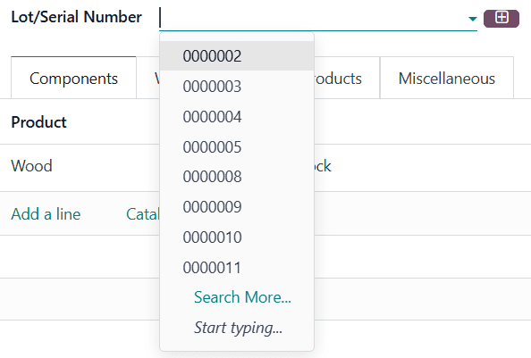
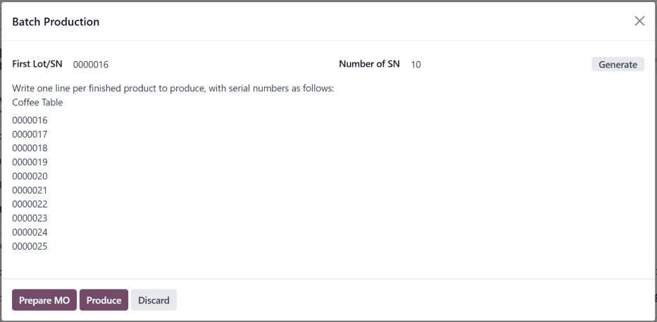

# Manufacture with lots and serial numbers

In Odoo, *lot numbers* and *serial numbers* are used to identify and
track products in Odoo. Serial numbers are used to assign unique numbers
to individual products, while lot numbers are used to assign a single
number to multiple units of a specific product.

When manufacturing products tracked using lots or serial numbers, Odoo
requires the lot or serial number to be assigned to each product before
manufacturing can be completed. This ensures that each product is
properly tracked from the moment it enters inventory.

## Configure products for tracking

By default, Odoo tracks the quantity of each product on hand, but does
not track individual units of a product. Lot or serial number tracking
must be enabled for each product individually.

To track a product using lots or serial numbers, begin by navigating to
`Inventory
‣ Configuration ‣ Settings`,
then scroll down to the `Traceability` section, and tick the
`Lots & Serial Numbers` checkbox.
Finally, click `Save` to save the
change.

Next, click on `Products ‣ Products`, and select a product to track. Make sure the
`Track Inventory` checkbox is ticked
in the `General Information` tab.
Since lot and serial number functionality is enabled, a drop-down menu
appears next to the ticked checkbox.

Click on the `Track Inventory`
drop-down menu. By default, `By Quantity` is selected, which only tracks the quantity on hand.
Select `By Lots` to track the product
using lot numbers, or `By Unique Serial Number` to track the product using serial numbers.

## Lot number manufacturing

To manufacture a product tracked with lots, begin by navigating to
`Manufacturing ‣
Operations ‣ Manufacturing Orders`. Click `New` to
create a new manufacturing order (MO).

In the `Product` field, select a
product tracked using lots, and enter the desired
`Quantity`. Click
`Confirm` to confirm the
`MO (Manufacturing Order)`.

Once the `MO (Manufacturing Order)` is
confirmed, a `Lot/Serial Number`
field appears in the top section of the
`MO (Manufacturing Order)` form. By
default, this field is empty.

To populate the `Lot/Serial Number`
field with a lot number, click the `fa-plus-square-o` `(plus)` icon to the
right of the field. Doing so automatically generates a lot, using the
next available number, and enters it in the field.

Alternatively, click on the `Lot/Serial Number` field and select an existing lot number, or manually
enter a new lot number and click `Create "#"` in the drop-down menu.

Either of these methods assign the product(s) in the
`MO (Manufacturing Order)` a lot number
before production is finished. It is also possible to complete
production and close the `MO (Manufacturing Order)` by clicking `Produce All`, without assigning a lot number. Doing so automatically
generates and assigns a lot, using the next available number.

## Serial number manufacturing

To manufacture a product tracked with serial numbers, begin by
navigating to
`Manufacturing ‣ Operations ‣ Manufacturing Orders`. Click `New` to
create a new `MO (Manufacturing Order)`.

In the `Product` field, select a
product tracked using serial numbers, and enter the desired
`Quantity`. Click
`Confirm` to confirm the
`MO (Manufacturing Order)`.

Once the `MO (Manufacturing Order)` is
confirmed, a `Lot/Serial Number`
field appears in the top section of the
`MO (Manufacturing Order)` form. By
default, this field is empty.

The rest of the manufacturing process depends on how many units the
`MO (Manufacturing Order)` contains.

### Manufacture single unit

If a single unit of the product is being manufactured, clicking
`Produce All` closes the
`MO (Manufacturing Order)`, and
automatically generates and assigns the next available serial number,
which appears in the `Lot/Serial Number` field.

To assign a serial number without closing the
`MO (Manufacturing Order)`, enter a
number manually in the `Lot/Serial Number` field, and click `Create "#"`, or click the `fa-plus-square-o` `(plus)` icon to the
right of the field to auto-fill it with the next available number.

### Manufacture multiple units

:::: warning

When manufacturing a product tracked using serial numbers, an
`MO (Manufacturing Order)` can be created
for multiple units. However, when serial numbers are assigned to each
unit, either at the end of production or before, the
`MO (Manufacturing Order)` is split into
multiple `MOs (Manufacturing Orders)`,
each containing one unit of the product.

Each of the split `MOs (Manufacturing Orders)` is identified by a numerical tag added to the end of the
original `MO (Manufacturing Order)`
number.

::: example
`MO (Manufacturing Order)`
[WH/MO/00109] contains two units of a [Chair], a
product tracked using serial numbers. A serial number is assigned to
each unit of the chair. This causes the
`MO (Manufacturing Order)` to be split
into two `MOs (Manufacturing Orders)`,
each containing one unit of the chair. The
`MOs (Manufacturing Orders)` are titled
[WH/MO/00109-001] and [WH/MO/00109-002].
:::
:::::

To assign serial numbers to each unit of an
`MO (Manufacturing Order)`, click
`Produce All` to open the
`Batch Production` pop-up window.

The `First Lot/SN` field of the
pop-up window is auto-filled with the next available serial number. The
`Number of SN` field defaults to the
number of units being manufactured. The values of either field can be
changed manually.

Click `Generate` to generate the
specified number of serial numbers, beginning with the number entered in
the `First Lot/SN` field. The serial
numbers are displayed in the text box at the bottom of the pop-up
window, and can be manually changed after generation.

To assign serial numbers without completing production, click the
`Prepare MO` button. Doing so splits
the `MO (Manufacturing Order)` into
individual `MOs (Manufacturing Orders)`,
one for each unit in the original
`MO (Manufacturing Order)`. Each
`MO (Manufacturing Order)` is left open,
and can be closed individually.

To assign serial numbers and complete production, click the
`Produce` button. Doing so splits the
`MO (Manufacturing Order)` into
individual `MOs (Manufacturing Orders)`,
one for each unit in the original
`MO (Manufacturing Order)`. All of the
`MOs (Manufacturing Orders)` are closed,
since production is complete.

After clicking `Prepare MO` or
`Produce`, the
`Manufacturing` app
automatically shows the first of the split
`MOs (Manufacturing Orders)` (ex.
[WH/MO/00109-001]). To view and access the rest the split
`MOs (Manufacturing Orders)`, click the
`Backorders` smart button at the top
of the screen.
