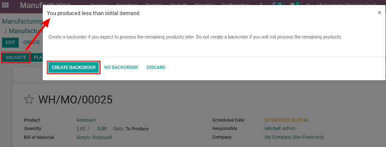
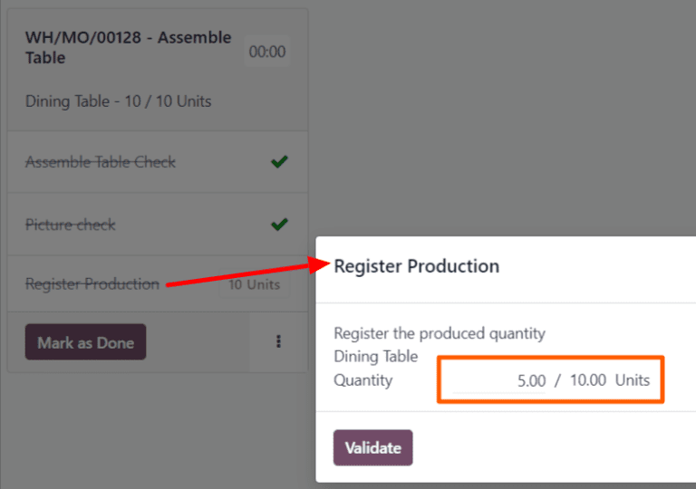

# Ishlab chiqarish orqa buyurtmalari

Ba'zi hollarda ishlab chiqarish buyurtmasining to'liq miqdorini darhol ishlab chiqarish mumkin emas. Bunday vaziyatda Odoo *Manufacturing* ilovasi buyurtmaning qisman miqdorini ishlab chiqarishga imkon beradi va qolgan miqdor uchun *orqa buyurtma* yaratadi.

*Manufacturing* ilovasida orqa buyurtma yaratish asl ishlab chiqarish buyurtmasini ikki buyurtmaga bo'ladi. Har bir buyurtma uchun havola tegi asl buyurtma uchun ishlatilgan teg bo'lib, undan keyin defis va orqa buyurtma ekanligini ko'rsatish uchun qo'shimcha raqam qo'yiladi.

::: example
Kompaniya *WH/MO/00175* havola tegi bilan *Product X* ning 10 birligini ishlab chiqarish buyurtmasini yaratadi. Ishlab chiqarish buyurtmasini boshlashdan so'ng, ishlab chiqarish liniyasida ishlovchi xodim omborda mahsulotning faqat besh birligini ishlab chiqarish uchun yetarli komponentlar borligini tushunadi.

Komponentlarning qo'shimcha zaxirasini kutish o'rniga, ular besh birlik ishlab chiqaradilar va qolgan besh birlik uchun orqa buyurtma yaratadilar. Bu ishlab chiqarish buyurtmasini ikki alohida buyurtmaga bo'ladi: *WH/MO/00175-001* va *WH/MO/00175-002*.

*001* buyurtmasi ishlab chiqarilgan besh birlikni o'z ichiga oladi va darhol `Done` deb belgilanadi. *002* buyurtmasi hali ishlab chiqarilishi kerak bo'lgan besh birlikni o'z ichiga oladi va `In Progress` deb belgilanadi. Qolgan komponentlar mavjud bo'lgandan so'ng, xodim *002* buyurtmasiga qaytadi va buyurtmani yopishdan oldin qolgan birliklarni ishlab chiqaradi.
:::

## Ishlab chiqarish orqa buyurtmasini yaratish

Ishlab chiqarish buyurtmasining bir qismi uchun orqa buyurtma yaratish uchun, `Manufacturing ‣ Operations ‣ Manufacturing Orders` bo'limiga o'ting. Ikki yoki undan ortiq miqdorga ega ishlab chiqarish buyurtmasini tanlang yoki `Create` tugmasini bosib yangi buyurtma yarating.

Agar yangi ishlab chiqarish buyurtmasi yaratilsa, `Product` ochiluvchi menyusidan mahsulotni tanlang va `Quantity` maydoniga ikki yoki undan ortiq miqdorni kiriting, so'ngra buyurtmani tasdiqlash uchun `Confirm` tugmasini bosing.

Darhol ishlab chiqarilayotgan miqdorni ishlab chiqarishdan so'ng, ishlab chiqarish buyurtmasining yuqori qismidagi `Quantity` maydoniga shu raqamni kiriting.

Keyin `Validate` tugmasini bosing va `You produced less than initial demand` oynasi paydo bo'ladi, undan orqa buyurtma yaratilishi mumkin. Ishlab chiqarish buyurtmasini ikki alohida buyurtmaga bo'lish uchun `Create Backorder` tugmasini bosing, havola teglari *WH/MO/XXXXX-001* va *WH/MO/XXXXX-002* bo'ladi.

*001* buyurtmasi ishlab chiqarilgan mahsulotlarni o'z ichiga oladi va darhol yopiladi. *002* buyurtmasi hali ishlab chiqarilmagan mahsulotlarni o'z ichiga olgan orqa buyurtma bo'lib, ochiq qoladi va keyinroq tugallanadi.

Qolgan birliklarni ishlab chiqarish mumkin bo'lgandan so'ng, `Manufacturing ‣
Operations ‣ Manufacturing Orders` bo'limiga o'ting va orqa buyurtma ishlab chiqarish buyurtmasini tanlang. Agar qolgan barcha birliklar darhol ishlab chiqarilsa, buyurtmani yopish uchun shunchaki `Validate` tugmasini bosing.

Agar qolgan birliklarning faqat bir qismi darhol ishlab chiqarilsa, qolgani uchun ushbu bo'limda batafsil bayon qilingan qadamlarni bajarib, yana bir orqa buyurtma yarating.

## Shop Floor da orqa buyurtma yaratish

Ishlab chiqarish buyurtmalari uchun orqa buyurtmalar *Shop Floor* modulidan ham yaratilishi mumkin.

::: tip

*Shop Floor* modulidan foydalanish uchun *Work Orders* sozlamasi yoqilgan bo'lishi kerak. Buning uchun `Manufacturing ‣ Configuration ‣ Settings` bo'limiga o'ting, `Work Orders` katagini yoqing va `Save` tugmasini bosing.
::::

*Shop Floor* modulidan orqa buyurtma yaratish uchun, `Manufacturing ‣ Operations ‣ Manufacturing Orders` bo'limiga o'ting. Orqa buyurtma yaratish kerak bo'lgan mahsulotning bir nechta birligi uchun `MO (Manufacturing Order)` ni tanlang.

`MO (Manufacturing Order)` da `Work Orders` bo'limini tanlang va keyin qayta ishlash kerak bo'lgan ish buyurtmasi qatoridagi `Open Work Order
(external link icon)` tugmasini bosing. Paydo bo'lgan `Work Orders` oynasida *Shop Floor* modulini ochish uchun `Open Shop Floor` tugmasini bosing.

Ma'lum bir ish buyurtmasidan kirilganda, *Shop Floor* moduli buyurtma qayta ishlanishi uchun sozlangan ish markazining sahifasini ochadi va ish buyurtmasi kartasini ajratib ko'rsatadi, shuning uchun boshqa kartalar ko'rsatilmaydi.

`Register Production` bosqichiga yetguncha ish buyurtmasi kartasidagi qadamlarni bajaring va keyin `Register Production` oynasini ochish uchun uni bosing.

::: warning

Bosqichning o'ng tomonidagi `# Units` tugmasini **bosmang**. Buni qilish barcha birliklarning to'liq miqdorini ishlab chiqarilgan deb avtomatik ravishda ro'yxatga oladi.
::::

`Register Production` oynasida `Quantity` maydoniga ishlab chiqarilgan birliklar sonini kiriting. Kiritilgan raqam maydonning o'ng tomonida ko'rsatilgan birliklar sonidan *kam* ekanligiga ishonch hosil qiling. Keyin `Validate` tugmasini bosing.

Oyna yo'qoladi va ish buyurtmasi kartasidagi `# Units` tugmasi `MO (Manufacturing Order)` dastlab yaratilgan birliklar sonining ulushi sifatida ishlab chiqarilgan birliklar sonini aks ettirish uchun yangilanadi.

Keyin ish buyurtmasi kartasining o'ng pastki qismidagi `Mark as Done` tugmasini bosing. Ish buyurtmasi kartasi yo'qola boshlaydi. U butunlay yo'qolgandan so'ng, asl `MO (Manufacturing Order)`ning havola raqami bilan nomlangan va oxiriga [-002] tegi qo'shilgan yangi ish buyurtmasi kartasi paydo bo'ladi.

Bu yangi havola raqami orqa buyurtma `MO (Manufacturing Order)`ni ifodalaydi. Asl `MO (Manufacturing Order)`ning havola raqami endi oxiriga [-001] tegi qo'shilgan holda paydo bo'ladi va uni orqa buyurtma `MO (Manufacturing Order)`dan farqlash uchun ishlatiladi.

Agar asl `MO (Manufacturing Order)`da qolgan ish buyurtmalari bo'lmasa, uni *Shop Floor* modulining yuqori navigatsiyasida `All` filtrini tanlab, so'ngra `MO (Manufacturing Order)` kartasining pastki qismidagi `Close
Production` tugmasini bosish orqali yopish mumkin.

Agar asl `MO (Manufacturing Order)`da yopilishidan oldin bajarilishi kerak bo'lgan qolgan ish buyurtmalari bo'lsa, bu ish buyurtmalari uchun kartalar ular bajarilishi uchun sozlangan ish markazlari uchun *Shop Floor* sahifalarida paydo bo'ladi. Ular odatdagidek qayta ishlanishi mumkin va ushbu bo'limda batafsil bayon qilingan yo'riqnomalar yordamida ularning ish buyurtmasi kartalaridan qo'shimcha orqa buyurtmalar yaratilishi mumkin.

Orqa buyurtma `MO (Manufacturing Order)` uchun joriy ish buyurtmasi qayta ishlanishga tayyor bo'lgandan so'ng, bu ham odatdagidek bajarilishi mumkin va ushbu bo'limda batafsil bayon qilingan yo'riqnomalarni bajarib, uning ish buyurtmasi kartasidan qo'shimcha orqa buyurtma yaratilishi mumkin.

Orqa buyurtma `MO (Manufacturing Order)` uchun yakuniy ish buyurtmasi tugallangandan so'ng, ish buyurtmasi kartasining pastki qismidagi `Close Production` tugmasini bosish orqali `MO (Manufacturing Order)`ni yopish mumkin.