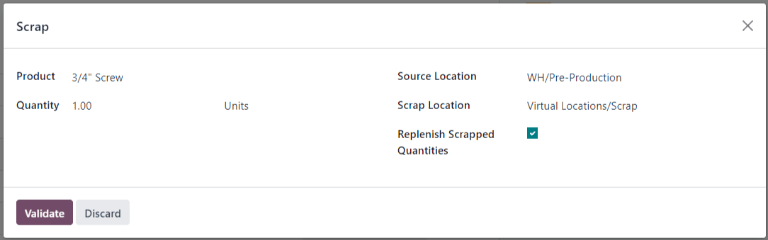

# Scrap during manufacturing

During the manufacturing process, scrapping components or finished
products may be necessary when items are damaged, defective, or no
longer usable.

Tracking scrapped materials helps manufacturers monitor waste, identify
process issues, and account for production costs.

In Odoo, scrapped items are removed from physical inventory and moved to
a virtual location called *Virtual Locations/Scrap*. This location is
not a physical space---it is a way to log and track losses without
affecting real stock levels.

::: tip

Scrap orders can be viewed by navigating to
`Inventory ‣ Operations ‣ Scrap`. Each scrap order shows the date and time the
order was created, along with the product and quantity that was
scrapped.

To view the total quantity of each item scrapped, navigate to
`Inventory ‣
Configuration ‣ Locations`,
then remove the `Internal` filter
from the `Search...` bar to display
all virtual locations. From the list, select the
`Virtual Locations/Scrap` location.
::::

## Navigate to the scrap window 

Scrapping can be done in either the **Manufacturing** app or the **Shop
Floor** module, depending on the task.

**Manufacturing** app allows:

- Scrapping finished products (only if the
  `MO (Manufacturing Order)` is in the
  *Done* stage).
- Scrapping components (while the
  `MO (Manufacturing Order)` is in the
  *Draft* or *Confirmed* stage).

**Shop Floor** allows:

- Scrapping only components.

### Manufacturing app

To scrap a product from the **Manufacturing** app, go to
`Manufacturing ‣
Operations ‣ Manufacturing Orders` and select the desired
`MO (Manufacturing Order)`.

On the `MO (Manufacturing Order)`, click
the `fa-cog`
`(Actions)` icon, then choose
`Scrap` from the drop-down menu.

### Shop Floor

In **Shop Floor**, only components can be scrapped. Navigate to the
desired `MO (Manufacturing Order)` card,
and then tap the `fa-cog`
`(Actions)` icon and in the
`What do you want to do?` pop-up
window, select `Scrap`.

## Scrap pop-up window

After opening the `Scrap Products`
pop-up window using one of the methods `detailed
above `, select the component or finished product being scrapped,
from the `Product` drop-down menu.

In the `Quantity` field, enter the
quantity being scrapped.

By default, the `Source Location`
field is set to the warehouse\'s pre-production location, while the
`Scrap Location` field is set to the
`Virtual Locations/Scrap` location.
If either the source or scrap location should be changed, select a
different location from their respective drop-down menus.

Enable the `Replenish Scrapped Quantities` checkbox if a picking order should be created to
replace the scrapped component upon confirmation of the scrap order.
This option should only be enabled for warehouses with
`two-step ` or
`three-step ` manufacturing enabled, since components are not picked as
part of the
`one-step ` manufacturing process.

After filling out the `Scrap Products` pop-up window, click the
`Scrap Products` button. After one or
more scrap orders have been created, a `Scraps` smart button appears at the top of the screen. Click it
to view a list of all scrap orders for the
`MO (Manufacturing Order)`.
