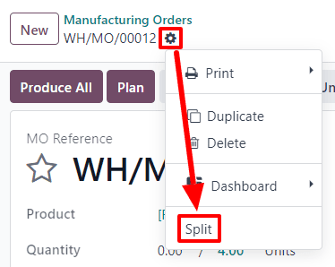
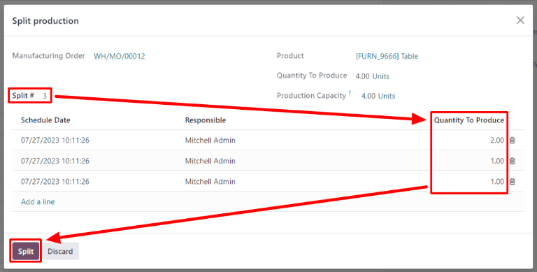
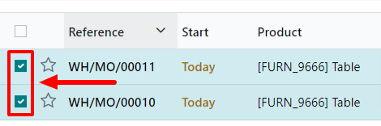
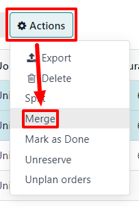

# Ishlab chiqarish buyurtmalarini bo'lish va birlashtirish

Odoo *Manufacturing* dasturida bir mahsulotning bitta birligi yoki bir xil mahsulotning bir nechta birligi uchun ishlab chiqarish buyurtmalarini yaratish mumkin. Ba'zi hollarda bir nechta birlikni o'z ichiga olgan ishlab chiqarish buyurtmasini ikki yoki undan ortiq buyurtmaga bo'lish yoki ikki yoki undan ortiq buyurtmani bitta buyurtmaga birlashtirish zarur bo'lishi mumkin.

::: warning

Ishlab chiqarish buyurtmasi faqat bir mahsulotning bitta birligini yoki bir xil Bill of Materials (BoM) dan foydalanadigan bitta mahsulotning bir nechta birligini o'z ichiga olishi mumkin. Natijada, ishlab chiqarish buyurtmalarini faqat har bir buyurtma bir xil BoM bilan ishlab chiqarilayotgan bir xil mahsulotni o'z ichiga olgan taqdirdagina birlashtirish mumkin.
::::

## Ishlab chiqarish buyurtmalarini bo'lish

Ishlab chiqarish buyurtmasini bir nechta buyurtmaga bo'lish uchun `Manufacturing ‣ Operations ‣ Manufacturing Orders` bo'limiga o'ting va ishlab chiqarish buyurtmasini tanlang. Sahifaning yuqori qismida, `New` tugmasi yonida ishlab chiqarish buyurtmasining havola raqami va uning yonida `⚙️ (settings)` tugmasi ko'rinadi.

Ishlab chiqarish buyurtmasi uchun umumiy sozlamalarni ochish uchun `⚙️ (settings)` tugmasini bosing, so'ngra `Split` ni tanlang.

`Split` ni tanlagandan so'ng `Split production` oynasi paydo bo'ladi. `Split #` maydoniga asl buyurtma nechta ishlab chiqarish buyurtmasiga bo'linishi kerakligini kiriting, so'ngra maydondan tashqariga bosing. Pastda bo'linish natijasida yaratilishi kerak bo'lgan har bir yangi ishlab chiqarish buyurtmasi uchun qator bilan jadval paydo bo'ladi. `Quantity To Produce` ustunida har bir yangi ishlab chiqarish buyurtmasiga tayinlanishi kerak bo'lgan birliklar sonini kiriting. Nihoyat, ishlab chiqarish buyurtmasini bo'lish uchun `Split` tugmasini bosing.

`Split` tugmasini bosgandan so'ng, asl ishlab chiqarish buyurtmasi `Split #` maydonida ko'rsatilgan buyurtmalar soniga bo'linadi. Yangi ishlab chiqarish buyurtmalari uchun havola raqamlari asl buyurtmaning havola raqami bo'lib, oxiriga *-###* teglari qo'shiladi.

::: example
*WH/MO/00012* ishlab chiqarish buyurtmasi uchta alohida buyurtmaga bo'linadi. Yangi buyurtmalar uchun havola raqamlari *WH/MO/00012-001*, *WH/MO/00012-002* va *WH/MO/00012-003* bo'ladi.
:::

## Ishlab chiqarish buyurtmalarini birlashtirish

Ikki yoki undan ortiq ishlab chiqarish buyurtmasini bitta buyurtmaga birlashtirish uchun `Manufacturing ‣ Operations ‣ Manufacturing Orders` bo'limiga o'ting. Birlashtiriladigan ishlab chiqarish buyurtmalarini har bir buyurtma nomining chap tomonidagi katagini faollashtirish orqali tanlang.

Barcha ishlab chiqarish buyurtmalari tanlangandan so'ng, sahifaning yuqori qismidagi `Actions` tugmasini bosing, so'ngra ochiluvchi menyudan `Merge` ni tanlang.

Tanlangan ishlab chiqarish buyurtmalari bitta buyurtmaga birlashtiriladi. Yangi ishlab chiqarish buyurtmasi uchun havola raqami hali buyurtmaga tayinlanmagan keyingi ketma-ket raqam bo'ladi.

::: example
Ishlab chiqarish buyurtmasi uchun ishlatilgan oxirgi havola raqami *WH/MO/00012* edi. Ikki ishlab chiqarish buyurtmasi *WH/MO/00008* va *WH/MO/00009* bitta buyurtmaga birlashtiriladi. Birlashtirish natijasida yaratilgan ishlab chiqarish buyurtmasi uchun havola raqami *WH/MO/00013* bo'ladi.
:::

Birlashtirish natijasida yaratilgan ishlab chiqarish buyurtmasining `Source` maydonida birlashtirilgan ishlab chiqarish buyurtmalarining havola raqamlari ro'yxatlangan.

::: example
*WH/MO/00009* va *WH/MO/00010* ishlab chiqarish buyurtmalari *WH/MO/00011* ni yaratish uchun birlashtiriladi. *WH/MO/00011* uchun manba maydonida *WH/MO/00009* va *WH/MO/00010* ikkalasi ham ro'yxatlangan.
:::