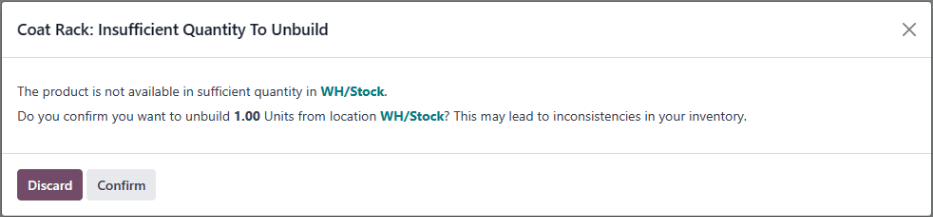

# Buzish buyruqlari

Ba'zi hollarda ishlab chiqarilgan mahsulotlarni alohida komponentlarga ajratish zarur bo'lishi mumkin. Bu mahsulotdan ortiqcha birliklar ishlab chiqarilgan bo'lsa yoki bir mahsulotning komponentlarini boshqa mahsulot ishlab chiqarishda ishlatish uchun qaytarib olish kerak bo'lganda talab qilinishi mumkin.

Odoo *Manufacturing* dasturida mahsulotlar ajratilishi va ularning komponentlari *buzish buyruqlari* yordamida inventarga qaytarilishi mumkin. Bu vazifani bajarish uchun buzish buyruqlaridan foydalanish orqali tayyor mahsulot va uning komponentlari uchun inventar hisobi ajratilgan mahsulotlar soni va qaytarib olingan komponentlar soniga asoslangan holda aniq qoladi.

## Buzish buyrug'ini yaratish

Yangi buzish buyrug'ini yaratish uchun `Manufacturing app ‣ Operations ‣ Unbuild Orders` ga o'tib, `New` tugmasini bosish mumkin.

Yangi buzish buyrug'ini to'ldirishni buzish uchun `Product` ni tanlashdan boshlang. Buni amalga oshirgandan so'ng, `Bill of Material` maydoni tegishli materiallar ro'yxati (BoM) bilan avtomatik to'ldiriladi. Agar boshqa `BoM (Bill of Materials)` ishlatilishi kerak bo'lsa, `Bill of Material` maydoniga bosing va uni ochiladigan menyudan tanlang.

Shu bilan bir qatorda, mahsulotni tanlashdan oldin `Bill of Material` maydonida aniq `BoM (Bill of Materials)` tanlanishi mumkin, bu esa `Product` maydonida tegishli mahsulotning avtomatik to'ldirilishiga olib keladi.

Keyin, buzilayotgan mahsulotning `Quantity` ni belgilang.

Agar buzilayotgan mahsulot dastlab ma'lum bir ishlab chiqarish buyrug'ida (MO) ishlab chiqarilgan bo'lsa, uni `Manufacturing Order` maydonida tanlang.

`Source Location` maydonida buzilayotgan mahsulot hozirda saqlanayotgan joyni tanlang.

`Destination Location` maydonida buzish buyrug'i bajarilgandan keyin qaytarib olingan komponentlar saqlanadigan joyni tanlang.

Agar *Inventory* dasturi sozlamalarida *Lots & Serial Numbers* funksiyasi yoqilgan bo'lsa, buzish buyrug'ida `Lot/Serial Number` maydoni paydo bo'ladi, bu buzilayotgan mahsulotning lot(lar) yoki seriya raqam(lar)ini belgilash uchun ishlatilishi mumkin, agar ular tayinlangan bo'lsa.

Agar Odoo ma'lumotlar bazasi bir nechta kompaniya bilan sozlangan bo'lsa, buzish buyrug'ida `Company` maydoni paydo bo'ladi, bu buzilayotgan mahsulotga egalik qiluvchi kompaniyani belgilash uchun ishlatilishi mumkin.

Nihoyat, mahsulot buzilgandan so'ng, uning bajarilganligini tasdiqlash uchun buyruq tepasidagi `Unbuild` tugmasini bosing.

:::: warning

Qo'lda nol (yoki undan kam) birlik mavjud bo'lgan mahsulotlar uchun buzish buyruqlarini yaratish mumkin bo'lsa-da, bu tavsiya etilmaydi, chunki bu inventar nomuvofiqliklariga olib kelishi mumkin.

Agar qo'lda nol (yoki undan kam) birlik mavjud bo'lgan mahsulot uchun buzish buyrug'i yaratilsa, buzish uchun yetarli miqdor yo'qligini ogohlantiruvchi qalqib chiquvchi oyna paydo bo'ladi.

Ogohlantirishni e'tiborsiz qoldirish va buzish buyrug'ini davom ettirish uchun qalqib chiquvchi oynaning pastidagi `Confirm` tugmasini bosing. Tasdiqlanmagan buzish buyrug'iga qaytish uchun uning o'rniga `Discard` tugmasini bosing.

::::

Buzish buyrug'ini bajarib bo'lgandan so'ng, inventar hisobi buzilgan mahsulotlar soni va qaytarib olingan komponentlar soniga asoslangan holda avtomatik yangilanadi.

::: example
[Coat Rack] mahsuloti bitta [Wooden Pole] komponenti va oltita [Wooden Dowel] komponentidan iborat.

Bitta [Coat Rack] birligi uchun buzish buyrug'i yaratiladi. Buyruq bajarilgandan so'ng, [Coat Racks] ning qo'ldagi miqdori bittaga kamayadi, [Wooden Poles] va [Wooden Dowels] ning qo'ldagi miqdorlari esa mos ravishda bitta va oltitaga ortadi.
:::

## Yaroqsiz komponentlarni chiqitga chiqarish

Ba'zi hollarda buzish jarayoni tugagandan so'ng komponentlar yaroqsiz bo'lishi mumkin. Inventar hisobi qo'lda mavjud bo'lgan yaroqli komponentlar sonini aniq aks ettirishini ta'minlash uchun, endi ishlatib bo'lmaydigan har qanday komponent `scrap order` yordamida inventardan olib tashlanishi kerak.