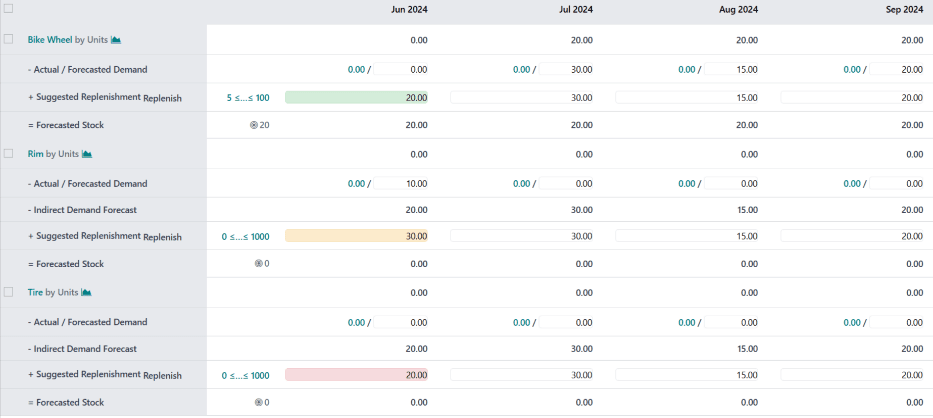

# Master production schedule

In Odoo\'s *Manufacturing* app, the *master production schedule* (MPS)
is used to manually plan manufacturing orders (MOs) and purchase orders
(POs), based on forecasted quantities of products and components.

By considering the impact of confirmed
`MOs (manufacturing orders)` and
`POs (purchase orders)`, along with
manually adjusted demand forecasts, the
`MPS (Master Production Schedules)` can
be used to manage long-term product replenishment. This ensures the
continued availability of the necessary products and components.

Since the `MPS (Master Production Schedules)` allows for manual intervention, it is useful for
replenishing products where the demand of existing sales orders (SOs)
does **not** reflect probable future demand.

::: example
A retail store sells artificial *Christmas trees* during the holiday
season. It is currently September, and the store has less than ten
Christmas tree `MOs (manufacturing orders)` confirmed for the month of December.

Despite the number of confirmed
`MOs (manufacturing orders)`, the
procurement manager knows that the demand for Christmas trees in
December is going to be much higher, once the holiday season starts. As
a result, they manually enter a greater demand in the
`MPS (Master Production Schedules)`, so
they can properly replenish the product in time for the increase in
customer demand.
:::

::: warning

It is essential to remember that the
`MPS (Master Production Schedules)` is a
**MANUAL** tool. Adding a product to the
`MPS (Master Production Schedules)` does
not cause it to be manufactured or purchased automatically. The
`MPS (Master Production Schedules)`
simply suggests the amount of the product that should be replenished,
but requires user input to create the
`MOs (manufacturing orders)` or
`POs (purchase orders)` that are used to
replenish it.

For this reason, it is recommended that the
`MPS (Master Production Schedules)`
**NOT** be used alongside reordering rules for the same product. Because
reordering rules are an automated workflow, they conflict with the
manual replenishment method of
`MPS (Master Production Schedules)`.
Using both, in unison, can lead to inaccurate forecasts and the creation
of unnecessary replenishment orders.
::::

## Enable and configure `MPS (Master Production Schedules)` 

To use the `MPS (Master Production Schedules)` feature, navigate to
`Manufacturing app ‣ Configuration ‣
Settings`, and tick the
`Master Production Schedule` checkbox
in the `Planning` section. Finally,
click `Save`.

After enabling the `Master Production Schedule` feature, two new fields appear under it on the
`Settings` page:
`Time Range` and
`Number of Columns`.

The `Time Range` field is used to
select the period of time over which planning takes place, and offers
three options: `Monthly`,
`Weekly`, and
`Daily`. For example, if
`Monthly` is selected, the
`MPS (Master Production Schedules)` plans
the production requirements of products and components on a monthly
basis.

The `Number of Columns` field is used
to specify the quantity of the selected `Time Range` units shown on the
`MPS (Master Production Schedules)` page.
For example, if the `Time Range`
field is set to `Monthly`, and
[12] is entered in the `Number of Columns` field, the
`MPS (Master Production Schedules)` shows
one column for the next 12 months, starting with the current month.

If the values of the `Time Range` or
`Number of Columns` fields are
altered, click `Save` again to save
the changes.

## `MPS (Master Production Schedules)` dashboard 

To open the `MPS (Master Production Schedules)`, navigate to
`Manufacturing app ‣ Planning ‣ Master Production
Schedule`. The
`MPS (Master Production Schedules)` view
appears as follows:

The grey column on the left side of the screen shows a section for every
product added to the
`MPS (Master Production Schedules)`, with
each product section being broken down into smaller rows. The
information shown in the rows depends on the filters selected in the
`Search...` bar drop-down menu at the
top of the page. The default categories that appear in the rows are:

- `[Product] by [unit]`
  `fa-area-chart`: the forecasted stock
  quantity at the beginning of each time period.
  `[Product]` and
  `fa-area-chart` are selectable buttons
  which open the product\'s page, or the forecast report for the
  product, respectively.

- `- Forecasted Demand`: the demand
  forecast, which is entered manually. This represents an estimate of
  the demand for the product during each time period.

- `- Indirect Demand Forecast`: while
  this is a default category, it **only** appears for products that are
  components of other products. It represents the demand for the
  component from existing MOs.

- `+ Suggested Replenishment`: the
  quantity of the product that is suggested to be replenished through
  `MOs (manufacturing orders)` or
  `POs (purchase orders)`. To the right
  of the category title is a `Replenish` button, which is used to manually replenish the
  product, based on the quantity suggested to be replenished.

  
  
  The "Replenish" button on the "+ Suggested Replenishment"
  row.
  

- `= Forecasted Stock`: the quantity
  of the product forecasted to be in stock at the end of each time
  period, assuming that suggested replenishment numbers are fulfilled.

Altogether, these default categories form an equation:

$$\text + \text = \text$$

In the case of components, the
`Indirect Demand Forecast` is taken
into account as well.

The `- Forecasted Demand` and
`+ Suggested Replenishment` fields
can be edited for any of the time periods to the right of the product
column. Doing so changes the equation, and updates the value displayed
in the `Forecasted Stock` field.

Changing the value in the `+ Suggested Replenishment` field also makes an `fa-times` `(reset)` button appear
to the left of the field. Click the `fa-times` `(reset)` button next to
the field to reset its value back to the one calculated by the
`MPS (Master Production Schedules)`.

::: warning

While the `MPS (Master Production Schedules)` can be used with only the default categories enabled, it is
advisable to also enable the `Actual Demand` category. This is done by clicking the
`fa-caret-down`
`(down arrow)` on the right side of
the `Search...` bar, and enabling the
`Actual Demand` option under the
`Rows` header.

With the `Actual Demand` option
enabled, the `- Forecasted Demand`
category changes to the `- Actual / Forecasted Demand` category. In addition to the manually entered
forecasted demand, this category also displays the confirmed demand for
the product, which is based on confirmed
`SOs (sales orders)`.
::::

Each column to the right of the products column lists one unit of the
time period selected in the *Time Range* field on the *Manufacturing*
app *Settings* page (ex. months). The number of time period columns
corresponds to the value entered in the *Number of Columns* field.

The first time period column represents the current time period. For
example, if the `MPS (Master Production Schedules)` is configured to use months, the first column displays data
for the current month. On this first column, the
`+ Suggested Replenishment` field
appears in one of five colors:

- `Green`: a replenishment order must
  be generated to keep stock at the `Safety
  Stock Target`.
- `Gray`: a replenishment order has
  already been generated to keep stock at the
  `Safety Stock Target`.
- `Yellow`: a replenishment order has
  already been generated, but the quantity it was created for is not
  enough to keep stock at the `Safety Stock Target`.
- `Red`: a replenishment order has
  already been generated, but the quantity it was created for puts the
  amount of stock above the `Safety Stock Target`.

The `+ Suggested Replenishment` field
appears white, if no replenishment order has been generated, and it is
not necessary to generate one at the current moment.

## Add a product

To use `MPS (Master Production Schedules)` to manage the replenishment of a product, navigate to
`Manufacturing app
‣ Planning ‣ Master Production Schedule`. At the top of the
`MPS (Master Production Schedules)` page,
click `Add a
Product` to open the
`Add a Product` pop-up window.

::: warning

Products **must** be properly configured to be replenished through the
`MPS (Master Production Schedules)`.

In the case of manufactured products, the *Manufacture* route must be
selected in the *Routes* section of the *Inventory* tab, on the
product\'s form.

In the case of products that are purchased, the *Buy* route must be
selected in the *Routes* section of the *Inventory* tab, on the
product\'s form. Additionally, a vendor and the price they sell the
product for must also be specified on the *Purchase* tab.
::::

On the pop-up window, select the product to add in the
`Product` drop-down menu. If the
product is replenished through manufacturing, select the product\'s
`BoM (Bill of Materials)` in the `Bill of
Materials` field.

::: tip

Selecting a BoM when adding a product to the
`MPS (Master Production Schedules)` also
adds any components listed on the BoM. If it is not necessary to manage
the replenishment of components through the
`MPS (Master Production Schedules)`,
simply leave the `Bill of Materials`
field blank.
::::

If the database is configured with multiple warehouses, a
`Production Warehouse` field appears
on the `Add a Product` pop-up window.
Use this field to specify which warehouse the product is replenished to.

In the `Safety Stock Target` field,
specify the minimum quantity of the product that should be kept
available for orders at all times. For example, if there should always
be 20 units of the product available for order fulfillment, enter
[20] in the `Safety Stock Target` field.

In the `Minimum to Replenish` field,
enter the minimum product quantity for orders created to replenish the
product. For example, if [5] is entered in this field,
replenishment orders for the product include a minimum of five units.

In the `Maximum to Replenish` field,
enter the maximum product quantity for orders created to replenish the
product. For example, if [100] is entered in this field,
replenishment orders for the product include a maximum of 100 units.

Finally, click `Save` to add the
product to the `MPS (Master Production Schedules)`. The product now appears on the
`MPS (Master Production Schedules)` page
each time it is opened. If a `BoM (Bill of Materials)` was selected in the `Bill of Materials` field of the `Add a Product` pop-up window, any components listed on the
`BoM (Bill of Materials)` appear on the
page, as well.

### Edit a product

After adding a product to the
`MPS (Master Production Schedules)`, it
may be necessary to change the replenishment values entered on the
`Add a Product` pop-up window. To do
so, click the `# ≤…≤ #` button to the
immediate right of the `Replenish`
button, on the `+ Suggested
Replenishment` row, below the
product\'s name.

::: tip

The first and second number displayed on the `# ≤…≤ #` button correspond to the values entered in the
`Minimum to Replenish` and
`Maximum to Replenish` fields when
adding the product to the
`MPS (Master Production Schedules)`.

For example, if [5] was entered in the
`Minimum to Replenish` field, and
[100] was entered in the
`Maximum to Replenish` field, the
button appears as `5 ≤…≤
100`.
::::

Clicking the `# ≤…≤ #` button opens
the `Edit Production Schedule` pop-up
window. This pop-up window is the same as the
`Add a Product` pop-up window, except
that the `Product` and
`Bill of Materials` fields cannot be
edited.

On the `Edit Production Schedule`
pop-up window, enter the desired values in the
`Safety Stock Target`,
`Minimum to Replenish`, and
`Maximum to
Replenish` fields. Then, click
`Save` to save the changes.

### Remove a product

To remove a product from the
`MPS (Master Production Schedules)`, tick
the checkbox to the left of its name. Then, click the
`fa-cog` `Actions` button at the top of the screen, and select
`Delete` from the resulting drop-down
menu. Finally, click `Ok` on the
`Confirmation` pop-up window.

Deleting a product from the
`MPS (Master Production Schedules)`
removes it, along with all of its data. If the product is re-added, its
replenishment values must be reconfigured.

## `MPS (Master Production Schedules)` replenishment 

Products in the `MPS (Master Production Schedules)` can be replenished in one of three ways:

- Click the `Replenish` button at the
  top of the screen to generate replenishment orders for every product
  below its `Safety Stock Target` for
  the current month.
- Click the `Replenish` button on the
  right side of the `+ Suggested
  Replenishment` row of a specific
  product, to generate a replenishment order for that specific product.
- Tick the checkbox to the left of the product name of one or more
  products. Then, click the `fa-cog`
  `Actions` button at the top of the
  screen, and select `Replenish` from
  the resulting drop-down menu. Doing so generates a replenishment order
  for each selected product.

The type of replenishment order generated corresponds to the route
selected on the *Inventory* tab of the product\'s form:

- If the *Buy* route is selected, an
  `RfQ (Request for Quotation)` is
  generated to replenish the product.
  `RfQs (Requests for Quotation)` can be
  selected by navigating to the `Purchase` app. Any
  `RfQ (Request for Quotation)` generated
  by the `MPS (Master Production Schedules)` lists `MPS` in its
  `Source Document` field.
- If the *Manufacture* route is selected, an
  `MO (manufacturing order)` is generated
  to replenish the product.
  `MOs (manufacturing orders)` can be
  selected by navigating to
  `Manufacturing app ‣ Operations ‣ Manufacturing
  Orders`. Any
  `MO (manufacturing order)` generated by
  the `MPS (Master Production Schedules)`
  lists `MPS` in its
  `Source Document` field.
