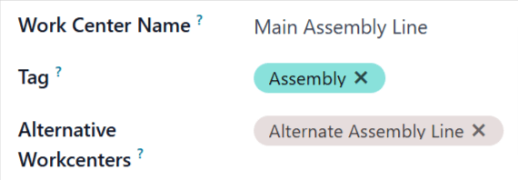
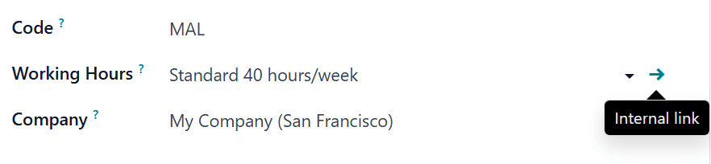
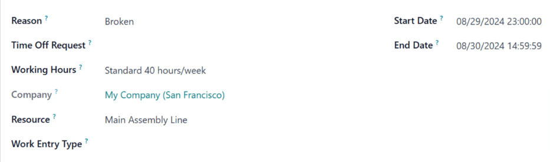

# Work center time off

In Odoo, *work centers* are used to carry out manufacturing operations
at specific locations. However, if a work center cannot be used for some
reason, work orders begin to pile up at the work center until it is
operational again.

As a result, it is necessary to make the work center unavailable in Odoo
so new work orders are routed to alternative work centers that are
operational. Using Odoo\'s **Time Off** app, it is possible to designate
a work center as being unavailable for a set period of time. Doing so
ensures manufacturing operations can continue until the impacted work
center is available again.

## Configuration

Before a work center can be designated as unavailable, the Odoo platform
must be properly configured. First, it is necessary to enable
`developer mode `. This
allows the *Time Off* smart button to appear on each work center\'s
*Working Hours* page.

Next, install the **Time Off** app. This is the app used for managing
time off for all resources within Odoo, including employees and work
centers.

To do so, navigate to the `Apps`
app, then search [Time Off] in the search bar. The card for
the `Time Off` app should be the only
one that appears on the page. Click the `Install` button on the card to install the app.

The last step is to properly configure work centers. For this workflow,
it is necessary to have at least two work centers: one that is made
unavailable, and a second that receives the work orders that the other
cannot accept. If no second work center is configured, Odoo cannot route
work orders away from the unavailable work center, and they pile up in
its queue.

To create a work center, navigate to
`Manufacturing app ‣ Configuration ‣ Work
Centers ‣ New`.

Make sure both work centers have the same equipment listed under the
`Equipment` tab. This ensures
operations carried out at one work center can also be performed at the
other.

On the work center that is made unavailable, select the second work
center from the `Alternative Workcenters` drop-down menu. Now, Odoo knows to send work orders to
the second work center when the first is unavailable for any reason.

## Add time off for a work center

With configuration completed, time off can now be assigned to a work
center. Begin by navigating to
`Manufacturing app ‣ Configuration ‣ Work Centers`, and selecting the affected work center. Click the
`oi-arrow-right`
`(Internal link)` button on the right
side of the `Working Hours` drop-down
menu, to open the working hours page for the work center.

The working hours page displays the standard working hours for the work
center. With developer mode activated, a `fa-plane` `Time Off` smart button
appears at the top of the page. Click it to open the
`Resource Time Off` page.

On this page, click `New` to
configure a new time-off entry. On the time-off form, note the
`Reason` for the work center closure
(e.g. broken equipment, maintenance, etc.), select the affected work
center as the `Resource`, and choose
a `Start Date` and
`End Date` to specify the period
during which the work center is unavailable.

## Alternative work center planning

Once a work center is within its specified time-off period, work orders
sent to it can be automatically routed to an alternative work center
using the *Plan* button.

Begin by creating a new manufacturing order (MO), by navigating to
`Manufacturing app
‣ Operations ‣ Manufacturing Orders ‣ New`. On the
`MO (manufacturing order)` form, specify
a `Product` that uses the unavailable
work center for one of its operations. Click `Confirm` to confirm the
`MO (manufacturing order)`.

On the confirmed `MO (manufacturing order)`, select the `Work Orders` tab. By default, the unavailable work center is
specified in the `Work Center`
column. There is also a `Plan` button
at the top left of the page.

Click `Plan`, and the work center
listed in the `Work Center` column of
the `Work Orders` tab is
automatically changed to the alternative work center.

Before clicking Plan, the work order is scheduled at Main Assembly Line.

After clicking Plan, the work order is rescheduled at Alternative Assembly
Line.

Once the time-off period for the unavailable work center ends, Odoo
recognizes the work center is available again. At this point, clicking
the `Plan` button does not route work
orders to an alternative work center unless the first one is at
capacity.
