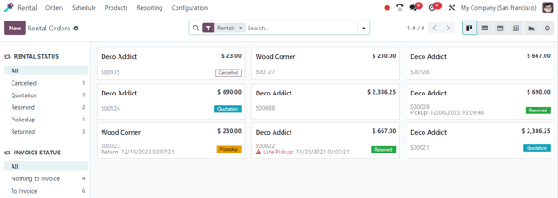
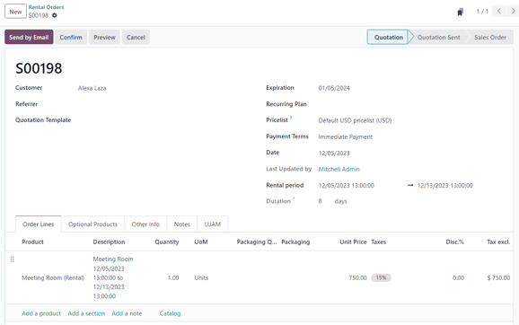
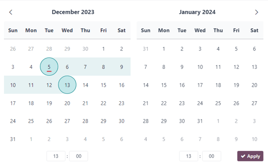
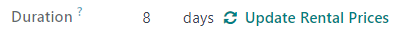
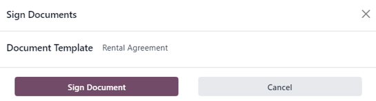

# Ijara

Odoo *Rental* ilovasi ijaralarni sozlash va boshqarish uchun keng qamrovli
yechimlar taqdim etadi.

Takliflar yuboring, buyurtmalarni tasdiqlang, ijaralarni rejalashtiring,
mahsulotlarni olib ketish va qaytarish vaqtida ro'yxatdan o'tkazing va
mijozlarga bitta platformadan hisob-faktura yuboring.

## Dashboard 

*Rental* ilovasini ochganda
`Rental Orders` dashboardi
ko'rsatiladi.

Standart kanban ko'rinishida barcha ijaralar ko'rinadi. Har bir ijara
kartasida mijoz nomi, ijara narxi, tegishli sotuv buyurtmasi raqami
va ijara holati ko'rsatiladi.

::: tip

Ijara holati ko'rsatilmagan ijara kanban kartalari tasdiqlangan taklif-
larning mavjudligini, ammo hali olib ketilmaganligini bildiradi.
::::

Chap yon panelda har bir ijara uchun `Rental Status` topish mumkin. Uning ostida
ijaralarning `Invoice Status`
mavjud. Chap yon paneldagi istalgan variantni bosish dashboardda
ko'rsatilgan ijaralarni filtrlaydi.

## Sozlamalar

Qo'shimcha ijara kechikish xarajatlarini, ijara buyumlarining mavjudligini
yoki minimal ijara vaqtini sozlash uchun
`Rental app ‣ Configuration ‣ Settings` ga o'ting.

`Rental` bo'limida
`Default Delay Costs` va `Default Padding Time` ni sozlash imkoniyatlari mavjud. Shuningdek,
`Rental
Transfers` va
`Digital Documents` ni faollashtirish imkoniyati ham bor.

- `Default Delay Costs` - kech
  qaytarish uchun qo'shimcha xarajatlar.

- `Default Padding Time` - ikki
  ijara orasidagi minimal vaqt miqdorini ifodalaydi.

- `Rental Transfers` - ijara
  buyurtmalari uchun zaxira yetkazib berish va qabul qilishlardan
  foydalanish mumkinligini bildiradi.

- 

  `Digital Documents` foydalanuvchilarga mijozlar ijarani

  :   tasdiqlashdan oldin imzolaydigan hujjatlarni yuklash imkonini beradi.

`Rent Online` bo'limida
`Minimal Rental
Duration` ni sozlash va
`Unavailability days` yoki olib ketish
va qaytarish mumkin bo'lmagan kunlarni belgilash imkoniyatlari mavjud.

## Ijara mahsulotlari

Ma'lumotlar bazasida ijaraga beriladigan barcha mahsulotlarni ko'rish uchun
`Rentals app ‣
Products` ga o'ting. Sukut bo'yicha
`Can be Rented` qidiruv filtri qidiruv
satrida paydo bo'ladi.

Har bir mahsulot kanban kartasida o'sha mahsulotning nomi, ijara narxi
va mahsulot rasmi (agar mavjud bo'lsa) ko'rsatiladi.

## Ijara narxlari

Mahsulotdagi ijara narxini sozlash uchun *Rental* ilovasidagi
`Products` sahifasiga o'ting, so'ngra
kerakli mahsulotni tanlang yoki noldan yangi mahsulot yaratish uchun
`New` ni bosing.

Mahsulot formasida `Can be Rented`
katakchasi belgilanganligiga ishonch hosil qiling. Keyin
`Rental prices` tabini oching.

::: tip

Agar *Rental* ilovasidan tashqarida ijara mahsulotini yaratayotgan bo'lsangiz,
mahsulot formasida `Can be
Rented` katakchasi belgilanganligiga
ishonch hosil qiling. Sukut bo'yicha, mahsulot to'g'ridan-to'g'ri
*Rental* ilovasida yaratilganda bu katakcha belgilanadi.
::::

### Narxlash

`Rental prices` tabining
`Pricing` bo'limida mahsulot uchun
maxsus ijara narxlari va ijara davrlarini belgilang.

Ijara uchun narx qo'shish uchun `Add a price` ni bosing. Keyin `Period`
ustunida *narxlash davri* (`ijara davomiyligi birligi`) ni tanlang yoki nom
yozib va `Create` ni bosish orqali yangi
narxlash davrini yarating.

Keyinchalik, bu maxsus ijara narxini ma'lum
`Pricelist` ga qo'llash yoki qo'llamaslikni hal qiling.

Nihoyat, o'sha maxsus `Period` uchun
kerakli `Price` ni kiriting.

::: tip

Qancha narxlash qatorini qo'shish mumkinligi cheklanmagan. Ijara mahsulotlari
uchun ko'plab narxlash variantlari odatda uzoqroq ijara davrilariga
rozi bo'lgan mijozlarga chegirmalar berish uchun ishlatiladi.
::::

Istalgan ijara narxlash variantini o'chirish uchun
`🗑️ (trash)` belgisini bosing va o'sha
qator o'chiriladi.

### Rezervatsiyalar

`Rental prices` tabining
`Reservations` bo'limida mijoz
ijarani qaytarish uchun olgan har bir
`Extra Hour` yoki
`Extra Day` uchun qo'shimcha
jarimalar sozlash imkoniyati mavjud.

Shuningdek, ikki ijara buyurtmasi orasida ijara mahsulotini vaqtincha
mavjud bo'lmagan qilish uchun soatlarda ifodalangan
`Security Time` ni o'rnatish imkoniyati
ham bor. Bunday funksiya ijaralar orasida ta'mirlash yoki tozalash
talab qilinsa foydali bo'lishi mumkin.

### Narx hisoblash

Ijara buyurtmasi yaratilganda Odoo mahsulot narxini hisoblash uchun
doimo ikkita qoidadan foydalanadi:

1.  Faqat bitta narx qatori ishlatiladi.
2.  Eng arzon qator tanlanadi.

::: exercise
Mahsulot uchun quyidagi ijara narxlash konfiguratsiyasini ko'rib chiqing:

- 1 kun: $100
- 3 kun: $250
- 1 hafta: $500

Mijoz bu mahsulotni sakkiz kunga ijaraga olmoqchi. Ular qancha to'laydi?

Buyurtma yaratilgandan so'ng, Odoo ikkinchi qatorni tanlaydi chunki bu
eng arzon variant. Mijoz ijaraning sakkiz kunini qoplash uchun uch marta
'3 kun' to'lashi kerak, jami $750.
:::

## Ijara buyurtmalari 

*Rental* ilovasida ijara buyurtmasi yaratish uchun
`Rental app ‣ Orders ‣
Orders` ga o'ting va
`New` ni bosing. Buni qilish tegishlicha
to'ldirilishi kerak bo'lgan bo'sh ijara buyurtmasi formasini ko'rsatadi.

`Customer` qo'shishdan boshlang, so'ngra
`Rental period` maydonida ijaraning
kerakli davomiyligini sozlang.

Ijara davomiyligini sozlash uchun `Rental period`
maydonidagi birinchi sanani bosing va paydo bo'ladigan qalqib chiquvchi
kalendar formasidan ijara davomiyligini ifodalovchi sanalar oralig'ini
tanlang.

Tugallangandan so'ng, kalendar qalqib chiquvchi formasida
`Apply` ni bosing. Shundan so'ng
qalqib chiquvchi forma yo'qoladi va ijaraning belgilangan vaqt davri
`Duration` maydonida ko'rsatiladi.

Keyinchalik, `Order Lines` tabida
`Add a
product` ni bosib va formaga qo'shish
uchun kerakli ijara mahsulotini tanlab ijara mahsulotini qo'shing.

::: tip

Agar ijara mahsuloti `Rental period`
maydoni to'g'ri sozlanishidan *oldin* qo'shilsa, foydalanuvchi hali ham
`Rental period` maydonini tegishlicha
sozlashi *mumkin*.

Shunchaki ijaraning davomiyligini ifodalovchi kerakli sanalar oralig'ini
tanlang, so'ngra `Duration` maydonida
`Update Rental Prices` ni bosing.

Buni qilish `Confirmation` qalqib
chiquvchi oynasini ko'rsatadi. Agar hamma narsa to'g'ri bo'lsa,
`Ok` ni bosing va Odoo ijara narxini
tegishlicha qayta hisoblaydi.
::::

Ijara buyurtmasi formasidagi barcha ma'lumotlar to'g'ri kiritilgandan
so'ng, taklifni mijozga yuborish uchun `Send by Email` tugmasini bosing yoki buyurtmani tasdiqlash
uchun `Confirm` tugmasini bosing.

## Mijoz imzosi

Ijara buyurtmasini tasdiqlashdan so'ng `Sign Documents` tugmasi paydo bo'ladi. Bu mijozga ijara
mahsulot(lar)ini olib ketishdan *oldin* kompaniya va mijoz o'rtasidagi
kelishuvni bayon qiluvchi ijara shartnomasini imzolashni so'rash
imkonini beradi.

Bunday hujjatlar hamma narsaning o'z vaqtida va asl holatida
qaytarilishini ta'minlashi mumkin.

::: warning

`Sign Documents` tugmasi/opsiyasi
**faqat** *Rental* ilovasi sozlamalarida
`Digital
Documents` funksiyasi faollashtirilgan
bo'lsagina paydo bo'ladi. Buning uchun
`Rental app ‣ Configuration ‣ Settings` ga o'ting,
`Digital
Documents` ni faollashtiring va
`Save` ni bosing.
::::

::: tip

Bu funksiya `Sign` ilovasini ham
talab qiladi. Agar kerak bo'lsa, Odoo
`Digital Documents` sozlamasi
faollashtirilgandan so'ng uni avtomatik o'rnatadi.
::::

Ijara shartnomasida mijoz imzosini so'rash uchun tasdiqlangan ijara
buyurtmasini tanlang va `Sign Documents`
qalqib chiquvchi oynasini ko'rsatish uchun `Sign Documents` tugmasini bosing.

Bu yerdan `Document Template`
maydonidan kerakli hujjatni tanlang. Keyin
`Sign Document` ni bosing. Buni qilish
`New Signature Request` qalqib
chiquvchi oynasini ko'rsatadi.

`New Signature Request` qalqib
chiquvchi formasidagi ma'lumotlarni tasdiqlashdan so'ng, imzolash
jarayonini boshlash uchun `Sign Now`
ni bosing.

Keyin alohida sahifa ko'rsatiladi, u imzolanishi kerak bo'lgan hujjatni
namoyish etadi va mijoz portaliga mijoz tomonidan kirish mumkin.

Odoo aniq, bosiladigan ko'rsatkichlar bilan mijozni imzolash jarayoni
orqali yo'naltiradi va formani tezda tugatish uchun elektron imzolar
yaratish imkonini beradi.

Hujjat imzolangandan va tugallangandan so'ng, hujjatning pastki qismidagi
`Validate & Send Completed
Document` tugmasini bosing.

`Validate & Send Completed Document`
tugmasini bosgandan so'ng, Odoo agar kerak bo'lsa, yozuvlarni saqlash
maqsadida imzolangan hujjatni yuklab olish imkoniyatini taqdim etadi.

## Mahsulotlarni olib ketish 

Mijoz mahsulot(lar)ni olib ketganda, tegishli ijara buyurtmasiga o'ting,
`Pickup` tugmasini bosing, so'ngra
paydo bo'ladigan `Validate a pickup`
qalqib chiquvchi formasida `Validate`
ni bosing.

Buni qilish ijara buyurtmasiga `Picked-up`
holat bannerini joylashtiradi.

## Mahsulotlarni qaytarish

Mijoz mahsulot(lar)ni qaytarganda, tegishli ijara buyurtmasiga o'ting,
`Return` tugmasini bosing va paydo
bo'ladigan `Validate a return` qalqib
chiquvchi formasida `Validate` ni
bosib qaytarishni tasdiqlang.

Buni qilish ijara buyurtmasiga `Returned`
holat bannerini joylashtiradi.

## Olib ketish va qaytarish kvitansiyalarini chop etish

Mijozlar ijara mahsulotlarini olib ketish va/yoki qaytarishda olib ketish
va qaytarish kvitansiyalarini chop etish mumkin.

Olib ketish va/yoki qaytarish kvitansiyalarini chop etish uchun tegishli
ijara buyurtmasiga o'ting, tushuvchi menyuni ko'rsatish uchun
`⚙️ (gear)` belgisini bosing.

Ushbu tushuvchi menyudan pastki menyuni ko'rsatish uchun
`Print` opsiyasining ustiga suring.
Keyin `Pickup and Return Receipt`
ni tanlang.

Odoo ijaraga olingan buyum(lar)ning joriy holati haqidagi barcha
ma'lumotlarni batafsil bayon qiluvchi PDF yaratadi va yuklab oladi.