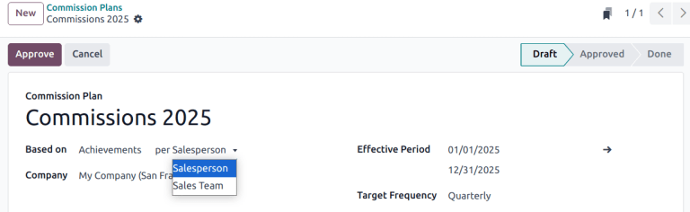

# Commissions

Commissions are a powerful tool to motivate sales team members. They
incentivize performance, boost productivity, and encourage healthy
competition. The *Commissions* feature in Odoo\'s **Sales** application
provides a way to reward salespeople or sales teams based on their
performance. This feature supports the creation of flexible, measurable
commission structures that align with business goals, whether that means
driving revenue, volume, profit, or recurring contracts.

## Configuration

To enable the *Commissions* feature, navigate to
`Sales app ‣ Configuration ‣
Settings`. Scroll to the
`Invoicing` section, and tick the
`Commissions` checkbox. Then, click
`Save`. Doing so causes a new
`Commissions` menu to appear in the
menu bar. To create a new commission plan, navigate to `Commissions ‣
Comission Plans` and click
`New`.

## Commission plan structure

Each commission plan is comprised of several components:

- `Based on`: Determines whether
  commissions are awarded based on progress toward
  `Targets` or
  `Achievements`
- `per`: Indicates whether the plan
  applies to individual salespeople or an entire sales team
- `Target Frequency`: Sets how often
  targets reset: **Monthly**, **Quarterly**, or **Yearly**.
- `Achievements`: Determines what is
  being measured toward commissions.

### Target-based commission plans

In a *Target* based commission plan, commissions are awarded based on
the percentage of sales targets reached. Target based plans are ideal
for setting clear, measurable goals, such as invoicing a specific amount
in sales per quarter, then rewarding sales people progressively based on
how close they come to reaching or exceeding that goal.

::: tip

Target based plans differ from *Achievement* based plans because they
are based on reaching a fixed, predefined goal. They focus on goal-based
incentives and performance milestones.
::::

To configure a new target based commission plan, navigate to the
`Sales app ‣
Commissions ‣ Commission Plans`, then click `New`. Click in the `Based on` drop-down menu and select `Targets`. Then, select an option in the `per` field.

In the `On Target Commission` field,
set the payout amount for reaching [100%] of the target.
Update the `Effective Period` fields
to confirm the dates for this plan. Then, update the
`Target Frequency` field based on how
often the targets should be set and evaluated.

- *Monthly*: short term goals with frequent payouts.
- *Quarterly*: aligns with business cycles and provides mid-range
  objectives.
- *Yearly*: long term sales goals for strategic planning.

After the `Target Frequency` field is
updated, the `Targets` tab updates
with a list of the appropriate time frame. For each
`Period`, enter a
`Target` goal.

On the `Achievements` tab, add one or
more `Achievement metric
`
for this plan by clicking `Add a new achievement`.

Click the `Sales People` tab to
assign this plan to the appropriate staff. Click either
`Add a new Sales Person` to add them
individually, or `Add Multiple
Salespersons` to bulk add several at
once.

::: tip

The `Add Multiple Salespersons`
button is only available if
`../../general/developer_mode` is active.
::::

### Levels

To provide additional incentive, *commission levels* can be added to
*Target* based plans. These tiers allow salespeople to earn varying
commission amounts based on their performance levels. Levels can start
at [0%] and increase incrementally. This allows for
salespeople to earn commission even if they do not achieve
[100%] of the target, as well as the ability to achieve over
[100%] of the target. Commission levels can be set from the
`Commissions` tab when creating a
commission plan.

If no levels are added above 100%, salespeople are **not** able to earn
above the stated commission.

::: example
In the plan below, the levels start at [0%], and continue
until [300%]. If a salesperson exceeds [100%] of
the expected target, their expected payout continues to increase up to
[300%].

:::

### Achievement-based commission plans

In a *Achievement* based commission plan, salespeople earn a percentage
of their invoice value as commission. Target based plans are ideal for
rewarding sales activity consistently, regardless of specific goals. For
example, offering a [5%] commission on all invoiced amounts,
regardless of how much is sold.

::: tip

Achievement based plans differ from *Target* based plans because they
are calculated based on actual achievements using a flat, consistent
rate. They are beneficial for ongoing, non-goal based compensation
plans.
::::

To configure a new target based commission plan, navigate to the
`Sales app ‣
Commissions ‣ Commission Plans`, then click `New`. Click in the `Based on` drop-down and select `Achievements`. Then, select an option in the `per` field.

Update the `Effective Period` fields
to confirm the dates for this plan. Then, update the
`Target Frequency` field based on how
often the targets should be set and evaluated.

On the `Achievements` tab, add one or
more `Achievement metric
`
for this plan by clicking `Add a new achievement`.

Click the `Sales People` tab to
assign this plan to the appropriate staff. Click either
`Add a new Sales Person` to add them
individually, or `Add Multiple
Salespersons` to bulk add several at
once.

### Achievements 

Performance can be measured in several ways in performance plans. These
are configured in the `Achievements`
tab of each plan.

- `Amount Sold`: the total value of
  sales orders (SOs).
- `Amount Invoiced`: the total value
  of confirmed invoices.
- `Quantity Sold`: the total number
  of units sold via `SOs (Sales Orders)`.
- `Quantity Invoiced`: the total
  number of units invoiced.
- `Margin`: the profit margin
  (selling price minus cost price).
- `MRR`: the new *Monthly Recurring
  Revenue* from subscription sales. this option is **only** available if
  the `Subscriptions ` app is installed.

::: tip

Regardless of what the plan is `Based on`, each plan needs both *Achievements* and *Targets*
configured.
::::

## Plan approval

After confirming the details of the new plan, click
`Approve`. This moves the plan from
the `Draft` stage into the
`Approved` stage.

::: warning

Commissions plans in the `Approved`
stage **cannot** be edited. To edit an approved plan, it must first be
`Reset to Draft`.
::::

After a plan is approved, Odoo automatically tracks performance and
calculates commissions based on the established parameters.
