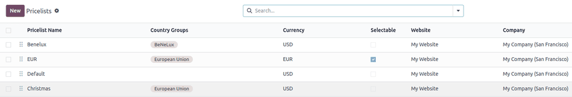
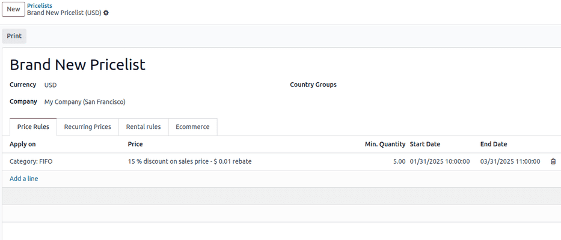

# Pricelists

A *pricelist* is a method of dynamic pricing that applies a list of
prices (or price rules) to adjust sales prices. This adjustment can
apply to specific customers, customer groups, sales orders, time
periods, etc., and is useful for creating pricing strategies and
optimizing sales margins.

Odoo **Sales** has a useful pricelist feature that can be tailored to
fit any unique pricing strategy. Pricelists suggest certain prices, but
they can always be overridden on the sales order.

## Configuration

To enable pricelists in the Odoo **Sales** app, first navigate to
`Sales app ‣
Configuration ‣ Settings`. In
the `Pricing` section, tick the
checkbox next to the `Pricelists`
feature, and click `Save` to save all
changes.

After activating and saving the `Pricelists` feature, the `Settings` page reloads. From here, either select the
`oi-arrow-right`
`Pricelists` link (beneath the
`Pricelists` feature on the
`Settings` page), or navigate to
`Sales app ‣ Products ‣ Pricelists`.

Either option reveals the `Pricelists` page, in which pricelists can be created and/or
modified at any time.

::: warning

If there is no specific pricelist configured on a sales quotation, the
`Default` pricelist is applied.
::::

::: tip

The `Selectable` column is only
applicable to Odoo **eCommerce**. This option allows website visitors to
choose a pricelist when shopping in your **eCommerce** website.
::::

::: tip

In Odoo 17 (and above), you are *not required* to enter a pricelist in
the `Pricelist` field on a sales
quotation form in order to confirm it (i.e. turn it into a sales order).

The chatter section is available on pricelist forms, which allows you to
add notes and communications on each pricelist page.
::::

### Creating and editing pricelists

From the `Pricelists` page, either
select the pricelist to edit, or click `New` to create a new pricelist, which reveals a blank
pricelist form that can be configured in a number of different ways.

When creating a new pricelist, start by adding a name for the pricelist
at the blank field at top of the form. Next, select which
`Currency` should be used.

If working in a multi-company environment, select which company this
pricelist should apply to in the `Company` field. If this field is left blank, the pricelist is
automatically applied to all companies in the database.

If working in a multinational company, select the countries where this
pricelist will apply under the `Country Groups` column.

### Price Rules tab 

In the `Price Rules` tab, each line
creates a new record that will implement customized pricing to the sales
order where the pricelist is applied. To create a new price rule, click
on `Add a line`, which opens a new
pricelist rules form.

Then, select whether to apply this set of rules to a
`Product` or
`Category`.

From here, there are several configuration options:

- `Product`: If selected in the
  `Apply To` field, use this field to
  choose one or more products to which this pricelist will apply.
- `Category`: Select one or more
  product categories to which this pricelist will apply.
- `Price Type`: Select whether the
  specialized pricing will fall under `Discount`, `Formula`, or
  `Fixed Price`. Depending on the
  price type, there will be additional configurations on how to apply
  the pricelist.
  - `Discount`: Enter the percentage
    to be discounted. A mark-up can be configured by using a negative
    value in this field.

    ::: warning
     example
To formulate a 100% markup (or two times the price of the product), with
a \$5 minimum margin, set the `Based price` field to `Sales Price` and the `Discount`
to [-100]. This is often seen in retail situations.

:::

::: example
To apply 20% discounts, with prices rounded up to 9.99, set the
`Based on` field to
`Sales Price`, the
`Discount` field to [20],
the `Extra Fee` field to
[-0.01], and the `Rounding Method` field to [10].

:::

::: tip

To have prices that end in 9.99, set the
`Rounding Method` to [10]
and the `Extra Fee` to
[-0.01].
::::

### Recurring Prices tab

Time-based rules are used specifically with subscription products. Be
sure to check out the Odoo
`Subscriptions ` documentation for more information.

In the `Recurring Prices` tab,
pricelists are configured with the same options as in the
`Price Rules` tab, with additional
columns for `Product Variants` and
`Recurring Plan`.

`Product Variants` are configured
under products that have one or more values, such as color, size, etc.
Once a product has been selected under the
`Products Tab`, if applicable, select
the desired product variants to be included in the price rule.

Then, select the blank field in the `Recurring Plan` column to reveal a drop-down menu of pre-designated
recurrence periods (e.g. [Monthly], [Quarterly],
[Weekly], etc.).

New recurrence periods can also be created from this column. To do so,
type in the name for the new `Recurring Plan`, then select `Create` from the resulting drop-down menu to create the time
period, which can be edited later. Alternatively, select `Create and
edit...` to reveal a
`Create Recurring Plan` pop-up form.
From this pop-up form, the new recurrence period can be configured, with
specific `Details`,
`Self-Service`, and
`Pricing` options. When the
configurations are complete, click the `Save &
Close` button.

Lastly, add the desired price for this recurring price rule in the
`Recurring Price` column.

### Rental rules tab

Price rules can be configured for
`rental products ` under
the `Rental rules` tab, using the
same methodology as the `Price Rules`
and `Recurring Prices` tabs.

To add a rental rule, click `Add a line`, and select a desired product in the
`Products` column. Then, select any
specific `Variants`, if necessary.

Next, designate a `Period` of time
for the rental rule (e.g. [Daily], [Hourly],
etc.).

Lastly, configure a `Price` for the
rental rule in the respective column.

### Ecommerce Tab

Under the `Ecommerce` tab, price
rules can be configured for products sold on an
`Ecommerce website `.

To enable the pricelist to be visible, select the target website in the
`Website` field.

The `Selectable` can be enabled to
allow the customer to choose this pricelist.

Finally, promotional and loyalty codes can be added to the
`E-commerce Promotional Code` field.

Tick the `Selectable` checkbox to
have this pricelist as a selectable option for customers to choose as
they shop. If the `Selectable` box is
left unticked, customers **cannot** select this pricelist for
themselves.

Lastly, there is the option to add an
`E-commerce Promotional Code`. To add
a code, type in the desired promo code that, when entered during the
checkout process, applies the pricelist to the customer, even if the
customer does not fall into the previously-specified criteria.

## Customer pricelist application

While the default pricelist applied to any customer is the
`Public Pricelist`, Odoo provides the
opportunity to directly apply a different pricelist to customers on
their contact form.

To do that, open the desired customer\'s contact form, either by
navigating to `Sales
app ‣ Orders ‣ Customers`
and selecting the customer from the main `Customers` page, or by clicking on the customer\'s name on a sales
order.

On the desired customer\'s contact form, under the
`Sales & Purchase` tab, in the
`Sales` section, designate what
pricelist should be applied to this specific customer from the drop-down
menu in the `Pricelist` field.

::: tip

When a customer is added to the database, the default pricelist is
automatically applied to them. There is **no way** to have a blank
*Pricelist* field on a contact form. Even if that field is left blank,
the default pricelist appears when that contact form is opened again.

However, when that contact is added to a quotation, and the *Pricelist*
field is auto-populated (based on the information from their contact
form), that predetermined pricelist can be removed from the *Pricelist*
field, and the quotation can still be confirmed, and subsequently,
turned into a sales order.
::::

### Conditions

At the bottom of the `Create Pricelist Rules` pop-up form is the `Conditions` section.

Here, start by selecting one of the options in the
`Apply On` field:

- `All Products`: the advanced
  pricelist rule will be applied to all products.
- `Product Category`: the advanced
  pricelist rule will be applied to a specific category of products.
- `Product`: the advanced pricelist
  rule will be applied to a specific product.
- `Product Variant`: the advanced
  pricelist rule will be applied to a specific product variant.

If any of those options, apart from `All Products`, are selected, a new option-specific field appears, in
which the specific `Product Category`, `Product`, or
`Product Variant` must be chosen.

Then, select a minimum quantity to be applied to the advanced pricelist
rule in the `Min.
Quantity` field. Lastly, select a
range of dates for the pricelist item validation in the
`Validity` field.

Once all configurations are complete, either click
`Save & Close` to save the advanced
pricelist rule, or click `Save & New`
to immediately create another advanced pricelist rule on a fresh form.

::: tip

If a price rule is set for a particular product, and another one for its
product category, Odoo takes the rule of the product itself.
::::

