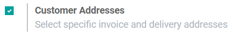
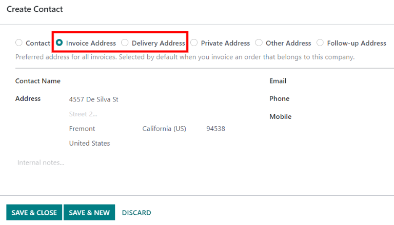
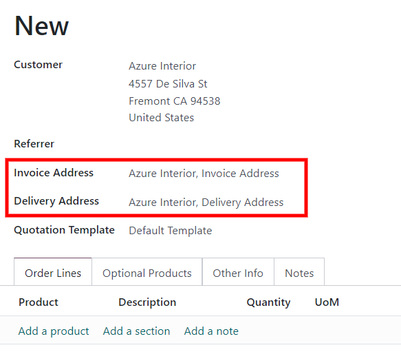

# Deliveries and invoices to different addresses

People and businesses often use separate addresses for billing
(invoicing) and shipping (delivery) purposes. With the Odoo *Sales* app,
contacts can have different specified addresses for delivery and
invoicing.

## Settings

To properly utilize multiple addresses in Odoo, go to
`Accounting app ‣
Configuration ‣ Settings`, and
scroll down to the `Customer Invoices` heading. Then, tick the checkbox.

## Contact form configuration 

To add multiple addresses to a contact, go to
`Sales app ‣ Orders ‣ Customers`, and clear any default filters from the search
bar. Then, click on the desired customer to open their contact form.

::: tip

Contact forms can be accessed in the *Contacts* application, as well.
::::

From the contact form, click `Edit`,
and then select `Add`, which is
located under the `Contacts & Addresses` tab. Doing so reveals a
`Create Contact` pop-up form, in
which additional addresses can be configured.

On the `Create Contact` pop-up form,
start by clicking the default `Other
Address` field to reveal a drop-down
menu of address-related options.

Select any of the following options:

- `Contact`: adds another contact to
  the existing contact form.
- `Invoice Address`: adds a specific
  invoice address to the existing contact form.
- `Delivery Address`: adds a specific
  delivery address to the existing contact form.
- `Other Address`: adds an alternate
  address to the existing contact form.
- `Private Address`: adds a private
  address to the existing contact form.

Once an option is selected, proceed to enter the corresponding contact
information that should be used for the specified address type.

Then, click `Save & Close` to save
the address and close the `Create Contact` window. Or, click `Save & New` to save the address and immediately input another one.

## Address added to quotations

When a customer is added to a quotation, the
`Invoice Address` and `Delivery
Address` fields autopopulate with the
corresponding addresses specified on the customer\'s contact form.

The `Invoice Address` and
`Delivery Address` can also be edited
directly from the quotation by clicking the `Edit` button, and then clicking the `➡️ (right
arrow)` internal link buttons next to
each address line.

These addresses can be updated at any time to ensure accurate invoicing
and delivery.

::: tip

If any changes are made on a form in Odoo, include *Contacts* forms,
remember to click `Save` to save the
changes to the database.
::::
