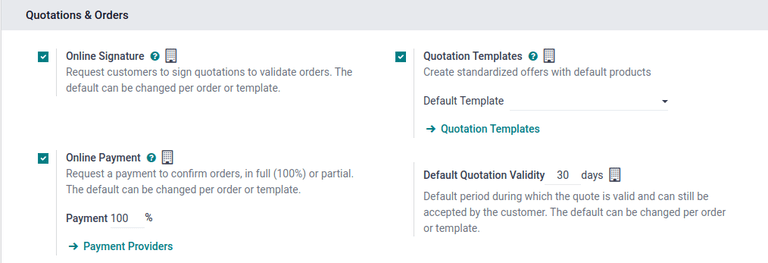
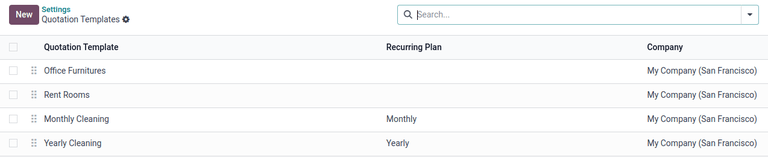
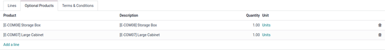
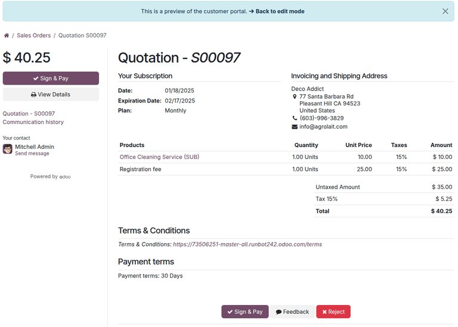
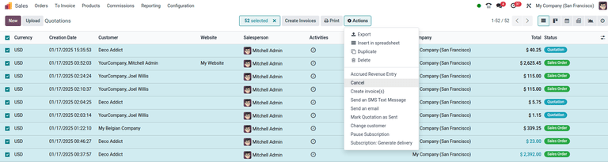

# Quotation templates

Reusable quotation templates can be made in Odoo\'s **Sales** app for
common products or services.

By using these templates, quotations can be tailored and sent to
customers at a quicker pace, without having to create new quotations
from scratch every time a sales negotiation occurs.

## Configuration

To use quotation templates, begin by activating the setting in
`Sales app ‣
Configuration ‣ Settings`, and
scroll to the `Quotations &_Orders`
heading.

Under the heading, tick the `Quotation Templates` checkbox. Doing so reveals a new
`Default Template` field, in which a
default quotation template can be chosen from the drop-down menu.

Upon activating the `Quotation Template` feature, an internal `fa-arrow-right` `Quotation Templates`
link appears beneath the `Default Template` field.

Clicking this link reveals the `Quotation Templates` page, from which templates can be created, viewed, and
edited.

Before leaving the `Settings` page,
do not forget to click the `Save`
button to save all changes made during the session.

## Create quotation templates 

To create a quotation template, click the
`Quotation Templates` link on the
`Settings` page once
`Quotation templates` are enabled, or
navigate to
`Sales app ‣ Configuration ‣ Quotation Templates`. Both options reveal the
`Quotation Templates` page, where
quotation templates can be created, viewed, and edited.

To create a new quotation template, click the `New` button, located in the upper-left corner. Doing so
reveals a blank quotation template form that can be customized.

Start by entering a name for the template in the
`Quotation Template` field.

Then, in the `Quotation Validity`
field, designate how many days the quotation template will remain valid
for, or leave the field on the default [0] to keep the
template valid indefinitely.

Next, in the `Confirmation Mail`
field, click the blank drop-down menu to select a preconfigured email
template to be sent to customers upon confirmation of an order.

::: tip

To create a new email template directly from the
`Confirmation Mail` field, start
typing the name of the new email template in the field, and select
either: `Create` or
`Create and edit...` from the
drop-down menu that appears.

Selecting `Create` creates the email
template, which can be edited later.

Selecting `Create and edit...`
creates the email template, and a `Create
Confirmation Mail` pop-up window
appears, in which the email template can be customized and configured
immediately.

When all modifications are complete, click
`Save & Close` to save the email
template and return to the quotation form.
::::

If working in a multi-company environment, use the
`Company` field to designate to which
company this quotation template applies.

If a journal is set in the `Invoicing Journal` field, all sales orders with this template will invoice
in that specified journal. If no journal is set in this field, the sales
journal with the lowest sequence is used.

If the `Online Signature` and/or
`Online Payment` features are
activated in the `Settings`
(`Sales app ‣ Configuration ‣ Settings`), those options are available on quotation
template forms.

Check the box beside `Online Signature` to request an online signature from the customer to
confirm an order.

Check the box beside `Online Payment`
to request an online payment from the customer to confirm an order. When
`Online Payment` is checked, a new
percentage field appears, in which a specific percentage of payment can
be entered.

Both options, `Online Signature` and
`Online Payment` can be enabled
simultaneously, in which case the customer must provide **both** a
signature **and** a payment to confirm an order.

In the `Recurring Plan` field, choose
from a variety of pre-configured amounts of time (e.g.
`Monthly`,
`Quarterly`, etc.) to designate how
often this quotation template should occur.

::: tip

The `Recurring Plan` field **only**
applies to subscription plans. For more information, check out the
documentation on `../../subscriptions/plans`.
::::

### Lines tab

In the `Lines` tab, products can be
added to the quotation template by clicking
`Add a product`, organized by
clicking `Add a section` (and
dragging/dropping section headers), and further explained with
discretionary information (such as warranty details, terms, etc.) by
clicking `Add a note`.

To add a product to a quotation template, click
`Add a product` in the
`Lines` tab of a quotation template
form. Doing so reveals a blank field in the `Product` column.

When clicked, a drop-down menu with existing products in the database
appears. Select the desired product from the drop-down menu to add it to
the quotation template.

If the desired product is not readily visible, type the name of the
desired product in the `Product`
field, and the option appears in the drop-down menu. Products can also
be found by clicking `Search More...`
from the drop-down menu.

::: tip

It is possible to add event-related products (booths and registrations)
to quotation templates. To do so, click the `Product` field, type in [Event], and select the
desired event-related product from the resulting drop-down menu.
::::

::: tip

When a product is added to a quotation template, the default
`Quantity` is [1], but
that can be edited at any time.
::::

Then, drag and drop the product to the desired position, via the
`six squares` icon, located to the
left of each line item.

To add a *section*, which serves as a header to organize the lines of a
sales order, click `Add a section` in
the `Lines` tab. When clicked, a
blank field appears, in which the desired name of the section can be
typed. When the name has been entered, click away to secure the section
name.

Then, drag and drop the section name to the desired position, via the
`oi-apps`
`(six squares)` icon, located to the
left of each line item.

To add a note, which appears as a piece of text for the customer on the
quotation, click `Add a note` in the
`Lines` tab. When clicked, a blank
field appears, in which the desired note can be typed. When the note has
been entered, click away to secure the note.

Then, drag and drop the note to the desired position, via the
`oi-apps`
`(six squares)` icon.

To delete any line item from the `Lines` tab (product, section, and/or note), click the
`fa-trash`
`(remove record)` icon on the
far-right side of the line.

### Optional Products tab

Using *optional products* is a marketing strategy that involves the
cross-selling of products along with a core product. The aim is to offer
useful and related products to customers, which may result in an
increased sale.

::: example
If a customer wants to buy a car, they have the choice to order
massaging seats as an additional product that compliments the car, or
ignore the offer and buy the car alone.
:::

Optional products appear as a section on the bottom of sales orders and
eCommerce pages. Customers can immediately add them to their online
sales orders themselves, if desired.

In the `Optional Products` tab,
`Add a line` for each cross-selling
product related to the original items in the `Lines` tab, if applicable.

Clicking `Add a line` reveals a blank
field in the `Product` column.

When clicked, a drop-down menu with products from the database appear.
Select the desired product from the drop-down menu to add it as an
optional product to the quotation template.

To delete any line item from the `Optional Products` tab, click the `fa-trash` `(remove record)` icon.

::: tip

Optional products are **not** required to create a quotation template.
::::

### Terms & Conditions tab

The `Terms & Conditions` tab provides
the opportunity to add terms and conditions to the quotation template.
To add terms and conditions, type the desired terms and conditions in
this tab.

::: tip

Terms and conditions are **not** required to create a quotation
template.
::::

## Use quotation templates

When creating a quotation (`Sales app ‣ New`), choose a preconfigured template in the
`Quotation Template` field.

::: tip

The order of the templates in the `Quotation Template` field is determined by the order of the templates in
the Quotation Templates form. The order of the quotations in the
Quotation Templates form does **not** affect anything else.
::::

To view what the customer will see, click the
`Preview` button at the top of the
page to see how the quotation template appears on the front-end of the
website through Odoo\'s customer portal.

When all blocks and customizations are complete, click the
`Save` button to save the
configuration.

The blue banner located at the top of the quotation template preview can
be used to quickly return `fa-arrow-right` `Back to edit mode`.
When clicked, Odoo returns to the quotation form in the back-end of the
*Sales* application.

## Mass cancel quotations/sales orders

Cancel multiple quotations (or sales orders) by navigating to the
`Sales app ‣
Orders ‣ Quotations`
dashboard, landing, by default, in the list view. Then, on the left side
of the table, tick the checkboxes for the quotations to be canceled.

::: tip

Select all records in the table by selecting the checkbox column header
at the top-left of the table; the total number of selected items are
displayed at the top of the page.
::::

Then, with the desired quotations (or sales orders) selected from the
list view on the `Quotations` page,
click the `fa-cog`
`Actions` button to reveal a
drop-down menu.

From this drop-down menu, select `Cancel quotations`.

::: tip

This action can be performed for quotations in *any* stage, even if it
is confirmed as a sales order.
::::

Upon selecting the `Cancel quotations` option, a `Cancel quotations` confirmation pop-up window appears. To complete the
cancellation, click the `Cancel
quotations` button.

::: tip

An error pop-up message appears when attempting to cancel an order for
an ongoing subscription that has an invoice.
::::

