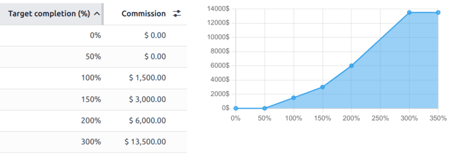

# Komissiyalar

Komissiyalar sotuv jamoasi a'zolarini rag'batlantirish uchun kuchli vositadir. Ular samaradorlikni rag'batlantiradi, mahsuldorlikni oshiradi va sog'lom raqobatni rag'batlantiradi. Odoo ning **Sotuvlar** ilovasidagi *Komissiyalar* funksiyasi sotuvchilar yoki sotuv jamoarelarini ularning samaradorligiga qarab mukofotlash imkonini beradi. Bu funksiya biznes maqsadlariga mos keladigan moslashuvchan, o'lchanadigan komissiya tuzilmalarini yaratishni qo'llab-quvvatlaydi, xoh bu daromad, hajm, foyda yoki takroriy shartnomalarni boshqarishni anglatsin.

## Sozlash

*Komissiyalar* funksiyasini yoqish uchun `Sales app ‣ Configuration ‣ Settings` ga o'ting. `Invoicing` bo'limiga aylanib, `Commissions` belgilamasini belgilang. Keyin `Save` tugmasini bosing. Buni qilish menyu satriga yangi `Commissions` menyusi paydo bo'lishiga sabab bo'ladi. Yangi komissiya rejasini yaratish uchun `Commissions ‣ Comission Plans` ga o'ting va `New` tugmasini bosing.

## Komissiya rejasi tuzilishi

Har bir komissiya rejasi bir nechta komponentlardan iborat:

- `Based on`: Komissiyalar `Targets` yoki `Achievements` ga erishish asosida berilishini belgilaydi
- `per`: Reja individual sotuvchilarga yoki butun sotuv jamoasiga taalluqli ekanligini ko'rsatadi
- `Target Frequency`: Maqsadlar qanchalik tez-tez yangilanishini belgilaydi: **Oylik**, **Choraklik** yoki **Yillik**.
- `Achievements`: Komissiyalar uchun nima o'lchanayotganini belgilaydi.

### Maqsadga asoslangan komissiya rejalari

*Maqsadga* asoslangan komissiya rejasida komissiyalar sotuv maqsadlariga erishish foiziga qarab beriladi. Maqsadga asoslangan rejalar aniq, o'lchanadigan maqsadlarni belgilash uchun ideal, masalan, chorakda ma'lum miqdordagi sotuvni hisoblash, keyin sotuvchilarni ushbu maqsadga qanchalik yaqinlashishi yoki uni oshirib yuborishiga qarab bosqichma-bosqich mukofotlash.

::: tip

Maqsadga asoslangan rejalar *Yutuq* asosidagi rejalardan farq qiladi, chunki ular oldindan belgilangan, sobit maqsadga erishishga asoslanadi. Ular maqsadga asoslangan rag'batlantirish va samaradorlik bosqichlariga e'tibor qaratadi.
::::

Yangi maqsadga asoslangan komissiya rejasini sozlash uchun `Sales app ‣ Commissions ‣ Commission Plans` ga o'ting, keyin `New` tugmasini bosing. `Based on` ochiladigan menyusiga bosing va `Targets` ni tanlang. Keyin `per` maydonida variantni tanlang.

`On Target Commission` maydonida maqsadning [100%] ga erishish uchun to'lov miqdorini belgilang. `Effective Period` maydonlarini yangilang va ushbu reja uchun sanalarni tasdiqlang. Keyin `Target Frequency` maydonini maqsadlar qanchalik tez-tez belgilanishi va baholanishiga qarab yangilang.

- *Oylik*: tez-tez to'lovlar bilan qisqa muddatli maqsadlar.
- *Choraklik*: biznes tsikllari bilan mos keladi va o'rta muddatli maqsadlarni ta'minlaydi.
- *Yillik*: strategik rejalashtirish uchun uzoq muddatli sotuv maqsadlari.

`Target Frequency` maydoni yangilangandan so'ng, `Targets` yorlig'i tegishli vaqt oralig'i ro'yxati bilan yangilanadi. Har bir `Period` uchun `Target` maqsadini kiriting.

`Achievements` yorlig'ida `Add a new achievement` tugmasini bosib, ushbu reja uchun bir yoki bir nechta `Achievement metric` qo'shing.

`Sales People` yorlig'ini bosib, ushbu rejani tegishli xodimlarga tayinlang. `Add a new Sales Person` tugmasini bosib ularni alohida qo'shing yoki `Add Multiple Salespersons` tugmasini bosib bir nechta kishini birdan qo'shing.

::: tip

`Add Multiple Salespersons` tugmasi faqat `../../general/developer_mode` faol bo'lgan taqdirdagina mavjud.
::::

### Darajalar

Qo'shimcha rag'batlantirish berish uchun *Maqsadga* asoslangan rejalarga *komissiya darajalari* qo'shilishi mumkin. Bu pog'onalar sotuvchilarga ularning samaradorlik darajalariga qarab turli komissiya miqdorlarini olish imkonini beradi. Darajalar [0%] dan boshlangan holda bosqichma-bosqich oshishi mumkin. Bu sotuvchilarning maqsadning [100%] ga erishmasalar ham komissiya olish imkoniyatini beradi, shuningdek [100%] dan oshib ketish imkoniyatini ham beradi. Komissiya darajalarini komissiya rejasini yaratishda `Commissions` yorlig'idan belgilash mumkin.

Agar 100% dan yuqori darajalar qo'shilmasa, sotuvchilar belgilangan komissiyadan yuqori daromad ololmaydilar.

::: tip
Quyidagi rejada darajalar [0%] dan boshlanib, [300%] gacha davom etadi. Agar sotuvchi kutilgan maqsadning [100%] ini oshirib yuborsa, ularning kutilgan to'lovi [300%] gacha oshishda davom etadi.

:::

### Yutugga asoslangan komissiya rejalari

*Yutuq* asosidagi komissiya rejasida sotuvchilar hisob-faktura qiymatining foizini komissiya sifatida oladilar. Maqsadga asoslangan rejalar ma'lum maqsadlardan qat'i nazar, sotuv faoliyatini doimiy ravishda mukofotlash uchun idealdir. Masalan, qancha sotilganidan qat'i nazar, barcha hisob-kitob qilingan miqdorlar uchun [5%] komissiya taklif qilish.

::: tip

Yutugga asoslangan rejalar *Maqsadga* asoslangan rejalardan farq qiladi, chunki ular tekis, doimiy stavka yordamida haqiqiy yutuqlarga asoslanib hisoblanadi. Ular davomiy, maqsadga asoslanmagan kompensatsiya rejalari uchun foydalidir.
::::

Yangi maqsadga asoslangan komissiya rejasini sozlash uchun `Sales app ‣ Commissions ‣ Commission Plans` ga o'ting, keyin `New` tugmasini bosing. `Based on` ochiladigan menyusiga bosing va `Achievements` ni tanlang. Keyin `per` maydonida variantni tanlang.

`Effective Period` maydonlarini yangilang va ushbu reja uchun sanalarni tasdiqlang. Keyin `Target Frequency` maydonini maqsadlar qanchalik tez-tez belgilanishi va baholanishiga qarab yangilang.

`Achievements` yorlig'ida `Add a new achievement` tugmasini bosib, ushbu reja uchun bir yoki bir nechta `Achievement metric` qo'shing.

`Sales People` yorlig'ini bosib, ushbu rejani tegishli xodimlarga tayinlang. `Add a new Sales Person` tugmasini bosib ularni alohida qo'shing yoki `Add Multiple Salespersons` tugmasini bosib bir nechta kishini birdan qo'shing.

### Yutuqlar

Samaradorlik rejalarida samaradorlikni bir nechta usul bilan o'lchash mumkin. Bular har bir rejaning `Achievements` yorlig'ida sozlanadi.

- `Amount Sold`: sotuv buyurtmalarining (SOs) umumiy qiymati.
- `Amount Invoiced`: tasdiqlangan hisob-fakturalarning umumiy qiymati.
- `Quantity Sold`: `SOs (Sales Orders)` orqali sotilgan birliklarning umumiy soni.
- `Quantity Invoiced`: hisob-kitob qilingan birliklarning umumiy soni.
- `Margin`: foyda marjasi (sotuv narxi minus xarajat narxi).
- `MRR`: obuna sotuvlaridan yangi *Oylik takroriy daromad*. Bu variant faqat `Subscriptions` ilovasi o'rnatilgan bo'lsagina mavjud.

::: tip

Reja nimaga `Based on` qilinganidan qat'i nazar, har bir rejada *Yutuqlar* ham, *Maqsadlar* ham sozlanishi kerak.
::::

## Rejani tasdiqlash

Yangi rejaning tafsilotlarini tasdiqlagandan so'ng, `Approve` tugmasini bosing. Bu rejani `Draft` bosqichidan `Approved` bosqichiga o'tkazadi.

::: warning

`Approved` bosqichidagi komissiya rejalarini **tahrirlash mumkin emas**. Tasdiqlangan rejani tahrirlash uchun avval uni `Reset to Draft` qilish kerak.
::::

Reja tasdiqlanganidan so'ng, Odoo avtomatik ravishda samaradorlikni kuzatib boradi va belgilangan parametrlarga asoslanib komissiyalarni hisoblab chiqadi.