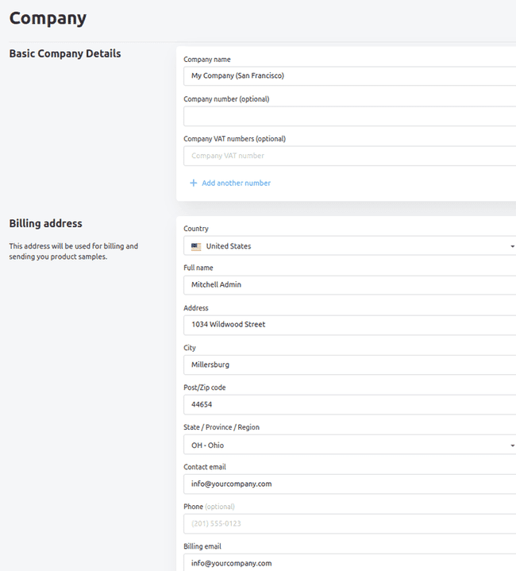
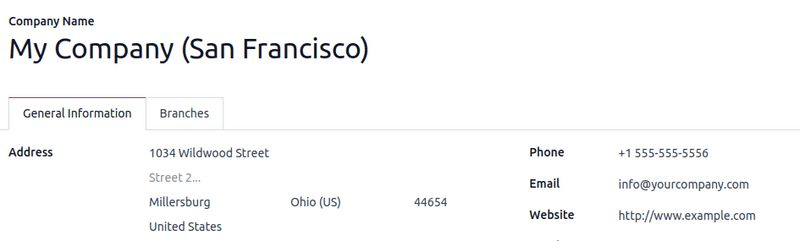
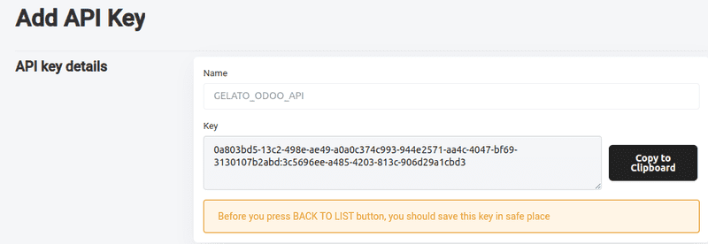
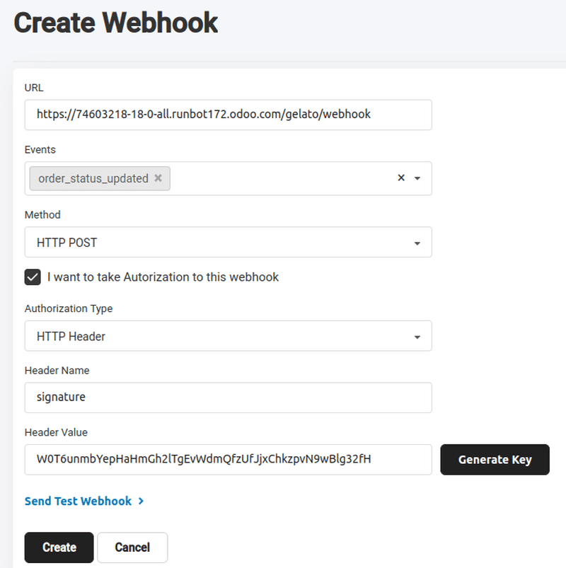

# Gelato

Gelato is a global print-on-demand platform that integrates with Odoo to
sync product catalogs and automate order fulfillment.

Connecting Gelato\'s services with Odoo\'s **Sales** and **eCommerce**
apps enables the following:

- Sync Odoo sales orders with Gelato for automated order fulfillment
- Create and manage Gelato products within Odoo; supports product
  variant and image sync
- Configure delivery options in Odoo and receive order updates via
  webhooks.

## Configuration

::: warning

The company information (*Company name* and *Billing address*) in the
Gelato account *must* match the company information in the Odoo database
in order for sales orders to be confirmed and sent to Gelato for
fulfillment.

::::

### Configure API keys and webhooks in Gelato

Before configuring the Gelato connector in Odoo, first obtain API
credentials and webhooks from the Gelato account.

API connectors enable Odoo **Sales** to send and receive data from
Gelato for order processing, while webhooks provide real-time updates on
order status and shipment tracking.

#### API Key

An API Key is a unique authentication token that allows Odoo to securely
communicate with Gelato\'s API, enabling order transmission, status
updates, and data synchronization.

After logging into Gelato, click `fa-code` `Developer` in the left
menu bar. From here, click on `API keys`. In the new page, click the
`Add API Key` button to open a new
API key form. Type in a name, then click `Create Key`.

Copy the generated API key using `Copy to Clipboard`.

::: warning

Copy the API key and store it somewhere safe and secure before leaving
this page. Once the page is refreshed or exited, the key will not be
available to copy.

If the key cannot be copied or is lost, return to the
`API key` page and start over,
creating a new API key.
::::

#### Webhook

A webhook is an automated notification system that instantly updates
Odoo when Gelato processes, ships, or delivers an order, ensuring
real-time tracking and minimal manual intervention.

To create a webhook, go to `Developer ‣ Webhooks` under the `Developer` drop-down menu in the left menu bar. In the new page,
click `Add Webhook` to open a
`Create Webhook` form.

The webhook form requires several specific configurations:

- `URL`: This tells Gelato where to
  send the order updates in Odoo. Copy and paste the Odoo database URL
  with the additional suffix [/gelato/webhook].

  ::: example
  [https://stealthywood.odoo.com/gelato/webhook]
  :::

- `Events`: Click into the field and
  select `order_status_updated`.
  Selecting `order_status_updated`
  ensures Odoo receives order changes automatically.

- `Method`: Click into the field and
  select the `HTTP Post` option, as
  this is the request method used to send data from Gelato to Odoo.

- Tick the checkbox next to
  `I want to take Authorization to this webhook`.

- `Header Name`: In this field, type
  in [signature] to match the field in Odoo.

- Click `Generate Key` to generate a
  `Header Value`.

- Click `Create` to complete this
  webhook configuration.

::: tip

Copy and paste the API key and webhook on a notepad before tabbing out
of the Gelato webpage as backup.
::::

### Configure Gelato connector in Odoo

In Odoo, navigate to
`Sales app ‣ Configuration ‣ Settings`, then scroll to the `Connectors` section. Enable the `Gelato` connector by ticking the checkbox. Next, paste the
newly generated API keys and webhook secret key into their respective
fields. Once saved, Gelato is available in Odoo **Sales** and
**eCommerce** products.

## Synchronizing Gelato products with Odoo Sales

It is recommended to have products already configured in Gelato before
configuring them in Odoo. To get the product ID in Gelato, navigate to
the `Templates` page from the side
bar menu. Select which product to synchronize in Odoo, then hover over
the product card to reveal the `fa-ellipsis-v` `(vertical ellipsis)`
menu icon. Click the menu icon, then click
`Copy Template ID` to copy the
product template ID to the clipboard.

### Odoo Sales product

To create a product in Odoo that matches the Gelato product, navigate to
`Sales app
‣ Products ‣ Products`,
select `New` to create a new product
form. Type in the product `Name`,
then navigate to the `Sales` tab.
Find the `Gelato` section, then click
into the `Template Reference` field
and paste the copied template ID from the Gelato product. Finally, click
`Synchronize`.

Successful synchronization pulls the Gelato product variant options into
the newly configured Odoo product.

In the new `Print Images` field,
click the `default` marker to set a
default product image. Click the `fa-pencil` `(edit)` icon and select
the product image file to upload, then `Save & Close`.

::: warning

The `Print Images` field *must* be
configured on all Gelato products and their respective product
variations before they can be ordered.
::::

### Product variants

To view and edit the newly synchronized product variants, navigate to
the `Attributes &
Variants` tab, which will have the
variants pulled from the Gelato product configuration. Click the
`Configure` button to edit and
configure the variant images, delivery methods, additional pricing, etc.

### Order a Gelato product from Odoo

Once synchronized, Gelato products are available to order in Odoo
through `sales quotations
` or on the
**eCommerce** store. Gelato delivery options are automatically
synchronized upon API and webhook configuration.

To add Gelato delivery, click `Add shipping` on the sales order. Select
`Standard Delivery` or
`Express Delivery` in the
`Shipping Method` field, then click
`Get rate`.

Once the quotation is confirmed, it becomes an active sales order, and
the order is sent to Gelato for fulfillment. Once a sales order is sent
from Odoo to Gelato, Gelato processes the order, produces the product at
the nearest fulfillment center, and ships it directly to the
end-customer.

::: warning

When creating a sales order for Gelato products in the database, only
Gelato products can be added to the same sales order. Multivendor orders
are not available with the Gelato connector at this time.
::::
