# Oldindan to'lovlar (Down payments)

Oldindan to'lov — bu savdo bitimi tasdiqlangan vaqtda amalga oshiriladigan dastlabki,  
ya'ni avans to'lovidir. Bu turdagi to'lovlar savdogar va xaridor uchun xavfni kamaytiradi,  
chunki ular ikki tomonning bitimni yakunlashga bo'lgan o'zaro majburiyatini bildiradi.

Oldindan to'lov orqali xaridor umumiy summaning bir qismini avvaldan to'laydi,  
qolgan qismini esa keyinchalik to'lashga rozi bo'ladi.  
Buning evaziga, sotuvchi xaridorga mahsulot yoki xizmatni to'lov vaqtida yoki undan so'ng taqdim etdi  
va qolgan to'lovni keyinchalik olishiga ishonadi.

Odoo `Sales` ilovasida oldindan to'lovlar har bir savdo bitimi ehtiyojiga qarab moslashtirilishi mumkin.

## Hisob-fakturalarni yaratish

Sotuv buyurtmasi (sales order) tasdiqlangandan so'ng, hisob-faktura yaratish imkoniyati  
`Hisob-faktura yaratish (Create Invoice)` tugmasi orqali mavjud bo'ladi.  
U bosilganda, `Hisob-faktura(lar)ni yaratish (Create invoice(s))` nomli ko'rinuvchi oynacha chiqadi.

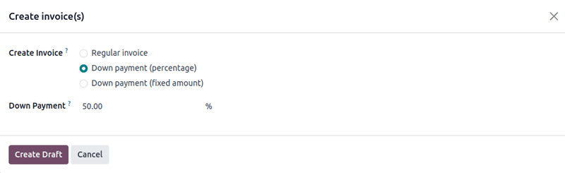

::: tip

Hisob-fakturalar avtomatik tarzda *qoralama (draft)* holatida yaratiladi,  
shuning uchun tasdiqlashdan oldin ularni ko'rib chiqish mumkin.
:::

`Create invoices` oynachasida `Hisob-faktura yaratish` maydonida tanlash mumkin bo'lgan 3 xil variant mavjud:

- `Oddiy hisob-faktura (Regular invoice)`
- `Oldindan to'lov (foiz) (Down payment - percentage)`
- `Oldindan to'lov (qat'iy miqdor) (Down payment - fixed amount)`

## Boshlang'ich oldindan to'lovni so'rash

`Hisob-faktura(lar)ni yaratish` oynachasida quyidagi oldindan to'lov variantlari mavjud:

- `Oldindan to'lov (foiz)`
- `Oldindan to'lov (qat'iy miqdor)`

Istalgan oldindan to'lov turini tanlang, so'ng `Oldindan to'lov summasi (Down Payment Amount)` maydonida  
foiz yoki qat'iy miqdor ko'rsatiladi.

Barcha maydonlar to'ldirilgandan so'ng, `Qoralama yaratish (Create Draft)` tugmasini bosing.  
U bosilgach, Odoo `Mijoz hisob-fakturasi qoralamasi (Customer Invoice Draft)`ni ko'rsatadi.

::: warning

Agar `Noto'g'ri amal (Invalid Operation)` xatosi paydo bo'lsa,  
`sotuv siyosati (invoicing policy)` to'g'ri sozlanganini tekshirib chiqing.  
Masalan, ba'zida hisob-faktura yaratishdan oldin mahsulot yetkazilishi talab qilinadi.
:::

`Mijoz hisob-fakturasi qoralamasi`ning `Hisob-faktura qatorlari (Invoice Lines)` tabida,  
`Hisob-faktura yaratish` oynasida belgilangan oldindan to'lov `Mahsulot (Product)` sifatida ko'rsatiladi.

## Misol: 50% oldindan to'lov so'rash

::: tip

Quyidagi misolda mahsulot (`Eshikli shkaf`) uchun 50% miqdorida oldindan to'lov mavjud.  
Bu mahsulotda `Buyurtma qilingan miqdorlar` invoicing policy sifatida tanlangan.

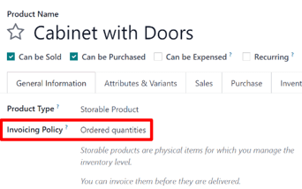
:::

Avval `Savdo (Sales)` ilovasiga o'ting va `Yangi (New)` tugmasini bosib,  
taklifnoma yarating hamda `Mijoz (Customer)`ni tanlang.

So'ng `Buyurtma qatorlari (Order Lines)` bo'limida `Mahsulot qo'shish (Add a product)` tugmasini bosib,  
`Eshikli shkaf (Cabinet with Doors)` mahsulotini tanlang.

Buyurtma `Tasdiqlash (Confirm)` tugmasi orqali tasdiqlangach, taklifnoma savdo buyurtmasiga aylanadi.  
Shundan so'ng, `Hisob-faktura yaratish (Create Invoice)` tugmasi orqali hisob-faktura yarating.

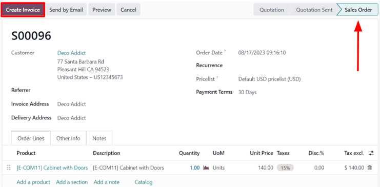

Keyin ochilgan `Hisob-faktura yaratish (Create invoices)` oynasida  
`Oldindan to'lov (foiz)` variantini tanlang va `Oldindan to'lov miqdori (Down Payment Amount)` maydoniga **50** deb yozing.

::: tip

`Oldindan to'lov (Down payment)` mahsulotiga biriktirilgan `Daromad hisobi (Income Account)`ni o'zgartirish mumkin.

Qo'shimcha ma'lumot uchun `Oldindan to'lov daromad hisobini o'zgartirish` hujjatini ko'rib chiqing.

Shuningdek, mahsulot kategoriyasida `Oldindan to'lov hisobi (Down payment Account)` belgilansa, u ustuvor bo'ladi.
:::

So'ng `Hisob-faktura qoralamasini yaratish (Create Draft Invoice)` tugmasini bosing.

Bu amaldan so'ng `Hisob-faktura qoralamasi (Draft Invoice)` ochiladi.  
Unda `Hisob-faktura qatorlari (Invoice Lines)` bo'limida oldindan to'lov mahsuloti ko'rsatilgan bo'ladi.

Keyin, `Tasdiqlash (Confirm)` tugmasini bosib, hisob-fakturani tasdiqlang.  
Tasdiqlangach, uning holati `Qoralama (Draft)`dan `Tasdiqlangan (Posted)`ga o'zgaradi  
va sahifaning yuqorisida yangi tugmalar paydo bo'ladi.

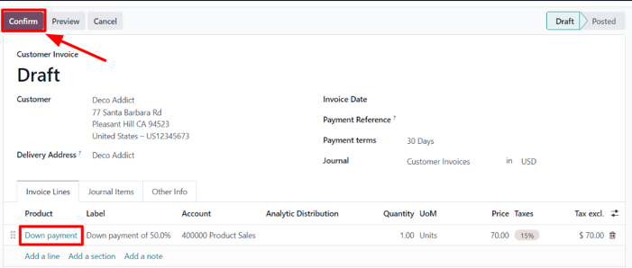

Hisob-fakturani tasdiqlaganingizdan so'ng, sahifaning yuqori qismidagi tugmalar orqali to'lovni ro'yxatdan o'tkazish mumkin.  
Buning uchun `To'lovni ro'yxatdan o'tkazish (Register Payment)` tugmasini bosing.

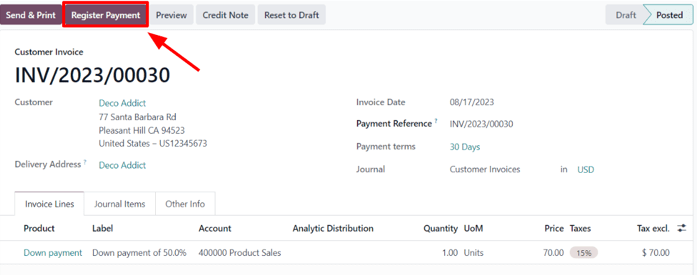

Shunda `To'lovni ro'yxatdan o'tkazish (Register Payment)` oynasi ochiladi.  
U kerakli ma'lumotlar bilan avtomatik to'ldirilgan bo'ladi.  
Ma'lumotlar to'g'riligini tekshiring va kerak bo'lsa, tuzatish kiriting.  
Hammasi tayyor bo'lsa, `To'lovni yaratish (Create Payment)` tugmasini bosing.

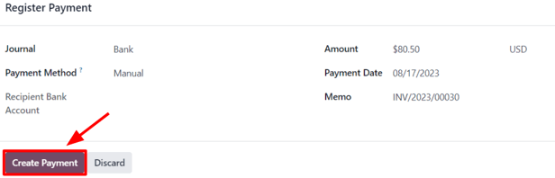

`To'lovni yaratish (Create Payment)` bosilgach, sahifaning yuqori o'ng burchagida yashil rangli  
`To'lanmoqda (In Payment)` belgilari paydo bo'ladi.

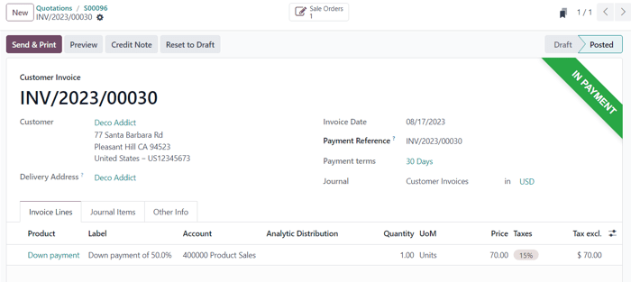

Endi mijoz buyurtmaning qolgan qismini to'lashni xohlasa, yana bir hisob-faktura yaratilishi kerak.  
Buning uchun `Savdo buyurtmasi (Sales Order)` sahifasiga breadcrumb havolalari orqali qayting.

Buyurtma sahifasida, `Buyurtma qatorlari (Order Lines)` bo'limida `Oldindan to'lovlar (Down Payments)`  
deb nomlangan yangi bo'lim paydo bo'ladi. Unda hozirgina yaratilgan va tasdiqlangan oldindan to'lov ko'rsatiladi.

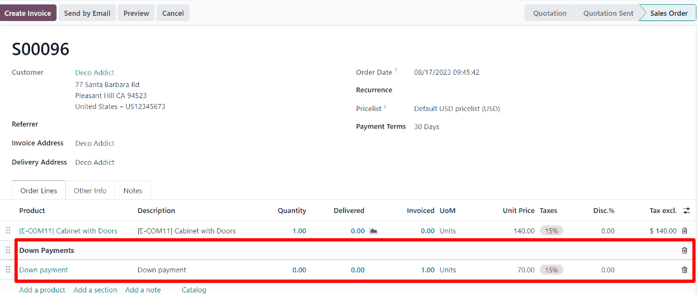

Endi, `Hisob-faktura yaratish (Create Invoice)` tugmasini yana bosing.

Ochiladigan `Hisob-faktura yaratish (Create invoices)` oynasida ikkita yangi maydon paydo bo'ladi:  
`Allaqachon hisoblangan (Already invoiced)` va `Hisoblanishi kerak (Amount to invoice)`.

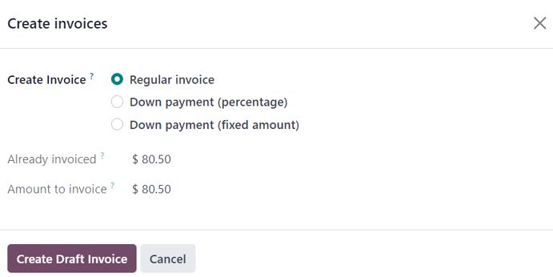

Agar qolgan summani to'lashga tayyor bo'lsangiz, `Oddiy hisob-faktura (Regular Invoice)` opsiyasini tanlang.  
Odoo to'liq to'lovni yakunlash uchun kerakli summaga hisob-faktura yaratadi — bu `Hisoblanishi kerak (Amount to invoice)` maydonida ko'rsatilgan.

So'ng, `Hisob-faktura qoralamasini yaratish (Create Draft Invoice)` tugmasini bosing.

Natijada yangi `Mijoz hisob-fakturasi qoralamasi (Customer Invoice Draft)` sahifasi ochiladi.  
Unda bu savdo buyurtmasiga bog'langan *barcha* hisob-fakturalar `Hisob-faktura qatorlari (Invoice Lines)` bo'limida ko'rsatiladi.  
Har bir qator tegishli hisob-faktura haqida barcha kerakli ma'lumotlarni o'z ichiga oladi.

Oxirgi bosqichni yakunlash uchun `Tasdiqlash (Confirm)` tugmasini bosing.  
Bu hisob-fakturaning holatini `Qoralama (Draft)`dan `Yaratilgan (Posted)`ga o'zgartiradi.  
So'ngra `To'lovni ro'yxatdan o'tkazish (Register Payment)` tugmasini bosing.

Shunda yana `To'lovni ro'yxatdan o'tkazish (Register Payment)` oynasi ochiladi.  
Bu safar ham barcha maydonlar kerakli ma'lumotlar bilan avtomatik to'ldirilgan bo'ladi —  
shu jumladan buyurtmaning qolgan to'lanishi kerak bo'lgan summasi.

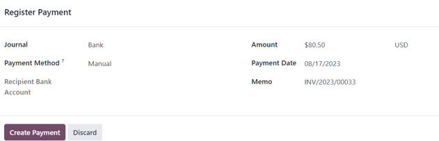

Ma'lumotlar to'g'riligini tasdiqlaganingizdan so'ng, `To'lovni yaratish (Create Payment)` tugmasini bosing.

Natijada, mijoz hisob-fakturasi sahifasi ochiladi. Sahifaning yuqori o'ng burchagida yashil `To'lanmoqda (In Payment)` belgisi paydo bo'ladi.  
Shuningdek, `Hisob-faktura qatorlari (Invoice Lines)` bo'limida har ikkala oldindan to'lovlar ham ko'rsatiladi.

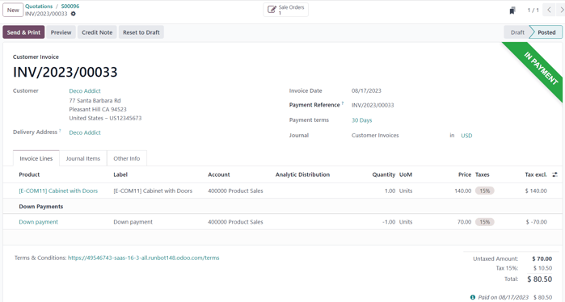

Bu bilan butun jarayon yakunlanadi ✅

::: tip
Ushbu jarayon `Qat'iy miqdor (Fixed amount)`dagi oldindan to'lovlar bilan ham amalga oshiriladi.
:::

::: warning
Agar mahsulot `Yetkazilgan miqdorlar (Delivered quantities)` bo'yicha hisoblanadigan invoicing policy'ga ega bo'lsa  
va mahsulot narxi 50% oldindan to'lovdan **yuqori** bo'lsa (ko'pchilik holatda shunday bo'ladi), unda oddiy hisob-faktura yaratiladi.

Ammo mahsulot narxi 50% oldindan to'lovdan **kam** bo'lsa, unda  
mijozga yakuniy hisob-fakturani yaratishda oldindan to'lov **ayirilmaydi**.

Buning sababi: Odoo hisob-faktura uchun **manfiy** summani yaratishga ruxsat bermaydi,  
shuning uchun mahsulot(lar) oldin yetkazilishi kerak bo'ladi.

Agar hech qanday yetkazib berish amalga oshirilmagan bo'lsa, `Kredit eslatmasi (Credit Note)` yaratiladi,  
bu esa avvalgi qoralama hisob-fakturasini bekor qiladi.

`Kredit eslatmasi` funksiyasidan foydalanish uchun,  
*Inventory (Ombor)* moduli o'rnatilgan bo'lishi kerak, yetkazib berishni tasdiqlash uchun.  
Aks holda, yetkazilgan miqdorni **qo'lda** savdo buyurtmasida kiritish mumkin.
:::

## Misol: 100% oldindan to'lov so'rash

100% oldindan to'lov so'rash jarayoni `50% oldindan to'lov` bilan bir xil,  
ammo bosqichlari kamroq.

::: tip
100% oldindan to'lov — bu savdo buyurtmasi uchun to'liq to'lov **emas**.

Agar savdo buyurtmasi oddiy hisob-faktura orqali to'liq to'langan bo'lsa,  
qolgan hisob-fakturalarni yaratish imkoniyati bo'lmaydi va  
*Savdo buyurtmasida (Sales Order)* `Create Invoice` tugmasi chiqmaydi.

Lekin, **ushbu misolda** Odoo hali ham qo'shimcha hisob-faktura kutadi,  
shuning uchun *Create Invoice* tugmasi ko'rinadi.
:::

Ushbu misolda `Quyosh panellarini o'rnatish (Solar Panel Installation)` mahsuloti ishlatilmoqda.

---

100% oldindan to'lovni sozlash uchun quyidagilarni bajaring:

1. `Sales` ilovasiga o'ting va `Yangi (New)` taklif yarating.
2. `Customer` maydoniga mijozni tanlang.
3. `Order Lines` bo'limida `Add a product` tugmasini bosib, `Solar Panel Installation` mahsulotini tanlang.
4. `Confirm` tugmasini bosing — taklif savdo buyurtmasiga aylanadi.
5. Endi yuqori chap burchakdagi `Create Invoice` tugmasini bosing.

`Create invoices` oynasi ochiladi:

- `Down payment (percentage)` ni tanlang
- `Down Payment Amount` maydoniga **100** ni yozing

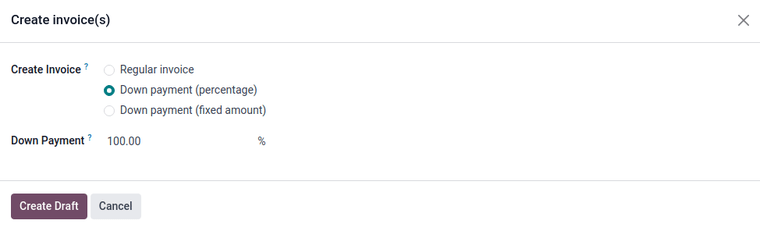

6. `Create Draft Invoice` tugmasini bosing.

   Natijada `Down Payment` mahsulot sifatida `Invoice Lines` bo'limida ko'rsatilgan qoralama hisob-faktura paydo bo'ladi.

7. Hisob-fakturani `Confirm` tugmasi orqali tasdiqlang.  
   Holat `Draft`dan `Posted`ga o'tadi va yuqorida yangi tugmalar paydo bo'ladi.

8. `Register Payment` tugmasini bosing.

   Bu sizga avtomatik to'ldirilgan `Register Payment` oynasini ochadi.  
   Ma'lumotlarni tekshiring va `Create Payment` tugmasini bosing.

9. To'lovdan so'ng, hisob-fakturani yuqori o'ng burchagida yashil `In Payment` belgilari ko'rsatiladi.

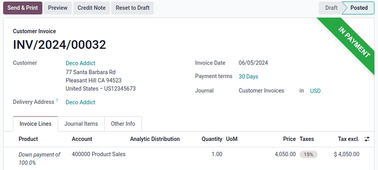

✅ 100% oldindan to'lov muvaffaqiyatli amalga oshirildi.

## Oldindan to'lovlar uchun daromad hisobini (Income Account) o'zgartirish

`Down Payment` mahsulot sahifasiga biriktirilgan daromad hisobini o'zgartirish yoki sozlash uchun  
`Accounting (Buxgalteriya)` moduli o'rnatilgan bo'lishi **shart**.

---

### Qadamlar:

1. `Sales` ilovasiga o'ting:  
   `Sales app ‣ Products ‣ Products`

2. Qidiruv satriga `Down Payment` mahsulotini yozing va uni tanlang — mahsulot tafsilotlari ochiladi.

3. Agar *Accounting* moduli o'rnatilgan bo'lsa, mahsulot sahifasida `Accounting` (Hisob) yorlig'i chiqadi.

4. `Accounting` yorlig'iga o'ting va `Receivables` (Qarzdorliklar) bo'limida joylashgan `Income Account` maydonidan kerakli hisobni tanlang yoki o'zgartiring.

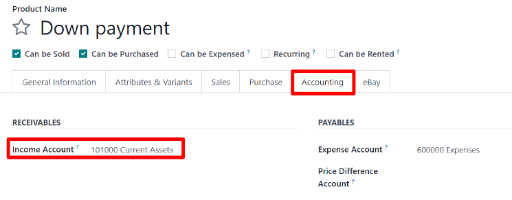