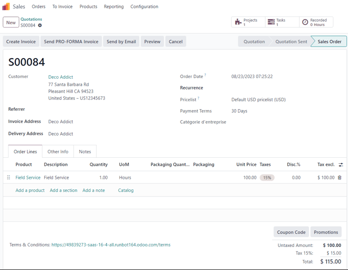
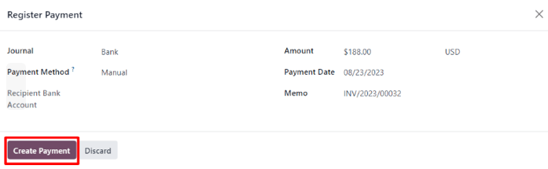

# Mijozlarga xarajatlarni qayta hisoblash

Mijoz uchun loyiha ustida ishlayotganda, xodimlar ko'pincha loyiha bilan bog'liq turli xarajatlar uchun o'z pullarini sarflashlari kerak bo'ladi.

Masalan, xodim mijozga mahalliy xizmat ko'rsatish paytida mehmonxona uchun o'z pulidan to'lashi kerak bo'lishi mumkin. Kompaniya sifatida bu xarajat mijozga qayta hisoblash kerak. Odoo yordamida bunday xarajatlar loyiha bilan bog'liq mijozga tezda qayta hisoblanishi mumkin.

## Xarajatlar ilovasi

Mijozga xarajatni qayta hisoblash uchun `Expenses` ilovasi **albatta** o'rnatilgan bo'lishi kerak.

`Expenses` ilovasini o'rnatish uchun `asosiy Odoo boshqaruv paneli ‣ Apps` bo'limiga o'ting va `Expenses` ilovasi blokida `Install` tugmasini bosing. Bosilgach, Odoo ilovani o'rnatadi, sahifani yangilaydi va asosiy Odoo boshqaruv paneliga qaytadi.

## Savdo buyurtmalariga xarajatlar qo'shish

Boshida `Sales` ilovasida qayta hisoblash mumkin bo'lgan xarajat qo'shilishi mumkin bo'lgan tasdiqlangan savdo buyurtmasi bo'lishi kerak. Yoki boshidan yangi savdo buyurtmasi yarating. Buning uchun `Sales app ‣ New` bo'limiga o'ting. Bu bo'sh taklif formasini ochadi.

Keyin `Customer` qo'shing va `Order Lines` tabiga `Add a product` tugmasini bosib mahsulot qo'shing. Keyin ochiluvchi menyudan mahsulotni tanlang.

Nihoyat, savdo buyurtmasini tasdiqlash uchun `Confirm` tugmasini bosing.

Savdo buyurtmasi tasdiqlangach, xarajat yaratish vaqti keldi.

Buning uchun `asosiy Odoo boshqaruv paneli ‣ Expenses` orqali `Expenses` ilovasiga o'ting.

Keyin `Expenses` boshqaruv panelidan bo'sh xarajatlar formasini ochish uchun `New` tugmasini bosing.

Xarajatlar formasida xarajatga oson murojaat qilish uchun `Description` qo'shing.

Keyin `Category` maydonida ochiluvchi menyudan quyidagi variantlardan birini tanlang:

- `Communication`: loyiha/buyurtma bilan bog'liq har qanday aloqa turi.
- `Others`: boshqa kategoriyalarga mos kelmaydigan xarajat.
- `Meals`: loyiha/buyurtma bilan bog'liq har qanday taom xarajatlari.
- `Gifts`: loyiha/buyurtma bilan bog'liq har qanday sovg'a xarajatlari.
- `Mileage`: loyiha/buyurtma bilan bog'liq har qanday yo'l (benzin) xarajatlari.
- `Travel & Accommodation`: loyiha/buyurtma bilan bog'liq har qanday sayohat yoki turar joy xarajatlari.

::: tip

Yangi xarajat kategoriyalarini xarajat formasidan yaratish mumkin, buning uchun `Category` maydonining ochiluvchi menyusini bosing, `View All` ni tanlang va `Search:Category` oynasidan `New` tugmasini bosing.

:::

Mijozga qisqa mehmonxona qolishi uchun qayta hisoblash bo'ladigan ushbu namuna ish oqimi uchun, bu misoldagi `Category` `[TRANS & ACC] Travel & Accommodation` dir.

::: tip

Quyidagi misol ish oqimi davomida eslatib o'tilgan barcha maydonlarni ko'rish/o'zgartirish uchun `Sales`, `Accounting` va `Expense` ilovalarni talab qiladi.
:::

`Category` maydoni ostida `Total` maydoniga xarajat qilinadigan summani kiriting.

Keyin `Total` da biror `Included taxes` borligini belgilang. Agar `Included taxes` maydonidan oldindan sozlangan soliq miqdori tanlansa, Odoo `Total` maydoniga kiritilgan miqdor asosida soliq miqdorini avtomatik hisoblaydi.

Keyin xarajat uchun qaysi `Employee` mas'ul ekanligini tanlang va `Paid By` maydonida variantni tanlang: `Employee (to reimburse)` yoki `Company`.

Bizning holatda xodim mehmonxona uchun o'z pulidan to'lagan, shuning uchun `Employee (to reimburse)` varianti tanlangan.

Xarajatlar formasining o'ng tomonida `Bill Reference` qo'shish imkoniyati mavjud. Uning ostida avtomatik to'ldirilgan `Expense Date` va `Account` maydonlari mavjud.

::: tip

`Expense Date` va `Account` maydonlarini kerak bo'lsa o'zgartirish mumkin.
:::

Keyin `Customer to Reinvoice` maydonida bo'sh maydonni bosib ochiluvchi menyuni ochish kerak. Ushbu ochiluvchi menyudan ushbu xarajat biriktirilishi kerak bo'lgan tegishli savdo buyurtmasini tanlang. Mijozga xarajatni qayta hisoblash uchun ushbu maydon **albatta** to'ldirilishi kerak.

Nihoyat, `Analytic Distribution` va `Company` maydonlarini o'zgartirish imkoniyati mavjud. Bu maydonlar mijozga qayta hisoblangan xarajatni yakunlash uchun *talab qilinmaydi*, lekin kerak bo'lsa o'zgartirish uchun mavjud.

Shuningdek, xarajatlar formasining pastki qismida `Notes...` bo'limi mavjud, bu yerda kerak bo'lsa ushbu xarajat bilan bog'liq har qanday eslatmalar qo'shilishi mumkin.

Xarajatlar formasining yuqori qismida `Attach Receipt`, `Create Report` va `Split Expense` tugmalari mavjud.

Agar xarajatga biriktirilishi kerak bo'lgan jismoniy yoki raqamli kvitansiya bo'lsa, `Attach Receipt` tugmasini bosing.

Agar ushbu xarajat narxini bo'lish kerak bo'lsa, `Split Expense` tugmasini bosing. Bu funksiya bir necha sabablarga ko'ra ishlatilishi mumkin (boshqa xodim bilan xarajatni bo'lish, turli soliq stavkalarini qo'llash va h.k.).

Agar ushbu variantlarning hech biri kerak bo'lmasa, hozirgina sozlangan xarajat hisobotini tasdiqlash uchun `Create Report` tugmasini bosing.

Bu yangi xarajat uchun `Expense Report Summary` ni ochadi.

Bu yerda xarajat bilan bog'liq tafsilotlar tasdiqlangach, `Submit to Manager` tugmasini bosing. Bu xarajat hisobotini tasdiqlovchi menejerga yuboradi, u xarajatni ko'rib chiqadi.

Xarajatni ko'rib chiqish va tasdiqlash uchun mas'ul menejer xarajat bilan bog'liq tafsilotlarni tekshiradi va agar muammolar bo'lmasa, ular `Approve` tugmasini bosadi --- bu tugma *faqat* xodim tomonidan menejerga topshirilgan `Expense Report Summary` ning menejer ko'rinishida paydo bo'ladi.

Tasdiqlangach, `Expense Report Summary` ning yuqori qismidagi tugmalar yana o'zgaradi. Ushbu nuqtada `Expense Report Summary` ning yuqori qismidagi tugmalar quyidagilar: `Post Journal Entries`, `Report in Next Payslip`, `Refuse` va `Reset to Draft`.

Menejer `Expense Report Summary` dan qoniqsa, ular `Post Journal Entries` tugmasini bosadi.

`Post Journal Entries` bosilgach, bu tugma yo'qoladi va `Expense` tabidagi `Analytic Distribution` ustuni `Customer to Reinvoice` maydonida dastlab xarajatga sozlangan savdo buyurtmasi bilan to'ldiriladi.

::: warning

Odatiy bo'lib, `Customer to Reinvoice` maydoni `[TRANS & ACC] Travel & Accommodation`, `[COMM] Communication`, `[FOOD] Meals` va `[MIL] Mileage` xarajat kategoriyalari uchun yoqilgan.

Shuni ta'kidlash kerakki, `Expenses` ilovasi bilan o'rnatilgan **barcha** standart xarajat kategoriyalarida qayta hisoblash siyosati faollashtirilmagan. Sozlama qo'lda faollashtirilishi kerak bo'lishi mumkin.

Buning uchun `Expenses app ‣ Configuration ‣ Expenses Categories` ga o'tib ma'lumotlar bazasidagi barcha xarajat kategoriyalari ro'yxatini ko'ring.

Har bir xarajat kategoriyasi uchun qanday tanlovlar qilinganini ko'rish uchun `Re-Invoice Expenses` ustuniga qarang.

Xarajat kategoriyasini o'zgartirish uchun `Category` maydonidagi `fa-arrow-right` `(o'ng o'q)` ni bosib, ushbu aniq xarajat formasini oching.

`Invoicing` bo'limi ostida, `Re-Invoice Expenses` maydonida `At cost` yoki `Sales price` ni tanlang.

:::

## Xarajatni qayta hisoblash

Ushbu qadamlar tugagach, mijozga xarajatni qayta hisoblashni yakunlash uchun savdo buyurtmasiga qaytish vaqti keldi.

Buning uchun `asosiy Odoo boshqaruv paneli ‣ Sales app` ga o'ting va xarajat uchun qayta hisoblanishi kerak bo'lgan tegishli savdo buyurtmasini tanlang.

Savdo formasida yangi sozlangan xarajat endi `Order Lines` tabida, `Delivered` ustuni to'ldirilgan holda va hisob-faktura qilishga tayyor.

Xarajat tafsilotlarini tasdiqlagach, savdo buyurtmasining yuqori qismidagi `Create Invoice` tugmasini bosing. Bosilgach, `Create invoices` oynasi paydo bo'ladi.

Ushbu oynadan `Create Invoice` maydonini standart `Regular invoice` variantida qoldiring va `Create Draft Invoice` tugmasini bosing.

Bu `Invoice Lines` tabida *faqat* xarajat ko'rsatilgan `Customer Invoice Draft` ni ochadi.

Agar xarajat bilan bog'liq barcha ma'lumotlar to'g'ri bo'lsa, hisob-fakturani tasdiqlash uchun `Confirm` tugmasini bosing. Bu hisob-faktura holatini `Draft` dan `Posted` ga o'tkazadi.

Hisob-fakturani mijozga yuborish uchun `Send & Print` tugmasini bosing. Bu xabar tanasida oldindan sozlangan xabar va PDF hisob-faktura bilan `Send` oynasini ochadi. Xabar ko'rib chiqilishi va kerak bo'lsa o'zgartirilishi mumkin.

Tayyor bo'lgach, hisob-fakturani mijozga yuborish uchun `Send & Print` tugmasini bosing. Bosilgach, oyna yo'qoladi va Odoo xabar/hisob-fakturani mijozga yuboradi. Qo'shimcha ravishda, hisob-fakturaning PDF fayli yozib olish va/yoki chop etish maqsadida avtomatik yuklab olinadi.

`Customer Invoice` ga qaytib, mijoz hisoblangan xarajat uchun to'laganda `Register Payment` tugmasini bosing.

`Register Payment` bosilgach, `Register Payment` oynasi paydo bo'ladi. Ushbu oynada kerakli maydonlar to'g'ri ma'lumotlar bilan avtomatik to'ldiriladi. Ma'lumotlarni ko'rib chiqqach, `Create Payment` tugmasini bosing.

`Create Payment` bosilgach, oyna yo'qoladi va hisob-fakturaning yuqori o'ng burchagida yashil `In Payment` belgisi paydo bo'ladi, bu hisob-faktura to'liq to'langanligini bildiradi. Shunday qilib, ish oqimi yakunlanadi.

