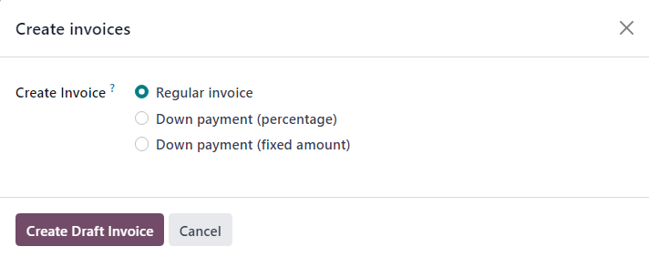

# Xarajatlarni mijozlarga qayta hisob-faktura qilish

Mijoz uchun loyiha ustida ishlayotgan vaqtda, xodimlar ko‘pincha turli xarajatlar uchun o‘z cho‘ntaklaridan mablag‘
sarflashlari mumkin.

Masalan, xodim mijozga joyida xizmat ko‘rsatish uchun mehmonxonada turishga majbur bo‘lishi mumkin. Bunday holatda,
kompaniya sifatida ushbu xarajat mijozga qayta hisob-faktura qilinishi lozim. Odoo yordamida bu kabi xarajatlarni
mijozga tez va oson qayta hisob-faktura qilish mumkin.

## Expenses (Xarajatlar) ilovasi

Xarajatni mijozga qayta hisob-faktura qilish uchun, avvalo *Expenses* (Xarajatlar) ilovasi o‘rnatilgan bo‘lishi **shart
**.

*Expenses* ilovasini o‘rnatish uchun quyidagicha harakat qiling:

`Asosiy Odoo boshqaruv paneli ‣ Ilovalar (Apps)` bo‘limiga o‘ting va *Expenses* ilovasi blokidagi `O‘rnatish (Install)`
tugmasini bosing. Tugmani bosgandan so‘ng, Odoo ilovani o‘rnatadi, sahifani yangilaydi va sizni boshqaruv paneliga
qaytaradi.

## Xarajatlarni savdo buyurtmalariga qo‘shish

Boshlash uchun, *Sales* (Savdo) ilovasida tasdiqlangan savdo buyurtmasi mavjud bo‘lishi kerak, unga qayta hisob-faktura
qilinadigan xarajat qo‘shilishi mumkin. Yoki, yangidan savdo buyurtmasi yarating. Buning uchun:

`Sales ilovasi ‣ Yangi` (New) ga o‘ting. Bu orqali bo‘sh kotirovka shakli ochiladi.

Shundan so‘ng, `Mijoz`ni kiriting va `Buyurtma satrlari` (Order Lines) yorlig‘iga mahsulot qo‘shish uchun
`Mahsulot qo‘shish` (Add a product) tugmasini bosing. Keyin, ro‘yxatdan kerakli mahsulotni tanlang.

Oxirida, `Tasdiqlash` (Confirm) tugmasini bosib, buyurtmani tasdiqlang.

Buyurtma tasdiqlangandan so‘ng, xarajatni yaratish vaqti keldi.

Buning uchun, `Asosiy Odoo boshqaruv paneli ‣ Expenses (Xarajatlar)` bo‘limiga o‘ting.

So‘ng, *Expenses* bosh sahifasida `Yangi` (New) tugmasini bosing. Bu orqali bo‘sh xarajat shakli ochiladi.

Xarajat formasida, xarajatingizni osongina aniqlash uchun `Tavsif` (Description) kiriting.

So‘ngra, `Toifa` (Category) maydonida quyidagi variantlardan birini tanlang:

- `Aloqa (Communication)`: loyiha/buyurtmaga tegishli har qanday aloqa xarajatlari.
- `Boshqalar (Others)`: boshqa toifalarga mos kelmaydigan xarajatlar.
- `Ovqatlanish (Meals)`: loyiha/buyurtmaga tegishli har qanday ovqatlanish xarajatlari.
- `Sovg‘alar (Gifts)`: loyiha/buyurtmaga tegishli sovg‘alar xarajatlari.
- `Yoqilg‘i (Mileage)`: loyiha/buyurtmaga tegishli yoqilg‘i xarajatlari.
- `Sayohat va Yashash (Travel & Accommodation)`: loyiha/buyurtmaga tegishli har qanday safar va yashash xarajatlari.

::: tip

Yangi xarajat toifalari xarajat formasining o‘zida yaratilishi mumkin. Buning uchun `Toifa` (Category) maydonidagi
ochiluvchi ro‘yxatdan `Barchasini ko‘rish` (View All) ni tanlang, so‘ng `Search:Category` ochiluvchi oynasida `Yangi` (
New) tugmasini bosing.

:::

Ushbu misoliy ish jarayonida, mijozga mehmonxonada qisqa muddatli turar joy xarajati qayta hisob-faktura qilinadi.
Shuning uchun `Toifa` sifatida `[TRANS & ACC] Sayohat va Yashash` tanlanadi.

::: tip

Quyidagi misolni to‘liq bajarish uchun *Sales* (Savdo), *Accounting* (Buxgalteriya) va *Expense* (Xarajatlar) ilovalari
o‘rnatilgan bo‘lishi zarur. Ushbu jarayonda tilga olingan barcha maydonlarni ko‘rish/sozlash uchun shu dasturlar kerak
bo‘ladi.
:::

`Toifa` maydonining tagida, xarajat qilinadigan summani `Jami` (Total) maydoniga kiriting.

Keyin, `Jami` maydoniga kiritilgan summaga qandaydir `Qo‘shilgan soliqlar` (Included Taxes) tegishli bo‘lsa, ushbu
maydondan mos soliq turini tanlang. Odoo bu summadan avtomatik tarzda soliq hisob-kitobini amalga oshiradi.

Shundan so‘ng, xarajatni qilgan `Xodim`ni tanlang va `Kim tomonidan to‘langan` (`To‘lovchi`) maydonidan biri tanlanadi:

- `Xodim (qaytariladi)` (Employee – to reimburse)
- `Kompaniya` (Company)

Ushbu holatda, xodim mehmonxona xarajatini o‘z hisobidan qilgan, shuning uchun `Xodim (qaytariladi)` varianti tanlanadi.

Xarajat formasining o‘ng tomonida `Hisob-faktura raqami` (Bill Reference) kiritish imkoniyati mavjud.

Buning ostida avtomatik to‘ldirilgan `Xarajat sanasi` (Expense Date) va `Hisob` (Account) maydonlari mavjud.

::: tip

Agar zarurat bo‘lsa, `Xarajat sanasi` (Expense Date) va `Hisob` (Account) maydonlarini tahrirlash mumkin.
:::

Keyin, `Qayta hisob-faktura qilinadigan mijoz` (`Customer to Reinvoice`) maydoniga kiring. Bo‘sh maydonga bosganingizda
ochiluvchi ro‘yxat paydo bo‘ladi. Shu ro‘yxatdan ushbu xarajat bog‘lanishi kerak bo‘lgan mos `savdo buyrug‘i`ni tanlang.
Bu maydon **majburiy** bo‘lib, xarajatni mijozga qayta hisob-faktura qilish uchun to‘ldirilishi kerak.

So‘ngra, `Analitik taqsimot` (`Analytic Distribution`) va `Kompaniya` (`Company`) maydonlarini kerak bo‘lsa o‘zgartirish
mumkin. Bu maydonlar mijozga qayta hisob-faktura qilish uchun *majburiy emas*, lekin kerak bo‘lsa tahrirlanishi mumkin.

Shuningdek, xarajat formasining pastki qismida `Izohlar...` (`Notes...`) bo‘limi mavjud bo‘lib, bu yerga ushbu xarajatga
oid har qanday eslatmalarni yozib qo‘yish mumkin.

Xarajat formasining yuqori qismida quyidagi tugmalar mavjud:

- `Chekni biriktirish` (`Attach Receipt`)
- `Hisobot yaratish` (`Create Report`)
- `Xarajatni bo‘lish` (`Split Expense`)

Agar xarajatga tegishli raqamli yoki qog‘ozli chek mavjud bo‘lsa, uni yuklash uchun `Chekni biriktirish` tugmasini
bosing.

Agar xarajat bir nechta bo‘limga bo‘linishi kerak bo‘lsa (masalan, boshqa xodim bilan xarajatni bo‘lishish, turli soliq
stavkalariga moslashish va hokazo), `Xarajatni bo‘lish` tugmasidan foydalaning.

Agar bu variantlar kerak bo‘lmasa, `Hisobot yaratish` tugmasini bosing. Bu orqali hozir kiritilgan xarajat asosida
hisobot yaratiladi.

Bu amal bajarilgach, yangi xarajat uchun `Xarajat Hisoboti Yig‘indisi` (`Expense Report Summary`) sahifasi ochiladi.

Bu yerda, xarajatga oid barcha tafsilotlar to‘g‘ri kiritilganiga ishonch hosil qilingandan so‘ng,
`Rahbar tasdig‘iga yuborish` (`Submit to Manager`) tugmasini bosing. Bu amal orqali xarajat hisobotini tasdiqlovchi
rahbarga yuborasiz.

Xarajatni tasdiqlash uchun mas’ul bo‘lgan rahbar barcha tafsilotlarni ko‘zdan kechiradi. Agar muammo bo‘lmasa, u
`Tasdiqlash` (`Approve`) tugmasini bosadi — bu tugma **faqat** rahbar tomonidan ko‘rinadigan
`Xarajat Hisoboti Yig‘indisi` sahifasida paydo bo‘ladi.

Tasdiqlangach, `Xarajat Hisoboti Yig‘indisi` sahifasining yuqori qismida tugmalar yangilanadi. Bu bosqichda quyidagi
tugmalar mavjud bo‘ladi:

- `Buxgalteriya yozuvlarini kiritish` (`Post Journal Entries`)
- `Keyingi ish haqiga kiritish` (`Report in Next Payslip`)
- `Rad etish` (`Refuse`)
- `Qoralamaga qaytarish` (`Reset to Draft`)

Agar rahbar xarajat hisobotini to‘liq tasdiqlasa, `Buxgalteriya yozuvlarini kiritish` (`Post Journal Entries`) tugmasini
bosadi.

Bu tugma bosilgach, u sahifadan yo‘qoladi va `Xarajatlar` tabidagi `Analitik taqsimot` (`Analytic Distribution`)
ustunida xarajat bog‘langan `Savdo buyurtmasi` (Sales Order) avtomatik ko‘rinadi. Bu savdo buyurtmasi oldin
`Qayta hisob-faktura qilinadigan mijoz` maydonida tanlangan edi.

::: warning

Standart holatda `Qayta hisob-faktura qilinadigan mijoz` (`Customer to Reinvoice`) maydoni faqat quyidagi xarajat
toifalari (`Expense Categories`) uchun yoqilgan bo‘ladi:

- `[TRANS & ACC] Sayohat va yashash` (`Travel & Accommodation`)
- `[COMM] Aloqa` (`Communication`)
- `[FOOD] Ovqatlanish` (`Meals`)
- `[MIL] Yo‘l xarajatlari` (`Mileage`)

Biroq, *Expenses* ilovasi bilan birga keladigan barcha standart xarajat toifalarida `Qayta hisob-fakturalash siyosati`
yoqilmagan bo‘lishi mumkin. Bu sozlamani **qo‘lda yoqish** kerak bo‘lishi mumkin.

Buning uchun `Xarajatlar` ilovasida quyidagi yo‘ldan o‘ting:
`Xarajatlar ilovasi ‣ Sozlamalar ‣ Xarajat toifalari` (`Expenses app ‣ Configuration ‣ Expense Categories`)

Ochilgan ro‘yxatda `Qayta hisob-faktura qilish` (`Re-Invoice Expenses`) ustunini tekshirib chiqing va kerakli toifalar
uchun ushbu sozlamani yoqing.
:::

Xarajat toifasini o‘zgartirish uchun `Category` maydonidagi
`→` (`fa-arrow-right`, ya’ni o‘ngga qaragan o‘qcha) tugmasini bosing. Bu bilan siz tanlangan xarajat toifasining o‘ziga
xos formasi (sahifasi)ga o‘tasiz.

U yerda `Hisob-fakturalash` (`Invoicing`) bo‘limi ostida joylashgan
`Qayta hisob-faktura qilish` (`Re-Invoice Expenses`) maydonini toping va unga quyidagi qiymatlardan birini tanlang:

- `Asl narxda` (`At cost`) — xarajat mijozga aynan sarflangan qiymatda hisob-faktura qilinadi.
- `Sotuv narxida` (`Sales price`) — xarajat belgilangan sotuv narxida mijozga qayta hisob-faktura qilinadi.

## Xarajatni qayta hisob-faktura qilish

Yuqoridagi bosqichlar yakunlangach, mijozga xarajatni qayta hisob-faktura qilish uchun savdo buyurtmasiga qaytish vaqti
keldi.

Buning uchun quyidagiga o‘ting:  
`Asosiy Odoo boshqaruv paneli ‣ Savdo ilovasi (Sales app)`,  
so‘ngra xarajat qayta hisob-faktura qilinadigan mos savdo buyurtmasini tanlang.

Savdo formasida, yangi sozlangan xarajat `Buyurtma satrlari` (`Order Lines`) bo‘limida ko‘rinadi.  
Uning `Yetkazib berilgan` (`Delivered`) ustuni to‘ldirilgan va hisob-fakturaga tayyor holatda turibdi.

Xarajat tafsilotlarini tekshirganingizdan so‘ng, savdo formasining yuqori qismidagi  
`Hisob-faktura yaratish` (`Create Invoice`) tugmasini bosing.  
Shunda `Hisob-faktura yaratish` (`Create invoices`) pop-up oynasi ochiladi.

Bu oynada, `Hisob-faktura turi` (`Create Invoice`) maydonini o‘zgartirmasdan  
`Oddiy hisob-faktura` (`Regular invoice`) holida qoldiring va  
`Qoralama hisob-faktura yaratish` (`Create Draft Invoice`) tugmasini bosing.

Shunda sizga mijoz uchun `Qoralama hisob-faktura` (`Customer Invoice Draft`) ko‘rsatiladi,  
unda faqat xarajat `Hisob-faktura satrlari` (`Invoice Lines`) bo‘limida aks etadi.

Agar xarajatga oid barcha ma’lumotlar to‘g‘ri bo‘lsa,  
`Tasdiqlash` (`Confirm`) tugmasini bosing.  
Bu bilan hisob-faktura holati `Qoralama` (`Draft`) dan `Yuborilgan` (`Posted`) holatiga o‘tadi.

Hisob-fakturani mijozga yuborish uchun `Yuborish va chop etish` (`Send & Print`) tugmasini bosing.  
Shunda `Yuborish` (`Send`) oynasi ochiladi, unda tayyorlangan xabar va PDF hisob-faktura mavjud bo‘ladi.  
Xabarni ko‘rib chiqish va zarurat bo‘lsa o‘zgartirish mumkin.

Tayyor bo‘lgach, `Yuborish va chop etish` tugmasini bosing.  
Shundan so‘ng pop-up oyna yopiladi, xabar va hisob-faktura mijozga yuboriladi.  
Shuningdek, hisob-faktura PDF shaklida avtomatik yuklab olinadi.

`Mijoz hisob-fakturasi` sahifasida, mijoz xarajatni to‘laganidan so‘ng,  
`To‘lovni qayd etish` (`Register Payment`) tugmasini bosing.

`To‘lovni qayd etish` (`Register Payment`) tugmasi bosilganda,  
`To‘lovni qayd etish` oynasi ochiladi.  
Ushbu pop-up oynada zarur maydonlar to‘g‘ri ma’lumotlar bilan avtomatik to‘ldirilgan bo‘ladi.  
Ma’lumotlarni ko‘rib chiqqach, `To‘lovni yaratish` (`Create Payment`) tugmasini bosing.

`To‘lovni yaratish` tugmasi bosilgach, pop-up oyna yopiladi va  
hisob-fakturaning yuqori o‘ng burchagida yashil `To‘landi` (`In Payment`) belgilari paydo bo‘ladi.  
Bu hisob-faktura to‘liq to‘langanini bildiradi.

Shu bilan butun ish jarayoni yakunlanadi.

