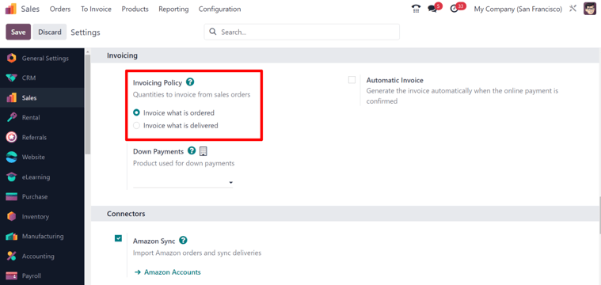
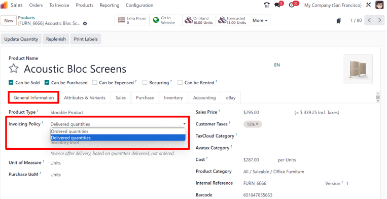
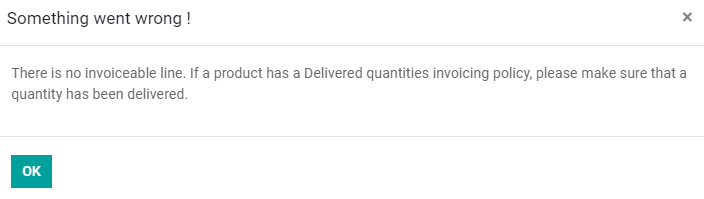
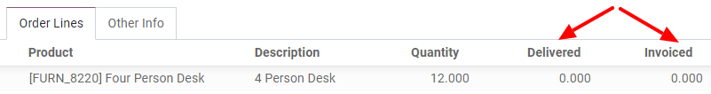

# Yetkazib berilgan yoki buyurtma qilingan miqdor asosida hisob-faktura

Turli biznes siyosatlari har xil hisob-fakturalash variantlarini talab qilishi mumkin:

- **Buyurtma qilingan miqdor asosida hisob-faktura qilish** — bu Odoo *Sales* (Sotuvlar) modulida standart bo‘lib
  keladi. Ya'ni, mijozlar sotuv buyurtmasi tasdiqlangandan so‘ng hisob-faktura qilinadi.
- **Yetkazib berilgan miqdor asosida hisob-faktura qilish** — bu usul mijozlar faqat mahsulot yetkazib berilgach
  hisob-faktura qilinadi. Ushbu usul odatda katta miqdorda materiallar, suyuqliklar yoki oziq-ovqat mahsulotlarini
  sotuvchi korxonalar tomonidan qo‘llaniladi. Bunday holatlarda buyurtma qilingan miqdor va real yetkazib berilgan
  miqdor o‘rtasida ozgina farq bo‘lishi mumkin, shuning uchun real yetkazib berilgan miqdorga asoslangan hisob-faktura
  afzal bo‘ladi.

Turli hisob-fakturalash variantlariga ega bo‘lish biznes uchun ko‘proq moslashuvchanlikni ta’minlaydi.

## Hisob-fakturalash siyosati funksiyalari

Zarur hisob-fakturalash siyosatini faollashtirish uchun quyidagi yo‘nalishda harakat qiling:  
`Sotuvlar ilovasi ‣ Sozlamalar ‣ Konfiguratsiya`,  
va `Hisob-fakturalash (Invoicing)` sarlavhasi ostida quyidagi qoidalardan birini tanlang:

- `Buyurtma asosida hisob-faktura qilish (Invoice what is ordered)`
- `Yetkazib berilgan mahsulot asosida hisob-faktura qilish (Invoice what is delivered)`

::: warning

Agar siz `Yetkazib berilgan mahsulot asosida hisob-faktura qilish` qoidasi tanlansa,  
`Avtomatik hisob-faktura (Automatic Invoice)` funksiyasini **yoqib bo‘lmaydi**.  
Bu funksiya onlayn to‘lov tasdiqlanganda avtomatik hisob-faktura yaratadi.
:::

## Mahsulot formasida hisob-fakturalash siyosati

Har qanday mahsulot sahifasida, quyidagicha yo‘l tuting:  
`Sotuvlar ilovasi ‣ Mahsulotlar ‣ Mahsulotlar boshqaruv paneli`,  
shu yerda `Umumiy ma'lumotlar (General Information)` tabi ostida  
`Hisob-fakturalash siyosati (Invoicing Policy)` opsiyasini toping.

Bu maydon orqali siyosatni qo‘lda, ochiluvchi ro‘yxatdan tanlab o‘zgartirish mumkin.

## Savdo jarayoniga ta'siri

Odoo *Sales* ilovasida asosiy savdo jarayoni kotirovka (quotation) yaratishdan boshlanadi.  
Keyin bu kotirovka mijozga yuboriladi. So‘ngra, bu kotirovka tasdiqlanishi kerak  
va tasdiqlangach, savdo buyurtmasiga (sales order) aylanadi.  
Bu esa o‘z navbatida hisob-faktura (invoice) yaratishga olib keladi.

Quyida hisob-fakturalash siyosatining yuqoridagi savdo jarayoniga qanday ta'sir qilishi ko‘rsatilgan:

- `Buyurtma asosida hisob-faktura (Invoice what is ordered)`:
  Asosiy savdo jarayoniga hech qanday ta’sir qilmaydi.  
  Sotuv tasdiqlangandan so‘ng darhol hisob-faktura yaratiladi.

- `Yetkazib berilgan miqdor asosida hisob-faktura (Invoice what is delivered)`:
  Savdo jarayoniga biroz ta’siri bor, chunki yetkazib berilgan miqdor
  savdo buyurtmasida qo‘lda kiritilishi kerak.  
  Yoki, *Ombor (Inventory)* ilovasidan foydalanib,  
  yetkazilgan miqdorni tasdiqlash orqali hisob-faktura yaratish mumkin.

:::: warning

Agar foydalanuvchi yetkazib berilgan miqdorni tasdiqlamasdan hisob-faktura yaratmoqchi bo‘lsa,  
quyidagi xato xabari paydo bo‘ladi:

`Hisoblanadigan bandlar yo‘q. Agar mahsulotda 'Yetkazib berilgan miqdor asosida' siyosati tanlangan bo‘lsa, iltimos, yetkazilgan miqdorni kiritganingizga ishonch hosil qiling.`

::::

::: tip

Kotirovka tasdiqlangandan so‘ng, holati `Kotirovka yuborildi (Quotation sent)`  
dan `Savdo buyurtmasi (Sales order)` ga o‘zgaradi.  
Shundan so‘ng, yetkazilgan va hisoblangan miqdorlarni bevosita  
savdo buyurtmasida ko‘rish mumkin bo‘ladi.  
Bu ikkala hisob-faktura siyosati uchun ham amal qiladi.

Odoo kotirovka tasdiqlangach, hatto qisman yetkazib berilgan bo‘lsa ham,  
hisob-fakturaga `Yetkazilgan (Delivered)` va `Hisoblangan (Invoiced)` miqdorlarni avtomatik tarzda qo‘shadi.
::::

Yakunda, hisob-faktura yaratish uchun bir nechta variantlar mavjud:

- `Oddiy hisob-faktura (Regular invoice)`
- `Oldindan to‘lov — foizda (Down payment - percentage)`
- `Oldindan to‘lov — qat'iy summada (Down payment - fixed amount)`
