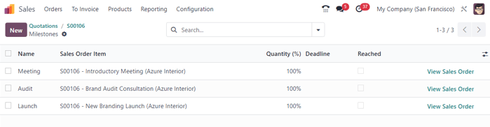

# Loyihadagi bosqichlar (milestones) asosida hisob-faktura yuborish

Loyihadagi bosqichlar (milestones) asosida hisob-faktura yuborish usuli qimmat yoki katta hajmdagi loyihalar uchun
ishlatiladi. Loyiha davomida belgilangan bir nechta bosqichlar — butun loyiha yoki shartnoma yakunlanishiga olib
keladigan aniq ishlar ketma-ketligidan iborat bo‘ladi.

Hisob-faktura yuborishning ushbu usuli kompaniyaga loyiha davomida muntazam ravishda pul oqimini ta'minlaydi. Mijozlar
esa loyiha rivojlanishining har bir bosqichini bevosita kuzatib borishlari, shuningdek, umumiy summani birdan
to‘lamasdan, bosqichma-bosqich to‘lashlari mumkin bo‘ladi.

## Loyihadagi bosqichlar uchun mahsulotlar yaratish

Odoo’da loyiha bosqichlarining har biri alohida mahsulot sifatida qaraladi.

Bunday mahsulotlarni yaratish yoki sozlash uchun quyidagi yo‘nalishga o‘ting:
`Savdo ilovasi ‣ Mahsulotlar ‣ Mahsulotlar`.

Keyin mavjud mahsulotni tanlang yoki `Yangi` tugmasini bosib yangi mahsulot yarating.

Bosqichlar asosida hisob-faktura yuborish imkoniyati faqat ayrim mahsulot turlarida mavjud.

Mahsulot formasi ichida, `Umumiy ma'lumotlar` tabida, `Mahsulot turi` (Product Type) quyidagi variantlardan biriga
o‘rnatilgan bo‘lishi **shart**:

- `Xizmat (Service)`
- `Tadbir uchun chipta (Event Ticket)`
- `Tadbir uchun stend (Event Booth)`
- `Kurs (Course)`

Yuqoridagi `Mahsulot turi` tanlanganidan so‘ng, `Hisob-faktura siyosati` (Invoicing Policy) menyusidan
`Bosqichlar asosida` (`Based on Milestones`) tanlanadi.

Shu maydon ostida `Buyurtma orqali yaratiladi` (`Create on Order`) maydoni mavjud.

Ish jarayonlari silliq bo‘lishi uchun, bu maydonda ham biror variant tanlanishi tavsiya qilinadi.

::: tip

Agar bu maydon `Hech narsa` (`Nothing`) holatida qoldirilsa ham ishga xalal bermaydi. Ammo bu holda loyiha **sotuv
buyurtmasidan qo‘lda** yaratilishi kerak bo‘ladi. Loyiha yaratilgach, undagi bosqichlar va vazifalarni qo‘shish va
sozlash mumkin bo‘ladi.
:::

`Buyurtma orqali yaratiladi` (`Create on Order`) maydonida standart qiymat `Hech narsa` (`Nothing`) bo‘lib, ustiga
bosilganda quyidagi variantlar ochiladi:

- `Vazifa (Task)`: Ushbu mahsulot buyurtma qilinganda, unga tegishli vazifa *Loyihalar* ilovasida yaratiladi.
- `Loyiha va vazifa (Project & Task)`: Ushbu mahsulot buyurtma qilinganda, unga tegishli loyiha **va** vazifa
  *Loyihalar* ilovasida yaratiladi.
- `Loyiha (Project)`: Ushbu mahsulot buyurtma qilinganda, unga tegishli loyiha *Loyihalar* ilovasida yaratiladi.

Agar `Vazifa (Task)` tanlansa, yangi `Loyiha` (`Project`) maydoni paydo bo‘ladi. Bu yerda ushbu yaratiladigan vazifa
qaysi mavjud loyihaga biriktirilishini tanlash mumkin.

Agar `Loyiha va vazifa (Project & Task)` yoki faqat `Loyiha (Project)` tanlansa, ikki yangi maydon paydo bo‘ladi:

- `Loyiha shabloni (Project Template)`
- `Ishchi makon shabloni (Workspace Template)`

- `Loyiha shabloni` maydonida, mahsulot buyurtma qilinganda avtomatik yaratiladigan loyiha uchun ishlatiladigan shablon
  tanlanadi.
- `Ishchi makon shabloni` esa *Hujjatlar (Documents)* ilovasida avtomatik yaratiladigan ishchi maydon uchun shablon
  tanlash imkonini beradi (bu *Loyihalar* ilovasiga emas, balki *Hujjatlar* ilovasiga tegishli).

::: tip

Tartib-intizomni saqlash uchun mahsulot formasining `Savdo` (`Sales`) tabiga o‘ting va `Savdo tavsifi` (
`Sales Description`) maydoniga maxsus **bosqich nomini** yoki izohini yozing. Bu ma’lumot sotuv buyurtmasining
`Buyurtma elementlari` (`Order Lines`) tabidagi `Tavsif` (`Description`) ustunida ko‘rinadi.

Yoki istasangiz, to‘g‘ridan-to‘g‘ri `Buyurtma elementlari` ichidagi `Tavsif` ustunini o‘zgartirishingiz ham mumkin.

Bu majburiy emas.
:::

## Bosqichlar bo‘yicha hisob-faktura qilish

::: tip

Quyidagi jarayonda uchta bosqichli mahsulot mavjud bo‘lib, ularning:

- `Mahsulot turi (Product Type)` — `Xizmat (Service)` deb belgilangan;
- `Buyurtma orqali yaratiladi (Create on Order)` — `Vazifa (Task)` deb belgilangandir.

Bu vazifalar oldindan mavjud bo‘lgan `Loyiha`ga biriktirilgan bo‘lib, bizning holatda bu loyiha `Rebrending loyihalari`
deb nomlangan.
::::

Bosqichlar bo‘yicha hisob-faktura qilish uchun, avvalo bosqich mahsulotlarini o‘z ichiga olgan **sotuv buyurtmasi**
yaratiladi.

Buning uchun `Savdo` ilovasiga o‘ting → `Yangi`. Natijada bo‘sh taklifnoma formasi ochiladi.

Bu formaga `Mijoz` qo‘shing. So‘ng `Buyurtma elementlari (Order Lines)` tabida `Mahsulot qo‘shish (Add a product)`
tugmasini bosing va bosqich mahsulotlarini qo‘shing.

Tegishli mahsulotlar qo‘shilgandan so‘ng, `Tasdiqlash (Confirm)` tugmasini bosing. Bu taklifnomani **sotuv buyurtmasiga
** aylantiradi.

Buyurtma tasdiqlangandan so‘ng, mahsulot formadagi `Buyurtma orqali yaratiladi` (`Create on Order`) maydoniga qarab,
yuqorida yangi `aqlli tugmalar (smart buttons)` paydo bo‘ladi.

Bu tugmalardan `Bosqichlar (Milestones)` tugmasini bosing. Natijada bo‘sh `Bosqichlar` sahifasi ochiladi. Bu yerda
`Yangi (New)` tugmasini bosib, bosqichlarni qo‘shing.

Har bir bosqich uchun quyidagilarni belgilang:

- `Nomi (Name)` — bosqich nomi;
- `Sotuv buyurtma elementi (Sales Order Item)` — ushbu bosqich tegishli bo‘lgan mahsulot;
- `Tugash sanasi (Deadline)` — ixtiyoriy maydon, bosqichning bajarilishi kerak bo‘lgan muddat.

Bu jarayonni barcha bosqich mahsulotlari uchun takrorlang.

So‘ng, sahifaning yuqori qismidagi `breadcrumbs` orqali sotuv buyurtmasiga qayting. Buyurtmadan `Vazifalar (Tasks)`
aqlli tugmasini bosing. Bu orqali har bir bosqich mahsuloti uchun yaratilgan vazifalarni ko‘rish mumkin bo‘lgan
`Vazifalar` sahifasi ochiladi.

Har bir vazifaga tegishli bosqichni qo‘lda biriktirish uchun, kerakli vazifani bosing. Bu orqali vazifa formasi
ochiladi. Shu formadagi `Bosqich (Milestone)` maydonida ushbu vazifaga tegishli bo‘lgan bosqichni tanlang.

Bu amalni barcha bosqich vazifalari uchun takrorlang.

Vazifalar to‘g‘ri sozlangach, xodimlar o‘zlarining ish jarayonlarini va tegishli izohlarini vazifa ichida qayd etishadi.

Vazifa yakunlanganda, bu bosqich bajarilganini anglatadi. Shu nuqtada, bosqich bo‘yicha hisob-faktura qilish vaqti
keladi.

Bosqich bo‘yicha hisob-faktura qilish uchun, avvalo sotuv buyurtmasiga qayting — bu breadcrumb linklari orqali yoki
`Savdo (Sales)` ilovasi → `Buyurtmalar (Orders)` → `Buyurtmalar (Orders)` bo‘limidan tegishli buyurtmani tanlash orqali
amalga oshiriladi.

Sotuv buyurtmasi formasida, `Bosqichlar (Milestones)` aqlli tugmasini bosing va tegishli vazifa uchun
`Erishilgan (Reached)` ustunidagi katakchani belgilang.

Keyin, sotuv buyurtmasiga qayting — bu `Bosqichlar` sahifasidagi `Sotuv buyurtmasini ko‘rish (View Sales Order)`
tugmasini bosish yoki yuqoridagi `breadcrumbs` havolalari orqali amalga oshiriladi.

Sotuv buyurtmasida, erishilgan bosqichga tegishli mahsulot qatorining `Yetkazilgan (Delivered)` ustuni to‘ldirilgan
holatda ko‘rinadi. Buning sababi — bosqich bajarilgan, ya'ni mahsulot yetkazilgan deb hisoblanadi.

Chap yuqoridagi `Hisob-faktura yaratish (Create Invoice)` tugmasini bosing. Bu orqali
`Hisob-faktura yaratish (Create Invoices)` oynasi ochiladi.

Ochilgan `Create invoices` oynasida `Create Invoice` maydonini standart holatda (`Regular Invoice`) qoldiring va
`Create Draft Invoice` tugmasini bosing.

`Create Draft Invoice` tugmasi bosilgach, Odoo `Mijoz hisob-fakturasi (Customer Invoice Draft)` sahifasini ochadi. Unda
faqatgina bajarilgan bosqich mahsuloti `Hisob-faktura qatorlari (Invoice Lines)` bo‘limida ko‘rsatiladi.

Ushbu hisob-faktura sahifasida `Tasdiqlash (Confirm)` tugmasini bosib hisob-fakturani tasdiqlang. Mijoz bosqich uchun
to‘lovni amalga oshirgach, `To‘lovni ro‘yxatga olish (Register Payment)` tugmasini bosing.

`Register Payment` tugmasi bosilganda, `To‘lovni ro‘yxatga olish` uchun pop-up oyna ochiladi.

Ushbu pop-up oynada avtomatik to‘ldirilgan maydonlar to‘g‘riligini tekshiring, so‘ng
`To‘lovni yaratish (Create Payment)` tugmasini bosing.

Ushbu tugma bosilgach, pop-up oyna yopiladi va Odoo sizni bosqich uchun chiqarilgan hisob-fakturaga qaytaradi. Endi
hisob-faktura sahifasining yuqori o‘ng burchagida yashil `To‘lanmoqda (In Payment)` banneri paydo bo‘lganini ko‘rasiz.
Bu banner — hisob-faktura to‘langanini bildiradi.

Keyin, yuqoridagi `breadcrumbs` havolalari orqali sotuv buyurtmasiga qayting. Sotuv buyurtmasida,
`Buyurtma qatorlari (Order Lines)` bo‘limida, hisob-fakturasi chiqarilgan va to‘lab bo‘lingan bosqich mahsulotining
`Hisob-fakturasi chiqarildi (Invoiced)` ustuni to‘ldirilgan bo‘ladi.

Shuningdek, sotuv buyurtmasi sahifasining yuqorisida yangi `Hisob-fakturalar (Invoices)` aqlli tugmasi (smart button)
paydo bo‘ladi. Ushbu tugmani bosish orqali mazkur sotuv buyurtmasiga bog‘langan barcha hisob-fakturalarni ko‘rish
mumkin.

Har bir bosqich ustida ish olib borilgan sayin, va u yakunlanganidan so‘ng yuqoridagi jarayonni takrorlang.

Ushbu jarayonni butun loyiha yakunlangunga qadar davom ettiring — ya’ni barcha bosqichlar hisob-fakturalangan va umumiy
buyurtma to‘liq to‘lab bo‘lingan bo‘ladi.
