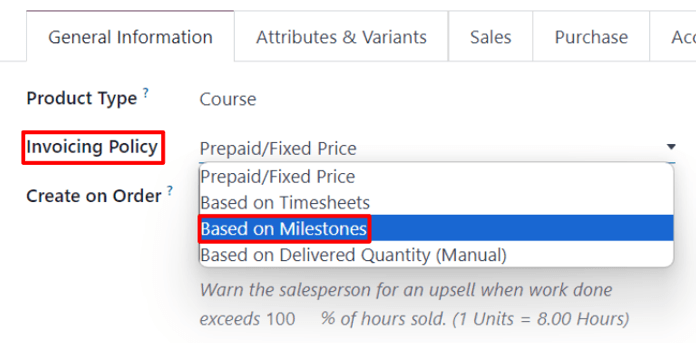
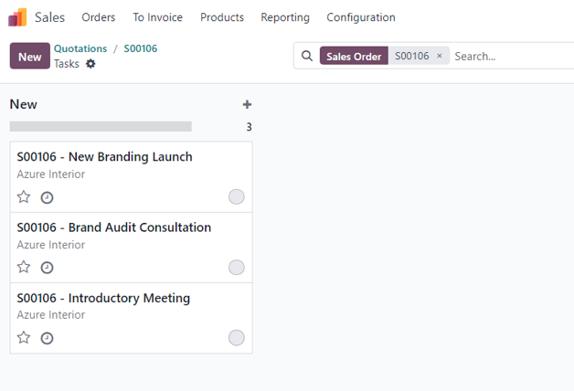
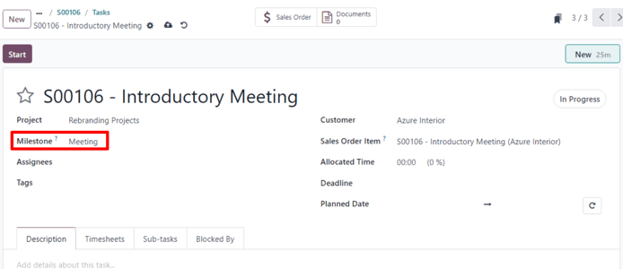
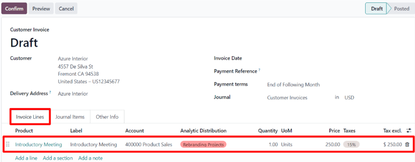

# Loyiha bosqichlariga hisob-faktura berish

Loyiha bosqichlariga asoslangan hisob-faktura berish qimmat yoki keng ko'lamli loyihalar uchun ishlatilishi mumkin. Loyihadagi bosqichlar ketma-ketligi loyiha va/yoki shartnomaning yakunlanishiga olib keladigan aniq ish ketma-ketligini ifodalaydi.

Hisob-faktura berishning bu usuli kompaniyaga loyiha davomida barqaror pul oqimi ta'minlaydi. Mijozlar loyiha rivojlanishining har bir bosqichini yaqindan kuzatib borishlari mumkin, shuningdek, katta hisobni bir vaqtning o'zida emas, balki bir necha bo'lib to'lashlari mumkin.

## Bosqich mahsulotlarini yaratish

Odoo dasturida loyihaning har bir bosqichi alohida mahsulot sifatida qaraladi.

Bunday ishlash uchun mahsulotlarni yaratish va/yoki sozlash uchun avval `Sales app ‣ Products ‣ Products` bo'limiga o'ting. Keyin mahsulotni bosing yoki `New` tugmasini bosib yangisini yarating.

Bosqichlarga asoslangan hisob-faktura berish variantlari faqat ma'lum mahsulot turlari uchun mavjud.

Mahsulot formasida, `General Information` yorlig'i ostida, `Product Type` maydoni quyidagi variantlardan birida *bo'lishi kerak*: `Service`, `Event Ticket`, `Event Booth` yoki `Course`.

Ushbu `Product Type` variantlaridan birini tanlab, `Invoicing Policy` ochiladigan menyusidan `Based on Milestones` ni tanlang.

Uning ostida `Create on Order` maydoni bor.

Ish jarayonlarining iloji boricha muammosiz bo'lishini ta'minlash uchun `Create on Order` maydonida variant tanlash tavsiya etiladi.

::: tip

Uni standart `Nothing` variantida qoldirish kerakli ish jarayoniga salbiy ta'sir qilmaydi. Biroq, loyiha o'sha maxsus mahsulot bilan sotuv buyurtmasi formasidan bevosita yaratilishi *kerak*. Loyiha yaratilgandan *so'ng* bosqichlar va vazifalarni yaratish va sozlash mumkin.
::::

`Create on Order` standart varianti `Nothing` bosilganida ochiladigan menyu quyidagi variantlar bilan ko'rinadi:

- `Task`: Bu maxsus mahsulot buyurtma qilinganida Odoo *Projects* dasturida ushbu bosqich mahsuloti bilan bog'liq vazifa yaratadi.
- `Project & Task`: Bu maxsus mahsulot buyurtma qilinganida Odoo *Projects* dasturida ushbu bosqich mahsuloti bilan bog'liq loyiha va vazifa yaratadi.
- `Project`: Bu maxsus mahsulot buyurtma qilinganida Odoo *Projects* dasturida ushbu bosqich mahsuloti bilan bog'liq loyiha yaratadi.

`Task` tanlanganda `Project` maydoni paydo bo'ladi. Bu maydon orqali yaratilgan vazifa *Projects* dasturidagi qaysi mavjud loyihaga ulanishi kerakligini tanlang.

`Project & Task` yoki `Project` tanlanganda ikkita yangi maydon paydo bo'ladi: `Project Template` va `Workspace Template`.

`Project Template` maydoni bu maxsus mahsulot buyurtma qilinganida yaratilishi kerak bo'lgan loyiha uchun foydalaniladigan andoza variantlarini taqdim etadi.

`Workspace Template` maydoni bu maxsus mahsulot buyurtma qilinganida loyiha uchun avtomatik yaratilishi kerak bo'lgan ish maydoni (*Documents* dasturi uchun, *Projects* dasturi uchun emas) uchun andoza variantlarini taqdim etadi.

::: tip

Tashkiliy maqsadlar uchun mahsulot formasidagi `Sales` yorlig'ini bosing va `Sales Description` maydoniga maxsus 'Bosqich' bilan bog'liq tavsifni kiriting. Bu ma'lumot sotuv buyurtmasining `Order Lines` yorlig'idagi `Description` ustunida ko'rinadi.

Yoki sotuv buyurtmasining `Order Lines` yorlig'idagi `Description` maydonini to'g'ridan-to'g'ri tahrirlang/o'zgartiring.

Bu *majburiy* emas.
::::

## Bosqichlarga hisob-faktura berish

::: tip

Quyidagi jarayon `Product Type` sifatida `Service` o'rnatilgan va `Create on Order` maydonida `Task` o'rnatilgan uchta bosqich mahsulotini o'z ichiga oladi.

Keyin bu vazifalar oldindan mavjud `Project`ga biriktiriladi, bu holda u `Rebranding Projects` deb nomlanadi.
::::

Bosqichlarga hisob-faktura berish uchun bosqich mahsulot(lar)i bilan sotuv buyurtmasi yarating. Buning uchun `Sales app ‣ New` ga o'ting. Bunda bo'sh taklifnoma formasi ochiladi.

Ushbu taklifnoma formasidan `Customer` qo'shing. Keyin `Order Lines` yorlig'ida `Add a product` ni bosing. So'ngra bosqich mahsulot(lar)ini `Order Lines` yorlig'iga qo'shing.

Tegishli bosqich mahsulot(lar)i qo'shilgandan so'ng buyurtmani tasdiqlash uchun `Confirm` ni bosing, bu taklifnomani sotuv buyurtmasiga aylantiradi.

Buyurtma tasdiqlanganida mahsulot formasidagi `Create on Order` maydonida tanlanganlarga asosan sotuv buyurtmasining yuqori qismida yangi aqlli tugmalar paydo bo'ladi.

Sotuv buyurtmasidan `Milestones` aqlli tugmasini bosing. Bunda bo'sh `Milestones` sahifasi ochiladi. Bosqichlar qo'shish uchun `New` ni bosing.

Bosqich uchun `Name` kiriting. Keyin uni tegishli `Sales Order Item`ga qo'llang. Nihoyat, agar kerak bo'lsa, bosqichga `Deadline` belgilang.

Ushbu jarayonni barcha bosqich sotuv buyurtmasi elementlari uchun takrorlang.

Keyin sotuv buyurtmasiga orqaga qaytish havolalari orqali qayting. Sotuv buyurtmasidan `Tasks` aqlli tugmasini bosing. Bunda `Create on Order` maydonida ushbu variant belgilangan har bir sotuv buyurtmasi elementi uchun vazifa bilan `Tasks` sahifasi ochiladi.

Sozlangan bosqichni vazifaga qo'lda tayinlash uchun kerakli vazifani bosing, bu vazifa formasini ochadi. Vazifa formasida `Milestone` maydonida bu vazifa qaysi bosqichga ulanishi kerakligini tanlang.

Ushbu jarayonni barcha bosqich vazifalari uchun takrorlang.

Ushbu vazifalar to'g'ri sozlangandan so'ng xodimlar vazifa ustida ishlayotganda o'z rivojlanishlarini qayd qiladilar va vazifaga bog'liq izohlar qo'shadilar.

Keyin, bu vazifa tugaganda, bu bosqichga erishilganligini anglatadi. Shu paytda ushbu bosqichga hisob-faktura berish vaqti keladi.

Bosqichga hisob-faktura berish uchun avval orqaga qaytish havolalari orqali yoki `Sales app ‣ Orders ‣ Orders` ga o'tib tegishli sotuv buyurtmasini tanlab sotuv buyurtmasiga qayting.

Sotuv buyurtmasi formasiga qaytib, `Milestones` aqlli tugmasini bosing va o'sha vazifa uchun `Reached` ustunidagi katakchani belgilang.

Keyin sotuv buyurtmasiga qayting --- `Milestones` sahifasida `View Sales Order` ni bosib yoki orqaga qaytish havolalari orqali.

Sotuv buyurtmasiga qaytib, erishilgan bosqichning qator elementi `Delivered` ustuni to'ldirilgan. Buning sababi bosqichga erishilgan va shuning uchun yetkazib berilgan.

Yuqori chap burchakdagi `Create Invoice` ni bosing. Bunda `Create invoices` oynasi ochiladi.

`Create invoices` oynasida `Create Invoice` variantini standart `Regular Invoice` tanlovida qoldiring va `Create Draft Invoice` tugmasini bosing.

`Create Draft Invoice` bosilgandan so'ng Odoo `Customer Invoice Draft` ni ko'rsatadi, faqat `Invoice Lines` yorlig'ida erishilgan bosqichni ko'rsatadi.

Ushbu hisob-faktura sahifasidan hisob-fakturani tasdiqlash uchun `Confirm` tugmasini bosing. Keyin mijoz ushbu bosqich uchun to'lov qilganida `Register Payment` ni bosing.

`Register Payment` bosilganda `Register Payment` oynasi paydo bo'ladi.

Ushbu oynada avtomatik to'ldirilgan maydonlarning to'g'riligini tasdiqlang, keyin `Create Payment` ni bosing.

Bosilganda oyna yo'qoladi va Odoo o'sha bosqich uchun hisob-fakturaga qaytadi, endi yuqori o'ng burchakda yashil `In Payment` banneri bor. Bu banner hisob-faktura to'langanligini bildiradi.

Keyin orqaga qaytish havolalari orqali sotuv buyurtmasiga qayting. Sotuv buyurtmasiga qaytib, `Order Lines` yorlig'ida hisob-faktura qilingan va to'langan erishilgan bosqich endi `Invoiced` ustuni to'ldirilgan.

Sotuv buyurtmasining yuqori qismida yangi `Invoices` aqlli tugmasi ham bor. Uni bosish ushbu sotuv buyurtmasiga ulangan barcha hisob-fakturalarni ko'rsatadi.

Har bir bosqich ustida ishlanayotganda va keyinchalik yakunlanayotganda yuqoridagi jarayonni oddiy takrorlang.

Butun loyiha yakunlanguncha, har bir bosqichga hisob-faktura berilguncha va butun buyurtma to'liq to'languncha ushbu jarayonni davom ettiring.