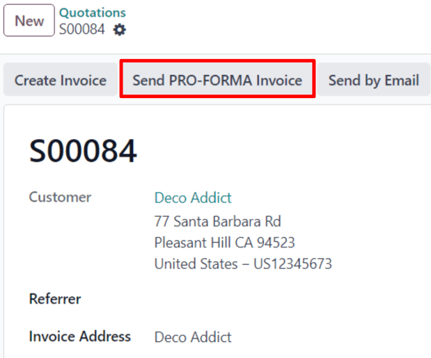

# Pro-forma hisob-fakturalar

*Pro-forma hisob-faktura* - bu tovarlar yetkazib berilishidan oldin yuborilgan qisqartirilgan yoki taxminiy hisob-faktura. Unda tovarlarning turi va miqdori, ularning qiymati va boshqa muhim ma'lumotlar, masalan, og'irligi va transport to'lovlari ko'rsatiladi.

Pro-forma hisob-fakturalar odatda taklifnoma bilan birga dastlabki hisob-faktura sifatida ishlatiladi. Ular, shuningdek, bojxona maqsadlari uchun import qilishda ham ishlatiladi. Ular oddiy hisob-fakturadan farq qiladi, chunki ular to'lov talabi (yoki so'rovi) *emas*.

## Sozlash

Pro-forma hisob-fakturalardan foydalanish uchun *Pro-Forma Invoice* funksiyasi **albatta** faollashtirilishi kerak.

Bu funksiyani yoqish uchun `Sales app ‣ Configuration ‣ Settings` ga o'ting va `Quotations & Orders` bo'limida `Pro-Forma Invoice` yonidagi katakchani belgilang. Keyin barcha o'zgarishlarni saqlash uchun `Save` ni bosing.

## Pro-forma hisob-faktura yuborish

`Pro-Forma Invoice` funksiyasi faollashtirilgan holda, pro-forma hisob-faktura yuborish imkoniyati endi `Send Pro-Forma Invoice` tugmasi orqali har qanday taklifnoma yoki sotuv buyurtmasida mavjud.

::: tip

Agar oldindan to'lov uchun hisob-faktura allaqachon yuborilgan bo'lsa yoki takrorlanuvchi obuna uchun bo'lsa, sotuv buyurtmasi yoki taklifnoma uchun pro-forma hisob-faktura yuborish **mumkin emas**.

Ikkala holatda ham `Send Pro-Froma Invoice` tugmasi **ko'rinmaydi**.

Biroq, xizmatlar, tadbir ro'yxatdan o'tkazishlari, kurslar va/yoki yangi obunalar uchun pro-forma hisob-fakturalar **yuborilishi mumkin**. Pro-forma hisob-fakturalar faqat jismoniy, iste'mol qilinadigan yoki saqlanadigan tovarlarga cheklanmaydi.
::::

`Send Pro-Forma Invoice` tugmasi bosilganida elektron pochta yuborilishi mumkin bo'lgan oyna paydo bo'ladi.

Oynada `Recipients` maydoni sotuv buyurtmasi yoki taklifnomadagi mijoz bilan avtomatik to'ldiriladi. `Subject` maydoni va elektron pochta matni kerak bo'lsa o'zgartirilishi mumkin.

Pro-forma hisob-faktura avtomatik ravishda elektron pochtaga ilova sifatida qo'shiladi.

Tayyor bo'lganda `Send` ni bosing va Odoo ilova qilingan pro-forma hisob-faktura bilan elektron pochtani mijozga darhol yuboradi.

::: tip

Pro-forma hisob-faktura qanday ko'rinishini oldindan ko'rish uchun `Send` ni bosishdan *oldin* elektron pochta oynasining pastki qismidagi PDF ni bosing. Bosilganda pro-forma hisob-faktura darhol yuklab olinadi. Pro-forma hisob-fakturani ko'rish (va ko'rib chiqish) uchun PDF ni oching.

::::
