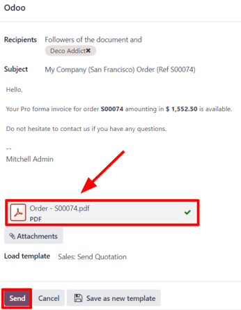

# Pro-forma hisob-fakturalar

**Pro-forma hisob-faktura** — bu tovar yetkazib berilishidan oldin yuboriladigan qisqacha yoki taxminiy hisob-faktura
hisoblanadi. Unda tovarlarning turi va miqdori, ularning qiymati hamda boshqa muhim ma’lumotlar, masalan, og‘irligi va
tashish xarajatlari ko‘rsatiladi.

---

Pro-forma hisob-fakturalar odatda kotirovka (taklif) bilan birga dastlabki hisob-faktura sifatida ishlatiladi.
Shuningdek, ularni import jarayonlarida bojxona maqsadida ham ishlatishadi.

Pro-forma hisob-faktura odatiy hisob-fakturadan farq qiladi, chunki **unda to‘lov so‘ralmaydi yoki talab qilinmaydi** —
bu faqat axborot uchun beriladi.

## Sozlamalar

Pro-forma hisob-fakturalardan foydalanish uchun **Pro-forma hisob-faktura** funksiyasi yoqilgan bo‘lishi **shart**.

Ushbu funksiyani yoqish uchun quyidagi amallarni bajaring:

`Savdo (Sales)` ilovasiga kiring → `Sozlamalar (Configuration)` → `Sozlamalar (Settings)` bo‘limiga o‘ting.  
So‘ng, `Kotirovkalar va Buyurtmalar (Quotations & Orders)` bo‘limida  
`Pro-forma hisob-faktura (Pro-Forma Invoice)` yonidagi katakchani belgilab qo‘ying.

Shundan so‘ng, pastdagi `Saqlash (Save)` tugmasini bosing.

## Pro-forma hisob-fakturani yuborish

`Pro-forma hisob-faktura` funksiyasi yoqilganidan so‘ng, har qanday kotirovka yoki savdo buyurtmasidan pro-forma
hisob-fakturani yuborish imkoni paydo bo‘ladi. Buning uchun
`Pro-forma hisob-fakturani yuborish (Send Pro-Forma Invoice)` tugmasidan foydalaniladi.

::: tip

Agar oldindan to‘lov (down payment) uchun hisob-faktura yuborilgan bo‘lsa yoki buyurtma obuna (subscription) asosida
bo‘lsa,  
**pro-forma hisob-fakturani yuborish mumkin emas**. Bu holatda `Send Pro-Forma Invoice` tugmasi ko‘rinmaydi.

Biroq xizmatlar, tadbirga ro‘yxatdan o‘tishlar, kurslar yoki yangi obunalar uchun pro-forma hisob-fakturani yuborish
mumkin.  
Pro-forma hisob-fakturalar faqat jismoniy mahsulotlar (iste’mol qilinadigan yoki saqlanadigan) bilan cheklanmaydi.
:::

`Send Pro-Forma Invoice` tugmasi bosilganda, email yuborish oynasi ochiladi.

Ochilgan pop-up oynada:

- `Qabul qiluvchi (Recipients)` maydoni avtomatik ravishda kotirovka yoki savdo buyurtmasidagi mijoz ma’lumotlari bilan
  to‘ldiriladi.
- `Mavzu (Subject)` maydoni va xat matnini kerak bo‘lsa, o‘zgartirish mumkin.

Pro-forma hisob-faktura avtomatik ravishda xatga ilova sifatida biriktiriladi.

Barchasi tayyor bo‘lgach, `Yuborish (Send)` tugmasini bosing. Odoo mijozga xatni pro-forma hisob-faktura bilan birga
yuboradi.

::: tip

Pro-forma hisob-fakturaning qanday ko‘rinishini oldindan ko‘rish uchun, email oynasining pastidagi PDF faylga bosish
kifoya.  
Bu PDF fayl darhol yuklanadi. Faylni oching va ko‘rib chiqing.

:::

