# Vaqt va materiallar asosida hisob-faktura chiqarish

Vaqt va/yoki materiallar asosida hisob-faktura chiqarish odatda loyihaning hajmini aniq baholab bo'lmaydigan holatlarda
yoki loyiha talablari o'zgarishi mumkin bo'lgan holatlarda qo'llaniladi.

Bu usul **belgilangan narxli shartnoma (fixed-price contract)** dan farq qiladi. Belgilangan narxli shartnomada mijoz
oldindan aniq belgilangan umumiy summani to'lashga rozi bo'ladi — xodimlar, subpudratchilar, yetkazib beruvchilar, va
boshqa xarajatlar qancha bo'lishidan qat'i nazar.

Odoo **Sales** ilovasi yordamida vaqt, xizmat safari, turar joy xarajatlari kabi turli xarajatlar uchun va buyurtmani
bajarish uchun kerakli xaridlar bo'yicha hisob-faktura chiqarish mumkin.

## Ilova va sozlamalarni konfiguratsiya qilish

Loyiha jarayonini to'g'ri nazorat qilish va kuzatib borish uchun Odoo'da **Project** (Loyihalar) va **Accounting** (
Buxgalteriya hisobi) ilovalari o'rnatilgan bo'lishi **shart**.

### Project ilovasini o'rnatish

1. ``Odoo bosh sahifasi ‣ Ilovalar (Apps)`` bo'limiga o'ting.
2. ``Ilovalar`` sahifasida ``Project`` ilovasini toping va ``Aktivlashtirish (Activate)`` tugmasini bosing.
3. Sahifa avtomatik ravishda yangilanadi va sizni Odoo bosh sahifasiga qaytaradi. Endi *Project* ilovasi menyuda mavjud
   bo'ladi.

### Accounting ilovasini o'rnatish

Xuddi shu usul bilan *Accounting* ilovasini ham o'rnating.

### Analitik hisobni yoqish

1. Bosh sahifadan ``Accounting`` ilovasi ikonkasini bosing.
2. ``Configuration ‣ Settings`` ga o'ting.
3. ``Settings`` sahifasida ``Analytics`` bo'limini toping va ``Analytic Accounting`` belgisini yoqing.

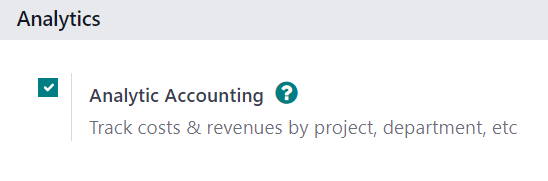

4. ``Save`` tugmasini bosib o'zgarishlarni saqlang.

### Timesheets funksiyasini yoqish

1. ``Odoo bosh sahifasi ‣ Project ilovasi ‣ Configuration ‣ Settings`` ga o'ting.
2. ``Time Management`` bo'limida ``Timesheets`` funksiyasini yoqing.

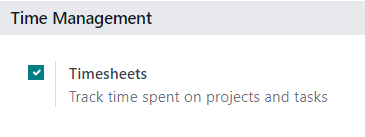

3. ``Save`` tugmasini bosib o'zgarishlarni saqlang.

## Xizmat mahsulotini sozlash

*Project* ilovasida *Timesheets* funksiyasi yoqilganidan so'ng, loyiha ustida sarflangan vaqt uchun hisob-faktura
chiqarish imkoniyati mavjud bo'ladi, lekin **faqat** quyidagi mahsulot sozlamalari to'g'ri o'rnatilgan bo'lsa.

::: warning

Loyihada sarflangan vaqt uchun hisob-faktura chiqarish **faqat** *Mahsulot turi* (Product Type) *Xizmat (Service)* deb
belgilangan mahsulotlar bilan amalga oshiriladi.
::::

### Xizmat mahsulotini sozlash bosqichlari:

1. ``Savdo (Sales) ilovasi ‣ Mahsulotlar (Products) ‣ Mahsulotlar (Products)`` ga o'ting.
2. Kerakli xizmat mahsulotini tanlang yoki ``Yangi (New)`` tugmasini bosib yangi mahsulot yarating.
3. Mahsulot formasi ochilgach, ``Umumiy ma'lumot (General Information)`` tabida ``Mahsulot turi (Product Type)`` maydonini
   ``Xizmat (Service)`` deb belgilang.
4. ``Hisob-faktura siyosati (Invoicing Policy)`` maydonidan ``Timesheets asosida (Based on Timesheets)`` variantini tanlang.
5. ``Buyurtma yaratilganda (Create on Order)`` menyusidan ``Loyiha va vazifa (Project & Task)`` variantini tanlang.

Bu sozlama mahsulot buyurtma qilinishi bilan avtomatik tarzda *Project* ilovasida yangi loyiha va vazifa yaratilishini
bildiradi.

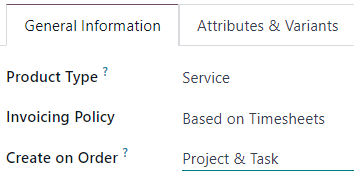

::: tip

Agar faqat ``Vazifa (Task)`` tanlansa, ``Loyiha (Project)`` maydoni paydo bo'ladi. Bu maydon orqali yangi vazifa qaysi
mavjud loyihaga biriktirilishini tanlashingiz mumkin.
::::

## Sarflangan vaqtni savdo buyurtmasiga qo'shish

Xizmat mahsuloti to'g'ri *Hisob-faktura siyosati* (Invoicing Policy) va *Buyurtma bo'yicha yaratish* (Create on Order)
variantlari bilan sozlangandan so'ng, savdo buyurtmasiga sarflangan vaqtni qo'shish mumkin bo'ladi.

### Amalda qanday ishlaydi?

1. ``Savdo (Sales)`` ilovasiga o'ting va ``Yangi (New)`` tugmasini bosing.
2. Bo'sh kotirovka (quotation) formasi ochiladi. Bu yerda ``Mijoz (Customer)`` ni kiriting.
3. ``Buyurtma qatorlari (Order Lines)`` bo'limida ``Mahsulot qo'shish (Add a product)`` tugmasini bosing va ilgari sozlangan
   xizmat mahsulotini tanlang.
4. So'ng ``Tasdiqlash (Confirm)`` tugmasini bosing.

Savdo buyurtmasi tasdiqlangach, forma yuqori qismida ikkita aqlli tugma (smart button) paydo bo'ladi:
``Loyihalar (Projects)`` va ``Vazifalar (Tasks)``.

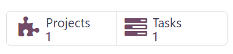

- ``Loyihalar (Projects)`` tugmasi orqali shu buyurtmaga tegishli loyiha sahifasiga o'tasiz.
- ``Vazifalar (Tasks)`` tugmasi orqali shu buyurtmaga bog'langan vazifa sahifasi ochiladi.

Har ikkala sahifaga *Project* ilovasi orqali ham kirish mumkin.

### Vaqt qo'shish

Savdo buyurtmasiga vaqt qo'shish uchun ``Vazifalar (Tasks)`` smart tugmasini bosing.

## Vazifa formasida vaqt qo'shish

Vazifa formasida ``Ish vaqtlari (Timesheets)`` yorlig'ini tanlang. Ushbu bo'limda xodimlar loyihaga biriktiriladi va ular
vazifaga sarflagan vaqtni o'zlari yoki savdo buyurtmasini yaratgan shaxs kiritishi mumkin.

### Xodim va vaqt qo'shish

1. ``Ish vaqtlari (Timesheets)`` yorlig'ida ``Qator qo'shish (Add a line)`` tugmasini bosing.
2. Mos ``Sana (Date)`` va ``Xodim (Employee)`` ni tanlang.
3. ``Tavsif (Description)`` ustuniga ushbu vaqt davomida bajarilgan ish bo'yicha qisqacha izoh yozish mumkin, ammo bu
   majburiy emas.
4. So'ngra, ``Sarflangan soatlar (Hours Spent)`` ustuniga ushbu vazifaga sarflangan vaqtni (soatlarda) yozing.

Kiritish tugagach, boshqa joyni bosing — shu bilan qator yakunlanadi va saqlanadi.

::: tip

``Sarflangan soatlar (Hours Spent)`` ustuniga yozilgan vaqt, avtomatik ravishda vazifa formasining yuqori qismidagi
``Ajratilgan vaqt (Allocated Time)`` maydonida foiz ko'rinishida aks etadi. Bu ko'rsatkich — umumiy ajratilgan ish
soatlarining qanchasi bajarilganini bildiradi.

Shuningdek, ushbu ma'lumotlar ``Sarflangan soatlar (Hours Spent)`` va ``Qolgan soatlar (Remaining Hours)`` maydonlarida
raqamli ko'rinishda ham beriladi — bularni ``Ish vaqtlari (Timesheets)`` yorlig'ining pastki qismida topishingiz mumkin.

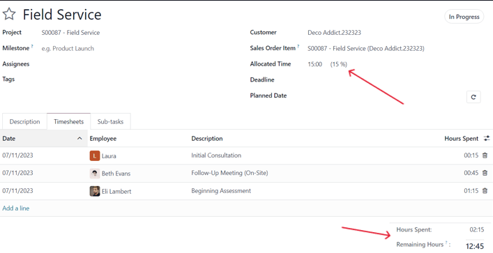
:::

Loyihada ishtirok etayotgan barcha xodimlar va ularning ishlagan soatlari uchun ushbu jarayonni takrorlang.

## Sarflangan vaqt asosida hisob-faktura chiqarish

Loyihaviy vazifaga barcha kerakli xodimlar va ularning ishlagan soatlari qo'shilgach, mijozga ushbu soatlar uchun
hisob-faktura chiqarish uchun savdo buyurtmasiga qayting. Buni quyidagicha amalga oshiring:

- Vazifa formasining yuqori qismida joylashgan ``Savdo buyurtmasi (Sales Order)`` tugmasini bosing, yoki
- Ekranning yuqori chap qismidagi **breadcrumb** (yo'l) havolalari orqali savdo buyurtmasiga qayting.

### Savdo buyurtmasida vaqt ko'rinishi

Savdo buyurtmasi formasida, vazifaga qo'shilgan vaqt ``Buyurtma qatorlari (Order Lines)`` yorlig'idagi
``Yetkazilgan (Delivered)`` ustunida aks etadi. Shuningdek, yuqorida ``Yozilgan soatlar (Recorded Hours)`` nomli yangi *
*aqlli tugma (smart button)** ham paydo bo'ladi.

### Hisob-faktura chiqarish

Mijozga loyiha uchun sarflangan vaqt asosida hisob-faktura chiqarish uchun:

1. ``Hisob-faktura yaratish (Create Invoice)`` tugmasini bosing.
2. Ochilgan ``Hisob-faktura yaratish (Create invoices)`` oynasida ``Oddiy hisob-faktura (Regular invoice)`` opsiyasini
   tanlang.
3. So'ng ``Qoralama hisob-faktura yaratish (Create Draft Invoice)`` tugmasini bosing.

Natijada ``Mijoz hisob-fakturasi qoralamasi (Customer Invoice Draft)`` ochiladi va undagi
``Hisob-faktura qatorlari (Invoice Lines)`` bo'limida bajarilgan barcha ishlar ko'rsatiladi.

::: tip

``Hisob-faktura``dagi ``Tahliliy taqsimot (Analytic Distribution)`` ustuniga e'tibor bering — bu ma'lumotlar boshqa
vaqt/materialga asoslangan hisob-kitoblarni to'g'ri va aniq bajarish uchun muhimdir.

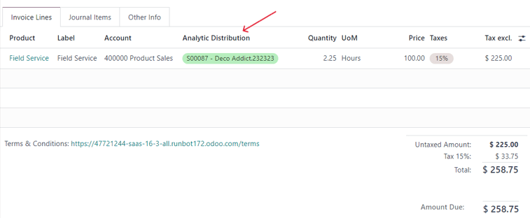
:::

So'ng, ``Tasdiqlash (Confirm)`` tugmasini bosib, hisob-fakturani tasdiqlang va keyingi jarayonlarga o'ting.

## Xarajatlarni sozlash

Savdo buyurtmasiga tegishli xarajatlarni kuzatish va hisob-fakturaga qo'shish uchun, Odoo tizimida *Xarajatlar (
Expenses)* ilovasi **majburiy** o'rnatilishi kerak.

### Xarajatlar ilovasini o'rnatish

1. ``Odoo bosh sahifa ‣ Ilovalar (Apps)`` bo'limiga o'ting.
2. ``Ilovalar (Apps)`` sahifasida ``Expenses`` ilovasini toping.
3. Ilova blokida joylashgan ``Faollashtirish (Activate)`` tugmasini bosing.

Shundan so'ng sahifa avtomatik tarzda yangilanadi va sizni asosiy boshqaruv paneliga qaytaradi. Endi
``Xarajatlar (Expenses)`` ilovasi foydalanishga tayyor bo'ladi.

## Xarajatni savdo buyurtmasiga qo'shish

Savdo buyurtmasiga xarajat qo'shish uchun, avval ``Xarajatlar (Expenses)`` ilovasiga o'ting. Bosh sahifada ``Yangi (New)``
tugmasini bosing — bu sizga yangi xarajat shaklini ochadi.

### Xarajat formasini to'ldirish

1. ``Tavsif (Description)`` maydoniga xarajat nomini kiriting (masalan: ``[Mehmonxona to'lovi]``, ``[Samolyot chiptasi]``).
2. ``Kategoriya (Category)`` maydonidan mos bo'lgan variantni tanlang (masalan: ``Ovqat``, ``Masofa``,
   ``Sayohat va joylashish``).

> 💡 **Maslahat**: Yangi xarajat kategoriyalarini ``Xarajatlar ilovasi ‣ Sozlamalar ‣ Xarajat Kategoriyalari`` orqali
> yaratish va tahrirlash mumkin.

3. ``Umumiy (Total)`` maydoniga umumiy xarajat summasini kiriting.
4. Agar soliqlar mavjud bo'lsa, ``Kiritilgan soliqlar (Included Taxes)`` maydonini ham to'ldiring.
5. ``Xodim (Employee)`` kim ekanligini ko'rsating.
6. ``Kim to'lagan (Paid By)`` maydonida xarajatni ``Xodim (qaytariladi)`` yoki ``Kompaniya`` to'laganini tanlang.

### Xarajatni savdo buyurtmasiga bog'lash

7. ``Mijozga qayta hisoblash (Customer to Reinvoice)`` maydonida xarajat bog'lanadigan savdo buyurtmasini tanlang.
8. Shu savdo buyurtmasini ``Analitik taqsimot (Analytic Distribution)`` maydonida ham tanlang.

> 💡 **Maslahat**: ``Analitik taqsimot`` maydonida savdo buyurtmasi **faqat** quyidagi turdagi xizmat mahsulotlari mavjud
> bo'lsa chiqadi:
> - Ish vaqti asosida hisob-faktura qilinadigan mahsulotlar (Timesheets)
> - Bosqich (Milestone) asosida
> - Yetkazilgan miqdorga asoslangan mahsulotlar

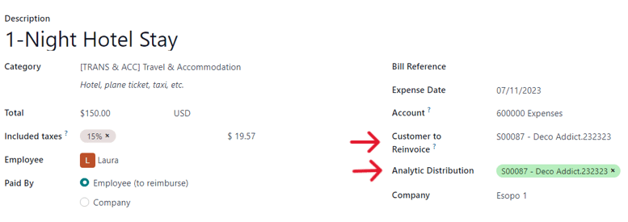

### Cheklar va hisobotingizni yakunlash

Agar xarajatga oid chek yoki hujjatlar mavjud bo'lsa, ``Chekni biriktirish (Attach Receipt)`` tugmasini bosib, fayllarni
yuklang. Bu majburiy emas, lekin xarajatni tasdiqlash jarayoniga ta'sir qilishi mumkin.

Barcha ma'lumotlar to'ldirilgach, ``Hisobot yaratish (Create Report)`` tugmasini bosing. Bu xarajat bo'yicha hisobotni
yaratadi.

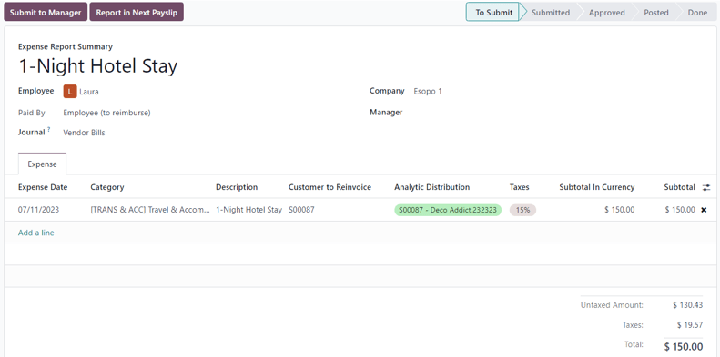

So'ngra ``Rahbar tasdig'iga yuborish (Submit to Manager)`` tugmasi orqali hisobotingizni rahbarga yuboring.

Rahbar quyidagi amallarni bajaradi:

1. ``Tasdiqlash (Approve)`` — xarajatni tasdiqlaydi.
2. ``Buxgalter yozuvlarini qayd etish (Post Journal Entries)`` — buxgalteriya yozuvlariga kiritadi.

Shundan so'ng, ``Keyingi ish haqi hisobotida (Report in Next Payslip)`` yozuvi paydo bo'ladi.

## Xarajatlarni hisob-fakturaga kiritish

Agar savdo buyurtmasiga bog'langan ``xarajat`` bo'lsa, mijozga ushbu xarajat bo'yicha hisob-faktura yuborish mumkin.

Buning uchun ``Savdo (Sales)`` ilovasi yoki ``Xarajatlar (Expenses)`` ilovasidagi hisobot orqali mos savdo buyurtmasini
toping.

Agar xarajat hisobotida savdo buyurtmasi bog'langan bo'lsa, ``Sales Orders`` deb nomlangan smart tugmasi sahifaning yuqori
qismida ko'rinadi — unga bosing.

Xarajat savdo buyurtmasiga to'g'ri bog'langan bo'lsa, u ``Buyurtma satrlari (Order Lines)`` bo'limida alohida qatorda
chiqadi va mijozga hisob-faktura qilish mumkin bo'ladi.

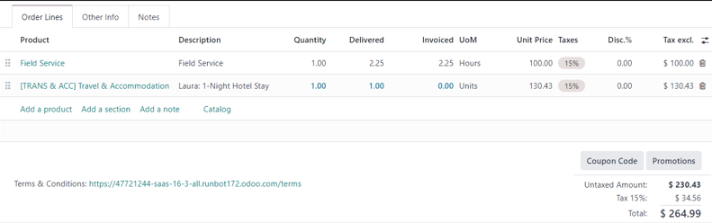

### Xarajat bo'yicha hisob-faktura yaratish

1. ``Hisob-faktura yaratish (Create Invoice)`` tugmasini bosing.
2. Ochilgan ``Hisob-faktura yaratish`` (Create invoices) oynasidan ``Oddiy hisob-faktura (Regular Invoice)`` ni tanlang.
3. ``Qoralama hisob-faktura yaratish (Create Draft Invoice)`` tugmasini bosing.

Shunda yangi ``Mijoz uchun hisob-faktura qoralamasi (Customer Invoice Draft)`` ochiladi, u xarajatga asoslangan bo'ladi.
Endi odatdagi hisob-faktura jarayonini davom ettirishingiz mumkin.

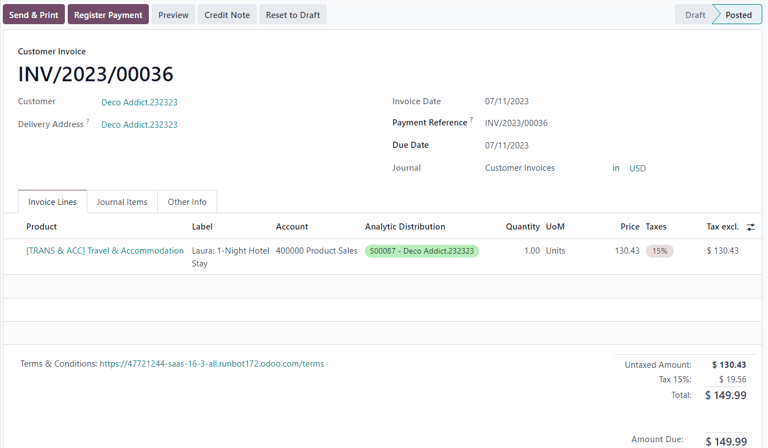

## Xaridlarni sozlash

Agar savdo buyurtmasi asosida amalga oshirilgan xaridlar uchun mijozga hisob-faktura yuborilmoqchi bo'lsa, **Xaridlar (
Purchase)** ilovasini o'rnatish shart.

Xaridlar ilovasini o'rnatish uchun quyidagilarni bajaring:

1. ``Odoo bosh menyusi (Odoo main dashboard)``ga o'ting.
2. ``Ilovalar (Apps)`` bo'limini tanlang.
3. ``Purchase`` nomli ilovani toping.
4. ``Faollashtirish (Activate)`` tugmasini bosing.

Shundan so'ng sahifa avtomatik yangilanadi va bosh menyuda ``Purchase`` ilovasi paydo bo'ladi.

## Xaridni savdo buyurtmasiga qo'shish

Savdo buyurtmasiga xaridni bog'lash uchun avvalo xarid buyurtmasi (purchase order) yaratilishi kerak. Xarid buyurtmasini
yaratish uchun:

1. ``Purchase`` ilovasiga o'ting.
2. ``Yangi (New)`` tugmasini bosing — yangi xarid buyurtmasi shakli ochiladi.

Dastlab ``Yetkazib beruvchi (Vendor)`` maydonini to'ldiring. So'ngra ``Mahsulotlar (Products)`` yorlig'ida ustunlarni
kengaytirish menyusini oching. Bu menyu sarlavhalarning eng o'ng tomonida, ikki gorizontal chiziq va nuqtalar bilan
ko'rsatilgan.

Ochilgan menyudan ``Analitik taqsimot (Analytic Distribution)`` ustunini belgilang.

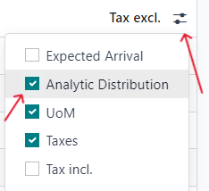

Shundan so'ng ``Mahsulot qo'shish (Add a product)`` tugmasini bosing va kerakli mahsulot(lar)ni tanlang. Bir nechta
mahsulot kiritilishi mumkin.

::: warning

Xarid savdo buyurtmasiga to'g'ri bog'lanishi va hisob-faktura yaratilishi uchun xarid buyurtmasidagi mahsulotda quyidagi
sozlamalar bo'lishi **shart**:

- ``Xarajat qilinishi mumkin (Can be Expensed)`` belgilangan bo'lishi kerak.
- ``Hisob-faktura siyosati (Invoicing Policy)`` — ``Yetkazilgan miqdorlar (Delivered quantities)`` deb tanlangan bo'lishi
  kerak.
- ``Xarajatlarni qayta hisoblash (Re-Invoice Expenses)`` maydonida ``Narxi bo'yicha (At cost)`` tanlangan bo'lishi kerak.

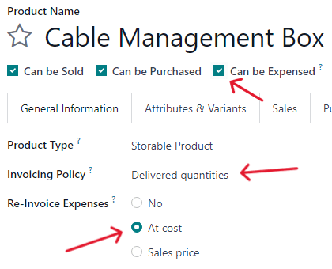
:::

So'ng, xarid buyurtmasi bog'lanadigan savdo buyurtmasiga mos ``Analitik taqsimot (Analytic Distribution)``ni tanlang.
Buning uchun:

1. ``Analitik taqsimot`` ustunidagi bo'sh maydonga bosing.
2. ``Analitika (Analytic)`` pop-up oynasi ochiladi.
3. ``Bo'limlar (Departments)`` ochiladigan menyusidan kerakli savdo buyurtmasiga tegishli bo'lgan analitik bo'limni
   tanlang.

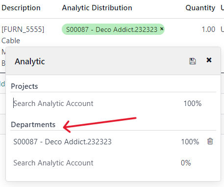

Mahsulotlar yorlig'ida barcha kerakli ma'lumotlar kiritilgach, buyurtmani tasdiqlash uchun
``Buyurtmani tasdiqlash (Confirm Order)`` tugmasini bosing. Mahsulotlar qabul qilingach esa
``Mahsulotlarni qabul qilish (Receive Products)`` tugmasini bosing — bu harakat qabul qilish hujjatini (receipt form)
yaratadi.

::: tip

Agar mahsulotlar uchun seriya yoki partiya raqamlari (serial/lot numbers) kiritilishi kerak bo'lsa, qabul qilish
hujjatida har bir mahsulot qatorining eng o'ngidagi ``Tafsilotlar`` tugmasini (to'rt gorizontal chiziq belgisi) bosing.

Bu orqali ``Batafsil amallar (Detailed Operations)`` yorlig'i ochiladi. Unda:

- ``Partiya/Seriya raqami (Lot/Serial Number)``ni,
- va ``Bajarilgan miqdor (Done)`` ni kiriting.

Tayyor bo'lgach, ``Tasdiqlash (Confirm)`` tugmasini bosing.
:::

Keyin ``Tasdiqlash (Validate)`` tugmasi orqali xarid buyurtmasini yakuniy tasdiqlang.

Keyingi bosqichda sahifaning yuqori qismidagi **breadcrumb** havolalari orqali xarid buyurtmasiga qayting va
``Hisob-faktura yaratish (Create Bill)`` tugmasini bosing. Bu orqali xarid buyurtmasi asosida **yetkazib beruvchidan
olinadigan hisob-faktura** (Vendor Bill) yaratiladi va bu hujjat tegishli savdo buyurtmasi asosida mijozga hisoblanishi
mumkin.

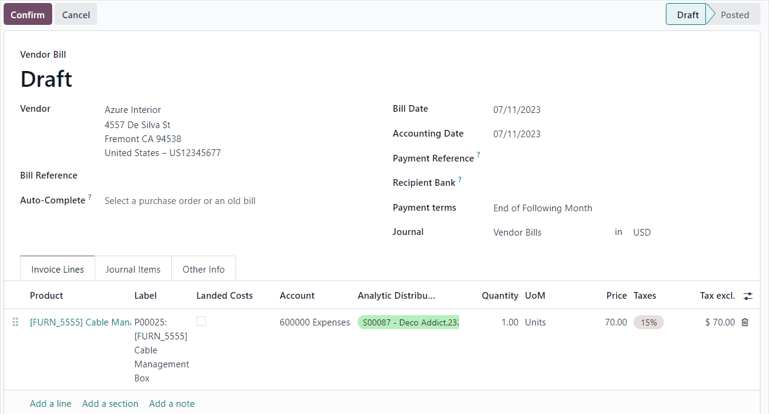

::: tip

Hisob-fakturani tasdiqlashdan oldin, ``Hisob-faktura sanasi (Bill Date)`` maydonini to'ldirishni unutmang.

Agar bu sana kiritilmasa, Odoo sizdan sanani kiritishni talab qiladigan xatolik oynasini ko'rsatadi va tasdiqlash amalga
oshmaydi.
:::

So'ng, ``Tasdiqlash (Confirm)`` tugmasini bosing. Hisob-faktura tasdiqlangach, u avtomatik tarzda **savdo buyurtmasiga
biriktiriladi**. Endi bu xarajatni mijozga hisob-faktura sifatida yuborish mumkin bo'ladi.

## Xarid asosida mijozga hisob-faktura yuborish

Mijozga **xarid asosida** hisob-faktura yuborish uchun avval
``savdo buyurtmasiga xaridni qo'shing``, so'ng ``Savdo`` (Sales) modulida kerakli savdo buyurtmasiga o'ting.

Xarid buyurtmasi bog'langan savdo buyurtmasida, xarid qilingan mahsulot endi ``Buyurtma satrlari (Order Lines)`` bo'limida
alohida qatorda ko'rsatiladi va bu mahsulot hisob-faktura qilishga tayyor bo'ladi.

Mijozga xarid bo'yicha hisob-faktura yuborish uchun, shunchaki ``Hisob-faktura yaratish (Create Invoice)`` tugmasini
bosing, ``Hisob-faktura turi (Create Invoice)`` maydonidan ``Oddiy hisob-faktura (Regular Invoice)``ni tanlang va
``Qoralama hisob-faktura yaratish (Create Draft Invoice)`` tugmasini bosing.

Natijada, yangi qo'shilgan xarid mahsuloti ko'rinadigan ``Mijoz uchun qoralama hisob-faktura (Customer Invoice Draft)``
oynasi paydo bo'ladi.

Hisob-faktura jarayonini yakunlash uchun ``Tasdiqlash (Confirm)`` tugmasini bosing, so'ng
``To'lovni ro'yxatga olish (Register Payment)`` tugmasini bosib, pop-up shaklida chiqadigan
``To'lovni ro'yxatga olish (Register Payment)`` oynasida kerakli ma'lumotlarni tasdiqlang.