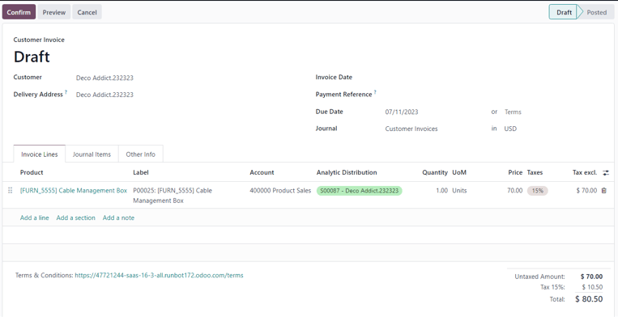

# Vaqt va materiallar asosida hisob-faktura chiqarish

Vaqt va/yoki materiallar asosida hisob-faktura chiqarish odatda loyihaning hajmini aniq baholab bo‘lmaydigan holatlarda
yoki loyiha talablari o‘zgarishi mumkin bo‘lgan holatlarda qo‘llaniladi.

Bu usul **belgilangan narxli shartnoma (fixed-price contract)** dan farq qiladi. Belgilangan narxli shartnomada mijoz
oldindan aniq belgilangan umumiy summani to‘lashga rozi bo‘ladi — xodimlar, subpudratchilar, yetkazib beruvchilar, va
boshqa xarajatlar qancha bo‘lishidan qat'i nazar.

Odoo **Sales** ilovasi yordamida vaqt, xizmat safari, turar joy xarajatlari kabi turli xarajatlar uchun va buyurtmani
bajarish uchun kerakli xaridlar bo‘yicha hisob-faktura chiqarish mumkin.

## Ilova va sozlamalarni konfiguratsiya qilish

Loyiha jarayonini to‘g‘ri nazorat qilish va kuzatib borish uchun Odoo’da **Project** (Loyihalar) va **Accounting** (
Buxgalteriya hisobi) ilovalari o‘rnatilgan bo‘lishi **shart**.

### Project ilovasini o‘rnatish

1. `Odoo bosh sahifasi ‣ Ilovalar (Apps)` bo‘limiga o‘ting.
2. `Ilovalar` sahifasida `Project` ilovasini toping va `Aktivlashtirish (Activate)` tugmasini bosing.
3. Sahifa avtomatik ravishda yangilanadi va sizni Odoo bosh sahifasiga qaytaradi. Endi *Project* ilovasi menyuda mavjud
   bo‘ladi.

### Accounting ilovasini o‘rnatish

Xuddi shu usul bilan *Accounting* ilovasini ham o‘rnating.

### Analitik hisobni yoqish

1. Bosh sahifadan `Accounting` ilovasi ikonkasini bosing.
2. `Configuration ‣ Settings` ga o‘ting.
3. `Settings` sahifasida `Analytics` bo‘limini toping va `Analytic Accounting` belgisini yoqing.

4. `Save` tugmasini bosib o‘zgarishlarni saqlang.

### Timesheets funksiyasini yoqish

1. `Odoo bosh sahifasi ‣ Project ilovasi ‣ Configuration ‣ Settings` ga o‘ting.
2. `Time Management` bo‘limida `Timesheets` funksiyasini yoqing.

3. `Save` tugmasini bosib o‘zgarishlarni saqlang.

## Xizmat mahsulotini sozlash

*Project* ilovasida *Timesheets* funksiyasi yoqilganidan so‘ng, loyiha ustida sarflangan vaqt uchun hisob-faktura
chiqarish imkoniyati mavjud bo‘ladi, lekin **faqat** quyidagi mahsulot sozlamalari to‘g‘ri o‘rnatilgan bo‘lsa.

::: warning

Loyihada sarflangan vaqt uchun hisob-faktura chiqarish **faqat** *Mahsulot turi* (Product Type) *Xizmat (Service)* deb
belgilangan mahsulotlar bilan amalga oshiriladi.
::::

### Xizmat mahsulotini sozlash bosqichlari:

1. `Savdo (Sales) ilovasi ‣ Mahsulotlar (Products) ‣ Mahsulotlar (Products)` ga o‘ting.
2. Kerakli xizmat mahsulotini tanlang yoki `Yangi (New)` tugmasini bosib yangi mahsulot yarating.
3. Mahsulot formasi ochilgach, `Umumiy ma'lumot (General Information)` tabida `Mahsulot turi (Product Type)` maydonini
   `Xizmat (Service)` deb belgilang.
4. `Hisob-faktura siyosati (Invoicing Policy)` maydonidan `Timesheets asosida (Based on Timesheets)` variantini tanlang.
5. `Buyurtma yaratilganda (Create on Order)` menyusidan `Loyiha va vazifa (Project & Task)` variantini tanlang.

Bu sozlama mahsulot buyurtma qilinishi bilan avtomatik tarzda *Project* ilovasida yangi loyiha va vazifa yaratilishini
bildiradi.

::: tip

Agar faqat `Vazifa (Task)` tanlansa, `Loyiha (Project)` maydoni paydo bo‘ladi. Bu maydon orqali yangi vazifa qaysi
mavjud loyihaga biriktirilishini tanlashingiz mumkin.
::::

## Sarflangan vaqtni savdo buyurtmasiga qo‘shish

Xizmat mahsuloti to‘g‘ri *Hisob-faktura siyosati* (Invoicing Policy) va *Buyurtma bo‘yicha yaratish* (Create on Order)
variantlari bilan sozlangandan so‘ng, savdo buyurtmasiga sarflangan vaqtni qo‘shish mumkin bo‘ladi.

### Amalda qanday ishlaydi?

1. `Savdo (Sales)` ilovasiga o‘ting va `Yangi (New)` tugmasini bosing.
2. Bo‘sh kotirovka (quotation) formasi ochiladi. Bu yerda `Mijoz (Customer)` ni kiriting.
3. `Buyurtma qatorlari (Order Lines)` bo‘limida `Mahsulot qo‘shish (Add a product)` tugmasini bosing va ilgari sozlangan
   xizmat mahsulotini tanlang.
4. So‘ng `Tasdiqlash (Confirm)` tugmasini bosing.

Savdo buyurtmasi tasdiqlangach, forma yuqori qismida ikkita aqlli tugma (smart button) paydo bo‘ladi:
`Loyihalar (Projects)` va `Vazifalar (Tasks)`.

- `Loyihalar (Projects)` tugmasi orqali shu buyurtmaga tegishli loyiha sahifasiga o‘tasiz.
- `Vazifalar (Tasks)` tugmasi orqali shu buyurtmaga bog‘langan vazifa sahifasi ochiladi.

Har ikkala sahifaga *Project* ilovasi orqali ham kirish mumkin.

### Vaqt qo‘shish

Savdo buyurtmasiga vaqt qo‘shish uchun `Vazifalar (Tasks)` smart tugmasini bosing.

## Vazifa formasida vaqt qo‘shish

Vazifa formasida `Ish vaqtlari (Timesheets)` yorlig‘ini tanlang. Ushbu bo‘limda xodimlar loyihaga biriktiriladi va ular
vazifaga sarflagan vaqtni o‘zlari yoki savdo buyurtmasini yaratgan shaxs kiritishi mumkin.

### Xodim va vaqt qo‘shish

1. `Ish vaqtlari (Timesheets)` yorlig‘ida `Qator qo‘shish (Add a line)` tugmasini bosing.
2. Mos `Sana (Date)` va `Xodim (Employee)` ni tanlang.
3. `Tavsif (Description)` ustuniga ushbu vaqt davomida bajarilgan ish bo‘yicha qisqacha izoh yozish mumkin, ammo bu
   majburiy emas.
4. So‘ngra, `Sarflangan soatlar (Hours Spent)` ustuniga ushbu vazifaga sarflangan vaqtni (soatlarda) yozing.

Kiritish tugagach, boshqa joyni bosing — shu bilan qator yakunlanadi va saqlanadi.

::: tip

`Sarflangan soatlar (Hours Spent)` ustuniga yozilgan vaqt, avtomatik ravishda vazifa formasining yuqori qismidagi
`Ajratilgan vaqt (Allocated Time)` maydonida foiz ko‘rinishida aks etadi. Bu ko‘rsatkich — umumiy ajratilgan ish
soatlarining qanchasi bajarilganini bildiradi.

Shuningdek, ushbu ma’lumotlar `Sarflangan soatlar (Hours Spent)` va `Qolgan soatlar (Remaining Hours)` maydonlarida
raqamli ko‘rinishda ham beriladi — bularni `Ish vaqtlari (Timesheets)` yorlig‘ining pastki qismida topishingiz mumkin.

:::

Loyihada ishtirok etayotgan barcha xodimlar va ularning ishlagan soatlari uchun ushbu jarayonni takrorlang.

## Sarflangan vaqt asosida hisob-faktura chiqarish

Loyihaviy vazifaga barcha kerakli xodimlar va ularning ishlagan soatlari qo‘shilgach, mijozga ushbu soatlar uchun
hisob-faktura chiqarish uchun savdo buyurtmasiga qayting. Buni quyidagicha amalga oshiring:

- Vazifa formasining yuqori qismida joylashgan `Savdo buyurtmasi (Sales Order)` tugmasini bosing, yoki
- Ekranning yuqori chap qismidagi **breadcrumb** (yo‘l) havolalari orqali savdo buyurtmasiga qayting.

### Savdo buyurtmasida vaqt ko‘rinishi

Savdo buyurtmasi formasida, vazifaga qo‘shilgan vaqt `Buyurtma qatorlari (Order Lines)` yorlig‘idagi
`Yetkazilgan (Delivered)` ustunida aks etadi. Shuningdek, yuqorida `Yozilgan soatlar (Recorded Hours)` nomli yangi *
*aqlli tugma (smart button)** ham paydo bo‘ladi.

### Hisob-faktura chiqarish

Mijozga loyiha uchun sarflangan vaqt asosida hisob-faktura chiqarish uchun:

1. `Hisob-faktura yaratish (Create Invoice)` tugmasini bosing.
2. Ochilgan `Hisob-faktura yaratish (Create invoices)` oynasida `Oddiy hisob-faktura (Regular invoice)` opsiyasini
   tanlang.
3. So‘ng `Qoralama hisob-faktura yaratish (Create Draft Invoice)` tugmasini bosing.

Natijada `Mijoz hisob-fakturasi qoralamasi (Customer Invoice Draft)` ochiladi va undagi
`Hisob-faktura qatorlari (Invoice Lines)` bo‘limida bajarilgan barcha ishlar ko‘rsatiladi.

::: tip

`Hisob-faktura`dagi `Tahliliy taqsimot (Analytic Distribution)` ustuniga e’tibor bering — bu ma’lumotlar boshqa
vaqt/materialga asoslangan hisob-kitoblarni to‘g‘ri va aniq bajarish uchun muhimdir.

:::

So‘ng, `Tasdiqlash (Confirm)` tugmasini bosib, hisob-fakturani tasdiqlang va keyingi jarayonlarga o'ting.

## Xarajatlarni sozlash

Savdo buyurtmasiga tegishli xarajatlarni kuzatish va hisob-fakturaga qo‘shish uchun, Odoo tizimida *Xarajatlar (
Expenses)* ilovasi **majburiy** o‘rnatilishi kerak.

### Xarajatlar ilovasini o‘rnatish

1. `Odoo bosh sahifa ‣ Ilovalar (Apps)` bo‘limiga o‘ting.
2. `Ilovalar (Apps)` sahifasida `Expenses` ilovasini toping.
3. Ilova blokida joylashgan `Faollashtirish (Activate)` tugmasini bosing.

Shundan so‘ng sahifa avtomatik tarzda yangilanadi va sizni asosiy boshqaruv paneliga qaytaradi. Endi
`Xarajatlar (Expenses)` ilovasi foydalanishga tayyor bo‘ladi.

## Xarajatni savdo buyurtmasiga qo‘shish

Savdo buyurtmasiga xarajat qo‘shish uchun, avval `Xarajatlar (Expenses)` ilovasiga o‘ting. Bosh sahifada `Yangi (New)`
tugmasini bosing — bu sizga yangi xarajat shaklini ochadi.

### Xarajat formasini to‘ldirish

1. `Tavsif (Description)` maydoniga xarajat nomini kiriting (masalan: `[Mehmonxona to‘lovi]`, `[Samolyot chiptasi]`).
2. `Kategoriya (Category)` maydonidan mos bo‘lgan variantni tanlang (masalan: `Ovqat`, `Masofa`,
   `Sayohat va joylashish`).

> 💡 **Maslahat**: Yangi xarajat kategoriyalarini `Xarajatlar ilovasi ‣ Sozlamalar ‣ Xarajat Kategoriyalari` orqali
> yaratish va tahrirlash mumkin.

3. `Umumiy (Total)` maydoniga umumiy xarajat summasini kiriting.
4. Agar soliqlar mavjud bo‘lsa, `Kiritilgan soliqlar (Included Taxes)` maydonini ham to‘ldiring.
5. `Xodim (Employee)` kim ekanligini ko‘rsating.
6. `Kim to‘lagan (Paid By)` maydonida xarajatni `Xodim (qaytariladi)` yoki `Kompaniya` to‘laganini tanlang.

### Xarajatni savdo buyurtmasiga bog‘lash

7. `Mijozga qayta hisoblash (Customer to Reinvoice)` maydonida xarajat bog‘lanadigan savdo buyurtmasini tanlang.
8. Shu savdo buyurtmasini `Analitik taqsimot (Analytic Distribution)` maydonida ham tanlang.

> 💡 **Maslahat**: `Analitik taqsimot` maydonida savdo buyurtmasi **faqat** quyidagi turdagi xizmat mahsulotlari mavjud
> bo‘lsa chiqadi:
> - Ish vaqti asosida hisob-faktura qilinadigan mahsulotlar (Timesheets)
> - Bosqich (Milestone) asosida
> - Yetkazilgan miqdorga asoslangan mahsulotlar

### Cheklar va hisobotingizni yakunlash

Agar xarajatga oid chek yoki hujjatlar mavjud bo‘lsa, `Chekni biriktirish (Attach Receipt)` tugmasini bosib, fayllarni
yuklang. Bu majburiy emas, lekin xarajatni tasdiqlash jarayoniga ta’sir qilishi mumkin.

Barcha ma’lumotlar to‘ldirilgach, `Hisobot yaratish (Create Report)` tugmasini bosing. Bu xarajat bo‘yicha hisobotni
yaratadi.

So‘ngra `Rahbar tasdig‘iga yuborish (Submit to Manager)` tugmasi orqali hisobotingizni rahbarga yuboring.

Rahbar quyidagi amallarni bajaradi:

1. `Tasdiqlash (Approve)` — xarajatni tasdiqlaydi.
2. `Buxgalter yozuvlarini qayd etish (Post Journal Entries)` — buxgalteriya yozuvlariga kiritadi.

Shundan so‘ng, `Keyingi ish haqi hisobotida (Report in Next Payslip)` yozuvi paydo bo‘ladi.

## Xarajatlarni hisob-fakturaga kiritish

Agar savdo buyurtmasiga bog‘langan `xarajat` bo‘lsa, mijozga ushbu xarajat bo‘yicha hisob-faktura yuborish mumkin.

Buning uchun `Savdo (Sales)` ilovasi yoki `Xarajatlar (Expenses)` ilovasidagi hisobot orqali mos savdo buyurtmasini
toping.

Agar xarajat hisobotida savdo buyurtmasi bog‘langan bo‘lsa, `Sales Orders` deb nomlangan smart tugmasi sahifaning yuqori
qismida ko‘rinadi — unga bosing.

Xarajat savdo buyurtmasiga to‘g‘ri bog‘langan bo‘lsa, u `Buyurtma satrlari (Order Lines)` bo‘limida alohida qatorda
chiqadi va mijozga hisob-faktura qilish mumkin bo‘ladi.

### Xarajat bo‘yicha hisob-faktura yaratish

1. `Hisob-faktura yaratish (Create Invoice)` tugmasini bosing.
2. Ochilgan `Hisob-faktura yaratish` (Create invoices) oynasidan `Oddiy hisob-faktura (Regular Invoice)` ni tanlang.
3. `Qoralama hisob-faktura yaratish (Create Draft Invoice)` tugmasini bosing.

Shunda yangi `Mijoz uchun hisob-faktura qoralamasi (Customer Invoice Draft)` ochiladi, u xarajatga asoslangan bo‘ladi.
Endi odatdagi hisob-faktura jarayonini davom ettirishingiz mumkin.

## Xaridlarni sozlash

Agar savdo buyurtmasi asosida amalga oshirilgan xaridlar uchun mijozga hisob-faktura yuborilmoqchi bo‘lsa, **Xaridlar (
Purchase)** ilovasini o‘rnatish shart.

Xaridlar ilovasini o‘rnatish uchun quyidagilarni bajaring:

1. `Odoo bosh menyusi (Odoo main dashboard)`ga o‘ting.
2. `Ilovalar (Apps)` bo‘limini tanlang.
3. `Purchase` nomli ilovani toping.
4. `Faollashtirish (Activate)` tugmasini bosing.

Shundan so‘ng sahifa avtomatik yangilanadi va bosh menyuda `Purchase` ilovasi paydo bo‘ladi.

## Xaridni savdo buyurtmasiga qo‘shish

Savdo buyurtmasiga xaridni bog‘lash uchun avvalo xarid buyurtmasi (purchase order) yaratilishi kerak. Xarid buyurtmasini
yaratish uchun:

1. `Purchase` ilovasiga o‘ting.
2. `Yangi (New)` tugmasini bosing — yangi xarid buyurtmasi shakli ochiladi.

Dastlab `Yetkazib beruvchi (Vendor)` maydonini to‘ldiring. So‘ngra `Mahsulotlar (Products)` yorlig‘ida ustunlarni
kengaytirish menyusini oching. Bu menyu sarlavhalarning eng o‘ng tomonida, ikki gorizontal chiziq va nuqtalar bilan
ko‘rsatilgan.

Ochilgan menyudan `Analitik taqsimot (Analytic Distribution)` ustunini belgilang.

Shundan so‘ng `Mahsulot qo‘shish (Add a product)` tugmasini bosing va kerakli mahsulot(lar)ni tanlang. Bir nechta
mahsulot kiritilishi mumkin.

::: warning

Xarid savdo buyurtmasiga to‘g‘ri bog‘lanishi va hisob-faktura yaratilishi uchun xarid buyurtmasidagi mahsulotda quyidagi
sozlamalar bo‘lishi **shart**:

- `Xarajat qilinishi mumkin (Can be Expensed)` belgilangan bo‘lishi kerak.
- `Hisob-faktura siyosati (Invoicing Policy)` — `Yetkazilgan miqdorlar (Delivered quantities)` deb tanlangan bo‘lishi
  kerak.
- `Xarajatlarni qayta hisoblash (Re-Invoice Expenses)` maydonida `Narxi bo‘yicha (At cost)` tanlangan bo‘lishi kerak.

:::

So‘ng, xarid buyurtmasi bog‘lanadigan savdo buyurtmasiga mos `Analitik taqsimot (Analytic Distribution)`ni tanlang.
Buning uchun:

1. `Analitik taqsimot` ustunidagi bo‘sh maydonga bosing.
2. `Analitika (Analytic)` pop-up oynasi ochiladi.
3. `Bo‘limlar (Departments)` ochiladigan menyusidan kerakli savdo buyurtmasiga tegishli bo‘lgan analitik bo‘limni
   tanlang.

Mahsulotlar yorlig‘ida barcha kerakli ma'lumotlar kiritilgach, buyurtmani tasdiqlash uchun
`Buyurtmani tasdiqlash (Confirm Order)` tugmasini bosing. Mahsulotlar qabul qilingach esa
`Mahsulotlarni qabul qilish (Receive Products)` tugmasini bosing — bu harakat qabul qilish hujjatini (receipt form)
yaratadi.

::: tip

Agar mahsulotlar uchun seriya yoki partiya raqamlari (serial/lot numbers) kiritilishi kerak bo‘lsa, qabul qilish
hujjatida har bir mahsulot qatorining eng o‘ngidagi `Tafsilotlar` tugmasini (to‘rt gorizontal chiziq belgisi) bosing.

Bu orqali `Batafsil amallar (Detailed Operations)` yorlig‘i ochiladi. Unda:

- `Partiya/Seriya raqami (Lot/Serial Number)`ni,
- va `Bajarilgan miqdor (Done)` ni kiriting.

Tayyor bo‘lgach, `Tasdiqlash (Confirm)` tugmasini bosing.
:::

Keyin `Tasdiqlash (Validate)` tugmasi orqali xarid buyurtmasini yakuniy tasdiqlang.

Keyingi bosqichda sahifaning yuqori qismidagi **breadcrumb** havolalari orqali xarid buyurtmasiga qayting va
`Hisob-faktura yaratish (Create Bill)` tugmasini bosing. Bu orqali xarid buyurtmasi asosida **yetkazib beruvchidan
olinadigan hisob-faktura** (Vendor Bill) yaratiladi va bu hujjat tegishli savdo buyurtmasi asosida mijozga hisoblanishi
mumkin.

::: tip

Hisob-fakturani tasdiqlashdan oldin, `Hisob-faktura sanasi (Bill Date)` maydonini to‘ldirishni unutmang.

Agar bu sana kiritilmasa, Odoo sizdan sanani kiritishni talab qiladigan xatolik oynasini ko‘rsatadi va tasdiqlash amalga
oshmaydi.
:::

So‘ng, `Tasdiqlash (Confirm)` tugmasini bosing. Hisob-faktura tasdiqlangach, u avtomatik tarzda **savdo buyurtmasiga
biriktiriladi**. Endi bu xarajatni mijozga hisob-faktura sifatida yuborish mumkin bo‘ladi.

## Xarid asosida mijozga hisob-faktura yuborish

Mijozga **xarid asosida** hisob-faktura yuborish uchun avval
`savdo buyurtmasiga xaridni qo‘shing`, so‘ng `Savdo` (Sales) modulida kerakli savdo buyurtmasiga o‘ting.

Xarid buyurtmasi bog‘langan savdo buyurtmasida, xarid qilingan mahsulot endi `Buyurtma satrlari (Order Lines)` bo‘limida
alohida qatorda ko‘rsatiladi va bu mahsulot hisob-faktura qilishga tayyor bo‘ladi.

Mijozga xarid bo‘yicha hisob-faktura yuborish uchun, shunchaki `Hisob-faktura yaratish (Create Invoice)` tugmasini
bosing, `Hisob-faktura turi (Create Invoice)` maydonidan `Oddiy hisob-faktura (Regular Invoice)`ni tanlang va
`Qoralama hisob-faktura yaratish (Create Draft Invoice)` tugmasini bosing.

Natijada, yangi qo‘shilgan xarid mahsuloti ko‘rinadigan `Mijoz uchun qoralama hisob-faktura (Customer Invoice Draft)`
oynasi paydo bo‘ladi.

Hisob-faktura jarayonini yakunlash uchun `Tasdiqlash (Confirm)` tugmasini bosing, so‘ng
`To‘lovni ro‘yxatga olish (Register Payment)` tugmasini bosib, pop-up shaklida chiqadigan
`To‘lovni ro‘yxatga olish (Register Payment)` oynasida kerakli ma'lumotlarni tasdiqlang.
