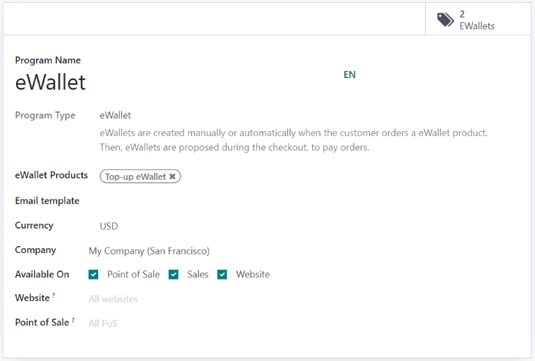
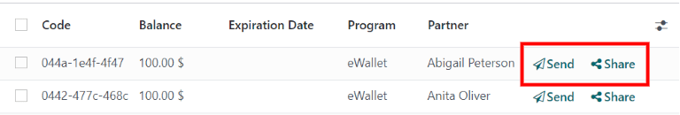
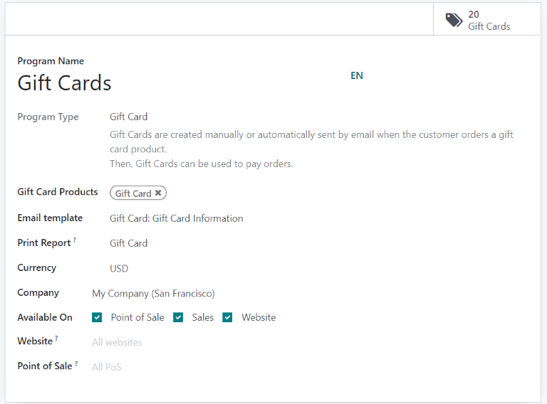
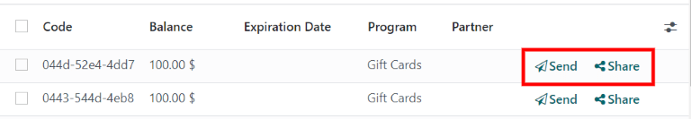

# eWallet va sovg'a kartalarini ishlatish

Odoo bilan mijozlar onlayn va do'kon ichida xarid qilish uchun **eWallet** va **sovg'a kartalarini** ishlatishlari
mumkin.

eCommerce va Point of Sale (PoS) uchun eWallet va sovg'a kartalarini yoqish uchun avval
`Sales app ‣ Configuration ‣ Settings ‣ Pricing section` ostida `Discounts, Loyalty & Gift Card` ni yoqing. Yoqilgandan
so'ng, `Sales app ‣ Products ‣ Gift cards & eWallet` ga o'ting va yangi eWallet yoki sovg'a kartalari dasturini `Create`
qiling.

## eWallet

eWallet mijozlarga onlayn hisoblarida kreditlarni saqlash va onlayn do'kon yoki oddiy do'konda buyumlar sotib olishda bu
kreditlarni to'lov usuli sifatida ishlatish imkonini beradi. eWallet bir nechta `gift cards` ni markazlashtirish uchun
ham ishlatilishi mumkin.

eWallet dasturini yaratishdan oldin eWallet **to'ldirish** mahsulotini yaratish kerak. To'ldirishlar haqiqiy valyutadagi
ekvivalenti evaziga eWallet ga qo'shiladigan oldindan belgilangan raqamli kredit qiymatlaridir. Keyin bu kreditlar
eCommerce do'koni yoki `PoS (Point of Sale)` da to'lov usuli sifatida ishlatilishi mumkin. To'ldirish qiymatlari turli
miqdorlarda bo'lishi mumkin.

::: tip
$50 to'ldirish $50 ga sotib olinishi mumkin va eWallet ga xuddi shu miqdorda kredit qo'shadi.
:::

To'ldirish mahsulotini yaratish uchun `Sales app ‣ Products ‣ Products` ga o'ting va yangi mahsulotni `Create` qiling.
Mahsulot shablonida quyidagi variantlarni sozlang:

- `Product Name`: to'ldirish mahsuloti uchun nom kiriting (masalan, [$50 To'ldirish])
- `Can be Sold`: yoqilgan
- `Product Type`: `Service` ni tanlang
- `Invoicing Policy`: `Prepaid/Fixed Price` ni tanlang
- `Create on Order`: `Nothing` ni tanlang
- `Sales Price`: to'ldirish miqdorini kiriting

::: tip

Turli miqdordagi eWallet to'ldirishlariga ega bo'lish uchun bir nechta to'ldirish mahsulotlarini yarating va
`Sales Price` ni mos ravishda o'zgartiring.
::::

To'ldirish yaratilgandan so'ng, eWallet dasturini `Create` qilish uchun `Sales app ‣ Products ‣ Gift cards & eWallet` ga
o'ting. Quyidagi konfiguratsiya variantlari mavjud:

- `Program Name`: eWallet dasturi uchun nom kiriting
- `Program Type`: `eWallet` ni tanlang
- `eWallet Products`: avval yaratilgan eWallet to'ldirishini tanlang. Agar turli miqdordagi to'ldirishlarni yaratgan bo'
  lsangiz, jarayonni takrorlang.
- `Email template`: mijozga yuborilgan elektron pochta uchun ishlatilgan elektron pochta shablonini tanlang. Yangi
  shablon yaratish uchun maydonni bosing, `Search More` ni tanlang, keyin `Create` ni bosing.
- `Currency`: eWallet dasturi uchun ishlatilishi kerak bo'lgan valyutani tanlang
- `Company`: dastur haqiqiy va mavjud bo'lgan kompaniyani tanlang
- `Available On`: dastur haqiqiy va mavjud bo'lgan ilovalarni tanlang
- `Website`: dastur haqiqiy va mavjud bo'lgan veb-saytni tanlang. Barcha veb-saytlarni qo'shish uchun bu maydonni bo'sh
  qoldiring.
- `Point of Sale`: dastur haqiqiy va mavjud bo'lgan `PoS (Point of Sale)` ni tanlang. Barcha `PoS (Point of Sale)` ni
  qo'shish uchun bu maydonni bo'sh qoldiring.

Dastur sozlangandan so'ng, eWallet larni yaratish uchun yuqori chap burchakdagi `Generate eWallet` tugmasini bosing.
eWallet lar `Customers` va/yoki `Customer Tags` asosida yaratilishi mumkin. Miqdor tanlangan `Customers` va
`Customer Tags` ga muvofiq avtomatik ravishda moslashtiriladi. Keyin `eWallet value` ni belgilang. Nihoyat, agar
tegishli bo'lsa, `Valid Until` muddatini belgilang.

Yaratilgan eWallet larga yuqori o'ng burchakdagi `eWallets` aqlli tugmasi orqali kirish mumkin. U yerdan eWallet larni
elektron pochta yoki URL havola orqali `Send` yoki `Share` qiling.

`Expiration Date`, `Partner` yoki `Balance` ni o'zgartirish uchun eWallet ni bosing. eWallet ning `Code` i
*o'zgartirilmaydi*, o'chirilmaydi yoki takrorlanmaydi.

## Sovg'a kartalari

Sovg'a kartalari mijozlar tomonidan sotib olinishi mumkin va o'z navbatida eCommerce do'koni yoki `PoS (Point of Sale)`
da to'lovni amalga oshirishda to'lov usuli sifatida ishlatilishi mumkin.

Yangi sovg'a kartalari dasturini yaratishdan oldin avval sovg'a kartalarini mahsulot sifatida yaratish kerak. Buning
uchun `Sales app ‣ Products ‣ Products` ga o'ting va mahsulotni `Create` qiling. Mahsulot shablonida quyidagi
variantlarni sozlang:

- `Product Name`: sovg'a kartasi mahsuloti uchun nom kiriting
- `Can be Sold`: yoqilgan
- `Product Type`: `Service` ni tanlang
- `Invoicing Policy`: `Prepaid/Fixed Price` ni tanlang
- `Create on Order`: `Nothing` ni tanlang
- `Sales Price`: sovg'a kartasining miqdorini kiriting

::: tip

Turli miqdordagi sovg'a kartalariga ega bo'lish uchun bir nechta sovg'a kartalari mahsulotlarini yarating va
`Sales Price` ni mos ravishda o'zgartiring.
::::

Sovg'a kartasi mahsuloti yaratilgandan so'ng, sovg'a kartalari dasturini `Create` qilish uchun
`Sales app ‣ Products ‣ Gift cards & eWallet` ga o'ting. Quyidagi konfiguratsiya variantlari mavjud:

- `Program Name`: sovg'a kartalari dasturi uchun nom kiriting
- `Program Type`: `Gift Card` ni tanlang
- `Gift Card Products`: avval yaratilgan sovg'a kartasi mahsulotini tanlang. Agar turli miqdordagi sovg'a kartalari
  mahsulotlarini yaratgan bo'lsangiz, jarayonni takrorlang.
- `Email template`: `Gift Card: Gift Card Information` standart shablonini tanlang yoki maydonni bosib, `Search More` ni
  tanlab, keyin `Create` ni bosish orqali yangi shablon yarating.
- `Print Report`: `Gift Card` ni tanlang
- `Currency`: sovg'a kartalari dasturi uchun ishlatilishi kerak bo'lgan valyutani tanlang
- `Company`: dastur haqiqiy va mavjud bo'lgan kompaniyani tanlang
- `Available On`: dastur haqiqiy va mavjud bo'lgan ilovalarni tanlang
- `Website`: dastur haqiqiy va mavjud bo'lgan veb-saytni tanlang. Barcha veb-saytlarni qo'shish uchun bu maydonni bo'sh
  qoldiring.
- `Point of Sale`: dastur haqiqiy va mavjud bo'lgan `PoS (Point of Sale)` ni tanlang. Barcha `PoS (Point of Sale)` ni
  qo'shish uchun bu maydonni bo'sh qoldiring.

Dastur sozlangandan so'ng, sovg'a kartalarini yaratish uchun yuqori chap burchakdagi `Generate Gift Cards` tugmasini
bosing. Sovg'a kartalari `Anonymous Customers` yoki `Selected Customers` uchun yaratilishi mumkin. `Anonymous Customers`
uchun `Quantity to generate` ni belgilang yoki `Selected Customers` uchun `Customers` va/yoki `Customer Tags` ni
tanlang. Keyin `Gift Card value` ni belgilang. Nihoyat, agar tegishli bo'lsa, `Valid Until` muddatini belgilang.

Yaratilgan sovg'a kartalariga yuqori o'ng burchakdagi `Gift Cards` aqlli tugmasi orqali kirish mumkin. U yerdan sovg'a
kartalarini elektron pochta yoki URL havola orqali `Send` yoki `Share` qiling.

`Expiration Date`, `Partner` yoki `Balance` ni o'zgartirish uchun sovg'a kartasini bosing. Sovg'a kartasining `Code` i
*o'zgartirilmaydi*, o'chirilmaydi yoki takrorlanmaydi.