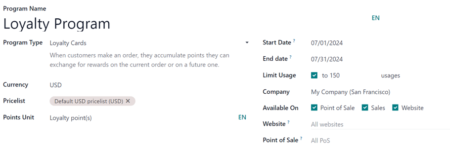

# Chegirma va sadoqat dasturlari

Odoo `Sales`, `eCommerce`, va `Point of Sale` ilovalari foydalanuvchilarga mijozlar onlayn va do'konda xarid qilishda foydalanishi mumkin bo'lgan chegirma va sadoqat dasturlarini yaratishga imkon beradi. Ushbu dasturlar `pricelists` ga qaraganda yanada xilma-xil, ommaviy va vaqtga bog'liq narx variantlarini taklif etadi.

## Sozlamalarni sozlash

Chegirma va sadoqat dasturlaridan foydalanishni boshlash uchun `Sales ‣ Configuration ‣ Settings` ga o'ting. `Pricing` sarlavhasi ostida, xususiyat yonidagi katakchani belgilash orqali `Discounts, Loyalty & Gift Card` sozlamasini faollashtiring. Nihoyat, o'zgarishlarni saqlash uchun `Save` tugmasini bosing.

## Chegirma va sadoqat dasturlarini sozlash

Chegirma va sadoqat dasturlarini yaratish uchun `Sales ‣ Products ‣ Discount & Loyalty` ga o'ting.

Agar hali hech qanday chegirma yoki sadoqat dasturi yaratilmagan bo'lsa, Odoo birinchi dasturni yaratishga yordam berish uchun shablonlar tanlovini taqdim etadi. Shablon kartalaridan birini tanlang yoki noldan yangi dastur yaratish uchun `New` tugmasini bosing.

Yoki, agar allaqachon mavjud dasturlar bo'lsa, uni tahrirlash uchun mavjud dasturni tanlang.

::: tip

Shablonlar **faqat** hech qanday dastur yaratilmaganda paydo bo'ladi va birinchi dastur yaratilgandan so'ng yo'qoladi.
::::

Dasturni yaratish yoki tahrirlash dastur formasini ochadi.

Dastur formasi quyidagi maydonlarni o'z ichiga oladi:

- `Program Name`: Ushbu maydonga dastur nomini kiriting. Dastur nomi mijozga **ko'rinmaydi**.
- `Program Type`: Ochiladigan menyudan kerakli `program type` ni tanlang.
- `Currency`: Dastur uchun ishlatiladigan valyutani tanlang.
- `Pricelist`: Agar kerak bo'lsa, ushbu sadoqat dasturini muayyan narx ro'yxatiga (va narx ro'yxatiga bog'langan mijozlarga) qo'llash uchun ochiladigan menyudan narx ro'yxatini tanlang. Ushbu maydondan bir nechta narx ro'yxatini tanlash mumkin. Bitta sadoqat dasturi bir nechta narx ro'yxatiga bog'langanda, turli mijoz segmentlari turli narx ro'yxatlariga ega bo'lishi, lekin *bir xil* sadoqat dasturlariga ega bo'lishi mumkin. Agar ushbu maydon bo'sh qoldirilsa, dastur narx ro'yxatidan qat'i nazar hammaga taalluqli.
- `Points Unit`: `Loyalty Cards` dasturi uchun ishlatiladigan ballar nomini kiriting (masalan, [Sadoqat ballari]). Ball birligi nomi mijozga *ko'rinadi*. Ushbu maydon **faqat** `Program Type` `Loyalty Cards` ga o'rnatilganda mavjud.
- `Start Date`: Dastur kuchga kirish sanasini tanlang. Agar dastur doimo haqiqiy bo'lishi va muddati tugamasligi kerak bo'lsa, ushbu maydonni bo'sh qoldiring.
- `End Date`: Dastur kuchini yo'qotish sanasini tanlang. Agar dastur doimo haqiqiy bo'lishi va muddati tugamasligi kerak bo'lsa, ushbu maydonni bo'sh qoldiring.
- `Limit Usage`: Agar kerak bo'lsa, ushbu katakchani belgilang va dasturni amal qilish muddati davomida foydalanish sonini cheklash uchun `usages` raqamini kiriting.
- `Company`: Agar ko'p kompaniyali ma'lumotlar bazasida ishlayotgan bo'lsangiz, dastur mavjud bo'lgan bitta kompaniyani tanlang. Agar bo'sh qoldirilsa, dastur ma'lumotlar bazasidagi barcha kompaniyalar uchun mavjud.
- `Available On`: Dastur mavjud bo'lgan ilovalarni tanlang.
- `Website`: Dastur mavjud bo'lgan veb-saytni tanlang. Uni barcha veb-saytlarda mavjud qilish uchun ushbu maydonni bo'sh qoldiring.
- `Point of Sale`: Dastur mavjud bo'lgan sotuv nuqta(lar)ini tanlang. Uni barcha `PoS (Point of Sale)` da mavjud qilish uchun ushbu maydonni bo'sh qoldiring.

::: tip

Dastur formasida mavjud bo'lgan variantlar tanlangan `Program Type` ga qarab farq qiladi.
::::

Dastur uchun yaratilgan barcha mavjud kartalar, kodlar, kuponlar va boshqalar forma tepasida joylashgan aqlli tugma orqali kirish mumkin.

::: tip

Odoo 17 da (va undan keyingi versiyalarda), sadoqat kartasi yoki kupon ma'lumotlar bazasidagi kontakt bilan bog'langanda, kontakt formasida shartli ravishda `Loyalty Cards` aqlli tugmasi paydo bo'ladi.

Ushbu aqlli tugma **faqat** sadoqat kartasi yoki kupon kontakt bilan bog'langan bo'lsa paydo bo'ladi.
::::

### Dastur turlari

Dastur formasida mavjud bo'lgan turli `Program Types` lar:

- `Coupons`: Mukofotlarga darhol kirish huquqini beradigan bir martalik kupon kodlarini yarating va baham ko'ring.
- `Loyalty Cards`: Xarid qilayotganda, mijoz joriy va/yoki kelajakdagi buyurtmalarda mukofotlarga almashtirish uchun ball to'playdi.
- `Promotions`: Mahsulotlarni buyurtma qilish uchun shartli qoidalarni belgilang, ular bajarilganda mijozga mukofotlarga kirish huquqini beradi.
- `Discount Code`: Chiqish paytida kiritilganda mijozga chegirmalar beradigan kodlarni belgilang.
- `Buy X Get Y`: har (X) sotib olingan mahsulot uchun mijozga 1 kredit beriladi. Belgilangan miqdorda kredit to'plagandan so'ng, mijoz ularni (Y) mahsulotni olish uchun almashtirishi mumkin.
- `Next Order Coupons`: Mijozning keyingi buyurtmasida mukofotlarga kirish huquqini beradigan bir martalik kupon kodlarini yarating va baham ko'ring.

### Shartli qoidalar

Keyin, dastur mijozning buyurtmasiga qachon taalluqli ekanligini aniqlaydigan `Conditional rules` ni sozlang.

`Rules & Rewards` yorlig'ida, dasturga *shartlar* qo'shish uchun `Conditional rules` yonidagi `Add` tugmasini bosing. Bu `Create Conditional rules` pop-up oynasini ochadi.

::: tip

`Conditional rules` uchun variantlar tanlangan `Program Type` ga qarab farq qiladi.
::::

Shartli qoidalarni sozlash uchun quyidagi variantlar mavjud:

- `Discount Code`: `Discount Code` dasturi uchun ishlatiladigan maxsus kodni kiriting yoki Odoo tomonidan yaratilgan standart koddan foydalaning. Ushbu maydon faqat `Program Type` `Discount Code` ga o'rnatilganda mavjud.
- `Minimum Quantity`: Mukofotga kirish uchun sotib olinishi kerak bo'lgan mahsulotlarning minimal sonini kiriting. Mijoz mukofotga kirish uchun xarid qilishi shart bo'lishini ta'minlash uchun minimal miqdorni kamida [1] ga o'rnating.
- `Minimum Purchase`: Mukofotga kirish uchun sarflanishi kerak bo'lgan minimal miqdorni (valyutada), `tax Included` yoki `tax Excluded` bilan kiriting. Agar minimal miqdor *va* minimal xarid miqdori kiritilsa, mijozning buyurtmasi ikkala shartni ham qondirishi kerak.
- `Products`: Dastur taalluqli bo'lgan muayyan mahsulot(lar)ni tanlang. Uni barcha mahsulotlarga qo'llash uchun ushbu maydonni bo'sh qoldiring.
- `Categories`: Dastur taalluqli bo'lgan mahsulotlar kategoriyasini tanlang. Uni barcha mahsulot kategoriyalariga qo'llash uchun `All` ni tanlang.
- `Product Tag:` Dasturni muayyan teg bilan mahsulotlarga qo'llash uchun tegni tanlang.
- `Grant`: Mijoz (`Loyalty Cards` va `Buy X Get Y` dasturlari uchun) `per order`, `per currency spent`, yoki `per unit paid` qancha ball olishini kiriting.

Qoidani saqlash va pop-up oynasini yopish uchun `Save & Close` tugmasini bosing yoki qoidani saqlash va darhol yangisini yaratish uchun `Save & New` tugmasini bosing.

### Mukofotlar

Dastur formasining `Rules & Rewards` yorlig'ida, dasturga *mukofotlar* qo'shish uchun `Rewards` yonidagi `Add` tugmasini bosing. Bu `Create Rewards` pop-up oynasini ochadi.

::: tip

`Rewards` uchun variantlar tanlangan `Program Type` ga qarab farq qiladi.
::::

Mukofotlarni sozlash uchun quyidagi variantlar mavjud:

- `Reward Type`: `Free Product`, `Discount`, va `Free Shipping` orasidan mukofot turini tanlang. Mukofot konfiguratsiyasi uchun boshqa variantlar tanlangan `Reward Type` ga bog'liq.
  - `Free Product`:
    - `Quantity Rewarded`: Mijozga berilgan bepul mahsulotlar sonini tanlang.
    - `Product`: Mukofot sifatida bepul berilgan mahsulotni tanlang. Faqat bitta mahsulot tanlanishi mumkin.
    - `Product Tag`: Mukofot uchun mos bo'lgan bepul mahsulotni yanada aniqlashtirish uchun tegni tanlang.
  - `Discount`:
    - `Discount`: Chegirma miqdorini `percentage`, `currency per point`, yoki `currency per order` da kiriting. Keyin chegirma butun `Order` ga, faqat buyurtmadagi `Cheapest Product` ga yoki faqat `Specific Products` ga taalluqli ekanligini tanlang.
    - `Max Discount`: Ushbu mukofot chegirma sifatida berishi mumkin bo'lgan maksimal miqdorni (valyutada) kiriting. Cheklovsiz uchun ushbu maydonni [0] da qoldiring.
  - `Free Shipping`:
    - `Max Discount`: Ushbu mukofot chegirma sifatida berishi mumkin bo'lgan maksimal miqdorni (valyutada) kiriting. Cheklovsiz uchun ushbu maydonni [0] da qoldiring.
- `In exchange of`: Mukofotga almashish uchun zarur bo'lgan ballar sonini kiriting (`Loyalty Cards` va `Buy X Get Y` dasturlari uchun).
- `Description on order`: Chiqish paytida mijozga ko'rsatiladigan mukofot tavsifini kiriting.

