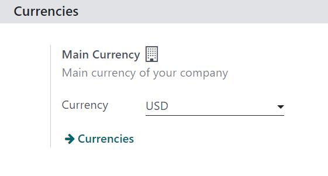
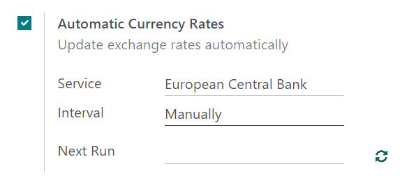
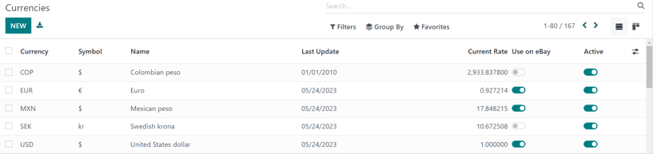
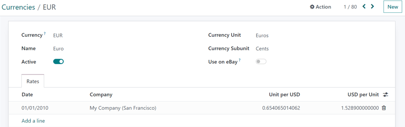
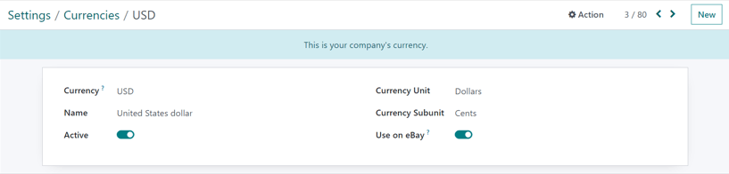
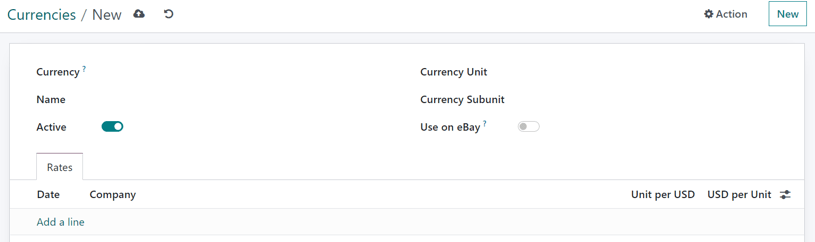
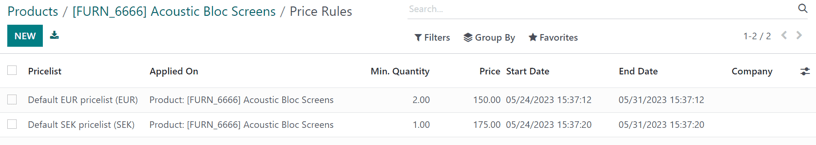

# Xorijiy valyutalar

Odoo bilan narx ro'yxatlari bir qator xorijiy valyutalarda narxlarni boshqarish uchun ishlatilishi mumkin. Aniq qilib aytganda, Odoo jami 167 ta valyuta bilan ishlash qobiliyatiga ega.

::: tip

Odoo *Sales* da bir nechta valyutalarni ishlatish uchun *Accounting* ilovasi **albatta** o'rnatilgan bo'lishi kerak.
::::

## Sozlamalar

*Accounting* ilovasi o'rnatilgandan so'ng, xorijiy valyutalar ma'lumotlar bazasiga qo'shilishi mumkin. `Accounting app ‣ Configuration ‣ Settings`ga o'ting, `Currencies` bo'limigacha pastga suring va `Main Currency` sozlamasini toping.

Odoo avtomatik ravishda asosiy valyutani kompaniya joylashgan mamlakat valyutasi sifatida belgilaydi.

Kompaniyaning asosiy valyutasini o'zgartirish uchun `Currency` maydonidagi pastga tushuvchi menyuni tanlang, kerakli valyutani tanlang va o'zgarishlarni `Save` qilishni unutmang.

::: tip

Valyuta kurslarining avtomatik yangilanishini ta'minlash uchun *Accounting* sozlamalar sahifasida (*avtomatik valyuta kurslari* funksiyasini yoqing
(`Accounting app ‣ Configuration ‣ Settings ‣ Currencies section`).

`Automatic Currency Rates` funksiyasining yonidagi katakchani belgilang, `Service` maydonining pastga tushuvchi menyusidan valyuta kurslarini olish uchun belgilangan bankni tanlang va yangilanishlar sodir bo'lishi uchun `Interval` vaqtini tanlang. Keyin `Next Run` sanasi qachon bo'lishi kerakligini aniqlang.

Valyuta kurslarini darhol yangilash uchun `Next Run` maydonining o'ng tomonida joylashgan `🔁 (doiraviy o'qlar)` belgisini bosing.

Barcha konfiguratsiyalar tugallangandan so'ng, barcha o'zgarishlarni `Save` qilishni unutmang.
::::

::: tip

Barcha to'lov usullari savdo jurnali bilan bir xil valyutada **bo'lishi kerak**, yoki kompaniya valyutasi belgilanmagan bo'lsa, kompaniya valyutasi bo'lishi kerak. Agar bir xil bo'lmasa, `Validation Error` xabari paydo bo'ladi.
::::

## Valyutalarni ko'rish, tahrirlash va qo'shish

Valyutalarni ma'lumotlar bazasiga ko'rish, tahrirlash va qo'shish uchun, ularni narx ro'yxatlarida va `Main Currency` pastga tushuvchi menyusida mavjud qilish uchun, `Accounting app ‣ Settings` sahifasidagi `Currency` maydonining ostida joylashgan `Currencies` havolasini bosing.

`Currencies` havolasi bosilganda, alohida `Currencies` sahifasi ochiladi.

Ushbu sahifada Odoo 167 ta global valyutaning asosiy ro'yxatini taqdim etadi. Har bir qator tegishli `Currency`, `Symbol`, `Name`, `Last Update` sanasi va `Current Rate` (kompaniya joylashgan mamlakatning standart valyutasi bilan solishtirilganda) ni ko'rsatadi.

Eng o'ng tomonda yoqilishi yoki o'chirilishi mumkin bo'lgan ikkita ustun mavjud:

- `Active`: bu valyuta faollashtirilgan, ya'ni u narx ro'yxatiga qo'shilishi yoki agar kerak bo'lsa, kompaniyaning asosiy valyutasi sifatida ishlatilishi mumkin (`Accounting app ‣ Configuration ‣ Settings ‣ Currencies section` orqali).

::: tip

Odatiy bo'lib, barcha `Active` valyuta variantlari ro'yxatning yuqori qismida joylashgan.
::::

::: tip

Har bir `Active` valyuta uchun *kamida* bitta narx ro'yxati yaratish tavsiya etiladi. Narx ro'yxati konfiguratsiyasi haqida ko'proq bilish uchun `./pricing` ga qarang.
::::

Variantlarni yoqish/o'chirish uchun tegishli ustundagi qator uchun o'tkazgichni bosing. *Yoqilgan* holatda o'tkazgichning rangi yashil bo'ladi. *O'chirilgan* holatda o'tkazgichning rangi kulrang bo'ladi.

### Valyuta tafsilot formasi

`Currencies` sahifasidagi har qanday valyutani tahrirlash uchun, o'sha maxsus valyutaning tafsilot formasini ochish uchun kerakli valyutani bosing va kerakli o'zgarishlarni kiriting.

Valyuta tafsilot formasida tegishli valyuta kodi `Currency` maydonida ko'rinadi. Uning ostida valyutaning nomi `Name` maydonida ko'rsatilgan.

Keyin valyutaning mavjudligini `Active` o'tkazgichi bilan o'zgartiring: *yoqilgan* holat yashil o'tkazgich bilan, *o'chirilgan* holat esa kulrang o'tkazgich bilan ko'rsatiladi.

Valyuta tafsilot formasining o'ng tomonida tegishli `Currency Unit` (masalan, [Dollars]) va `Currency Subunit` (masalan, [Cents]) ni topish mumkin.

Keyin, `Rates` yorlig'i ostida turli konvertatsiya kurslarini ko'rish, qo'shish yoki o'chirish mumkin. Har bir qator o'sha maxsus kursning `Date`, u bog'langan `Company`, keyin `Unit per...` va `...per Unit` ni ko'rsatadi.

::: tip

Oxirgi ikki ustundagi *\...* kompaniya uchun belgilangan asosiy valyutani ifodalaydi. Masalan, agar asosiy valyuta [USD] ga o'rnatilgan bo'lsa, ustunlar `Unit per USD` va `USD per Unit` deb nomlanadi.
::::

Yangi kurs qo'shish uchun `Rates` yorlig'ida `Add a line` ni bosing va yuqorida aytib o'tilgan ustunlarga kerakli ma'lumotlarni kiriting.

### Asosiy valyuta tafsilot formasi

Agar tanlangan valyuta kompaniyaning asosiy valyutasi bo'lsa, valyuta tafsilot formasining yuqori qismida `This is your company's currency.` xabari bilan ko'k banner paydo bo'ladi.

Barcha maydonlar oddiy valyuta tafsilot formasi bilan bir xil, lekin `Rates` yorlig'i bo'lmaydi, chunki boshqa barcha valyuta kurslari kompaniyaning asosiy valyutasiga asoslanadi.

## Yangi valyuta yaratish

Agar kerakli valyuta `Currencies` sahifasida bo'lmasa, bo'sh valyuta shablon formasini ochish uchun `New` tugmasini bosing.

::: tip

Xuddi shu `New` tugmasi har qanday valyuta tafsilot formasining yuqori o'ng burchagida joylashgan.
::::

Bo'sh valyuta tafsilot formasida `Currency` maydoniga kerakli valyuta kodini kiriting. Uning ostida `Name` maydoniga valyutaning nomini kiriting.

Keyin valyutaning mavjudligini `Active` o'tkazgich tugmasi bilan o'zgartiring.

Valyuta tafsilot formasining o'ng tomonida tegishli `Currency Unit` (masalan, [Dollars]) va tegishli `Currency Subunit` (masalan, [Cents]) ni kiriting.

Keyin, `Rates` yorlig'i ostida `Add a line` ni bosish orqali yangi kurs qo'shing. Keyin `Date`, `Company`, `Unit per...`, va `...per Unit` maydonlarini tasdiqlang va sozlang, barcha avtomatik to'ldirilgan ma'lumotlar to'g'ri ekanligini ta'minlang.

::: tip

Oxirgi ikki ustundagi *\...* kompaniya uchun belgilangan asosiy valyutani ifodalaydi. Masalan, agar asosiy valyuta [USD] ga o'rnatilgan bo'lsa, ustunlar `Unit per USD` va `USD per Unit` deb nomlanadi.
::::

## Valyutaga xos narx ro'yxatlari

Ma'lumotlar bazasidagi har bir faol valyuta uchun *kamida* bitta narx ro'yxati yaratish tavsiya etiladi. Muayyan valyuta uchun narx ro'yxatini yaratish (yoki tayinlash) uchun `Sales app ‣ Products ‣ Pricelists` ga o'ting.

`Pricelists` sahifasidan tahrirlash uchun mavjud narx ro'yxatini tanlang yoki yangi narx ro'yxatini yaratish uchun `New` ni bosing.

Yangi yoki mavjud narx ro'yxati uchun narx ro'yxati tafsilot formasida `Currency` maydonini kerakli bo'lgancha sozlang.

## Ommaviy narxdan avtomatik konvertatsiya

Shuni ta'kidlash kerakki, mahsulotlarda ko'rinadigan ommaviy narx bevosita kompaniya belgilagan asosiy valyuta bilan bog'liq bo'lib, u `Accounting app ‣ Configuration ‣ Settings ‣ Currencies section ‣ Main Currency ‣ Currency drop-down menu` ga o'tish orqali sozlanadi.

Agar narx ro'yxati kompaniyaning asosiy valyutasidan boshqa valyutaga ega bo'lgan boshqa narx ro'yxatiga o'zgartirilsa, savdo narxi avtomatik ravishda yangilanadi. Narxdagi o'zgarish o'sha valyuta uchun yangilangan konvertatsiya kursi bilan bevosita bog'liq.

## Mahsulot narxlarini belgilash

Valyuta kurslaridagi har qanday o'zgarishlardan qochish uchun mahsulot narxlarini belgilash uchun avval `Sales app ‣ Products ‣ Products` ga o'ting.

`Products` sahifasidan o'zgartirish uchun kerakli mahsulotni tanlang. Yoki `New` tugmasini bosish orqali yangi mahsulot yarating.

Keyin mahsulot tafsilot formasida yuqori chap burchakda joylashgan `Extra Prices` aqlli tugmasini bosing. Buni qilish o'sha maxsus mahsulotga xos alohida `Price Rules` sahifasini ochadi.

`New` ni bosing va `Pricelist` ustunidagi pastga tushuvchi menyudan kerakli narx ro'yxatini tanlang.

`Applied On` maydoni mahsulot bilan avtomatik to'ldiriladi, shuning uchun `Min. Quantity` va `Price` maydonlariga kerakli raqamlarni kiriting.

::: tip

`Min. Quantity` maydonidagi raqam belgilanayotgan `Price` **faqat** mahsulotdan kamida shu miqdor sotib olingan taqdirdagina faollashishini bildiradi.
::::

Agar kerak bo'lsa, belgilangan narxlar uchun `Start Date` va `End Date` ni sozlang. Ushbu ustunlarni bo'sh qoldirish belgilangan narx sotish sanasidan qat'i nazar amal qilishini ta'minlaydi.

Agar ko'p kompaniyali muhitda ishlayotgan bo'lsangiz, `Company` maydonida bu narx qoidasi qaysi kompaniyaga qo'llanilishi kerakligini belgilang. Ushbu maydonni bo'sh qoldirish narx qoidasi ma'lumotlar bazasidagi barcha kompaniyalarga qo'llanilishini ta'minlaydi.

Ushbu konfiguratsiyalar tugallangandan so'ng, konvertatsiyada har qanday o'zgarishlar/yangilanishlardan qat'i nazar, ushbu belgilangan narx ro'yxatlari ushbu maxsus mahsulotni sotib olishga harakat qilayotgan mijozga qo'llanilganda, bu oldindan belgilangan narxlar paydo bo'ladi.