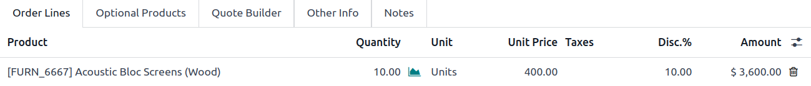
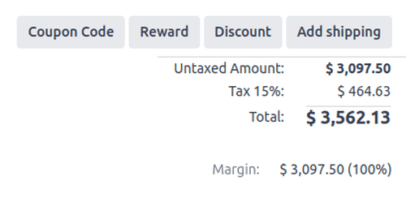
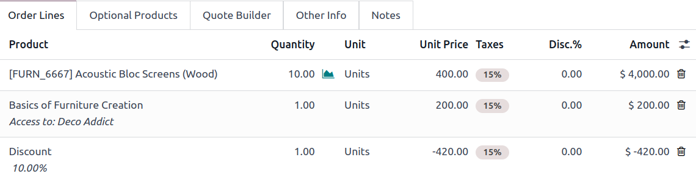

# Chegirmalar

*Chegirmalar* funksiyasi foydalanuvchilarga savdo taklifnomasi yoki buyurtmasidagi mahsulot qatorlarining narxini kamaytirish yoki oshirish imkonini beradi. Bu mahsulotlarning savdo narxining foizi sifatida hisoblanadi.

**Savdo** ilovasida chegirgmalarga kirish uchun `Sales app ‣ Configuration ‣ Settings` ga o'ting. `Pricing` bo'limida `Discounts` katakchani belgilang, so'ngra `Save` tugmasini bosing.

Sozlama faollashtirilgandan so'ng, sahifaning yuqori qismida `Sales app ‣ Orders ‣ Quotations` ga o'tib kerakli taklifnomaga o'ting. U yerda ro'yxatdan kerakli taklifni tanlang.

## Mahsulot qatorlaridagi chegirmalar

Taklifnoma formasining `Order Lines` yorlig'ida `Disc.%` deb nomlangan yangi ustun sarlavhasi paydo bo'ladi. Bu ustun alohida qator elementlariga chegirma belgilash uchun ishlatiladi. Har bir mahsulot qatori uchun kerakli chegirmani kiriting va yangi narx sahifaning pastidagi `Total` da avtomatik ravishda hisoblanadi.

::: tip

Chegirma xuddi shu tarzda bevosita savdo buyurtmasiga ham qo'shilishi mumkin. `Sales app ‣ Orders ‣ Orders` ga o'ting, kerakli savdo buyurtmasini tanlang va yuqorida tavsiflangan `Disc.%` maydoniga chegirmani qo'shing.
::::

::: tip

`Disc.%` uchun musbat qiymatlar *chegirma* qo'llaydi, manfiy qiymatlar esa narxni *oshirish* uchun ishlatilishi mumkin.
::::

::: warning

Musbat qiymatlar yoki narx pasayishi mijozga ko'rinadi, manfiy qiymatlar yoki narx oshishi esa mijozga *ko'rinmaydi*. Chegirma ustuni o'rniga, manfiy chegirma mahsulotning birlik narxini o'zgartiradi.
::::

## Chegirma tugmasi 

*Chegirmalar* sozlamalari yoqilganda, savdo buyurtmalarining pastida `Discount` tugmasi paydo bo'ladi.

Savdo buyurtmasida `Discount` tugmasini bosish qalqib chiquvchi oynani ochadi, bu yerda `Discount` foizi va variantlar sozlanadi:

- `On All Order Lines`: Savdo buyurtmasining barcha mavjud buyurtma qatorlariga belgilangan chegirma foizini (qalqib chiquvchi oynaning `Discount` maydonida sozlangan) qo'shish.

- `Global Discount`: Buyurtmaga belgilangan chegirma foiziga teng yig'ma qiymatga ega chegirma mahsulot qatorini qo'shish.

  ::: tip
  10% global chegirma jami summasi 4200$ bo'lgan savdo buyurtmasining oxirgi qatoriga -420$ qiymatli chegirma qatori qo'shish orqali qo'shiladi (bu 4200$ ning 10% i).

  
  :::

  ::: warning
  : eslatma

Barcha kerakli mahsulotlar savdo buyurtmasiga qo'shilgandan **keyin** `Fixed Amount` chegirmani qo'shish foydaliroqdir. Agar chegirma qo'shilgandan *keyin* savdo buyurtmasiga o'zgartirishlar kiritilsa, `Discount` qatoridagi qiymatni sozlang yoki qatorni olib tashlang va kerak bo'lganda chegirmani qaytadan qo'shing.
::::