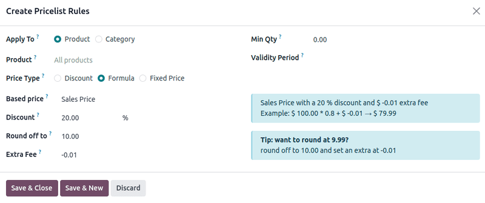
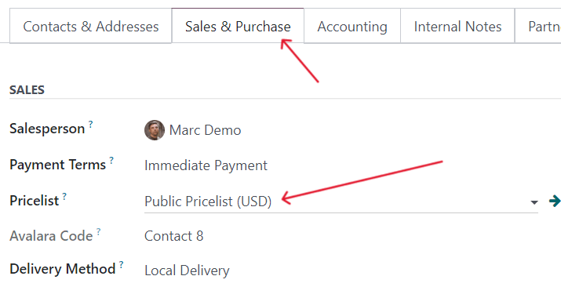

# Narx ro'yxatlari

*Narx ro'yxati* - bu sotuv narxlarini moslashtirish uchun narxlar ro'yxati (yoki narx qoidalari)ni qo'llaydigan dinamik narxlash usuli. Ushbu moslashtirish muayyan mijozlar, mijozlar guruhlari, sotuv buyurtmalari, vaqt davrlari va boshqalarga qo'llanilishi mumkin va narxlash strategiyalarini yaratish hamda sotuv daromadlarini optimallashtirish uchun foydalidir.

Odoo **Sales** ilovasida har qanday noyob narxlash strategiyasiga moslashtirilishi mumkin bo'lgan foydali narx ro'yxati funksiyasi mavjud. Narx ro'yxatlari ma'lum narxlarni taklif qiladi, ammo ularni har doim sotuv buyurtmasida bekor qilish mumkin.

## Sozlash

Odoo **Sales** ilovasida narx ro'yxatlarini yoqish uchun avval `Sales app ‣ Configuration ‣ Settings` bo'limiga o'ting. `Pricing` bo'limida `Pricelists` funksiyasi yonidagi belgi qo'yish maydonchasi`ni belgilang va barcha o'zgarishlarni saqlash uchun `Save` tugmasini bosing.

`Pricelists` funksiyasini faollashtirish va saqlashdan keyin `Settings` sahifasi qayta yuklanadi. Bu yerdan `Pricelists` havolasini tanlang (`Settings` sahifasidagi `Pricelists` funksiyasi ostida) yoki `Sales app ‣ Products ‣ Pricelists` ga o'ting.

Ikkala variant ham `Pricelists` sahifasini ochadi, bu yerda narx ro'yxatlarini istalgan vaqtda yaratish va/yoki o'zgartirish mumkin.

::: warning

Agar sotuv taklifida maxsus narx ro'yxati konfiguratsiya qilinmagan bo'lsa, `Default` narx ro'yxati qo'llaniladi.
:::

::: tip

`Selectable` ustuni faqat Odoo **eCommerce** uchun tegishli. Bu variant veb-sayt tashrif buyuruvchilariga **eCommerce** veb-saytingizda xarid qilishda narx ro'yxatini tanlash imkonini beradi.
:::

::: tip

Odoo 17 (va undan yuqori)da sotuv taklifi formasidagi `Pricelist` maydoniga narx ro'yxatini kiritish uni tasdiqlash (ya'ni sotuv buyurtmasiga aylantirish) uchun *shart emas*.

Har bir narx ro'yxati sahifasida eslatmalar va muloqotlarni qo'shish imkonini beruvchi chatter bo'limi narx ro'yxati formalarida mavjud.
:::

### Narx ro'yxatlarini yaratish va tahrirlash

`Pricelists` sahifasidan tahrirlash uchun narx ro'yxatini tanlang yoki yangi narx ro'yxati yaratish uchun `New` tugmasini bosing, bu turli xil yo'llar bilan konfiguratsiya qilinishi mumkin bo'lgan bo'sh narx ro'yxati formasini ochadi.

Yangi narx ro'yxati yaratishda forma tepasidagi bo'sh maydoniga narx ro'yxati nomini qo'shishdan boshlang. Keyin qaysi `Currency` ishlatilishi kerakligini tanlang.

Ko'p kompaniyali muhitda ishlayotgan bo'lsangiz, ushbu narx ro'yxati `Company` maydonida qaysi kompaniyaga tegishli ekanligini tanlang. Agar bu maydon bo'sh qoldirilsa, narx ro'yxati ma'lumotlar bazasidagi barcha kompaniyalarga avtomatik ravishda qo'llaniladi.

Ko'p milliy kompaniyada ishlayotgan bo'lsangiz, `Country Groups` ustunida ushbu narx ro'yxati qo'llaniladigan mamlakatlarni tanlang.

### Narx qoidalari belgisi

`Price Rules` belgisida har bir qator narx ro'yxati qo'llaniladigan sotuv buyurtmasiga moslashtirilgan narxlashni amalga oshiradigan yangi yozuv yaratadi. Yangi narx qoidasini yaratish uchun `Add a line` tugmasini bosing, bu yangi narx ro'yxati qoidalari formasini ochadi.

Keyin bu qoidalar to'plamini `Product` yoki `Category` ga qo'llashni tanlang.

Bu yerdan bir necha konfiguratsiya variantlari mavjud:

- `Product`: Agar `Apply To` maydonida tanlab olingan bo'lsa, ushbu narx ro'yxati qo'llaniladigan bir yoki bir nechta mahsulotlarni tanlash uchun ushbu maydondan foydalaning.
- `Category`: Ushbu narx ro'yxati qo'llaniladigan bir yoki bir nechta mahsulot toifalarini tanlang.
- `Price Type`: Maxsus narxlash `Discount`, `Formula` yoki `Fixed Price` ostiga tushishini tanlang. Narx turiga qarab, narx ro'yxatini qanday qo'llash bo'yicha qo'shimcha konfiguratsiyalar bo'ladi.
  - `Discount`: Chegirma qilinadigan foizni kiriting. Ushbu maydondan manfiy qiymat ishlatib narx oshirishni konfiguratsiya qilish mumkin.

    ::: warning
     misol
100% narx oshirish (yoki mahsulot narxining ikki baravar)ni, minimal 5 dollar daromad bilan shaklllantirish uchun `Based price` maydonini `Sales Price` ga va `Discount` ni [-100] ga o'rnating. Bu ko'pincha chakana sotuvda ko'riladi.

:::

::: tip
20% chegirmalarni qo'llash uchun, narxlarni 9.99 gacha yumaloqlash bilan, `Based on` maydonini `Sales Price` ga, `Discount` maydonini [20] ga, `Extra Fee` maydonini [-0.01] ga va `Rounding Method` maydonini [10] ga o'rnating.

:::

::: tip

9.99 da tugaydigan narxlar uchun `Rounding Method` ni [10] ga va `Extra Fee` ni [-0.01] ga o'rnating.
:::

### Takroriy narxlar belgisi

Vaqtga asoslangan qoidalar maxsus obuna mahsulotlari bilan ishlatiladi. Qo'shimcha ma'lumot uchun Odoo `Subscriptions` hujjatlarini ko'rib chiqishni unutmang.

`Recurring Prices` belgisida narx ro'yxatlari `Price Rules` belgisidagi kabi variantlar bilan konfiguratsiya qilinadi, `Product Variants` va `Recurring Plan` uchun qo'shimcha ustunlar bilan.

`Product Variants` rang, o'lcham va boshqalar kabi bir yoki bir nechta qiymatlarga ega mahsulotlar ostida konfiguratsiya qilinadi. `Products Tab` ostida mahsulot tanlab olingandan so'ng, agar tegishli bo'lsa, narx qoidasiga kiritilishi kerak bo'lgan kerakli mahsulot variantlarini tanlang.

Keyin `Recurring Plan` ustunidagi bo'sh maydonni tanlang, bu oldindan belgilangan takrorlash davrlari ochiladigan menyusini ochadi (masalan, [Oylik], [Choraklik], [Haftalik] va boshqalar).

Ushbu ustundan yangi takrorlash davrlari ham yaratilishi mumkin. Buning uchun yangi `Recurring Plan` nomini yozing, keyin vaqt davrini yaratish uchun natijada paydo bo'lgan ochiladigan menyudan `Create` ni tanlang, uni keyinroq tahrirlash mumkin. Shu bilan bir qatorda, `Create Recurring Plan` pop-up formasini ochish uchun `Create and edit...` ni tanlang. Ushbu pop-up formadan yangi takrorlash davri maxsus `Details`, `Self-Service` va `Pricing` variantlari bilan konfiguratsiya qilinishi mumkin. Konfiguratsiyalar tugagandan so'ng `Save & Close` tugmasini bosing.

Nihoyat, `Recurring Price` ustunida ushbu takroriy narx qoidasi uchun kerakli narxni qo'shing.

### Ijara qoidalari belgisi

`Rental rules` belgisi ostida `rental products` uchun narx qoidalari `Price Rules` va `Recurring Prices` belgilaridagi kabi metodologiya bilan konfiguratsiya qilinishi mumkin.

Ijara qoidasini qo'shish uchun `Add a line` tugmasini bosing va `Products` ustunida kerakli mahsulotni tanlang. Keyin zarur bo'lsa, har qanday maxsus `Variants` ni tanlang.

Keyin ijara qoidasi uchun `Period` vaqtini belgilang (masalan, [Kunlik], [Soatlik] va boshqalar).

Nihoyat, tegishli ustunda ijara qoidasi uchun `Price` ni konfiguratsiya qiling.

### Elektron tijorat belgisi

`Ecommerce` belgisi ostida `Ecommerce website` da sotiladigan mahsulotlar uchun narx qoidalari konfiguratsiya qilinishi mumkin.

Narx ro'yxatini ko'rinadigan qilish uchun `Website` maydonida maqsadli veb-saytni tanlang.

`Selectable` mijozga ushbu narx ro'yxatini tanlash imkonini berish uchun yoqilishi mumkin.

Nihoyat, `E-commerce Promotional Code` maydoniga reklama va sadoqat kodlari qo'shilishi mumkin.

Mijozlar xarid qilishda tanlaydigan variant sifatida ushbu narx ro'yxatini qo'yish uchun `Selectable` belgisini belgilang. Agar `Selectable` maydoni belgilanmagan bo'lsa, mijozlar o'zlari uchun ushbu narx ro'yxatini **tanlay olmaydi**.

Nihoyat, `E-commerce Promotional Code` qo'shish imkoniyati mavjud. Kod qo'shish uchun kerakli reklama kodini yozing, u to'lov jarayonida kiritilganda mijoz avval belgilangan mezonlarga to'g'ri kelmasa ham narx ro'yxatini mijozga qo'llaydi.

## Mijoz narx ro'yxatining qo'llanilishi

Har qanday mijozga qo'llaniladigan standart narx ro'yxati `Public Pricelist` bo'lsa-da, Odoo mijozlarga ularning aloqa formasida to'g'ridan-to'g'ri boshqa narx ro'yxatini qo'llash imkoniyatini beradi.

Buning uchun kerakli mijozning aloqa formasini oching, `Sales app ‣ Orders ‣ Customers` ga o'tib, asosiy `Customers` sahifasidan mijozni tanlash yoki sotuv buyurtmasidagi mijoz nomini bosish orqali.

Kerakli mijozning aloqa formasida `Sales & Purchase` belgisi ostida `Sales` bo'limida `Pricelist` maydonidagi ochiladigan menyudan ushbu maxsus mijozga qo'llanishi kerak bo'lgan narx ro'yxatini belgilang.

::: tip

Mijoz ma'lumotlar bazasiga qo'shilganda, standart narx ro'yxati ularga avtomatik ravishda qo'llaniladi. Aloqa formasida bo'sh *Narx ro'yxati* maydoniga ega bo'lishning **hech qanday yo'li yo'q**. Hatto bu maydon bo'sh qoldirilsa ham, o'sha aloqa formasi qayta ochilganda standart narx ro'yxati paydo bo'ladi.

Biroq, o'sha aloqa taklifga qo'shilganda va *Narx ro'yxati* maydoni avtomatik to'ldirilganda (ularning aloqa formasidagi ma'lumotlarga asoslanib), o'sha oldindan belgilangan narx ro'yxatini *Narx ro'yxati* maydonidan olib tashlash mumkin va taklif hali ham tasdiqlanishi va keyinchalik sotuv buyurtmasiga aylantirilishi mumkin.
:::

### Shartlar

`Create Pricelist Rules` pop-up formasining pastki qismida `Conditions` bo'limi joylashgan.

Bu yerda `Apply On` maydonidagi variantlardan birini tanlashdan boshlang:

- `All Products`: ilg'or narx ro'yxati qoidasi barcha mahsulotlarga qo'llaniladi.
- `Product Category`: ilg'or narx ro'yxati qoidasi mahsulotlarning muayyan toifasiga qo'llaniladi.
- `Product`: ilg'or narx ro'yxati qoidasi muayyan mahsulotga qo'llaniladi.
- `Product Variant`: ilg'or narx ro'yxati qoidasi muayyan mahsulot variantiga qo'llaniladi.

Agar `All Products` dan tashqari ushbu variantlardan biri tanlab olinsa, variant-maxsus yangi maydon paydo bo'ladi, unda muayyan `Product Category`, `Product` yoki `Product Variant` tanlanishi kerak.

Keyin `Min. Quantity` maydonida ilg'or narx ro'yxati qoidasiga qo'llaniladigan minimal miqdorni tanlang. Nihoyat, `Validity` maydonida narx ro'yxati elementi tasdiqlash uchun sanalar oralig'ini tanlang.

Barcha konfiguratsiyalar tugagandan so'ng, ilg'or narx ro'yxati qoidasini saqlash uchun `Save & Close` tugmasini bosing yoki yangi formada darhol boshqa ilg'or narx ro'yxati qoidasini yaratish uchun `Save & New` tugmasini bosing.

::: tip

Agar muayyan mahsulot uchun narx qoidasi o'rnatilgan bo'lsa va uning mahsulot toifasi uchun yana biri bo'lsa, Odoo mahsulotning o'zining qoidasini oladi.
:::