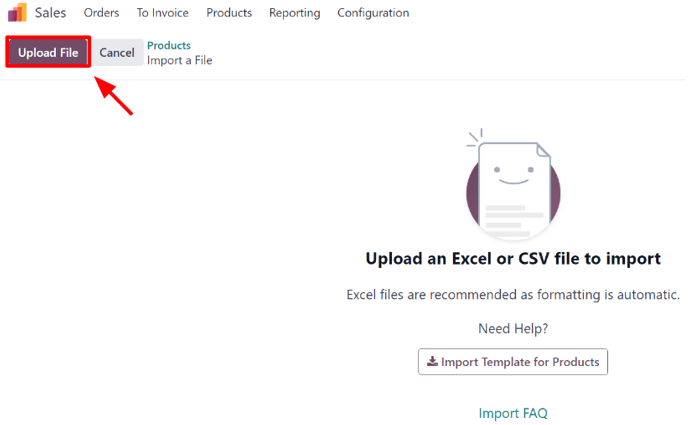
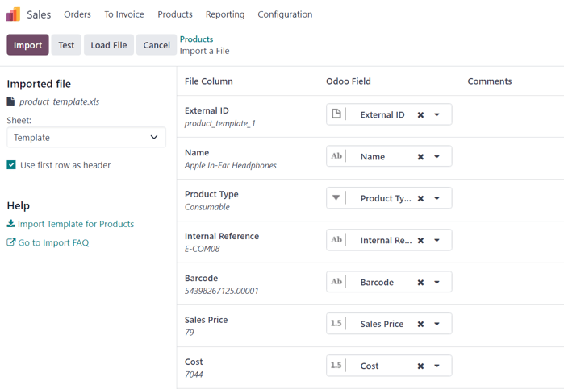
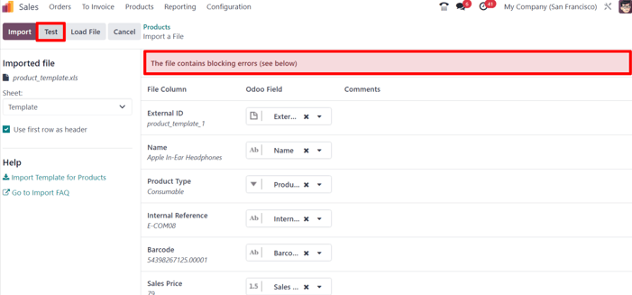
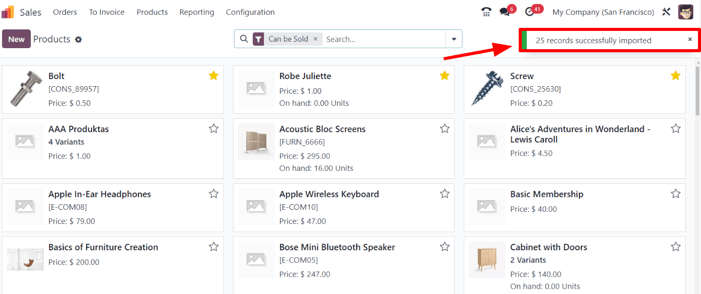

# Mahsulotlarni import qilish

Odoo *Sales* moduli mahsulotlarni kategoriyalar va variantlar bilan import qilish uchun shablon taqdim etadi. Bu shablonni istalgan elektron jadval dasturi (Microsoft Excel, OpenOffice, Google Sheets va h.k.) bilan ochish va tahrirlash mumkin.

Ushbu elektron jadval to'g'ri to'ldirilgandan so'ng, uni tezda Odoo ma'lumotlar bazasiga yuklash mumkin. Yuklangandan so'ng, bu mahsulotlar darhol qo'shiladi, foydalanish mumkin bo'ladi va mahsulot katalogida tahrirlash imkoniyati paydo bo'ladi.

## Import shabloni

Mahsulotlarni kategoriyalar va variantlar bilan import qilish uchun *`Import Template for Products`* **albatta** yuklab olinishi kerak. Yuklab olingandan so'ng, shablonni sozlash va moslash mumkin, keyin esa uni qaytadan Odoo ma'lumotlar bazasiga yuklash mumkin.

Kerakli import shablonini yuklab olish uchun `Sales app ‣ Products ‣ Products` bo'limiga o'ting. `Products` sahifasida yuqori chap burchakdagi `⚙️ (gear)` belgisini bosing. Bu tugma bosilganda pastga ochiluvchi menyu paydo bo'ladi.

Ushbu pastga ochiluvchi menyudan `Import records` variantini tanlang.

`Import records` ni tanlash `Import Template for Products` ni yuklab olish havolasi bilan alohida sahifani ochadi. Shablonni yuklab olish uchun ushbu havolani bosing.

Shablon yuklab olinishi tugagandan so'ng, uni sozlash uchun elektron jadval faylini oching.

## Mahsulot import shablonini sozlash

Import shabloni yuklab olinib ochilgandan so'ng, uning mazmunini o'zgartirish vaqti keldi. Biroq, har qanday o'zgarish kiritishdan oldin, jarayon davomida yodda tutish kerak bo'lgan bir nechta elementlar mavjud:

- Kerak bo'lmagan ustunlarni olib tashlashingiz mumkin. Biroq, `Internal Reference` ustunini saqlab qolish *qat'iy tavsiya etiladi*.

  Majburiy bo'lmasa ham, har bir mahsulot uchun `Internal Reference` ustunida noyob identifikator (masalan, [FURN_001]) bo'lishi ko'p hollarda foydali bo'lishi mumkin. Bu hatto avvalgi dastur elektron jadvallaridan ham bo'lishi mumkin, bu Odoo ga o'tishni osonlashtiradi.

  Masalan, import qilingan mahsulotlarni yangilashda, bir xil faylni bir necha marta import qilish mumkin, bu esa dublikatlar yaratmasdan import qilingan mahsulotlarni boshqarishning samaradorligi va soddaligini oshiradi.

- Import qilinishi kerak bo'lgan ustunlar nomlarini **o'zgartirmang**. Aks holda, Odoo ularni taniy olmaydi va foydalanuvchi ularni import ekranida qo'lda moslashtirishi kerak bo'ladi.

- Agar xohlasangiz, shablon elektron jadvaliga yangi ustunlar qo'shishingiz mumkin. Biroq, qo'shilishi uchun bu maydonlar Odoo da **mavjud bo'lishi kerak**. Agar Odoo ustun nomini maydon bilan moslashtirib bo'lmasa, import jarayoni davomida uni qo'lda moslashtirish mumkin.

  Tugallangan shablonni import qilish jarayoni davomida Odoo yangi sozlangan mahsulot shablon elektron jadvalining barcha elementlarini `File Column`, `Odoo Field` va `Comments` bo'yicha ajratilgan holda ko'rsatadigan sahifani ochadi.

  Ustun nomini Odoo dagi maydon bilan qo'lda moslashtirish uchun qo'lda sozlash kerak bo'lgan `File Column` yonidagi `Odoo Field` pastga ochiluvchi menyusini bosing va ushbu pastga ochiluvchi menyudan tegishli maydonni tanlang.

  

## Mahsulot shablon elektron jadvalini import qilish

Mahsulot shablon elektron jadvalini sozlashdan so'ng, shablon yuklab olish havolasi joylashgan Odoo mahsulot import sahifasiga qaytib, yuqori chap burchakdagi `Upload File` tugmasini bosing.

Keyin paydo bo'ladigan popup oynasida tugallangan mahsulot shablon elektron jadval fayli tanlanishi va Odoo ga yuklanishi kerak.

Shundan so'ng, Odoo yangi sozlangan mahsulot shablon elektron jadvalining barcha elementlarini `File Column`, `Odoo Field` va `Comments` bo'yicha ajratilgan holda ko'rsatadigan sahifani ochadi.

Bu yerdan kerak bo'lsa, `File Column` ni `Odoo Field` ga qo'lda tayinlash mumkin.

Hamma narsa mos va barcha ustunlar va maydonlar to'g'ri joylashganligiga ishonch hosil qilish uchun yuqori chap burchakdagi `Test` tugmasini bosing.

Agar hamma narsa to'g'ri joylashgan va qo'llanilgan bo'lsa, Odoo sahifaning yuqori qismida foydalanuvchiga `Everything seems valid` deb xabar beruvchi ko'k banner ko'rsatadi.

Agar biron-bir xatoliklar bo'lsa, Odoo sahifaning yuqori qismida muayyan muammolarni qayerdan topish va ularni qanday tuzatish haqida ko'rsatmalar bilan qizil banner ko'rsatadi.

Ushbu xatoliklar tuzatilgandan so'ng, barcha kerakli muammolar to'g'ri hal qilinganligiga ishonch hosil qilish uchun yana `Test` ni bosing.

Agar qo'shimcha mahsulot shablon elektron jadvallarini yuklash kerak bo'lsa, `Load File` tugmasini bosing, kerakli mahsulot shablon elektron jadvalini tanlang va jarayonni takrorlang.

Hamma narsa tayyor bo'lganda, `Import` tugmasini bosing.

Bosilganda, Odoo bu mahsulotlarni darhol import qiladi va yuqori o'ng burchakda popup xabar bilan asosiy `Products` sahifasini ko'rsatadi. Bu popup xabar foydalanuvchiga nechta mahsulot muvaffaqiyatli import qilinganligini bildiradi.

Ushbu nuqtada barcha yangi import qilingan mahsulotlarga `Products` sahifasi orqali kirish va tahrirlash mumkin.

## Bog'lanish maydonlari, atributlar va variantlarni import qilish

Shuni ta'kidlash kerakki, Odoo obyekti doimo boshqa ko'plab obyektlar bilan bog'lanadi. Masalan, mahsulot mahsulot kategoriyalari, atributlari, sotuvchilar va shunga o'xshash narsalar bilan bog'langan. Bu bog'lanishlar/ulanishlar munosabatlar deb nomlanadi.

::: tip

Mahsulot munosabatlarini import qilish uchun tegishli obyektning yozuvlari **avval** o'zlarining ro'yxat menyusidan import qilinishi **kerak**.
::::

### Bog'lanish maydonlari

Odoo dagi mahsulot formalarida istalgan vaqtda o'zgartirilishi va sozlanishi mumkin bo'lgan bir qator maydonlar mavjud. Bu maydonlar mahsulot formasidagi har bir tab ostida joylashgan. Bu maydonlar mahsulot formasida bevosita osongina tahrirlanishi mumkin bo'lsa-da, ularni mahsulot import orqali ham o'zgartirish mumkin.

Yuqorida aytib o'tilganidek, bunday bog'lanish maydonlari mahsulotlar uchun **faqat** ma'lumotlar bazasida mavjud bo'lsagina import qilinishi mumkin. Masalan, agar foydalanuvchi *`Product Type`* bilan mahsulotni import qilishga harakat qilsa, bu faqat ma'lumotlar bazasida mavjud bo'lgan oldindan sozlangan mahsulot turlaridan biri bo'lishi mumkin (masalan, *`Storable Product`*, *`Consumable`* va h.k.).

Mahsulot import shablon elektron jadvalida bog'lanish maydoni uchun ma'lumot import qilish uchun maydon nomini elektron jadvaldagi ustun nomi/sarlavhasi sifatida qo'shing. Keyin tegishli mahsulot qatorida kerakli bog'lanish maydoni variantini qo'shing.

Barcha kerakli bog'lanish maydoni ma'lumotlari kiritilgandan so'ng, elektron jadvalni saqlang va yuqorida aytib o'tilgan jarayon bo'yicha uni ma'lumotlar bazasiga import qiling (`Sales app ‣ Products ‣ Products ‣ ⚙️ (gear) icon ‣ Import records ‣ Upload File`).

Yangi sozlangan bog'lanish maydoni ma'lumotlari bilan elektron jadval yuklangandan so'ng, `Import` ni bosing va Odoo `Products` sahifasiga qaytadi.

Yangi bog'lanish maydoni ma'lumotlari bilan yangi o'zgartirilgan/o'zgartirilgan mahsulotlar import qilinib yuklangandan so'ng, bu yangi ma'lumotlarni `Products` sahifasida topish mumkin.

### Atributlar va qiymatlar

Odoo shuningdek foydalanuvchilarga ma'lumotlar bazasida mavjud bo'lgan mahsulotlar uchun va/yoki import qilingan mahsulotlar bilan ishlatilishi mumkin bo'lgan mahsulot atributlari va qiymatlarini import qilish imkonini beradi.

Atributlar va qiymatlarni import qilish uchun, atributlar va qiymatlarga bag'ishlangan alohida elektron jadval yoki CSV fayl boshqa mahsulotlar uchun ishlatilishidan oldin import qilinishi va yuklanishi **kerak**.

Atributlar va qiymatlar elektron jadvalining ustun nomlari/sarlavhalari quyidagicha bo'lishi kerak: `Attribute`, `Display Type`, `Variant Creation Mode` va `Values / Value`.

- `Attribute`: atribut nomi (masalan, [Size]).
- `Display Type`: mahsulot konfiguratorida ishlatiladigan ko'rsatish turi. Uchta ko'rsatish turi varianti mavjud:
  - `Radio`: qiymatlar radio tugmalar sifatida ko'rsatiladi
  - `Selection`: qiymatlar tanlov ro'yxatida ko'rsatiladi
  - `Color`: qiymatlar rang tanlovi sifatida belgilanadi
- `Variant Creation Mode`: mahsulotga qo'llanilganda variantlar qanday yaratilishi. Uchta variant yaratish rejimi varianti mavjud:
  - `Instantly`: atribut va uning qiymatlari mahsulotga qo'shilishi bilanoq barcha mumkin bo'lgan variantlar yaratiladi

  - `Dynamically`: har bir variant **faqat** uning tegishli atributlari va qiymatlari savdo buyurtmasiga qo'shilgandagina yaratiladi

  - `Never`: atribut uchun variantlar **hech qachon** yaratilmaydi

    ::: tip
    : tip

Bir nechta qiymatlarni import qilish uchun mahsulot import shablon elektron jadvalida ularni *faqat* vergul bilan ajrating, **bo'shliq bilan keyingi vergul emas** (masalan, [furniture,couch,home]).
::::

Kerakli mahsulotlar va mahsulot variantlari elektron jadvalga kiritilib saqlanganidan so'ng, ularni Odoo ga import qilish va yuklash vaqti keldi. Buning uchun `Sales app ‣ Products ‣ Products ‣ ⚙️ (gear) icon ‣ Import records ‣ Upload File` ga o'ting.

Yangi sozlangan mahsulotlar va mahsulot variantlari bilan elektron jadval yuklangandan so'ng, `Import` ni bosing va Odoo `Products` sahifasiga qaytadi. Yangi qo'shilgan mahsulotlarni o'sha yerda topish mumkin.

Istalgan mahsulotlardagi atributlar va variantlarni ko'rish va o'zgartirish uchun `Products` sahifasidan kerakli mahsulotni tanlang va `Attributes & Variants` tabini bosing.