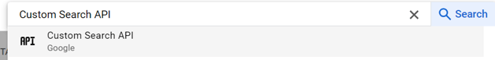
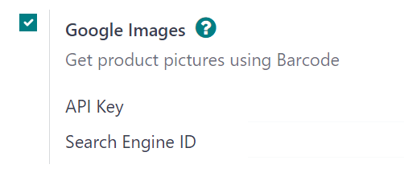

# Google Images bilan mahsulot rasmlari

Odoo-da tegishli mahsulot rasmlarining bo'lishi bir qancha sabablarga ko'ra foydalidir. Biroq, agar ko'plab mahsulotlar
uchun rasmlar kerak bo'lsa, ularni tayinlash juda ko'p vaqt talab qilishi mumkin.

Yaxshiyamki, Odoo ma'lumotlar bazasida *Google Custom Search* API-ni sozlash orqali mahsulotlar uchun rasm topish (
ularning shtrix-kodlari asosida) juda samarali bo'ladi.

## Sozlash

Odoo ma'lumotlar bazasida *Google Custom Search*-dan foydalanish uchun ham ma'lumotlar bazasi, ham Google API to'g'ri
sozlanishi kerak.

::: tip

Bepul Google hisoblari foydalanuvchilarga kuniga 100 tagacha bepul rasm tanlash imkonini beradi. Agar ko'proq miqdor
kerak bo'lsa, to'lov yangilanishi talab qilinadi.
::::

### Google API dashboard

1. Google Custom Search API hisobga olish ma'lumotlarini yaratish
   uchun [Google Cloud Platform API & Services](https://console.developers.google.com/) sahifasiga o'ting. Keyin Google
   hisobi bilan kiring. Keyingi, katakchani belgilash va `Agree and Continue` tugmasini bosish orqali ularning
   `Terms of Service`-ga rozi bo'ling.

2. Bu yerdan hisobga olish ma'lumotlarini saqlash uchun API loyihasini tanlang (yoki yarating). Esda qolarli
   `Project Name` berish bilan boshlang, `Location`-ni tanlang (agar mavjud bo'lsa), keyin `Create` tugmasini bosing.

3. Chap yon panelda `Credentials` tanlovi tanlanganida, `Create Credentials` tugmasini bosing va ochiladigan menyudan
   `API key`-ni tanlang.

   

4. Bunday qilish maxsus `API key`-ni o'z ichiga olgan `API key created` pop-up oynasini ko'rsatadi. Pop-up oynasidagi
   `Your API key`-ni nusxalab oling va saqlang -- u keyinroq ishlatiladi. Kalit nusxalanganidan keyin (va keyingi
   foydalanish uchun saqlangandan keyin), pop-up oynasini olib tashlash uchun `Close` tugmasini bosing.

   

5. Ushbu sahifada [Custom Search API]ni qidiring va uni tanlang.

   

6. `Custom Search API` sahifasidan `Enable` tugmasini bosish orqali API-ni yoqing.

   

### Google Programmable Search dashboard

1. Keyingi, [Google Programmable Search Engine](https://programmablesearchengine.google.com/) sahifasiga o'ting va
   `Get started` tugmalaridan birini bosing. Agar allaqachon kirmagansiz, Google hisobi bilan kiring.

   

2. `Create a new search engine` formasida qidiruv tizimining nomini, shuningdek tizim nimani qidirishi kerakligini
   to'ldiring va `Image Search` va `SafeSearch`-ni yoqishni unutmang.

   

3. `Create` tugmasini bosish orqali formani tasdiqlang.

4. Bunday qilish `Your new search engine has been created` sarlavhasi bilan yangi sahifani ko'rsatadi.

   

5. Ushbu sahifadan `Overview ‣ Basic` sahifasini ochish uchun `Customize` tugmasini bosing. Keyin `Search engine ID`
   maydonidagi ID-ni nusxalang. Bu ID Odoo sozlamasi uchun kerak.

   

### Odoo

1. Odoo ma'lumotlar bazasida `Settings app`-ga o'ting va `Integrations` bo'limigacha pastga aylantiring. Bu yerdan
   `Google Images` yonidagi katakchani belgilang. Keyin `Save` tugmasini bosing.

   

2. Keyingi, `Settings app`-ga qaytib, `Integrations` bo'limigacha pastga aylantiring. Keyin `Google Images` xususiyati
   ostidagi maydonlarda `API Key` va `Search Engine ID`-ni kiriting.

3. `Save` tugmasini bosing.

## Google Custom Search API bilan Odoo-da mahsulot rasmlari

Odoo-da mahsulotlarga rasm qo'shish har qanday mahsulot yoki mahsulot variantida amalga oshirilishi mumkin. Bu jarayon
mahsulot sahifalariga kirish imkonini beruvchi har qanday Odoo ilovasida bajarilishi mumkin (masalan, *Sales* ilovasi,
*Inventory* ilovasi va h.k.).

Quyida Odoo *Sales* ilovasidan foydalanib Odoo-da mahsulotlarga rasmlarni tayinlash uchun *Google Custom Search API*-dan
qanday foydalanishni batafsil tushuntiruvchi qadamma-qadam yo'riqnoma keltirilgan:

1. *Sales* ilovasida `Products` sahifasiga o'ting (`Sales app ‣ Products ‣ Products`). Yoki *Sales* ilovasida
   `Product Variants` sahifasiga o'ting (`Sales app ‣ Products ‣ Product Variants`).

2. Rasm kerak bo'lgan kerakli mahsulotni tanlang.

   ::: tip
   seelalso
   [Create, modify, or close your Google Cloud Billing account](https://cloud.google.com/billing/docs/how-to/manage-billing-account)
   :::