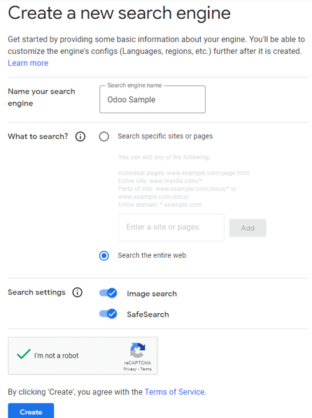
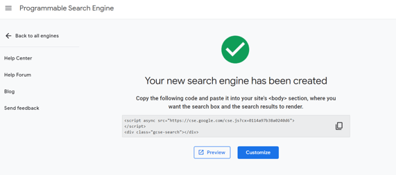

# Product images with Google Images

Having appropriate product images in Odoo is useful for a number of
reasons. However, if a lot of products need images, assigning them can
become incredibly time-consuming.

Fortunately, by configuring the *Google Custom Search* API within an
Odoo database, finding product images for products (based on their
barcode) is extremely efficient.

## Configuration 

In order to utilize *Google Custom Search* within an Odoo database, both
the database and the Google API must be properly configured.

::: tip

Free Google accounts allow users to select up to 100 free images per
day. If a higher amount is needed, a billing upgrade is required.
::::

### Google API dashboard 

1.  Go to the [Google Cloud Platform API &
    Services](https://console.developers.google.com/) page to generate
    Google Custom Search API credentials. Then, log in with a Google
    account. Next, agree to their `Terms of Service` by checking the box, and clicking `Agree and
    Continue`.

2.  From here, select (or create) an API project to store the
    credentials. Start by giving it a memorable
    `Project Name`, select a
    `Location` (if any), then click
    `Create`.

3.  With the `Credentials` option
    selected in the left sidebar, click `Create
    Credentials`, and select
    `API key` from the drop-down
    menu.

    

4.  Doing so reveals an `API key created` pop-up window, containing a custom `API
    key`. Copy and save
    `Your API key` in the pop-up
    window \-- it will be used later. Once the key is copied (and saved
    for later use), click `Close` to
    remove the pop-up window.

    

5.  On this page, search for [Custom Search API], and select
    it.

    

6.  From the `Custom Search API`
    page, enable the API by clicking `Enable`.

    

### Google Programmable Search dashboard 

1.  Next, go to [Google Programmable Search
    Engine](https://programmablesearchengine.google.com/), and click
    either of the `Get started`
    buttons. Log in with a Google account, if not already logged in.

    

2.  On the `Create a new search engine` form, fill out the name of the search engine, along
    with what the engine should search, and be sure to enable
    `Image Search` and
    `SafeSearch`.

    

3.  Validate the form by clicking `Create`.

4.  Doing so reveals a new page with the heading:
    `Your new search engine has been
    created`.

    

5.  From this page, click `Customize`
    to open the `Overview ‣ Basic` page. Then, copy the ID in the
    `Search engine ID` field. This ID
    is needed for the Odoo configuration.

    

### Odoo 

1.  In the Odoo database, go to the `Settings app` and scroll to the
    `Integrations` section. From
    here, check the box beside `Google Images`. Then, click `Save`.

    

2.  Next, return to the `Settings app`, and scroll to the
    `Integrations` section. Then,
    enter the `API Key` and
    `Search Engine ID` in the fields
    beneath the `Google Images`
    feature.

3.  Click `Save`.

## Product images in Odoo with Google Custom Search API 

Adding images to products in Odoo can be done on any product or product
variant. This process can be completed in any Odoo application that
provides access to product pages (e.g. *Sales* app, *Inventory* app,
etc.).

Below is a step-by-step guide detailing how to utilize the *Google
Custom Search API* to assign images to products in Odoo using the Odoo
*Sales* application:

1.  Navigate to the `Products` page
    in the *Sales* app (`Sales app ‣
    Products ‣ Products`). Or,
    navigate to the `Product Variants` page in the *Sales* app
    (`Sales app ‣ Products ‣ Product Variants`).

2.  Select the desired product that needs an image.

    ::: tip
     seealso
[Create, modify, or close your Google Cloud Billing
account](https://cloud.google.com/billing/docs/how-to/manage-billing-account)
:::
