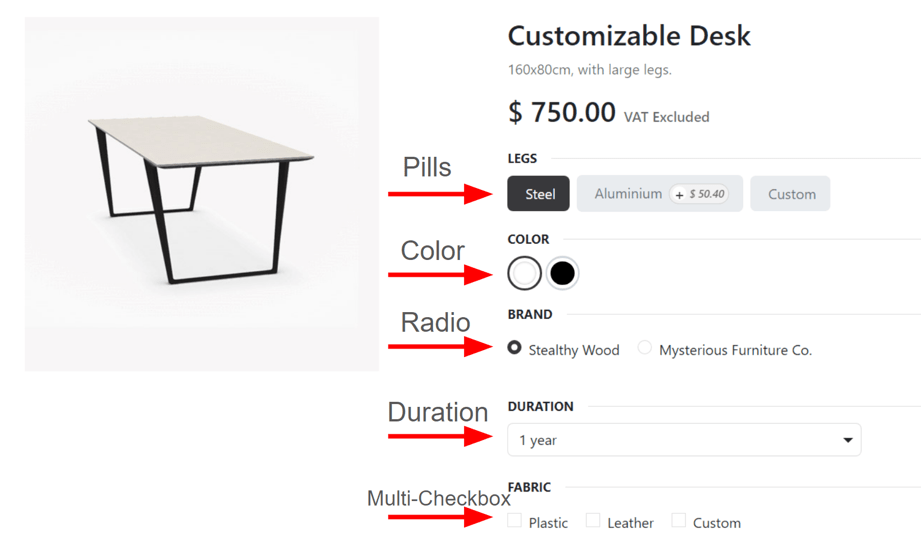

# Mahsulot variantlari

Mahsulot variantlari yagona mahsulotlarga turli xil xususiyatlar va mijozlar tanlashi mumkin bo'lgan imkoniyatlarni
berish uchun ishlatiladi, masalan o'lcham, uslub yoki rang va boshqalar.

Mahsulot variantlarini ularning individual mahsulot shabloni orqali boshqarish mumkin yoki `Product Variants` yoki
`Attributes` sahifalariga o'tish orqali. Bu barcha imkoniyatlar Odoo *Sales* dasturi ichida joylashgan.

::: tip
Kiyim kompaniyasi o'zining eng ko'p sotiladigan futbolkalari uchun quyidagi variant taqsimotiga ega:

- Klassik Futbolka
    - Rang: Ko'k, Qizil, Oq, Qora
    - O'lcham: S, M, L, XL, XXL

Bu yerda **Futbolka** mahsulot shabloni, **Futbolka: Ko'k, S** esa aniq mahsulot varianti hisoblanadi.

**Rang** va **O'lcham** *atributlar*, va tegishli variantlar (**Ko'k** va **S** kabi) *qiymatlar* hisoblanadi.

Bu holatda jami yigirma xil mahsulot varianti mavjud: to'rtta **Rang** varianti beshta **O'lcham** variantiga
ko'paytirilgan. Har bir variant Odoo'da o'zining inventar soni, sotuv jami va boshqa o'xshash yozuvlariga ega.
:::

## Konfiguratsiya

Mahsulot variantlarini ishlatish uchun Odoo *Sales* dasturida *Variants* sozlamasi **albatta** faollashtirilishi kerak.

Buning uchun `Sales app ‣ Configuration ‣ Settings` ga o'ting va sahifaning yuqorisidagi `Product Catalog` bo'limini
toping.

Shu bo'limda `Variants` funksiyasini yoqish uchun katagiga belgi qo'ying.

Keyin `Settings` sahifasining yuqorisidagi `Save` tugmasini bosing.

## Atributlar

Mahsulot variantlarini sozlashdan oldin atributlar **albatta** yaratilishi kerak. Atributlarni yaratish, boshqarish va
o'zgartirish uchun `Sales app ‣ Configuration ‣ Attributes` ga o'ting.

::: tip

`Attributes` sahifasidagi atributlar tartibi ularning *Product Configurator*, *Point of Sale* boshqaruv paneli va
*eCommerce* sahifalarida qanday ko'rinishini belgilaydi.
::::

`Attributes` sahifasidan yangi atribut yaratish uchun `New` tugmasini bosing. Bu turli xil usullarda sozlanishi va
konfiguratsiya qilinishi mumkin bo'lgan bo'sh atributlar formasini ochadi.

Birinchi navbatda [Color] yoki [Size] kabi `Attribute Name` yarating.

Keyin `Display Type` maydonidagi variantlardan birini tanlang. `Display Type` bu mahsulotning onlayn do'kon, *Point of
Sale* boshqaruv paneli va *Product Configurator*da qanday ko'rsatilishini belgilaydi.

`Display Type` variantlari:

- `Pills`: variantlar onlayn do'konning mahsulot sahifasida tanlanadigan tugmalar sifatida ko'rinadi.
- `Color`: variantlar har qanday HTML rang kodlarini aks ettiruvchi kichik, rangli kvadratlar sifatida ko'rinadi
- `Radio`: variantlar onlayn do'konning mahsulot sahifasida o'q uslubidagi ro'yxat sifatida ko'rinadi.
- `Select`: variantlar onlayn do'konning mahsulot sahifasida pastga tushuvchi menyu sifatida ko'rinadi.
- `Multi-checkbox (option)`: variantlar onlayn do'konning mahsulot sahifasida tanlanadigan belgilash katakchasi sifatida
  ko'rinadi.

`Variant Creation Mode` maydoni Odoo'ga atribut mahsulotga qo'shilganda yangi variantni avtomatik ravishda qachon
yaratishni bildiradi.

::: tip

`Multi-checkbox (option)`ning `Display Type` sifatida to'g'ri ishlashi uchun `Variant Creation Mode` maydoni **albatta**
`Never (option)` ga o'rnatilishi kerak.
::::

- `Instantly`: atributlar va qiymatlar mahsulot shabloniga qo'shilishi bilanoq barcha mumkin bo'lgan variantlarni
  yaratadi.
- `Dynamically`: **faqat** tegishli atributlar va qiymatlar savdo buyurtmasiga qo'shilgandagina variantlarni yaratadi.
- `Never (option)`: hech qachon avtomatik ravishda variantlar yaratmaydi.

:::: warning

Mahsulotga qo'shilgandan so'ng, atributning `Variants Creation Mode`ni tahrir qilib bo'lmaydi.
::::

`eCommerce Filter Visibility` maydoni mijozlar onlayn do'konda xarid qilishda bu atribut variantlarining old tomondan
ko'rinadigan yoki ko'rinmasligini belgilaydi.

- `Visible`: atribut qiymatlari mijozlarga old tomondan ko'rinadi.
- `Hidden`: atribut qiymatlari mijozlardan old tomonda yashirilgan.

Nihoyat, ixtiyoriy `eCommerce Category` maydonida qo'shimcha aniqlik va tashkilot uchun o'xshash atributlarni bir xil
bo'lim ostida guruhlash uchun pastga tushuvchi menyudan kategoriya tanlang.

::: tip

Tanlangan atribut kategoriyasi bilan bog'liq tafsilotlarni ko'rish uchun variant tanlanganidan keyin
`eCommerce Category` maydonining eng o'ng tomonidagi `fa-arrow-right` `(o'ng o'q)` ichki havola belgisini bosing. Bu shu
atribut kategoriyasining batafsil formasini ochadi.

Bu yerda yuqorida `Category Name` va `Sequence` ko'rsatilgan. Keyin kategoriya bilan bog'langan `Related Attributes`
ko'rsatilgan. Bu atributlarni istagan tartib bo'yicha sudrab o'tkazish mumkin.

Atributlarni `Add a line` tugmasini bosish orqali to'g'ridan-to'g'ri kategoriyaga qo'shish ham mumkin.
::::

::: tip

Atribut kategoriyasini to'g'ridan-to'g'ri shu maydondan yaratish uchun yangi kategoriya nomini yozishni boshlang, keyin
paydo bo'lgan pastga tushuvchi menyudan `Create` yoki `Create and edit...`ni tanlang.

`Create` tugmasini bosish kategoriyani yaratadi, uni keyinroq o'zgartirish mumkin. `Create and edit...` tugmasini bosish
kategoriyani yaratadi va yangi atribut kategoriyasini sozlash va moslashtirishda `Create Category` pop-ap oynasini
ochadi.
::::

### Atribut qiymatlari

Atribut qiymatlari `Attribute Values` yorlig'iga qo'shilishi kerak. Kerak bo'lsa, atributga istalgan vaqtda qiymatlar
qo'shish mumkin.

Qiymat qo'shish uchun `Attribute Values` yorlig'ida `Add a line` ni bosing.

Keyin `Value` ustuniga qiymat nomini kiriting. Keyin, agar qiymat maxsus bo'lsa (ya'ni mijoz shu aniq qiymatga xos noyob
spetsifikatsiyalarni taqdim etsa) `Is custom value` ustunidagi katagiga belgi qo'ying.

#### Ranglar

`Display Type` yonida `Color` variantini tanlang. Qiymat sozlamalarini o'zgartirish uchun `Attribute Values` yorlig'iga
o'ting.

Rangni tanlash uchun HTML rang tanlagich pop-ap oynasini ochadigan `Color` ustunidagi bo'sh aylanani bosing.

Bu pop-ap oynasida rang slayderni ma'lum bir rangga sudrab va rang gradiyenti oynasida rang qismini to'g'ridan-to'g'ri
bosish orqali aniq rangni tanlang.

Yoki *tomizgich* belgisini bosib, hozirda ekranda bosiladigan kerakli rangni tanlab aniq rangni tanlang.

Agar siz ma'lum naqshli mahsulotlar sotsangiz, mahsulot naqshini ko'rsatish uchun tasvir ham qo'shishingiz mumkin.
Buning uchun `fa-camera` `(kamera)` belgisini bosing, keyin `fa-pencil` `(qalam)` belgisini bosib mahalliy diskingizdan
tasvir tanlang. Bu naqsh elektron tijorat mahsulot sahifasida rang varianti sifatida ko'rinadi.

::: tip

Atributlarni yangi qator qo'shib va nomni `Variants` yorlig'iga yozish orqali to'g'ridan-to'g'ri mahsulot shablonidan
ham yaratish mumkin.
::::

Atribut mahsulotga qo'shilgandan so'ng, bu mahsulot atributning `Related Products` aqlli tugmasi orqali ro'yxatlanadi va
unga kirish mumkin. Bu tugma hozirda shu atributdan foydalanayotgan ma'lumotlar bazasidagi har bir mahsulotni ro'
yxatlaydi.

## Mahsulot variantlari

Atribut yaratilgandan so'ng, mahsulot variantini yaratish uchun atribut (va uning qiymatlarini) ishlatamiz. Buning uchun
`Sales app ‣ Products ‣ Products` ga o'ting va kerakli mahsulotning formasini ko'rish uchun mavjud mahsulotni tanlang.
Yoki mahsulot variantini qo'shish mumkin bo'lgan yangi mahsulot yaratish uchun `Create` tugmasini bosing.

Mahsulot formasida mahsulot uchun atributlar va qiymatlarni ko'rish, boshqarish va o'zgartirish uchun
`Attributes \& Variants` yorlig'ini bosing.

Mahsulotga atribut va keyingi atribut qiymatlarini qo'shish uchun `Attributes \& Variants` yorlig'ida `Add a line` ni
bosing. Keyin paydo bo'lgan pastga tushuvchi menyudan kerakli atributni tanlang.

::: tip

Atributlarni mahsulot formasining `Attributes \& Variants` yorlig'idan to'g'ridan-to'g'ri yaratish mumkin. Buning uchun
bo'sh maydoniga yangi atribut nomini yozishni boshlang va paydo bo'lgan kichik pastga tushuvchi menyudan `Create` yoki
`Create and edit...`ni tanlang.

`Create` tugmasini bosish atributni yaratadi, uni keyinroq moslashtirishingiz mumkin. `Create and edit...` tugmasini
bosish atributni yaratadi va `Create Attribute` pop-ap formasi paydo bo'ladi. Pop-ap formasida atributni turli xil
usullarda o'zgartirishga o'ting.
::::

`Attribute` ustunida atribut tanlanganidan so'ng, `Values` ustunida mavjud pastga tushuvchi menyu orqali mahsulotga
qo'llanishi kerak bo'lgan aniq atribut qiymatlarini tanlang.

::: tip

Qancha qiymat qo'shishda cheklov yo'q.
::::

::: tip

O'xshash mahsulot variant yaratish jarayonlariga Purchase, Inventory va eCommerce dasturlari orqali kirish mumkin.
::::

### Variantlarni sozlash

Atribut qatorining eng o'ng tomonida `Configure` tugmasi bor. Bosilganda, Odoo shu aniq `Product Variant Values`ni
ko'rsatadigan alohida sahifani ochadi.

Bu yerda aniq `Value` nomi, `HTML Color Index` (agar mavjud bo'lsa) va `Value Price Extra` ko'rinadi.

::: tip

`Value Price Extra` atribut tanlanganda sotuv narxining oshishini ifodalaydi.
::::

`Product Variant Values` sahifasida qiymat bosilganda, Odoo shu qiymatning tegishli tafsilotlarini batafsil
ko'rsatadigan alohida sahifani ochadi.

Aniq mahsulot variant batafsil sahifasida `Value` va `Value Price Extra` maydonlarini, shuningdek `Exclude for`
maydonini topish mumkin.

`Exclude for` maydoniga turli xil `Product Templates` va aniq `Attribute Values` qo'shish mumkin. Qo'shilganda, bu aniq
atribut qiymati shu aniq mahsulotlardan chiqarib tashlanadi.

### Variants aqlli tugmasi

Mahsulotning `Attributes \& Variants` yorlig'ida atributlar va variantlar sozlanganda, mahsulot formasining yuqorisida
`Variants` aqlli tugmasi paydo bo'ladi. `Variants` aqlli tugmasi shu aniq mahsulot uchun hozirda nechta variant
sozlanganligini ko'rsatadi.

`Variants` aqlli tugmasi bosilganda, Odoo shu aniq mahsulot uchun sozlangan barcha aniq mahsulot variant
kombinatsiyalarini ko'rsatadigan alohida sahifani ochadi.

## Variantlarning ta'siri

Mijozlarga batafsilroq mahsulot variantlarini taklif qilishdan tashqari, mahsulot variantlari Odoo ma'lumotlar bazasi
bo'ylab foydalanish mumkin bo'lgan o'zlarining ta'siriga ega.

- `Barcode`: shtrix-kodlar mahsulot shabloni o'rniga har bir variant bilan bog'langan. Har bir individual variant
  o'zining noyob shtrix-kodi/SKU'ga ega bo'lishi mumkin.

- `Price`: har bir mahsulot varianti o'zining ommaviy narxiga ega, bu mahsulot shabloni narxi *va* ma'lum atributlar
  uchun har qanday qo'shimcha to'lovlarning yig'indisi.

  ::: tip
  Qizil ko'ylakning sotuv narxi $23 -- chunki ko'ylak shablonining narxi $20, shuningdek qizil rang varianti uchun
  qo'shimcha $3. Narx ro'yxati qoidalarini mahsulot shabloni yoki variantga qo'llash uchun sozlash mumkin.
  :::

- `Inventory`: inventar har bir individual mahsulot varianti uchun hisoblanadi. Mahsulot shabloni formasida inventar
  barcha variantlarning yig'indisini aks ettiradi, lekin haqiqiy inventar individual variantlar bo'yicha hisoblanadi.

- `Picture`: har bir mahsulot varianti o'zining aniq rasriga ega bo'lishi mumkin.

::: tip

Mahsulot shablonidagi o'zgarishlar avtomatik ravishda shu mahsulotning har bir variantiga qo'llaniladi.
::::