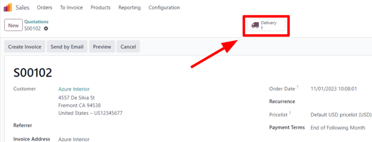
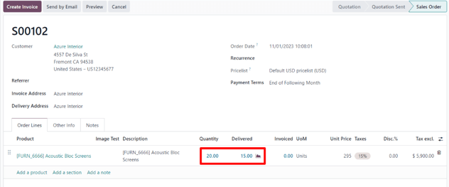

# Qaytarish va to'lovlarni qaytarish

Odoo *Sales* ilovasi qaytarishni qayta ishlash uchun ikki xil usulni taqdim etadi. Qo'llaniladigan usul schyot-faktura
yuborilganmi yoki yo'qmi bunga bog'liq.

## Schyot-faktura berishdan oldin

Mijoz schyot-faktura yuborilishi yoki tasdiqlashdan **oldin** mahsulotni qaytarishga qaror qilganda qaytarish *Teskari
o'tkazmalar* yordamida amalga oshiriladi.

::: tip

*Teskari o'tkazmalar*dan foydalanish uchun *Inventory* ilovasi **albatta** o'rnatilgan bo'lishi kerak.
::::

Schyot-faktura berishdan oldin qaytarishni boshlash uchun `Sales` ilovasiga o'ting, kerakli savdo buyurtmasini tanlang
va bog'langan yetkazib berish buyurtmasini ochish uchun `Delivery` aqlli tugmasini bosing.

Tasdiqlangan yetkazib berish buyurtmasida `Return` tugmasini bosing.

Bu `Reverse Transfer` oynasini ochadi.

Odatiy bo'lib, `Quantity` yetkazib berish buyurtmasidan tasdiqlangan miqdorlarga mos keladi. Agar kerak bo'lsa,
miqdorlarni yangilang. Uni qaytarishdan olib tashlash uchun satr elementining yonidagi `🗑️ (axlat qutisi)` belgisini
bosing.

Keyin qaytarishni tasdiqlash uchun `Return` tugmasini bosing. Bu qaytarilgan mahsulot(lar) uchun yangi ombor
operatsiyasini yaratadi.

Qaytarishni olgandan so'ng, ombor jamoasi `Validate` tugmasini bosish orqali ombor operatsiyasini tasdiqlaydi. Keyin asl
savdo buyurtmasida `Delivered` miqdori dastlabki tasdiqlangan miqdorlar va qaytarilgan miqdorlar o'rtasidagi farqni aks
ettirish uchun yangilanadi.

Schyot-faktura yaratilganda, mijoz **faqat** o'zi saqlab qolayotgan mahsulotlar uchun schyot-faktura oladi (agar mavjud
bo'lsa).

## Schyot-faktura berishdan keyin

Ba'zida mijozlar schyot-fakturani olgandan va/yoki to'lagandan keyin mahsulotni qaytaradilar. Bunday hollarda faqat
*Teskari o'tkazmalar*dan foydalangan holda qaytarish yetarli emas, chunki tasdiqlangan yoki yuborilgan
schyot-fakturalarni o'zgartirib bo'lmaydi.

Biroq, *Teskari o'tkazmalar* mijozning qaytarishini yakunlash uchun *Kredit Yozuvlari* bilan birgalikda ishlatilishi
mumkin.

Schyot-faktura berishdan keyin qaytarishni boshlash uchun `Sales` ilovasidagi tegishli savdo buyurtmasiga o'ting.

Agar savdo buyurtmasida ro'yxatga olingan to'lov mavjud bo'lsa, to'lov tafsilotlari suhbatda ko'rinadi va
schyot-faktura (`Invoices` aqlli tugmasi orqali kirish mumkin) yashil `In Payment` banneriga ega.

Savdo buyurtmasidan tasdiqlangan yetkazib berish buyurtmasini ko'rish uchun `Delivery` aqlli tugmasini bosing. Keyin
`Reverse Transfer` oynasini ochish uchun `Return` tugmasini bosing.

Keyin qaytarish uchun kerak bo'lganda `Product` va/yoki `Quantity`ni tahrirlang. Keyin `Return` tugmasini bosing. Bu
qaytarilgan mahsulot(lar) uchun yangi ombor operatsiyasini yaratadi, bu ombor jamoasi tomonidan qaytarish qabul
qilingandan keyin `Validate` tugmasini bosish orqali tasdiqlanadi.

Keyin savdo buyurtmasida `Delivered` miqdori dastlabki tasdiqlangan miqdorlar va qaytarilgan miqdorlar o'rtasidagi
farqni aks ettirish uchun yangilanadi.

Pulni qaytarishni qayta ishlash uchun tegishli schyot-fakturaga o'ting (savdo buyurtmasidan `Invoices` aqlli tugmasini
bosing). Keyin tasdiqlangan schyot-fakturaning yuqori qismidagi `Credit Note` tugmasini bosing.

Buni qilish `Credit Note` shaklini ochadi.

`Reason displayed on Credit Note` va kreditni qayta ishlash uchun maxsus `Journal`ni kiritishdan boshlang. Keyin maxsus
`Reversal Date`ni tanlang.

Ma'lumot to'ldirilgandan so'ng, `Reverse` yoki `Reverse and Create Invoice` tugmasini bosing. Keyin agar kerak bo'lsa,
qoralamani tahrirlang.

Nihoyat, kredit yozuvini tasdiqlash uchun `Confirm` tugmasini bosing.

Yakunlanganda sahifaning yuqori qismida ko'k banner paydo bo'ladi:
`You have outstanding credits for this customer. You can allocate them to mark this invoice as paid.`
