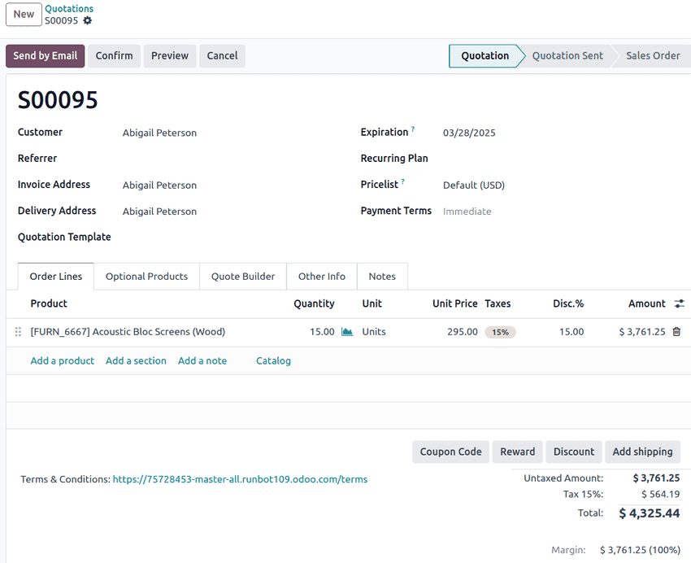

# Sotuv kotirovkalari

*Sotuv kotirovkasi* yoki taklif - bu mijozga yuborilgan hujjat bo'lib, tovarlar va xizmatlar uchun taxminiy xarajatlar
va shartlarni belgilaydi. Qabul qilingandan so'ng, kotirovka sotuv buyurtmasiga aylantirilishi mumkin, bu esa yetkazib
berish va hisob-faktura berishdan oldin yakuniy kelishuv vazifasini bajaradi.

## Sotuv jarayoniga umumiy koʻrinish

Kotirovkalar mijozlar bilan muloqotning dastlabki qiziqishdan to'lovgacha bo'lgan turli bosqichlarini bog'laydigan
kengroq sotuv jarayoniga mos keladi.

Odatiy jarayon quyidagi qadamlarni bajaradi:

1. *Kotirovka*: Mijozga mahsulot tafsilotlari va narxlar bilan yuborilgan taklif.
2. *Sotuv buyurtmasi*: Mijoz kotirovkani qabul qilganda avtomatik ravishda yaratiladi va sotuvni tasdiqlaydi.
3. *Yetkazib berish* (agar tegishli bo'lsa): Mahsulotlar jo'natiladi yoki xizmatlar ko'rsatiladi.
4. *Hisob-faktura*: Sotuv buyurtmasi yoki yetkazib berilgan mahsulotlar/xizmatlar asosida yakuniy hisob-faktura
   beriladi.
5. *To'lov*: Mijoz hisob-fakturani to'laydi va sotuv tsiklini yakunlaydi.

Ushbu jarayon biznesga sotuvning to'liq hayot tsiklini kuzatib borishga yordam beradi va ilovalar bo'ylab
ma'lumotlarning izchilligini saqlaydi.

Odoo-da kotirovkalar **Sales** ilovasida sozlashadi. Ular shuningdek, sotuv jarayonining bir qismi sifatida boshqa
ilovalardan ham yaratilishi mumkin:

- **CRM**: Potentsial bitimlarni kuzatib borish uchun `imkoniyatlarni takliflarga aylantiring`.
- **Helpdesk**: Pullik xizmatlar yoki mahsulotlarni taklif qilishda `chiptalardan takliflar yarating`.
- **Subscriptions**: Avtomatik hisob-kitob tsiklini boshlashdan oldin `takrorlanuvchi xizmatlarni taklif qiling`.

## Biznes bitimlaridagi sotuv kotirovkalari

Sotuv kotirovkalari sotuv jarayonining asosiy qadami bo'lib xizmat qiladi, mijozning tovarlar va xizmatlar haqidagi
dastlabki so'rovi bilan to'lov va yetkazib berish uchun yakuniy shartnoma kelishuvi o'rtasidagi bo'shliqni to'ldiradi.
Kotirovka shuningdek, narxlarda shaffoflikni ta'minlaydi, bu esa har ikki tomonning majburiyat olishdan oldin shartlarni
muhokama qilish va yakunlashiga yordam beradi.

Sotuv kotirovkalari biznes operatsiyalarida hal qiluvchi rol o'ynaydi: oxirgi mijozga nima sotilayotganining doirasi va
narxini belgilash; narx, yetkazib berish, soliq va to'lov shartlari bo'yicha aniq kutishlarni o'rnatish; va
kelishilishdan oldin biznes bitimini muhokama qilish mumkin bo'lgan hujjatlashtirilgan bosqichni ta'minlash orqali.

## Sotuv kotirovkasining asosiy tarkibiy qismlari

Yaxshi tuzilgan sotuv kotirovkasi quyidagilardan iborat:

- Kotirovka raqami va sanasi: Kuzatish va ma'lumotnoma uchun noyob identifikator, shuningdek
  `berilish va amal qilish muddati sanalari`. Odoo **Sales** ilovasida kotirovka raqami tasdiqlangandan so'ng standart
  nomlash konventsiyasi ostida tayinlanadi.
- Mijoz ma'lumotlari: Mijoz nomi va aloqa ma'lumotlari, shuningdek `hisob-faktura va yetkazib berish manzili`.
- Mahsulotlar va xizmatlar: Xarid qilinadigan narsalarning batafsil ro'yxati, shu jumladan miqdor, spetsifikatsiyalar (
  kerak bo'lganda) va birlik narxi.
- To'lov shartlari va `narx ro'yxatlari`: Ushbu maxsus sotuv kotirovkasining narxlash va to'lovi uchun sozlangan
  kelishuvlar va qoidalar.
- Maxsus narxlash: Alohida mahsulot qatorlarini yangilash va/yoki o'zgartirish uchun ixtiyoriy
  `chegirmalar va reklama narxlari`.
- Umumiy xarajat va valyuta: Tegishli soliqlar bilan birga mahsulot yoki xizmat va yetkazib berish narxlarining umumiy
  summasi.

Odoo-ning **Sales** ilovasida kotirovkalar qo'shimcha tafsilotlar va konfiguratsiyalarni o'z ichiga olishi mumkin,
masalan `kotirovka shablonlari`, `obuna rejalari` va `sotuv jamoasi yo'naltiruvchi nomi`.

