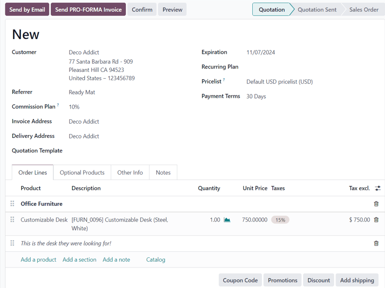

# Taklifnomalar yaratish

Odoo **Savdo** modulida mijozlarga taklifnomalar yaratish va yuborish mumkin. Taklifnoma tasdiqlangach, u rasmiy
ravishda *sotuv buyurtmasi*ga aylanadi, undan keyin esa hisob-faktura chiqariladi va to‘lov amalga oshiriladi.

## Taklifnoma sozlamalari

Ushbu sozlamalarga kirish uchun `Savdo ilovasi ‣ Konfiguratsiya ‣ Sozlamalar` yo‘liga o‘ting va
`Taklifnomalar va Buyurtmalar` bo‘limigacha pastga tushing.

- `Taklifnoma Shablonlari`: Standart mahsulot takliflarini o‘z ichiga olgan taklifnoma shablonlarini yaratish imkonini
  yoqing. Ushbu belgi belgilanganda, `Standart Shablon` degan qo‘shimcha maydon va `Taklifnoma Shablonlari` sahifasiga
  havola paydo bo‘ladi.
- `Onlayn Imzo`: Buyurtmalarni tasdiqlash uchun onlayn imzo so‘rang.
- `Onlayn To‘lov`: Mijozlardan buyurtmani tasdiqlash uchun oldindan (to‘liq yoki qisman) onlayn to‘lov talab qiling.
  Ushbu belgi belgilanganda, `Oldindan to‘lov miqdori (%)` maydoni va `To‘lov Provayderlari` sahifasiga havola paydo
  bo‘ladi.
- `Standart Taklifnoma Amal Qilish Muddati`: Taklifnomalar necha kun amal qilishini belgilang.
- `Standart Qaytalanish`: Yangi taklifnoma uchun qaytalanish davrini tanlang.
- `Savdo Ogohlantirishlari`: Maxsus mahsulotlar yoki mijozlar bo‘lgan buyurtmalarda ogohlantirish xabarlarini oling.
- `PDF Taklifnoma Yaratgichi`: Taklifnomalarni sarlavha sahifasi, mahsulot tavsifi, pastki sahifalar va boshqalar bilan
  sozlang.
- `Tasdiqlangan Savdolarni Bloklash`: Tasdiqlangan buyurtmalar ustida keyingi tahrirlarni oldini oling.
- `Pro-Forma Hisob-faktura`: Mijozlarga pro-forma hisob-fakturalarni yuboring.

Ushbu sozlamalarning istalgan birini faollashtirish uchun mos variant yonidagi belgi (checkbox) ni belgilang. So‘ng
`Saqlash` tugmasini bosing.

## Taklifnomalar boshqaruv paneli

*Taklifnomalar* boshqaruv paneli — bu `Savdo ilovasi` ochilganda ko‘rinadigan sahifa hisoblanadi.

Odatiy holatda, `Taklifnomalar` boshqaruv panelida bazadagi foydalanuvchiga tegishli barcha taklifnomalar ko‘rsatiladi.
Buni izlash panelidagi standart `Mening taklifnomalarim` filtri orqali ko‘rish mumkin.

::: tip

Bazadagi *barcha* taklifnomalarni ko‘rish uchun izlash panelidan `Mening taklifnomalarim` filtrini olib tashlang.

:::

Ushbu sahifadagi taklifnomalar odatda ro‘yxat ko‘rinishida (`List view`) ko‘rsatiladi, lekin quyidagi ko‘rinishlarda ham
ko‘rish mumkin:

- `Kanban`
- `Kalendar`
- `Pivot jadvali`
- `Grafik`
- `Faollik`

`Taklifnomalar` boshqaruv panelidagi istalgan taklifnomani ko‘rish yoki tahrirlash uchun ro‘yxatdagi kerakli qatorda
sichqoncha bilan bosing — Odoo tanlangan taklifnomaga tegishli shaklni ochib beradi.

## Taklifnoma yaratish

Taklifnoma yaratish uchun `Savdo ilovasi`ni oching va `Taklifnomalar` boshqaruv panelining yuqori chap burchagidagi
`Yangi` tugmasini bosing.

::: warning

`Yangi` tugmasi **faqat** `Taklifnomalar` boshqaruv paneli ro‘yxat (list) yoki Kanban ko‘rinishida bo‘lsa, ko‘rinadi.

:::

`Yangi` tugmasi bosilganda, turli maydonlar va tablar bilan to‘ldiriladigan bo‘sh taklifnoma shakli ochiladi.

Shaklning yuqori qismidagi `Mijoz` (`Customer`) maydoniga mijoz nomini kiriting. Bu **majburiy** maydon hisoblanadi.

Agar mijozning ma'lumotlari allaqachon bazada mavjud bo‘lsa, `Hisob-faktura manzili` (`Invoice Address`) va
`Yetkazib berish manzili` (`Delivery Address`) maydonlari avtomatik tarzda mijozning **Aloqalar** (Contacts) ilovasidagi
ma’lumotlar asosida to‘ldiriladi.

Agar mijoz boshqa mijoz yoki kontakt orqali yo‘naltirilgan bo‘lsa, `Yo‘naltiruvchi` (`Referrer`) maydoniga ularning
ismini kiriting.

Agar `Yo‘naltiruvchi` tanlansa, `Komissiya Rejasi` (`Commission Plan`) degan yangi maydon paydo bo‘ladi. Bu yerda
yo‘naltiruvchi kontaktga beriladigan komissiya foizi tanlanadi.

Agar `Hisob-faktura manzili` va `Yetkazib berish manzili` avtomatik to‘ldirilmagan bo‘lsa, ularni qo‘lda to‘ldiring.
Ikkalasi ham **majburiy** maydonlardir.

So‘ngra, istalgan bo‘lsa, `Taklifnoma Shabloni` (`Quotation Template`) ni tanlang. E’tibor bering, tanlangan shablon
asosida qo‘shimcha maydonlar paydo bo‘lishi mumkin.

`Amal qilish muddati` (`Expiration`) maydonidagi sana `Savdo ilovasi ‣ Konfiguratsiya ‣ Sozlamalar` bo‘limida
belgilangan `Taklifnoma amal qilish muddati` asosida avtomatik ko‘rsatiladi.

::: tip

Taklifnoma shabloni ishlatilganda, `Amal qilish muddati` maydonidagi sana shablon formasidagi `Taklifnoma muddati`
qiymatiga asoslanadi.

:::

Agar taklifnoma takrorlanuvchi mahsulot yoki obuna uchun bo‘lsa, mos `Takrorlanish Rejasi` (`Recurring Plan`) ni
tanlang.

Istasangiz, ushbu taklifnomaga qo‘llaniladigan maxsus `Narxlar ro‘yxati` (`Pricelist`) ni tanlang.

Va nihoyat, bu taklifnoma uchun foydalaniladigan aniq `To‘lov shartlari` (`Payment Terms`) ni tanlang.

### Buyurtma Qatorlari tab

Taklifnoma formasidagi birinchi tab — bu `Buyurtma qatorlari` (`Order Lines`) tabidir.

Ushbu tabda mahsulotlar va ularning miqdorlarini tanlab, taklifnomaga qo‘shish mumkin.

Bu tab orqali mahsulotlarni taklifnomaga qo‘shishning ikki usuli mavjud:

1. `Mahsulot qo‘shish` (`Add a product`) tugmasini bosing, `Mahsulot` (`Product`) ochiluvchi ro‘yxatidan kerakli
   mahsulotni tanlang va kerak bo‘lsa, miqdorini o‘zgartiring.

2. Yoki `Katalog` (`Catalog`) tugmasini bosing — bu sizga mahsulotlar va ularning variantlari to‘liq ko‘rinadigan
   alohida sahifani ochadi. Mahsulotlar `Mahsulot kategoriyasi` (`Product Category`) va `Xususiyatlar` (`Attributes`)
   bo‘yicha saralanadi.

Bu sahifadan kerakli mahsulotlarni toping, mahsulot kartasidagi `Qo‘shish` (`Add`) tugmasini bosing va kerak bo‘lsa,
miqdorini belgilang. Tugatganingizdan so‘ng, yuqori chapdagi `Taklifnomaga qaytish` (`Back to Quotation`) tugmasini
bosing. Yangi tanlangan mahsulotlar `Buyurtma qatorlari` tabida paydo bo‘ladi.

Agar bir nechta mahsulotlarni yaxshiroq tartib bilan ko‘rsatmoqchi bo‘lsangiz, `Bo‘lim qo‘shish` (`Add a section`)
tugmasini bosing, bo‘lim nomini yozing va bo‘lim sarlavhasini kerakli joyga suring. Bu bo‘lim sarlavhasi **qalin**
harflar bilan ko‘rsatiladi.

Agar kerak bo‘lsa, mahsulot qatordagi `Izoh qo‘shish` (`Add a note`) tugmasi orqali maxsus eslatma qo‘shishingiz mumkin.
Bu izoh *kursiv*da ko‘rsatiladi. Keyin, bu eslatmani kerakli mahsulot qatorining ostiga ko‘chirib qo‘yishingiz mumkin.

Mahsulot qatorlarining ostida quyidagi funksiyalarni qo‘llash mumkin bo‘lgan tugmalar mavjud:

- `Kupon kodi` (`Coupon Code`)
- `Aksiyalar` (`Promotions`)
- `Chegirma` (`Discount`)
- `Yetkazib berish qo‘shish` (`Add shipping`)

### Ixtiyoriy mahsulotlar tab

`Ixtiyoriy mahsulotlar` (`Optional Products`) tabini oching va mijozga taklif qilinishi mumkin bo‘lgan, sotuv hajmini
oshirishi ehtimoli bo‘lgan bog‘liq mahsulotlarni tanlang.

Masalan, agar mijoz avtomobil xarid qilmoqchi bo‘lsa, unga *Tirkama ilgagich* (Trailer Hitch) kabi qo‘shimcha mahsulot
taklif qilinishi mumkin.

### Boshqa ma’lumotlar tab

`Boshqa ma’lumotlar` (`Other Info`) tabida taklifnomaga oid bir qancha konfiguratsiyalar mavjud bo‘lib, ular to‘rt xil
bo‘limga ajratilgan:

- `Savdo` (`Sales`)
- `Yetkazib berish` (`Delivery`)
- `Hisob-kitob` (`Invoicing`)
- `Kuzatuv` (`Tracking`)

::: tip

Ba’zi maydonlar **faqat** maxsus sozlamalar va parametrlar faollashtirilgan bo‘lsa, ko‘rinadi.

:::

#### Savdo bo‘limi

`Boshqa ma’lumotlar` (`Other Info`) tabining `Savdo` (`Sales`) bo‘limida savdoga oid maxsus maydonlarni sozlash mumkin.

- `Savdo vakili` (`Salesperson`): Ushbu taklifnomaga biror savdo vakilini tanlang. Odatiy holatda, taklifnomani yaratgan
  foydalanuvchi shu yerda avtomatik tanlanadi.
- `Savdo guruhi` (`Sales Team`): Taklifnomaga aniq bir savdo guruhini biriktiring. Agar tanlangan `Savdo vakili` biror
  savdo guruhiga mansub bo‘lsa, bu maydon avtomatik to‘ldiriladi.
- `Kompaniya` (`Company`): Taklifnoma qaysi kompaniyaga tegishli bo‘lishini tanlang. Bu maydon faqat ko‘p kompaniyali (
  multi-company) muhitda ko‘rinadi.
- `Onlayn imzo` (`Online signature`): Buyurtmani tasdiqlash uchun mijozdan onlayn imzo talab qilish uchun ushbu belgi (
  checkbox) ni belgilang. Bu maydon faqat *Onlayn Imzo* sozlamasi yoqilgan bo‘lsa ko‘rinadi.
- `Onlayn to‘lov` (`Online payment`): Mijozdan buyurtmani tasdiqlash uchun onlayn to‘lov talab qilish uchun belgi
  qo‘ying va yonidagi maydonga foizni kiriting. Bu maydon faqat *Onlayn To‘lov* sozlamasi yoqilgan bo‘lsa ko‘rinadi.
- `Mijoz havolasi` (`Customer Reference`): Mijoz uchun maxsus havola (ID) kiriting. U harflar, raqamlar yoki
  ikkalasining aralashmasidan iborat bo‘lishi mumkin.
- `Teglar` (`Tags`): Taklifnomani tartibga solish va qidiruvda qulaylik yaratish uchun unga teglar qo‘shing. Zarur
  bo‘lsa, bir nechta teg qo‘shilishi mumkin.

#### Yetkazib berish bo‘limi

`Boshqa ma’lumotlar` (`Other Info`) tabining `Yetkazib berish` (`Delivery`) bo‘limida yetkazib berishga oid maxsus
maydonlar mavjud.

- `Yuk vazni` (`Shipping Weight`): Yetkazilayotgan mahsulotlarning umumiy vaznini ko‘rsatadi. Bu maydon tahrir qilib
  bo‘lmaydi. Mahsulot vazni har bir mahsulot formasida alohida belgilanadi.
- `Incoterm`: Xalqaro savdo shartlari (Incoterm) dan birini tanlang. Bu xalqaro bitimlar uchun oldindan belgilangan
  shartlardir.
- `Incoterm manzili` (`Incoterm Location`): Agar Incoterm ishlatilayotgan bo‘lsa, bu yerga xalqaro manzilni kiriting.
- `Yetkazib berish siyosati` (`Shipping Policy`): Ochiluvchi ro‘yxatdan kerakli yetkazib berish siyosatini tanlang. Agar
  barcha mahsulotlar bir vaqtning o‘zida yetkazilsa, buyurtma eng uzoq yetkazish muddati asosida rejalashtiriladi. Aks
  holda, eng qisqa muddat asosida rejalashtiriladi. Mavjud variantlar: `Imkon qadar tez` yoki
  `Barcha mahsulotlar tayyor bo‘lganda`.
- `Yetkazib berish sanasi` (`Delivery Date`): Bo‘sh maydonga bosganingizda taqvim ochiladi, shu yerdan mijoz uchun
  yetkazib berish sanasini tanlang. Agar maxsus sana kerak bo‘lmasa, ushbu maydonning o‘ng tomonidagi `Kutilayotgan` (
  `Expected`) sanasiga e’tibor bering.

#### Hisob-kitob bo‘limi

`Boshqa ma’lumotlar` (`Other Info`) tabining `Hisob-kitob` (`Invoicing`) bo‘limida hisob-fakturalarga oid maxsus
maydonlarni sozlash mumkin.

- `Soliq holati` (`Fiscal Position`): Muayyan mijozlar yoki savdo buyurtmalari/hisob-fakturalari uchun soliqlar va
  hisoblarni moslashtirish uchun soliq holatini tanlang. Odatiy qiymat mijozdan olinadi. Agar bu maydonda tanlov amalga
  oshirilsa, `Soliqlarni yangilash` (`Update Taxes`) degan havola va belgisi (`fa-refresh`) paydo bo‘ladi. Uni
  bosganingizda ushbu mijoz va taklifnoma uchun soliqlar yangilanadi. Shuningdek, tasdiqlash oynasi ham ochiladi.
- `Tahliliy hisob` (`Analytic Account`): Ushbu mijoz/taklifnomaga qo‘llaniladigan tahliliy hisobni tanlang.

#### Kuzatuv bo‘limi

`Boshqa ma’lumotlar` (`Other Info`) tabining `Kuzatuv` (`Tracking`) bo‘limida kuzatuvga oid maxsus maydonlarni sozlash
mumkin.

- `Manba hujjat` (`Source Document`): Agar mavjud bo‘lsa, taklifnoma/savdo buyurtmasini yaratgan hujjatning havolasini
  kiriting.
- `Imkoniyat` (`Opportunity`): Agar mavjud bo‘lsa, **CRM** ilovasidagi ushbu taklifnomaga tegishli imkoniyatni tanlang.
- `Kampaniya` (`Campaign`): Agar mavjud bo‘lsa, taklifnoma bilan bog‘liq bo‘lgan marketing kampaniyasini tanlang.
- `Vosita` (`Medium`): Agar mavjud bo‘lsa, ushbu taklifnoma qanday vosita orqali kelganini tanlang (masalan, *Email*).
- `Manba` (`Source`): Agar mavjud bo‘lsa, ushbu taklifnomani yaratgan havola qayerdan kelganini tanlang (masalan,
  *Facebook*).

### Eslatmalar tab

Taklifnoma shaklining `Eslatmalar` (`Notes`) tabida, istalgan bo‘lsa, ushbu taklifnoma yoki mijozga oid ichki
eslatmalarni yozib qo‘yishingiz mumkin.

## Taklifnomani yuborish va tasdiqlash

Barcha kerakli maydonlar va tablar to‘ldirilgach, taklifnomani mijozga yuborish va uning tasdig‘ini olish vaqti keladi.
Taklifnoma tasdiqlangach, u rasmiy *savdo buyurtmasi*ga aylanadi.

Shaklning yuqori qismida bir nechta tugmalar mavjud:

- `Email orqali yuborish` (`Send by Email`): Ushbu tugma bosilganda, pop-up oyna ochiladi. Unda `Qabul qiluvchilar` (
  `Recipients`) maydonida mijozning ismi va elektron pochta manzili, `Mavzu` (`Subject`) maydonida esa taklifnoma va
  uning identifikatsiya raqami ko‘rsatiladi. Shuningdek, xat tanasida qisqa matn avtomatik paydo bo‘ladi (zarur bo‘lsa,
  uni o‘zgartirish mumkin).

  Shu oynaning pastida taklifnomaning PDF nusxasi biriktiriladi. Tayyor bo‘lgach, `Yuborish` (`Send`) tugmasini bosib,
  taklifnomani email orqali mijozga yuborish mumkin — mijoz uni ko‘rib chiqadi va tasdiqlaydi.

- `PRO-FORMA hisob-faktura yuborish` (`Send PRO-FORMA Invoice`): Bu tugma **faqat** *Pro-Forma hisob-faktura* sozlamasi
  yoqilgan bo‘lsa ko‘rinadi. Bosilganda, yuqoridagidek pop-up oyna ochiladi, lekin bu safar *Pro-forma hisob-faktura*
  bilan.

  Pastki qismida PDF fayl biriktiriladi. Tayyor bo‘lgach, `Yuborish` tugmasini bosing.

- `Tasdiqlash` (`Confirm`): Ushbu tugma bosilganda, taklifnoma tasdiqlanadi va holati `Savdo buyurtmasi` (`Sales Order`)
  ga o‘zgaradi.

- `Ko‘rib chiqish` (`Preview`): Bosilganda, Odoo mijozning portalida ko‘radigan taklifnoma ko‘rinishini ochadi. Ushbu
  ko‘rinishdan `Tahrirlash rejimiga qaytish` (`Back to edit mode`) havolasini bosish orqali taklifnoma shakliga qaytish
  mumkin.

- `Bekor qilish` (`Cancel`): Bosilganda, taklifnoma bekor qilinadi.

::: tip

Agar *Tasdiqlangan savdolarni bloklash* (`Lock Confirmed Sales`) sozlamasi yoqilgan bo‘lsa, savdo buyurtmasi
`Bloklangan` (`Locked`) holatga o‘tadi va bu buyurtma shaklida ko‘rsatiladi.

:::

Shu bosqichda, taklifnoma tasdiqlandi, *savdo buyurtmasi*ga aylandi va endi hisob-faktura chiqarish hamda to‘lov uchun
tayyor.

Hisob-faktura haqida batafsil ma’lumot olish uchun quyidagiga murojaat qiling:  
**`Hisob-fakturalar yetkazilgan yoki buyurtma qilingan miqdorga asoslangan bo‘lishi`**
