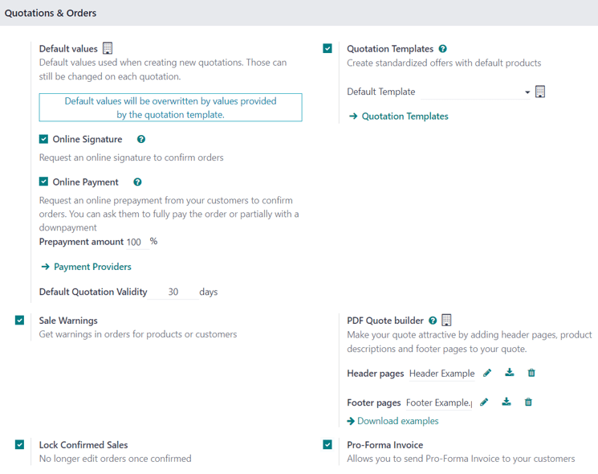

# Kotirovkalar yaratish

Odoo **Sales** dasturida kotirovkalar yaratilishi va mijozlarga yuborilishi mumkin. Kotirovka tasdiqlangandan so'ng, u rasman *savdo buyurtmasi*ga aylanadi va keyinchalik hisob-faktura qilish va to'lash mumkin.

## Kotirovka sozlamalari 

Ushbu sozlama variantlariga kirish uchun `Sales app ‣ Configuration ‣ Settings` ga o'ting va `Quotations & Orders` bo'limiga siljiting.

- `Quotation Templates`: Standart mahsulot takliflarini o'z ichiga olgan kotirovka shablonlarini yaratish uchun ushbu variantni yoqing, keyin ular kotirovka formalarida tanlanadi. Ushbu katakcha belgilanganda, qo'shimcha `Default Template` maydoni va `Quotation Templates` sahifasiga havola paydo bo'ladi.
- `Online Signature`: Buyurtmalarni tasdiqlash uchun onlayn imzo so'rang.
- `Online Payment`: Buyurtmalarni tasdiqlash uchun mijozlardan onlayn oldindan to'lovni so'rang. To'liq yoki qisman to'lovni so'rang (oldindan to'lov orqali). Ushbu katakcha belgilanganda, qo'shimcha `Prepayment amount (%)` maydoni paydo bo'ladi. Shuningdek, `Payment Providers` sahifasiga havola ham mavjud.
- `Default Quotation Validity`: Kotirovkalar amal qilishi mumkin bo'lgan belgilangan miqdorni (`days`da) aniqlang.
- `Default Recurrence`: Yangi kotirovka uchun takrorlash davri sifatida foydalanish uchun ochiladigan menyudan standart davrni tanlang.
- `Sale Warnings`: Muayyan mahsulotlar yoki mijozlarni o'z ichiga olgan buyurtmalar haqida ogohlantirish xabarlarini oling.
- `PDF Quote builder`: Sarlavha sahifalari, mahsulot tavsiflari, altqism sahifalari va boshqalar bilan kotirovkalarning ko'rinishini sozlang.
- `Lock Confirmed Sales`: Tasdiqlangan buyurtmalarga boshqa o'zgartirishlarni kiritish mumkin emasligini ta'minlang.
- `Pro-Forma Invoice`: Mijozlarga pro-forma hisob-fakturalarini yuboring.

Ushbu sozlamalarning har qandayini faollashtirish uchun kerakli variant(lar) yonidagi katakchani belgilang. Keyin `Save` tugmasini bosing.

## Kotirovkalar boshqaruv paneli

*Kotirovkalar* boshqaruv paneli - bu `Sales app` ochilganda paydo bo'ladigan sahifa.

Standart bo'yicha, `Quotations` boshqaruv paneli qidiruv panelida mavjud bo'lgan standart `My Quotations` filtri ko'rsatganidek, joriy foydalanuvchi bilan bog'liq ma'lumotlar bazasidagi barcha kotirovkalarni ko'rsatadi.

::: tip

Ma'lumotlar bazasidagi *barcha* kotirovkalarni ko'rish uchun qidiruv panelidan `My Quotations` filtrini olib tashlang.
::::

Ushbu sahifadagi kotirovkalar standart ro'yxat ko'rinishida paydo bo'ladi, ammo ularni `oi-view-kanban` `Kanban` ko'rinishida, `fa-calendar` `Calendar`, `oi-view-pivot` `Pivot` jadvalida, `fa-area-chart` `Graph` yoki `fa-clock-o` `Activity` ko'rinishida ham ko'rish mumkin.

`Quotations` boshqaruv panelidan har qanday ro'yxatdagi kotirovkani ko'rish va/yoki o'zgartirish uchun ro'yxatdan kerakli kotirovka qatorini bosing va Odoo tanlangan kotirovka uchun maxsus formani ochadi.

## Kotirovka yaratish

Kotirovka yaratish uchun `Sales app` ni oching va asosiy `Quotations` boshqaruv panelining yuqori chap burchagida joylashgan `New` tugmasini bosing.

::: warning

`New` tugmasi **faqat** `Quotations` boshqaruv paneli ro'yxat yoki Kanban ko'rinishida bo'lgandagina mavjud.
::::

`New` tugmasini bosish sozlash uchun turli maydonlar va yorliqlar bilan bo'sh kotirovka formasini ochadi.

Formaning yuqori qismidagi `Customer` maydoniga mijozning ismini kiritish bilan boshlang. Bu **majburiy** maydon.

Agar mijozning ma'lumotlari allaqachon ma'lumotlar bazasida bo'lsa, `Invoice Address` va `Delivery Address` maydonlari o'sha mijozning kontakt yozuvidagi ma'lumotlarga asoslagan holda (**Contacts** dasturida topiladi) ushbu tegishli maydonlar uchun saqlangan ma'lumotlar bilan avtomatik to'ldiriladi.

Agar mijoz boshqa mijoz yoki kontakt tomonidan tavsiya etilgan bo'lsa, ularning ismini `Referrer` maydoniga kiriting.

Agar `Referrer` tanlangan bo'lsa, yangi `Commission Plan` maydoni paydo bo'ladi, unda ochiladigan menyudan komissiya tanlanishi mumkin. Ushbu komissiya `Referrer` maydonida tanlangan kontaktga beriladi.

Keyin, agar ular mijozning ma'lumotlari bilan avtomatik to'ldirilmagan bo'lsa, `Invoice Address` va `Delivery Address` maydonlariga tegishli manzillarni kiriting. Ushbu maydonlarning ikkalasi ham **majburiy**.

Keyin, agar xohlasangiz, ushbu kotirovkaga qo'llash uchun ochiladigan maydondan `Quotation Template` ni tanlang. Shuni ta'kidlash kerakki, tanlangan shablonga qarab, ba'zi qo'shimcha maydonlar paydo bo'lishi mumkin.

`Expiration` maydonida paydo bo'ladigan standart sana `Default Quotation Validity setting` da (`Sales app ‣ Configuration ‣ Settings`da) sozlangan raqamga asoslanadi.

::: tip

Kotirovka shablonidan foydalanganda, `Expiration` maydonidagi sana shablon formasidagi `Quotation Validity` raqamiga asoslanadi.
::::

Agar kotirovka takrorlanadigan mahsulot yoki obuna uchun bo'lsa, o'sha maxsus ochiladigan menyudan kerakli `Recurring Plan` ni tanlang.

Agar xohlasangiz, ushbu kotirovkaga qo'llanishi kerak bo'lgan maxsus `Pricelist` ni tanlang.

Nihoyat, ushbu kotirovka uchun ishlatiladigan har qanday maxsus `Payment Terms` ni tanlang.

### Order Lines yorlig'i

Kotirovka formasidagi birinchi yorliq `Order Lines` yorlig'idir.

Ushbu yorliqda mahsulotlarni va ushbu mahsulotlarning miqdorlarini tanlab, ularni kotirovkaga qo'shing.

Ushbu yorliqdan mahsulotlarni kotirovkaga qo'shishning ikki yo'li mavjud.

`Add a product` ni bosing, `Product` ochiladigan maydonidan kerakli elementni tanlang va kerak bo'lsa, tanlangan mahsulotning miqdorini o'zgartiring.

Yoki, `Catalog` ni bosing, bu `Product Category` va `Attributes` bo'yicha tartibga solinadigan elementlar bilan tashkil etilgan katalog ko'rinishida har bir element (va har bir potentsial mahsulot varianti)ni ko'rsatadigan alohida sahifani ochadi.

Bu yerdan shunchaki kerakli elementlarni toping, mahsulot kartasidagi `fa-shopping-cart` `Add` tugmasini bosing va kerak bo'lsa miqdorni sozlang. Tugallangach, kotirovkaga qaytish uchun yuqori chap burchakdagi `Back to Quotation` tugmasini bosing, bu yerda yangi tanlangan katalog elementlarini `Order Lines` yorlig'ida topish mumkin.

Agar bir nechta elementlar kotirovkada yanada tartibli tarzda taqdim etilishi kerak bo'lsa, `Add a section` ni bosing, bo'lim uchun nom kiriting va ushbu bo'lim sarlavhasini `Order Lines` yorlig'idagi elementlar orasidagi kerakli joyga suring. Bo'lim sarlavhasi qalin harflar bilan ko'rinadi.

Kerak bo'lsa, muayyan mahsulot haqida maxsus eslatma qo'shish uchun muayyan mahsulot qatori ostidagi `Add a note` ni bosing. Eslatma kursiv harflar bilan ko'rinadi. Keyin, kerak bo'lsa, eslatmani kerakli mahsulot qatori ostiga suring.

Mahsulot qatorlari ostida quyidagilarning har qandayini qo'llash uchun bosiladigan tugmalar mavjud: `Coupon Code`, `Promotions`, `Discount` va/yoki `Add shipping`.

### Optional Products yorlig'i

Mijozga taqdim etilishi mumkin bo'lgan bog'liq mahsulotlarni tanlash uchun `Optional Products` yorlig'ini oching, bu esa savdoning ko'payishiga olib kelishi mumkin.

Masalan, agar mijoz mashina sotib olmoqchi bo'lsa, taklif etilishi mumkin bo'lgan ixtiyoriy mahsulot *Trailer Hitch* dir.

### Other Info yorlig'i

`Other Info` yorlig'ida to'rt xil bo'limga ajratilgan turli kotirovka bilan bog'liq konfiguratsiyalar mavjud: `Sales`, `Delivery`, `Invoicing` va `Tracking`.

::: tip

Ba'zi maydonlar **faqat** maxsus sozlamalar va variantlar sozlangan bo'lsagina paydo bo'ladi.
::::

#### Sales bo'limi

`Other Info` yorlig'ining `Sales` bo'limida sozlanishi mumkin bo'lgan savdoga xos maydonlar mavjud.

- `Salesperson`: Ushbu kotirovka bilan bog'lanishi kerak bo'lgan sotuvchini ochiladigan menyudan tayinlang. Kotirovkani dastlab yaratgan foydalanuvchi standart bo'yicha ushbu maydonva tanlanadi.
- `Sales Team`: Ushbu kotirovkaga maxsus savdo jamoasini tayinlang. Agar tanlangan `Salesperson` savdo jamoasining a'zosi bo'lsa, o'sha jamoa maydonda avtomatik to'ldiriladi.
- `Company`: Ushbu kotirovka bog'lanishi kerak bo'lgan kompaniyani ochiladigan menyudan tanlang. Ushbu maydon faqat ko'p kompaniyali muhitda ishlashda paydo bo'ladi.
- `Online signature`: Buyurtmani tasdiqlash uchun mijozdan onlayn imzo so'rash uchun ushbu katakchani belgilang. Ushbu maydon faqat *Online Signature* sozlamasi yoqilgan bo'lsagina paydo bo'ladi.
- `Online payment`: Ushbu katakchani belgilang va buyurtmani tasdiqlash uchun mijozdan onlayn to'lovni so'rash uchun qo'shni maydoniga kerakli foizni kiriting (umumiy miqdorning o'sha belgilangan foizi uchun). Ushbu maydon faqat *Online Payment* sozlamasi yoqilgan bo'lsagina paydo bo'ladi.
- `Customer Reference`: Ushbu mijoz uchun maxsus mos yozuvlar ID sini kiriting. Kiritilgan mos yozuvlar ID si harflar, raqamlar yoki ikkalasining aralashmasini o'z ichiga olishi mumkin.
- `Tags`: Qo'shimcha tashkilot va Odoo **Sales** dasturida yaxshilangan qidiruv imkoniyati uchun kotirovkaga maxsus teglar qo'shing. Kerak bo'lsa, bir nechta teglar qo'shilishi mumkin.

#### Delivery bo'limi

`Other Info` yorlig'ining `Delivery` bo'limida sozlanishi mumkin bo'lgan yetkazib berishga xos maydonlar mavjud.

- `Shipping Weight`: Yetkazib beriladigan elementlarning og'irligini ko'rsatadi. Ushbu maydon o'zgartirilmaydi. Mahsulot og'irligi alohida mahsulot formalarida sozlanadi.
- `Incoterm`: Xalqaro tranzaksiyalar uchun oldindan belgilangan tijorat shartlari sifatida foydalanish uchun Incoterm (Xalqaro Tijorat Shartlari)ni tanlang.
- `Incoterm Location`: Agar Incoterm ishlatilayotgan bo'lsa, ushbu maydoniga xalqaro manzilni kiriting.
- `Shipping Policy`: Ochiladigan menyudan kerakli yetkazib berish siyosatini tanlang. Agar barcha mahsulotlar bir vaqtda yetkazib berilsa, yetkazib berish buyurtmasi eng katta mahsulot yetkazib berish vaqtiga asoslanib rejalashtiriladi. Aks holda, u eng qisqa yetkazib berish vaqtiga asoslanadi. Mavjud variantlar: `As soon as possible` yoki `When all products are ready`.
- `Delivery Date`: Kalendar ochilish oynasini ochish uchun bo'sh maydonni bosing, undan mijozning yetkazib berish sanasini tanlash mumkin. Agar maxsus sana kerak bo'lmasa, o'sha maydonning o'ng tomonida ko'rsatilgan `Expected` sanasiga murojaat qiling.

#### Invoicing bo'limi

`Other Info` yorlig'ining `Invoicing` bo'limida sozlanishi mumkin bo'lgan hisob-fakturalashga xos maydonlar mavjud.

- `Fiscal Position`: Muayyan mijozlar yoki savdo buyurtmalari/hisob-fakturalar uchun soliqlar va hisoblarni moslash uchun ishlatiladigan fiskal pozitsiyani tanlang. Standart qiymat mijozdan keladi. Agar ushbu maydonva tanlov qilinsa, `fa-refresh` `Update Taxes` bosiladigan havola va belgisi paydo bo'ladi. Bosilganda, ushbu muayyan mijoz va kotirovka uchun soliqlar yangilanadi. Tasdiqlash oynasi ham paydo bo'ladi.
- `Analytic Account`: Ushbu mijoz/kotirovkaga qo'llash uchun analitik hisobni tanlang.

#### Tracking bo'limi

`Other Info` yorlig'ining `Tracking` bo'limida sozlanishi mumkin bo'lgan kuzatuvga xos maydonlar mavjud.

- `Source Document`: Agar tegishli bo'lsa, kotirovka/savdo buyurtmasini yaratgan hujjatning ma'lumotnomesini kiriting.
- `Opportunity`: Agar tegishli bo'lsa, ushbu kotirovka bilan bog'liq maxsus imkoniyatni (**CRM** dasturidan) tanlang.
- `Campaign`: Agar tegishli bo'lsa, ushbu kotirovka bilan bog'liq marketing kampaniyasini tanlang.
- `Medium`: Agar tegishli bo'lsa, ushbu kotirovka paydo bo'lgan usulni (masalan, *Email*) tanlang.
- `Source`: Agar tegishli bo'lsa, ushbu kotirovkani yaratish uchun ishlatilgan havolaning manbasini (masalan, *Facebook*) tanlang.

### Notes yorlig'i

Kotirovka formasining `Notes` yorlig'ida, agar xohlasangiz, kotirovka va/yoki mijoz haqida har qanday maxsus ichki eslatmalarni kiriting.

## Kotirovkalarni yuborish va tasdiqlash

Barcha kerakli maydonlar va yorliqlar sozlangandan so'ng, kotirovkani tasdiqlash uchun mijozga yuborish vaqti keldi. Tasdiqlanganidan so'ng, kotirovka rasmiy savdo buyurtmasiga aylanadi.

Formaning yuqori qismida bir qator tugmalar mavjud:

- `Send by Email`: Bosilganda, `Recipients` maydonida mijozning ismi va elektron pochta manzili, `Subject` maydonida kotirovka (va mos yozuvlar ID si) va elektron pochta tanasida o'zgartirish mumkin bo'lgan qisqa standart xabar bilan ochilish oynasi paydo bo'ladi.

  Uning ostida kotirovkaning PDF nusxasi biriktirilgan. Tayyor bo'lganda, kotirovkani elektron pochta orqali mijozga yuborish uchun `Send` tugmasini bosing, shunda ular uni ko'rib chiqishi va tasdiqlashi mumkin.

- `Send PRO-FORMA Invoice`: Ushbu tugma **faqat** *Pro-Forma Invoice* sozlamasi yoqilgan bo'lsagina paydo bo'ladi. Bosilganda, `Recipients` maydonida mijozning ismi va elektron pochta manzili, `Subject` maydonida *Proforma* hisob-fakturasi (va mos yozuvlar ID si) va elektron pochta tanasida o'zgartirish mumkin bo'lgan qisqa standart xabar bilan ochilish oynasi paydo bo'ladi.

  Uning ostida kotirovkaning PDF nusxasi biriktirilgan. Tayyor bo'lganda, kotirovkani elektron pochta orqali mijozga yuborish uchun `Send` tugmasini bosing, shunda ular uni ko'rib chiqishi va tasdiqlashi mumkin.

- `Confirm`: Bosilganda, kotirovka tasdiqlanadi va holat `Sales Order` ga o'zgaradi.

- `Preview`: Bosilganda, Odoo mijoz o'zlarining mijoz portaliga kirganda ko'radigan kotirovkaning oldindan ko'rishini ochadi. Kotirovka formasiga qaytish uchun ko'k bannerdagi preview sahifasining yuqori qismidagi `fa-arrow-right` `Back to edit mode` havolasini bosing.

- `Cancel`: Bosilganda, kotirovka bekor qilinadi.

::: tip

Agar *Lock Confirmed Sales* sozlamasi yoqilgan bo'lsa, savdo buyurtmasi `Locked` bo'ladi va savdo buyurtmasi formasida shunday ko'rsatiladi.
::::

Shu nuqtada kotirovka tasdiqlandi, savdo buyurtmasiga aylandi va endi hisob-faktura qilish va to'lash uchun tayyor.

Hisob-fakturalash haqida batafsil ma'lumot uchun `Invoice based on delivered or ordered quantities` ga murojaat qiling.