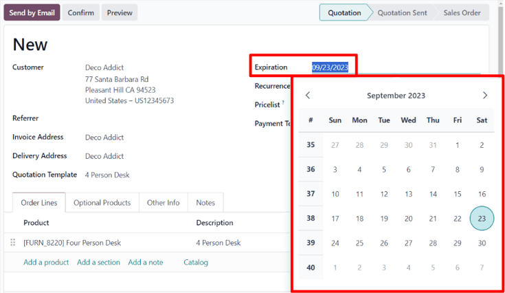
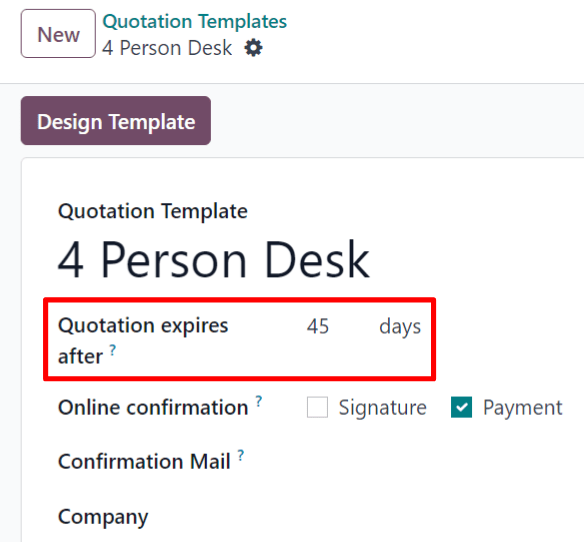

# Taklifnoma muddati

Odoo’ning *Savdo* ilovasida savdo taklifnomalariga amal qilish muddati (deadline) belgilash imkoniyati mavjud. Bu
mijozlarni tezroq harakat qilishga undaydi, chunki ular yaxshi shartni boy berishdan cho‘chishlari mumkin. Shuningdek,
muddati tugagan takliflar kompaniyani zararli shartnomalarni bajarish majburiyatidan himoya qiladi.

## Taklifnoma amal qilish muddati

Odoo *Savdo* ilovasida har bir taklifnomaga amal qilish (muddati tugash) sanasini belgilash mumkin.

Buning uchun `Savdo ilovasi`ga o‘ting, mavjud taklifnomani tanlang yoki `Yangi` (`New`) tugmasini bosib yangi taklifnoma
yarating.

Taklifnoma formasida `Amal qilish muddati` (`Expiration`) maydoniga bosing — shunda kalendar ochiladi. Shu kalendardan
kerakli oy va sanani tanlang.

::: tip

Taklifnomadagi `Ko‘rish` (`Preview`) tugmasini bosganingizda, mijoz taklifnoma qachon muddati tugashini aniq ko‘ra
oladi.

:::

## Taklifnoma shablonining amal qilish muddati

Odoo’ning *Savdo* ilovasi taklifnoma shablonlariga ham amal qilish (muddati tugash) sanasini belgilash imkonini beradi.

Taklifnoma shabloniga amal qilish muddatini qo‘shish uchun quyidagi yo‘ldan o‘ting:  
`Savdo ilovasi ‣ Konfiguratsiya ‣ Taklifnoma shablonlari`.  
Shundan so‘ng, kerakli taklifnoma shablonini tanlang yoki `Yangi` (`New`) tugmasini bosib yangi shablon yarating.

Shablon formasida, taklifnoma nomining pastki qismida joylashgan `Taklifnoma amal qiladi (kunlar)` (
`Quotation expires after`) maydoniga kerakli kunlar sonini kiriting. Bu qiymat taklifnoma mijozga yuborilgandan keyin
nechta kun davomida amal qilishini belgilaydi.

Shundan so‘ng, ushbu shablon asosida taklifnoma yaratilganida, avtomatik ravishda amal qilish muddati yuqorida
kiritilgan kunlar asosida hisoblab chiqiladi. Biroq, ushbu sanani mijozga yuborishdan oldin qo‘lda o‘zgartirish mumkin.
