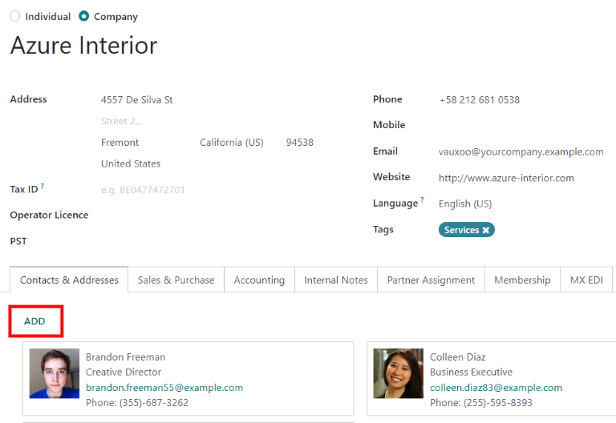

# Turli manzillarga yetkazib berish va hisob-fakturalar

Shaxslar va korxonalar ko'pincha hisob-fakturalash (hisob-faktura) va yetkazib berish (yetkazib berish) maqsadlari uchun alohida manzillardan foydalanadilar. Odoo *Sales* dasturi yordamida kontaktlar yetkazib berish va hisob-fakturalash uchun turli belgilangan manzillarga ega bo'lishi mumkin.

## Sozlamalar

Odoo da bir nechta manzillardan to'g'ri foydalanish uchun `Accounting app ‣ Configuration ‣ Settings` ga o'ting va `Customer Invoices` sarlavhasiga siljiting. Keyin katakchani belgilang.

## Kontakt formasi konfiguratsiyasi 

Kontaktga bir nechta manzil qo'shish uchun `Sales app ‣ Orders ‣ Customers` ga o'ting va qidiruv panelidan har qanday standart filtrlarni olib tashlang. Keyin kontakt formasini ochish uchun kerakli mijozni bosing.

::: tip

Kontakt formalariga *Contacts* dasturida ham kirish mumkin.
::::

Kontakt formasidan `Edit` tugmasini bosing, so'ngra `Contacts & Addresses` yorlig'i ostida joylashgan `Add` ni tanlang. Bunday qilish qo'shimcha manzillarni sozlash mumkin bo'lgan `Create Contact` ochilish formasini ochadi.

`Create Contact` ochilish formasida standart `Other Address` maydonini bosish bilan boshlang, bu manzil bilan bog'liq variantlarning ochiladigan menyusini ochadi.

Quyidagi variantlardan birini tanlang:

- `Contact`: mavjud kontakt formasiga boshqa kontaktni qo'shadi.
- `Invoice Address`: mavjud kontakt formasiga maxsus hisob-faktura manzilini qo'shadi.
- `Delivery Address`: mavjud kontakt formasiga maxsus yetkazib berish manzilini qo'shadi.
- `Other Address`: mavjud kontakt formasiga muqobil manzilni qo'shadi.
- `Private Address`: mavjud kontakt formasiga shaxsiy manzilni qo'shadi.

Variant tanlangandan so'ng, belgilangan manzil turi uchun ishlatilishi kerak bo'lgan tegishli kontakt ma'lumotlarini kiritishni davom eting.

Keyin manzilni saqlash va `Create Contact` oynasini yopish uchun `Save & Close` tugmasini bosing. Yoki manzilni saqlash va darhol boshqasini kiritish uchun `Save & New` tugmasini bosing.

## Kotirovkalarga qo'shilgan manzil

Mijoz kotirovkaga qo'shilganda, `Invoice Address` va `Delivery Address` maydonlari mijozning kontakt formasida belgilangan tegishli manzillar bilan avtomatik to'ldiriladi.

`Invoice Address` va `Delivery Address` kotirovka formasidan to'g'ridan-to'g'ri tahrirlash ham mumkin, buning uchun `Edit` tugmasini bosing, so'ngra har bir manzil qatori yonidagi `➡️ (right arrow)` ichki havola tugmalarini bosing.

Ushbu manzillar to'g'ri hisob-fakturalash va yetkazib berishni ta'minlash uchun istalgan vaqtda yangilanishi mumkin.

::: tip

Agar Odoo da biror formada, shu jumladan *Contacts* formalarida biror o'zgarishlar kiritilsa, o'zgarishlarni ma'lumotlar bazasiga saqlash uchun `Save` tugmasini bosishni unutmang.
::::