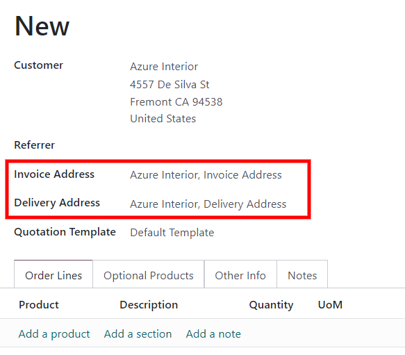

# Yetkazib berish va hisob-fakturani turli manzillarga yuborish

Odamlar va kompaniyalar ko‘pincha hisob-faktura (billing) va yetkazib berish (shipping) uchun alohida manzillardan
foydalanadilar. Odoo’ning *Savdo* ilovasi yordamida har bir kontakt uchun hisob-faktura va yetkazib berish manzillarini
alohida belgilash mumkin.

## Sozlamalar

Odoo’da bir nechta manzillardan to‘g‘ri foydalanish uchun quyidagi amallarni bajaring:

`Hisob-kitob ilovasi ‣ Konfiguratsiya ‣ Sozlamalar` (`Accounting app ‣ Configuration ‣ Settings`) yo‘liga o‘ting va
`Mijoz hisob-fakturalari` (`Customer Invoices`) sarlavhasigacha pastga tushing. So‘ng, `Mijoz manzillari` (
`Customer Addresses`) sozlamasini faollashtirish uchun belgilash katagiga belgi qo‘ying.

## Kontakt formasini sozlash

Bitta kontaktga bir nechta manzil qo‘shish uchun quyidagi yo‘ldan boring:  
`Savdo ilovasi ‣ Buyurtmalar ‣ Mijozlar`.  
So‘ng qidiruv panelidagi barcha standart filtrlardan tozalang. Kerakli mijozni tanlang va uning kontakt formasini
oching.

::: tip

Kontakt formalariga *Kontaktlar* (`Contacts`) ilovasi orqali ham kirish mumkin.

:::

Kontakt formasida `Tahrirlash` (`Edit`) tugmasini bosing, keyin `Kontaktlar va manzillar` (`Contacts & Addresses`)
tabidagi `Qo‘shish` (`Add`) tugmasini bosing. Shu bilan `Kontakt yaratish` (`Create Contact`) oynasi ochiladi va bu
yerda qo‘shimcha manzillarni kiritish mumkin.

`Kontakt yaratish` oynasida, avval `Boshqa manzil` (`Other Address`) maydoniga bosing — ochiluvchi menyuda quyidagi
manzil turlari paydo bo‘ladi:

- `Kontakt` — mavjud forma ichiga qo‘shimcha kontakt qo‘shadi.
- `Hisob-faktura manzili` — alohida hisob-faktura manzilini qo‘shadi.
- `Yetkazib berish manzili` — alohida yetkazib berish manzilini qo‘shadi.
- `Boshqa manzil` — alternativa manzilni qo‘shadi.
- `Shaxsiy manzil` — shaxsiy manzil qo‘shadi.

Kerakli variant tanlangach, shu manzil turiga tegishli kontakt ma’lumotlarini kiriting.

So‘ng, manzilni saqlash va oynani yopish uchun `Saqlash va yopish` (`Save & Close`) tugmasini bosing. Yoki, agar yana
bir manzil kiritmoqchi bo‘lsangiz, `Saqlash va yangi` (`Save & New`) tugmasini bosing.

## Taklifnomalarga manzil qo‘shish

Mijoz taklifnomaga qo‘shilganda, `Hisob-faktura manzili` (`Invoice Address`) va `Yetkazib berish manzili` (
`Delivery Address`) maydonlari avtomatik tarzda mijozning kontakt formasida belgilangan mos manzillar bilan
to‘ldiriladi.

`Hisob-faktura manzili` va `Yetkazib berish manzili` taklifnoma ichida ham bevosita tahrirlanishi mumkin. Buning uchun
`Tahrirlash` (`Edit`) tugmasini bosing, so‘ng har bir manzil qatori yonidagi `➡️` (o‘ngga yo‘naltiruvchi) ichki havola
tugmalarini bosing.

Ushbu manzillar istalgan vaqtda yangilanishi mumkin, bu esa to‘g‘ri hisob-faktura va yetkazib berishni ta’minlaydi.

::: tip

Odoo’da har qanday formada (shu jumladan *Kontaktlar* formalarida) o‘zgarish kiritilgan bo‘lsa, o‘zgarishlarni
ma’lumotlar bazasiga saqlash uchun `Saqlash` (`Save`) tugmasini bosishni unutmang.

:::
