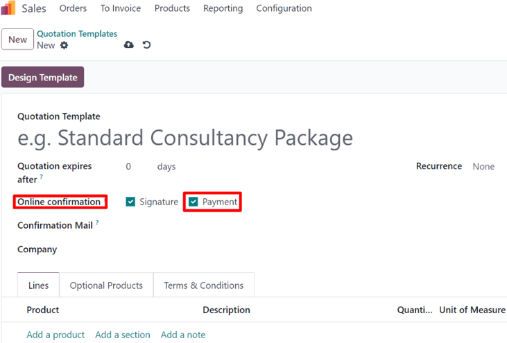

# Onlayn to'lov buyurtmani tasdiqlash

Odoo *Sales* dasturi mijozlarga savdo buyurtmasida to'g'ridan-to'g'ri onlayn to'lov orqali buyurtmalarni tasdiqlash imkoniyatini beradi. Savdo buyurtmasi mijoz tomonidan elektron tarzda to'langandan so'ng, savdo buyurtmasiga biriktirilgan sotuvchiga buyurtma tasdiqlanganligini darhol xabar beriladi.

## Onlayn to'lovlarni faollashtirish

Mijozlar onlayn to'lov bilan buyurtmalarni tasdiqlashi uchun *Online Payment* sozlamasi **majburiy** ravishda faollashtirilishi kerak.

*Online Payment* funksiyasini faollashtirish uchun `Sales app ‣ Configuration ‣ Settings` ga o'ting, `Quotations \& Orders` sarlavhasiga siljiting, `Online Payment` funksiyasi yonidagi katakchani belgilang va `Save` tugmasini bosing.

*Sales* `Settings` sahifasidagi `Online Payment` variantining ostida `Default Quotation Validity` maydoni mavjud. Ushbu maydonva kotirovkalar standart bo'yicha amal qilishi uchun muayyan kun sonini qo'shish imkoniyati mavjud.

Standart kotirovkada ushbu funksiyani yoqish uchun `Other Info` yorlig'idagi `Online confirmation` maydonida joylashgan `Payment` funksiya variantining katakchasini belgilang.

Kotirovka shablonida ushbu funksiyani yoqish uchun kotirovka shabloni formasining `Online confirmation` maydonida joylashgan `Payment` funksiya variantining katakchasini belgilang.

## To'lov provayderlari

`Online Payment` funksiyasini faollashtirgandan so'ng, uning ostida `Payment Providers` ni sozlash uchun havola paydo bo'ladi.

Ushbu havolani bosish turli xil to'lov provayderlarini yoqish, sozlash va nashr qilish mumkin bo'lgan alohida `Payment Providers` sahifasini ochadi.

## To'lovni ro'yxatdan o'tkazish

Mijozlar o'zlarining mijoz portalida kotirovkalarni ochgandan so'ng, buyurtmalarini onlayn to'lov bilan tasdiqlash uchun `Accept \& Pay` tugmasini bosishlari mumkin.

`Accept \& Pay` tugmasini bosgandan so'ng, mijozlarga `Pay with` bo'limida onlayn to'lovlar qilish uchun turli variantlarni o'z ichiga olgan `Validate Order` ochilish oynasi taqdim etiladi.

::: tip

Odoo `Validate Order` ochilish oynasida **faqat** `Payment Providers` sahifasida nashr qilingan va sozlangan to'lov variantlarini taklif qiladi.
::::

Mijoz o'z kerakli to'lov usulini tanlagandan so'ng, buyurtmani tasdiqlash uchun ochilish oynasidagi `Pay` tugmasini bosadi. Odoo onlayn to'lov bilan buyurtma tasdiqlanganidan so'ng tayinlangan sotuvchiga darhol xabar beradi.

