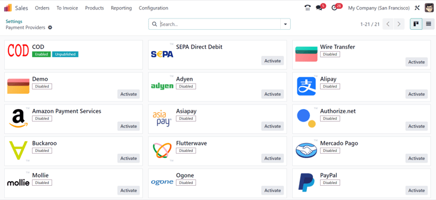
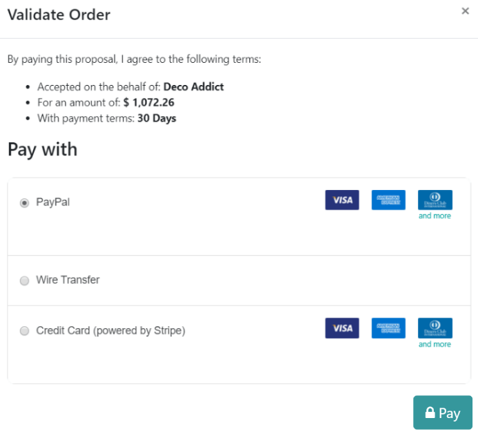

# Buyurtmalarni onlayn to‘lov bilan tasdiqlash

Odoo’ning *Savdo* ilovasi mijozlarga savdo buyurtmalarini to‘g‘ridan-to‘g‘ri onlayn to‘lov orqali tasdiqlash imkonini
beradi. Mijoz buyurtmani elektron tarzda to‘laganidan so‘ng, bu buyurtmaga biriktirilgan savdo vakili darhol xabardor
qilinadi.

## Onlayn to‘lovni faollashtirish

Mijozlar buyurtmalarni onlayn to‘lov orqali tasdiqlay olishi uchun *Onlayn to‘lov* funksiyasi **albatta**
faollashtirilgan bo‘lishi kerak.

Bu funksiyani faollashtirish uchun quyidagi yo‘ldan boring:  
`Savdo ilovasi ‣ Konfiguratsiya ‣ Sozlamalar`  
so‘ng `Taklifnomalar va buyurtmalar` (`Quotations & Orders`) bo‘limigacha pastga tushing, `Onlayn to‘lov` (
`Online Payment`) belgisini belgilang va `Saqlash` (`Save`) tugmasini bosing.

*Savdo* ilovasining `Sozlamalar` sahifasidagi `Onlayn to‘lov` opsiyasi ostida
`Taklifnoma amal qilish muddati (kunlarda)` (`Default Quotation Validity`) maydoni mavjud. Bu yerda taklifnomalarning
standart amal qilish muddatini kunlarda belgilashingiz mumkin.

Agar bu funksiyani oddiy taklifnomada yoqmoqchi bo‘lsangiz, taklifnoma formasining `Boshqa ma’lumotlar` (`Other Info`)
tabida joylashgan `Onlayn tasdiqlash` (`Online confirmation`) qismidagi `To‘lov` (`Payment`) opsiyasini belgilang.

Agar bu funksiyani taklifnoma shablonida yoqmoqchi bo‘lsangiz, taklifnoma shabloni formasidagi `Onlayn tasdiqlash` (
`Online confirmation`) qismida joylashgan `To‘lov` (`Payment`) opsiyasini belgilang.

## To‘lov provayderlari

`Onlayn to‘lov` funksiyasi faollashtirilgandan so‘ng, uning tagida `To‘lov provayderlari` (`Payment Providers`)
sozlamasiga olib boruvchi havola paydo bo‘ladi.

Bu havolani bosganingizda alohida `To‘lov provayderlari` sahifasi ochiladi. Bu yerda turli to‘lov provayderlarini
yoqish, sozlash va e’lon qilish (publish) mumkin.

## To‘lovni ro‘yxatga olish

Mijozlar o‘z mijoz portalidagi taklifnomani ochganlaridan so‘ng, `Qabul qilish va to‘lash` (`Accept & Pay`) tugmasini
bosish orqali buyurtmani onlayn to‘lov bilan tasdiqlashlari mumkin.

`Qabul qilish va to‘lash` tugmasi bosilgach, `Buyurtmani tasdiqlash` (`Validate Order`) oynasi ochiladi. Bu oynada
`To‘lov usuli` (`Pay with`) bo‘limida turli onlayn to‘lov variantlari ko‘rsatiladi.

::: tip

`Buyurtmani tasdiqlash` oynasida **faqat** `To‘lov provayderlari` sahifasida faollashtirilgan va e’lon qilingan to‘lov
variantlari ko‘rsatiladi.

:::

Mijoz kerakli to‘lov usulini tanlagach, `To‘lash` (`Pay`) tugmasini bosadi va buyurtma tasdiqlanadi. Buyurtma onlayn
to‘lov bilan tasdiqlangani zahoti, unga biriktirilgan savdo vakiliga xabar yuboriladi.

