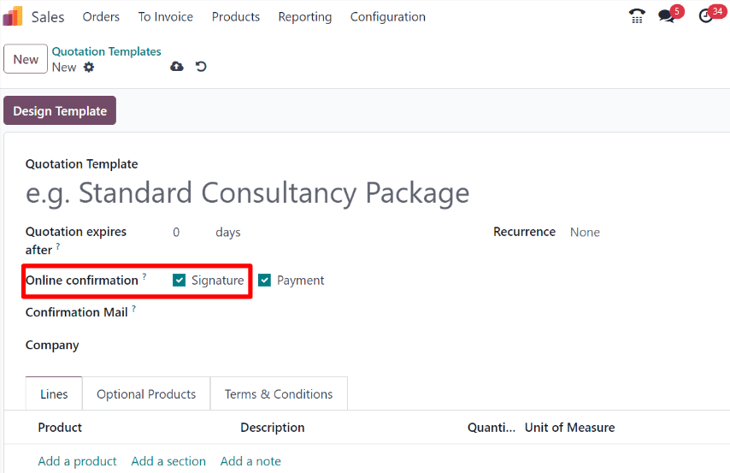

# Buyurtmalarni tasdiqlash uchun onlayn imzolar

Odoo *Sales* ilovasi mijozlarga buyurtmalarni bevosita savdo buyurtmasida onlayn imzo orqali tasdiqlash imkoniyatini beradi. Savdo buyurtmasi mijoz tomonidan elektron imzolanganidan so'ng, savdo buyurtmasiga biriktirilgan sotuvchi buyurtma tasdiqlanganligini darhol xabardor qilinadi.

## Onlayn imzolarni faollashtirish

Mijozlar buyurtmalarni onlayn imzo bilan tasdiqlashi uchun *Online Signature* funksiyasi **majburiy ravishda** faollashtirilishi kerak.

*Online Signature* funksiyasini faollashtirish uchun `Sales app ‣ Configuration ‣ Settings` ga boring, `Quotations \& Orders` sarlavhasiga o'ting va uning yonidagi katakchani belgilash orqali `Online Signature` funksiyasini faollashtiring.

Keyin yuqori chap burchakdagi `Save` tugmasini bosing.

::: tip

Kotirovka shablonini yaratishda onlayn imzo funksiyasi kotirovka shablon formasining `Online confirmation` maydonida joylashgan `Signature` opsiyasidir.

Standart kotirovkalarda onlayn imzo funksiyasi kotirovka formasining `Other Info` bo'limida joylashgan `Signature` opsiyasidir.

::::

## Onlayn imzolar bilan buyurtmalarni tasdiqlash

Mijozlar o'zlarining mijoz portalida kotirovkalarga onlayn kirganlarida, kotirovkada bevosita `Sign \& Pay` tugmasi mavjud.

Bosilganda `Validate Order` qalqib chiquvchi oynasi paydo bo'ladi. Ushbu qalqib chiquvchi oynada `Full Name` maydoni ma'lumotlar bazasidagi aloqa ma'lumotlariga asoslanib avtomatik to'ldiriladi.

Keyin mijozlar quyidagi variantlardan birini tanlash orqali onlayn imzo kiritish imkoniyatiga ega: `Auto`, `Draw` yoki `Load`.

`Auto` Odoo'ga `Full Name` maydonidagi ma'lumotlarga asoslanib avtomatik ravishda onlayn imzo yaratishga imkon beradi. `Draw` mijozga kursordan foydalanib qalqib chiquvchi oynadayoq maxsus imzo yaratishga imkon beradi. `Load` esa mijozga kompyuteridan oldindan yaratilgan imzo faylini yuklashga imkon beradi.

Mijoz yuqorida qayd etilgan uchta imzo variantidan birini tanlaganidan so'ng (`Auto`, `Draw` yoki `Load`), ular `Accept \& Sign` tugmasini bosadi.

`Accept \& Sign` bosilganda, turli to'lov usuli variantlari tanlanishi uchun mavjud bo'ladi (agar *onlayn to'lov* opsiyasi bu kotirovkaga tegishli bo'lsa).

Keyin kotirovka to'langanda va tasdiqlanganida, yetkazib berish buyurtmasi avtomatik ravishda yaratiladi (agar Odoo *Inventory* ilovasi o'rnatilgan bo'lsa).