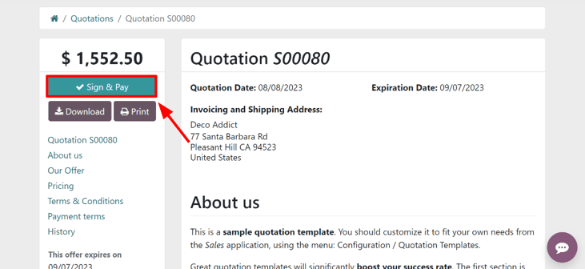

# Buyurtmalarni tasdiqlash uchun onlayn imzolar

Odoo’ning *Savdo* ilovasi mijozlarga savdo buyurtmalarini to‘g‘ridan-to‘g‘ri buyurtma shaklida onlayn imzo orqali
tasdiqlash imkonini beradi. Mijoz buyurtmaga elektron imzo qo‘ygach, bu buyurtmaga biriktirilgan savdo vakili darhol
xabardor qilinadi.

## Onlayn imzoni faollashtirish

Mijozlar buyurtmalarni onlayn imzo bilan tasdiqlashi uchun *Onlayn imzo* funksiyasi **albatta** faollashtirilgan
bo‘lishi kerak.

Bu funksiyani faollashtirish uchun quyidagi yo‘ldan boring:  
`Savdo ilovasi ‣ Konfiguratsiya ‣ Sozlamalar`,  
so‘ng `Taklifnomalar va buyurtmalar` (`Quotations & Orders`) sarlavhasigacha pastga tushing va `Onlayn imzo` (
`Online Signature`) opsiyasini belgilang.

Keyin, yuqori chapdagi `Saqlash` (`Save`) tugmasini bosing.

::: tip

Taklifnoma shabloni yaratishda, onlayn imzo funksiyasi `Onlayn tasdiqlash` (`Online confirmation`) maydonidagi `Imzo` (
`Signature`) opsiyasi orqali yoqiladi.

Oddiy taklifnomalarda esa, onlayn imzo funksiyasi `Boshqa ma’lumotlar` (`Other Info`) tabidagi `Imzo` opsiyasi orqali
yoqiladi.

:::

## Buyurtmalarni onlayn imzo bilan tasdiqlash

Mijozlar o‘z mijoz portalidagi taklifnomalarni onlayn ko‘rganlarida, taklifnoma ustida `Imzolash va to‘lash` (
`Sign & Pay`) tugmasi ko‘rinadi.

Bu tugma bosilganda, `Buyurtmani tasdiqlash` (`Validate Order`) degan pop-up oynasi ochiladi. Ushbu oynada
`To‘liq ism` (`Full Name`) maydoni avtomatik tarzda, bazadagi kontakt ma’lumotlari asosida to‘ldiriladi.

Keyin mijoz quyidagi uch usuldan birini tanlab, onlayn imzo kiritishi mumkin:

- `Avto` (`Auto`) — Odoo `To‘liq ism` maydonidagi ma’lumotga asoslangan holda avtomatik imzo yaratadi.
- `Chizish` (`Draw`) — Mijoz kursor yordamida oynaning ichida o‘z imzosini chizadi.
- `Yuklash` (`Load`) — Mijoz kompyuteridan oldindan yaratilgan imzo faylini yuklaydi.

Mijoz yuqoridagi usullardan birini tanlagach, `Qabul qilish va imzolash` (`Accept & Sign`) tugmasini bosadi.

`Qabul qilish va imzolash` bosilgach, agar *onlayn to‘lov* funksiyasi bu taklifnomaga tegishli bo‘lsa, turli to‘lov
usullari mijozga tanlash uchun taqdim etiladi.

Taklifnoma to‘lanib va tasdiqlangach, agar Odoo’ning *Omborxona* (Inventory) ilovasi o‘rnatilgan bo‘lsa, avtomatik
tarzda yetkazib berish buyurtmasi yaratiladi.
