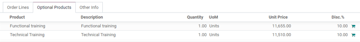
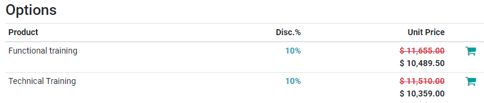
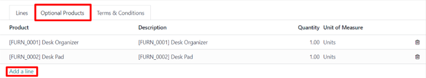

# Ixtiyoriy mahsulotlar

Ixtiyoriy mahsulotlardan foydalanish asosiy mahsulot bilan birga mahsulotlarni o'zaro sotishni o'z ichiga olgan marketing strategiyasidir. Maqsad mijozlarga foydali va tegishli mahsulotlarni taklif qilish bo'lib, bu sotuv hajmini oshirishga olib kelishi mumkin.

Masalan, agar mijoz mashina sotib olmoqchi bo'lsa, ular massaj o'rindiqlari ham buyurtma qilishni tanlashlari yoki taklifni rad etib, oddiy mashina sotib olishlari mumkin. Ixtiyoriy mahsulotlarni sotib olish tanlovini taqdim etish mijozlar tajribasini yaxshilaydi.

## Kotirovkalardagi ixtiyoriy mahsulotlar

Odoo *Sales* ilovasi bilan kotirovka formasidagi `Optional Products` bo'limiga o'tish orqali ixtiyoriy mahsulotlarni bevosita kotirovkalarga qo'shish yoki o'zgartirish mumkin.

Kotirovkaga ixtiyoriy mahsulot(lar)ni qo'shish uchun kotirovkaning `Optional Products` bo'limida `Add a product` tugmasini bosing. Buni amalga oshirish `Product` ustunida bo'sh maydonni ochadi.

Bosilganda ma'lumotlar bazasidan mahsulotlar bilan ochiluvchi menyu paydo bo'ladi. Kotirovka shabloniga ixtiyoriy mahsulot sifatida qo'shish uchun ochiluvchi menyudan kerakli mahsulotni tanlang.

::: tip

Agar kerakli mahsulot darhol ko'rinmasa, maydondan kerakli mahsulotning nomini yozing va variant ochiluvchi menyuda paydo bo'ladi. Keyin uni kotirovkaga qo'shish uchun o'sha kerakli mahsulotni tanlang.
::::

::: tip

Mahsulot qo'shilganda standart `Quantity` [1] bo'ladi, lekin uni istalgan vaqtda tahrirlash mumkin.
::::

`Optional Products` bo'limidan istalgan qator elementini o'chirish uchun `🗑️ (axlat qutisi)` belgisini bosing.

Kotirovkaning yuqori chap burchagida joylashgan `Preview` tugmasini bosib, mijozlar elektron pochta orqali oladigan kotirovka va ular buyurtmalariga qo'shishlari mumkin bo'lgan ixtiyoriy mahsulotlar ko'rsatilgan `Options` bo'limining oldindan ko'rishini ochish mumkin.

Mijozlar ixtiyoriy mahsulot qatorining o'ng tomonida joylashgan `🛒 (xarid savati)` belgisini bosish orqali buyurtmaga turli ixtiyoriy mahsulotlarni qo'shishlari mumkin.

Agar mijoz ixtiyoriy mahsulotlarni tanlasa, ular sotuvchi tomonidan boshqariladigan kotirovkaga avtomatik ravishda qo'shiladi.

Mijoz buyurtmaga ixtiyoriy mahsulot(lar)ni qo'shganda, sotuvchi o'zgarish haqida va mijoz buyurtmaga kiritgan boshqa har qanday o'zgarish haqida darhol xabardor qilinadi. Bu sotuvchilarga *Sales* ilovasining orqa qismida buyurtma bilan bog'liq hamma narsa haqida xabardor bo'lib turishga imkon beradi.

## Kotirovka shablonlaridagi ixtiyoriy mahsulotlar

::: tip

Quyidagi ma'lumotlarni o'qishdan oldin kotirovka shablonlari qanday ishlashini yaxshiroq tushunish uchun `quote_template` hujjatlarini ko'rib chiqishni unutmang.
::::

Kotirovka shablonlari uchun ham oddiy kotirovka formasiga o'xshab `Optional Products` bo'limi mavjud bo'lib, unda tegishli mahsulotlar yoki xizmatlar kotirovka shabloniga qo'shilishi mumkin.

Kotirovka shabloniga ixtiyoriy mahsulotlarni qo'shish uchun `Sales app ‣ Configuration ‣ Quotation Templates` ga o'ting. Keyin tahrirlash uchun mavjud kotirovka shablonini tanlang yoki `New` tugmasini bosib yangisini yarating.

Kotirovka shablon formasida `Optional Products` bo'limini bosing. `Optional Products` bo'limi ostida `Add a line` tugmasini bosing va kotirovka shabloniga ixtiyoriy mahsulot sifatida qo'shish uchun kerakli mahsulotni tanlang.

`Optional Products` bo'limiga qo'shilgan mahsulotlar o'sha kotirovka shablon ishlatilganda kotirovkada sukut bo'yicha mavjud bo'ladi. Bu mahsulotlar o'chirilishi va kotirovka mijozga yuborilishidan oldin qo'shimcha mahsulotlar qo'shilishi mumkin.

::: tip

Mijozni buyurtmasiga qo'shimcha narsalar qo'shishga undaydigan yoki dastlab tanlagan mahsulotning qimmatroq versiyasini sotib olishga undaydigan ixtiyoriy mahsulotlarni taklif qilish eng yaxshisidir.

Masalan, agar mijoz yog'och stul sotib olsa, ba'zi ixtiyoriy mahsulotlar quyidagicha bo'lishi mumkin: u stulga kafolat va/yoki teri o'rindiqli yog'och stul.
::::

::: tip

Kotirovka shabloniga qancha ixtiyoriy mahsulot qo'shish mumkinligi cheklanmagan.
::::