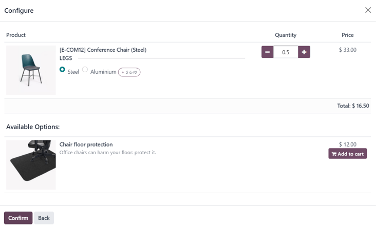
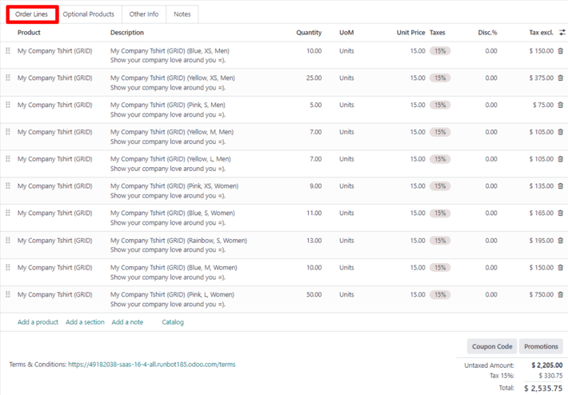

# Taklifnomalar va savdo buyurtmalarida mahsulot variantlari

Taklifnomalar va savdo buyurtmalarida mahsulot variantlaridan qanday foydalanishni o‘rganishdan oldin, Odoo’dagi
`../products_prices/products/variants` bo‘limidagi mahsulot variantlari haqidagi asosiy ma’lumotlar bilan tanishib
chiqish tavsiya etiladi.

Asosiy tushunchalar bilan tanishgandan so‘ng, quyida mahsulot variantlarini taklifnomalar va savdo buyurtmalariga qanday
qo‘shish mumkinligi ko‘rib chiqiladi — bu *mahsulot konfiguratori* yoki *buyurtma panjarasi kirituvi* (order grid entry)
orqali amalga oshiriladi.

::: tip

Shuni unutmangki, bu sozlama *Savdo* ilovasi sozlamalarida **Variant Grid Entry** deb ataladi, mahsulot formalarida esa
**Order Grid Entry** deb nomlanadi.

:::

## Sozlamalar

Odoo mahsulot variantlari bilan ishlashda odatiy holatda *mahsulot konfiguratori*dan foydalanadi. Ammo agar siz *variant
panjarasi kirituvi* (variant grid entry) funksiyasidan foydalanmoqchi bo‘lsangiz, bu funksiyani alohida yoqish kerak.

Variant panjarasi kirituvi — taklifnoma yoki savdo buyurtmasida variant tanlash jarayonini soddalashtiruvchi pop-up
oynani taqdim etadi.

Bu sozlamani yoqish uchun quyidagicha harakat qiling:

`Savdo ilovasi ‣ Konfiguratsiya ‣ Sozlamalar` yo‘liga o‘ting va `Mahsulot katalogi` (`Product Catalog`) bo‘limigacha
pastga tushing. So‘ng `Variant Grid Entry` opsiyasi yonidagi belgini belgilang va `Saqlash` (`Save`) tugmasini bosing.

::: tip

Albatta, mahsulot variantlaridan foydalanish uchun `Variantlar` (`Variants`) funksiyasi **ham** faollashtirilgan
bo‘lishi kerak.

:::

## Mahsulot konfiguratsiyasi

`Variant Grid Entry` sozlamasi yoqilgandan so‘ng, har bir mahsulot formasida ikkita variant — *Mahsulot konfiguratori* (
`Product Configurator`) va *Buyurtma panjarasi kirituvi* (`Order Grid Entry`) — mavjud bo‘ladi.

Mahsulotni ushbu usullardan biri bilan sozlash uchun quyidagicha harakat qiling:

`Savdo ilovasi ‣ Mahsulotlar ‣ Mahsulotlar` (`Sales app ‣ Products ‣ Products`) bo‘limiga o‘ting va bazadagi barcha
mahsulotlarni ko‘ring.

So‘ng, kerakli mahsulotni tanlang yoki `Yangi` (`New`) tugmasini bosib yangi mahsulot yarating. Mahsulot formasida
`Xususiyatlar va variantlar` (`Attributes & Variants`) tabiga o‘ting — bu yerda mahsulot variantlarini ko‘rish,
o‘zgartirish va qo‘shish mumkin.

`Xususiyatlar va variantlar` tabining pastki qismida `Savdo variantini tanlash` (`Sales Variant Selection`) bo‘limi
mavjud. Bu yerda quyidagi ikkita variantdan birini tanlash mumkin:

- `Mahsulot konfiguratori` (`Product Configurator`)
- `Buyurtma panjarasi` (`Order Grid Entry`)

::: tip

Bu tanlov variantlari **faqat** mahsulotga kamida ikkita xususiyat qiymati (attribute value) qo‘shilgan bo‘lsa
ko‘rinadi.

:::

Bu variantlar mahsulotni taklifnomalar yoki savdo buyurtmalariga qo‘shishda qaysi usul ishlatilishini belgilaydi.

- `Mahsulot konfiguratori` — mahsulot taklifnomaga qo‘shilganda barcha mavjud variantlarni ko‘rsatadigan pop-up oynani
  ochadi. Biroq, bir vaqtning o‘zida faqat **bitta** variantni tanlash mumkin.

- `Buyurtma panjarasi` — shu variantlarni jadval ko‘rinishida taqdim etadi. Bu usul bir vaqtning o‘zida bir nechta
  mahsulot variantlarini tanlash va taklifnomaga qo‘shish imkonini beradi.

## Mahsulot konfiguratori

Mahsulot konfiguratori funksiyasi taklifnoma yoki savdo buyurtmasiga kamida ikkita varianti bo‘lgan mahsulot
qo‘shilganda avtomatik tarzda `Sozlash` (`Configure`) pop-up oynasini ochadi. Biroq bu faqat mahsulot formasida
`Mahsulot konfiguratori` (`Product Configurator`) opsiyasi tanlangan bo‘lsa yuz beradi.

::: tip

Agar `Buyurtma panjarasi` (`Order Grid Entry`) sozlamasi **faol bo‘lmasa**, ushbu `Sozlash` oynasi avtomatik tarzda
ochiladi, chunki bu Odoo tomonidan mahsulot variantlari bilan ishlashda **standart (default)** usul sifatida tanlanadi.
:::

`Mahsulot konfiguratori` opsiyasi savdo vakillariga onlayn do‘konlarga o‘xshash interfeys orqali aynan qaysi mahsulot
variantini taklifnomaga yoki buyurtmaga qo‘shishni tanlash imkonini beradi.

## Buyurtma panjarasi (Order Grid Entry)

`Buyurtma panjarasi` funksiyasi taklifnoma yoki savdo buyurtmasiga kamida ikkita varianti bo‘lgan mahsulot qo‘shilganda
avtomatik tarzda `Mahsulot variantlarini tanlang` (`Choose Product Variants`) nomli pop-up oynasini ochadi. Biroq bu
faqat mahsulot formasida `Buyurtma panjarasi` (`Order Grid Entry`) opsiyasi tanlangan bo‘lsa yuz beradi.

`Mahsulot variantlarini tanlang` oynasida ushbu mahsulotga tegishli barcha variantlar ko‘rsatiladi. Savdo vakili ushbu
oynada har bir variantdan nechta miqdorda qo‘shishni xohlayotganini belgilashi mumkin.

Barcha kerakli miqdor va variantlar tanlangach, savdo vakili shunchaki `Tasdiqlash` (`Confirm`) tugmasini bosadi, va shu
zahoti tanlangan variantlar `Buyurtma qatorlari` (`Order Lines`) yorlig‘iga qo‘shiladi.

